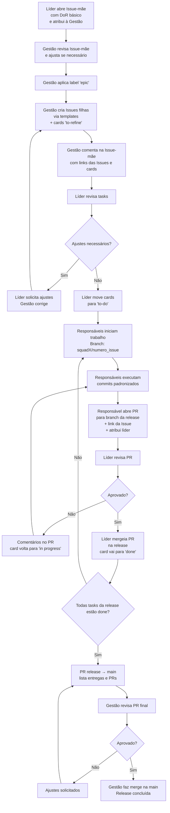

---

# 📘 **CONTRIBUTING.md**

**Guia Oficial de Contribuição – Projeto PDC: IA Generativa para Engenharia de Software**

Este documento explica **como contribuir de maneira padronizada**, seguindo o fluxo aprovado entre Gestão e Squads.

---
# Fluxo Oficial de Trabalho
## **Etapa 1 — Líder abre Issue-mãe (Epic)**

O líder inicia o processo criando uma **Issue-mãe** contendo:

* Contexto da entrega
* Objetivo
* Escopo
* Dependências
* **DoR básico** (Definition of Ready)
* Prazo estimado
* DoD geral (Definition of Done)
* Lista de tarefas da squad (alto nível)

A Issue-mãe é atribuída à **Gestão**.

---

## **Etapa 2 — Gestão revisa e estrutura as tasks**

A gestão:

1. Revisa a Issue-mãe
2. Ajusta descrição, escopo e datas
3. Aplica label **`epic`**
4. Cria **issues filhas** (uma por tarefa) usando templates oficiais
5. Cria **cards no GitHub Project** com status inicial `to-refine`

Após criar as tasks, a gestão **comenta na Issue-mãe** com:

* Links dos cards
* Observações necessárias

---

## **Etapa 3 — Líder revisa e libera tasks**

O líder revisa o conteúdo das issues
Se ajustes forem necessários → solicita à gestão.
Se estiver tudo OK:

➡️ O líder move os cards de `to-refine` para **`to-do`**.

---

## **Etapa 4 — Execução pelos membros da Squad**

### Cada responsável deve:

### ✔ Criar branch no padrão:

```
squadX/numero_issue-titulo
```

Ex.:

* `squad1/23-analise-scispace`
* `squad2/07-levantamento-artigos-arxiv`

### ✔ Executar a tarefa no diretório correto

Usando o **template apropriado** (RSL, Experimentação, Comparativo, Documentação etc.).

### ✔ Fazer commits padronizados

Formato:

```
tipo: descrição breve
```

Tipos permitidos:

* `add:` inclusão
* `update:` modificação
* `fix:` correção
* `refactor:` reorganização
* `docs:` documentação
* `test:` testes

Exemplos:

```
add: adiciona relatório inicial da ferramenta Copilot
update: melhora tabela de métricas T3
docs: adiciona links no comparativo
```

---

## **Etapa 5 — Pull Request para branch de release**

Quando concluir a tarefa:

1. Abra um PR de sua branch → para **branch da release**
2. Inclua no PR:

   * Link direto da Issue (`Closes #23`)
   * Resumo da entrega
   * Observações relevantes
3. Atribua o **Líder da squad** como revisor
4. Movimente o card para **`review`**

O líder revisa:

* Estrutura
* Template
* Conteúdo
* Clareza
* Aderência ao DoD da tarefa

Se ajustes forem necessários → card volta para **`in progress`**.
Se aprovado → líder faz merge na release e card vai para `done`.

---

## **Etapa 6 — Fechamento da Release**

Quando **todas as tasks da release estiverem em `done`**, o líder:

1. Abre **PR da branch de release → main**
2. Descreve:

   * Todas as entregas incluídas
   * Links dos PRs
   * Squads envolvidas
3. Atribui à Gestão para aprovação final

A Gestão revisa e, se aprovado:

➡️ Faz o **merge na main**
➡️ A release é concluída oficialmente

---

## **Fluxo completo de Gestão + Squads**


