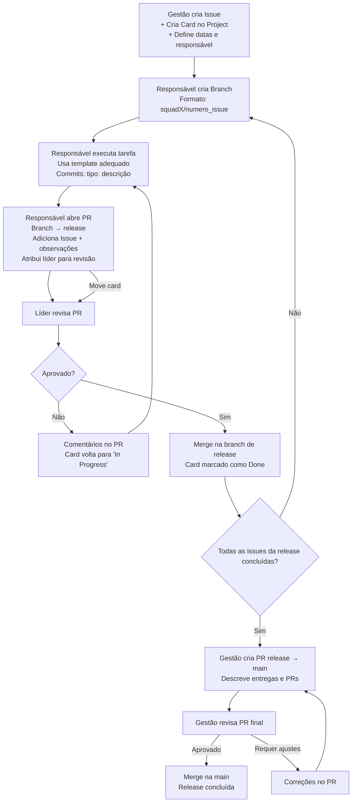

---

# 🔄 **Fluxo Oficial de Trabalho (Workflow de Contribuição)**

*PDC – IA Generativa para Engenharia de Software*

Este fluxo define **como Issues, Branches, Pull Requests, Reviews e Releases** devem ser criados, organizados e integrados ao GitHub Project.

---

# #️⃣ 1. Criação das Issues (Responsabilidade da Gestão)

A Gestão é responsável por:

### ✔ Criar todas as Issues no GitHub

Cada Issue deve conter:

* Título claro
* Descrição da tarefa
* Critérios de aceitação
* Pasta onde o arquivo deve ser criado
* Template a ser usado
* Dependências (se houver)

### ✔ Criar automaticamente um **card** correspondente no GitHub Projects

Todos os cards devem ter:

* **Status inicial:** `To Do`
* **Data de início (start date)**
* **Data de entrega (due date)**
* **Squad responsável**
* **Assignee (responsável)**

### ✔ Garantir priorização

A gestão define o que deve ser executado primeiro.

---

# #️⃣ 2. Criação da Branch pelo Responsável

O assignee cria a branch seguindo a nomenclatura:

```
squadX/numero_issue
```

Exemplos:

* `squad1/23`
* `squad2/07`
* `squad3/15`

Sempre baseada na branch da release atual.

---

# #️⃣ 3. Execução da Tarefa

Dentro da **pasta indicada na Issue**, o responsável deve:

### ✔ Criar ou editar o arquivo usando **o template apropriado**

* Templates para RSL
* Templates para análise comparativa
* Templates para experimentação
* Templates de documentação técnica
* Etc.

### ✔ Fazer commits pequenos e frequentes

Padrão:

```
tipo: descrição breve da alteração
```

**Tipos permitidos:**

* `add:` inclusão de conteúdo
* `update:` melhoria ou modificação
* `fix:` correção de erros
* `refactor:` reorganização sem alterar conteúdo
* `docs:` ajustes documentais
* `test:` inclusão/alteração de testes

**Exemplos:**

```
add: adiciona resultados da tarefa T2
update: melhora tabela de métricas da experimentação
fix: corrige link quebrado no relatório
docs: adiciona referência no comparativo
```

Durante a execução, o responsável atualiza o card no Project para:

➡️ **`In Progress`**

---

# #️⃣ 4. Abrir Pull Request (PR) para Branch de Release

Quando concluir a tarefa:

1. Abrir um PR da sua branch → para a **branch da release atual**.

2. Na descrição do PR incluir:

   * ✔ Link direto para a Issue (ex.: `Closes #23`)
   * ✔ Resumo do que foi feito
   * ✔ Observações importantes
   * ✔ Checklist de conformidade, se aplicável

3. Atribuir o **líder da Squad** como revisor.

4. No GitHub Project mover o card para:

➡️ **`Review`**

---

# #️⃣ 5. Revisão pelo Líder da Squad

O líder deve:

### ✔ Ler o material

### ✔ Acessar arquivos vinculados

### ✔ Conferir aderência ao template

### ✔ Validar evidências e métricas (quando aplicável)

### Se precisar de ajustes:

* Comentar diretamente no PR
* Movimentar o card para:

➡️ **`In Progress`**

### Se estiver tudo aprovado:

* O líder faz o **merge do PR na branch de release**
* O card vai para:

➡️ **`Done`** *(relativo à release atual)*

---

# #️⃣ 6. Fechamento da Release

Quando **todas as Issues** da release estiverem completas, o líder ou gestão:

1. Abre um **Pull Request de release → main**
2. Na descrição incluir:

   * Lista de todas as entregas
   * Link para todos os PRs incluídos
   * Quais squads contribuíram
   * Impacto geral da release
3. A gestão revisa o PR final
4. Após aprovação, o merge é realizado na **main**

---

# #️⃣ 7. Boas Práticas Gerais

* Nunca commitar diretamente na `main`
* Nunca mergear PR sem revisão do líder ou gestão
* Commits devem ser curtos e específicos
* Sempre respeitar estrutura de pastas
* Nunca mover arquivos fora da pasta da Squad
* Arquivos devem ser sempre `.md` (exceto código, scripts e notebooks)

---

# #️⃣ 8. Ciclo Resumido (Mapa Visual)

```
Gestão cria Issue → Cria card → Atribui responsável
Responsável cria branch → Começa tarefa (In Progress)
Responsável faz commits → Preenche template
Responsável abre PR → Marca líder como revisor → Move card para Review
Líder revisa:
    Se OK → Merge na release → card Done
    Se precisa correção → Comentários → card volta para In Progress
Quando todas completas → PR release → main → Aprovado pela Gestão
```




