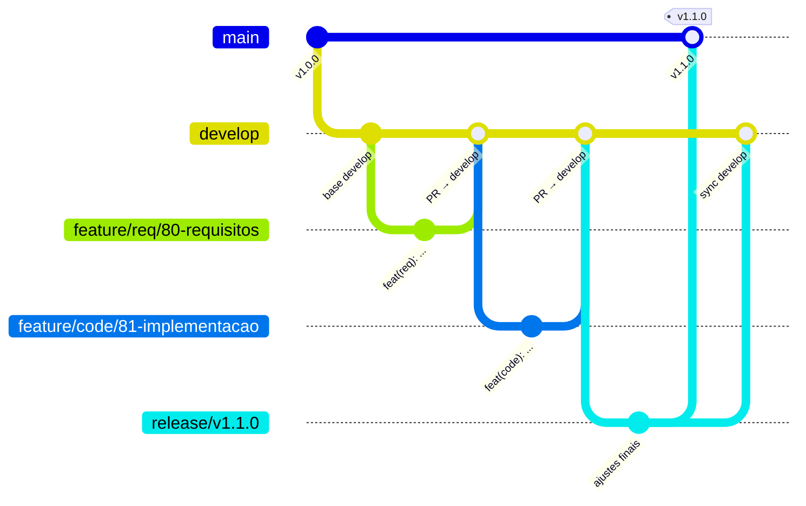

# Guia Rápido — Gitflow para Líderes Operacionais

Referência rápida para os Líderes Operacionais das sub-equipes (Requisitos, Design, Codificação e Testes). Para detalhes completos, consulte o [CONTRIBUTING.md](./CONTRIBUTING.md).

---

## Fluxo Visual



### Ciclo resumido

```text
main ← release/* ← develop ← feature/<equipe>/<issue>-descricao
 ↑                                     │
 └── hotfix/<equipe>/<issue>-desc ─────┘ (merge em main E develop)
```

---

## Convenção de Branches

| Tipo        | Origem      | Destino              | Formato                                        |
| ----------- | ----------- | -------------------- | ---------------------------------------------- |
| `feature/`  | `develop`   | `develop`            | `feature/<equipe>/<issue>-descricao`           |
| `hotfix/`   | `main`      | `main` + `develop`   | `hotfix/<equipe>/<issue>-descricao`            |
| `release/`  | `develop`   | `main` + `develop`   | `release/vX.Y.Z`                               |

**Prefixos de equipe:** `req` · `design` · `code` · `test`

---

## Conventional Commits — Cheat Sheet

Formato: `<tipo>(<escopo>): <descrição> #<issue>`

| Tipo       | Uso                                |
| ---------- | ---------------------------------- |
| `feat`     | Nova funcionalidade                |
| `fix`      | Correção de bug                    |
| `docs`     | Documentação                       |
| `refactor` | Refatoração (sem mudança de API)   |
| `test`     | Testes                             |
| `chore`    | Manutenção, deps, configs          |
| `ci`       | Pipeline CI/CD                     |
| `style`    | Formatação                         |
| `perf`     | Performance                        |

**Escopos:** `req` · `design` · `code` · `test` · `orchestrator` · `pipeline`

Exemplos:

```text
feat(code): cria endpoint de autenticação #42
fix(test): corrige teste flaky de login #99
docs(req): documenta requisitos do módulo X #101
```

---

## Comandos Rápidos por Cenário

### Nova feature

```bash
git checkout develop
git pull origin develop
git checkout -b feature/code/42-minha-feature

# ... trabalhe nos arquivos ...

git add <arquivos>
git commit -m "feat(code): implementa minha feature #42"
git push -u origin feature/code/42-minha-feature
# Abra o PR para develop no GitHub
```

### Hotfix em produção

```bash
git checkout main
git pull origin main
git checkout -b hotfix/code/55-corrige-crash

# ... corrija o bug ...

git add <arquivos>
git commit -m "fix(code): corrige crash no login #55"
git push -u origin hotfix/code/55-corrige-crash
# Abra PR para main; depois garanta merge de volta em develop
```

### Release

```bash
git checkout develop
git pull origin develop
git checkout -b release/v1.2.0

# ... ajustes finais, bump de versão ...

git add <arquivos>
git commit -m "chore(pipeline): prepara release v1.2.0 #60"
git push -u origin release/v1.2.0
# Abra PR para main (gera tag) e depois para develop
```

---

## Checklist Pré-PR

Antes de abrir ou marcar um PR como "Ready for review":

- [ ] Branch criada a partir da origem correta (`develop` para feature, `main` para hotfix)
- [ ] Nome da branch segue o padrão `tipo/<equipe>/<issue>-descricao`
- [ ] Commits seguem Conventional Commits (`tipo(escopo): descrição #issue`)
- [ ] Branch sincronizada com o destino (`git pull origin develop` / `main`)
- [ ] Conflitos resolvidos localmente
- [ ] Testes passando (se aplicável)
- [ ] Issue referenciada na descrição do PR (`Closes #XX` ou `Refs #XX`)
- [ ] PR utiliza o [template padrão](./.github/PULL_REQUEST_TEMPLATE.md)

---

## Como os Agentes Interagem com o Git

Os agentes ADK (especialmente o **coder**) possuem ferramentas de Git integradas (`tool_git_add`, `tool_git_commit`, `tool_git_checkout`). Eles seguem as mesmas regras:

1. **Branching**: o agente cria branches no formato `feature/code/<issue>-descricao`.
2. **Commits**: mensagens seguem Conventional Commits com escopo `code`.
3. **Aprovação humana**: o agente **nunca** faz commit sem aprovação explícita do supervisor. Ele apresenta um resumo e aguarda um "sim" antes de executar `tool_git_commit`.
4. **Sem merge direto**: agentes não fazem merge em `main` ou `develop`. Eles abrem PRs que passam pela revisão normal.

Para mais detalhes sobre a arquitetura dos agentes, veja a seção "Criando Agentes (ADK)" no [CONTRIBUTING.md](./CONTRIBUTING.md).
