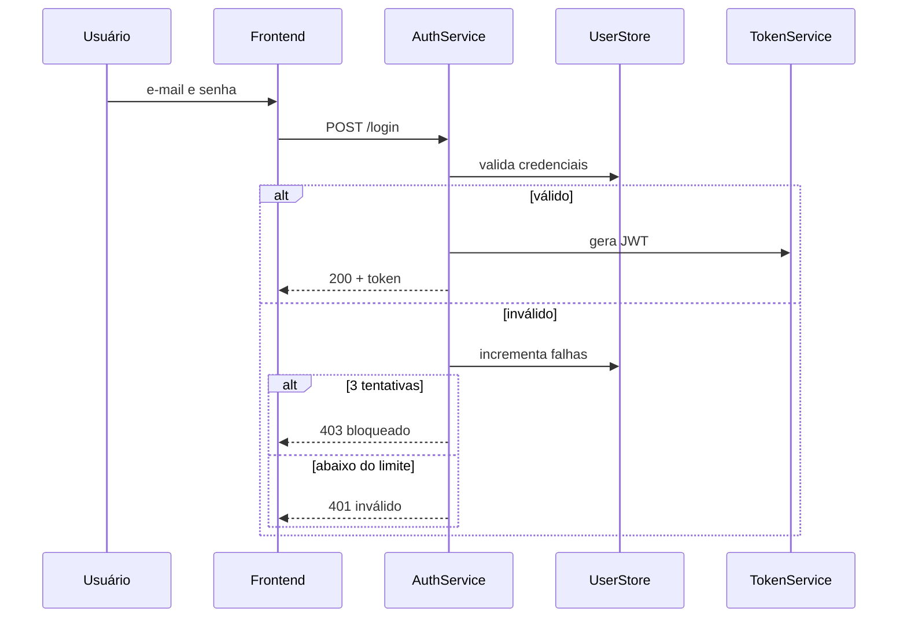
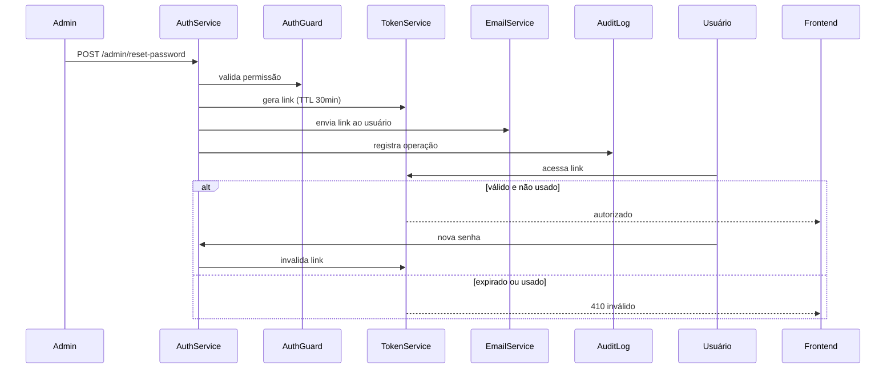
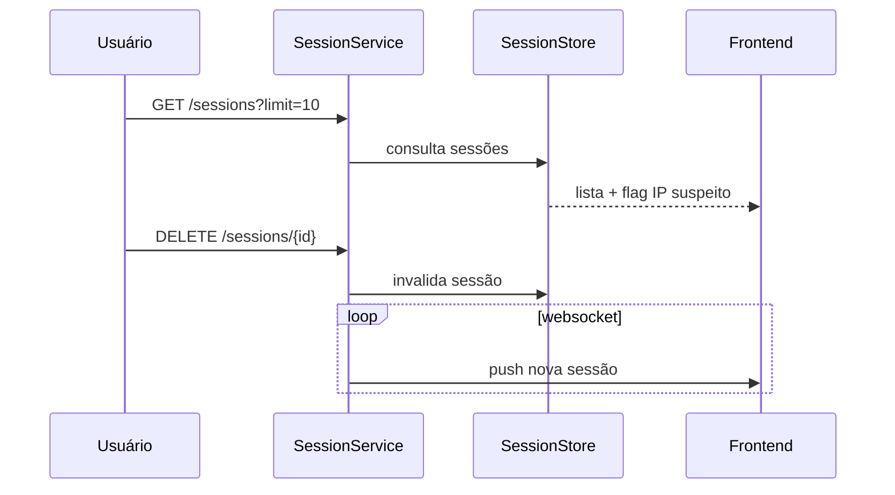
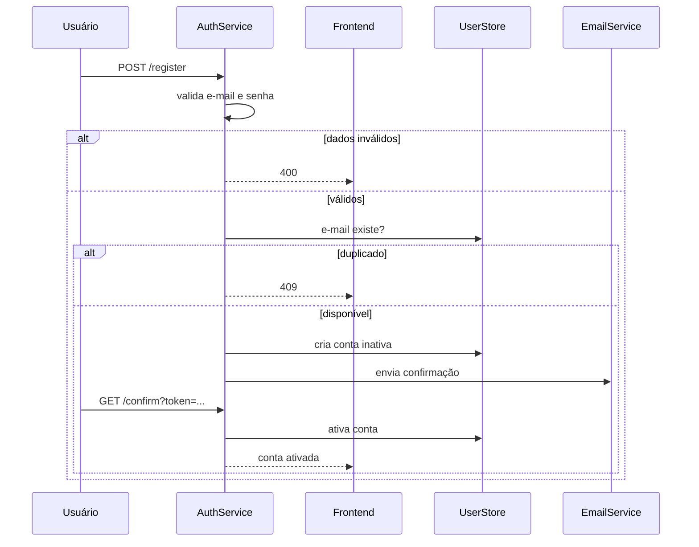
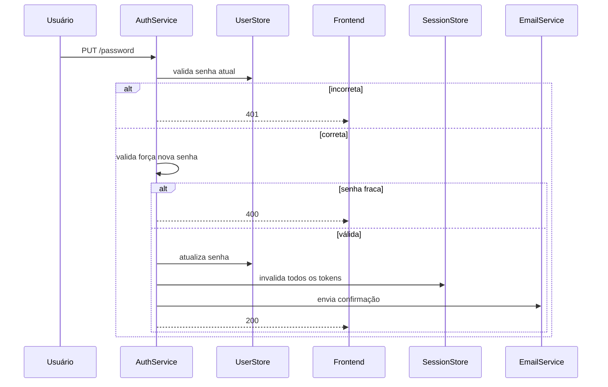
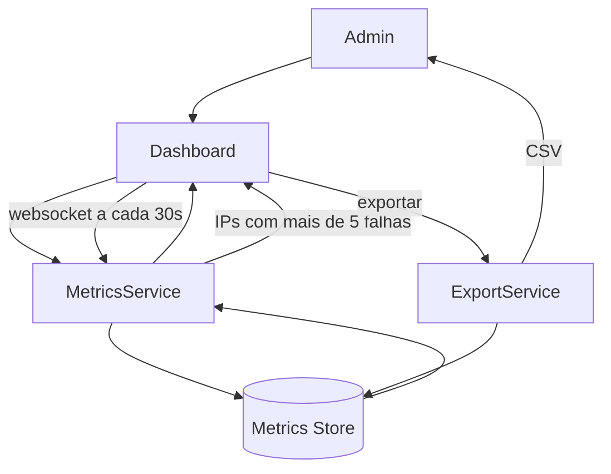

# Prompts para testes do MVP

## Testes básicos

### Prompt

1.

```markdown
Lote de HUs para análise:

HU-001
Solicitante: Leonardo
Como usuário autenticado,
quero fazer login na plataforma com e-mail e senha
para acessar meu painel personalizado.
Critérios de aceite:
- Validar e-mail e senha no backend; retornar erro genérico em caso de falha (sem indicar qual campo está errado)
- Retornar token JWT com expiração de 1h e refresh token com expiração de 7 dias em caso de sucesso
- Bloquear acesso temporariamente por 15 minutos após 3 tentativas falhas consecutivas; o contador reseta após login bem-sucedido
- Redirecionar automaticamente para o painel do usuário após autenticação bem-sucedida
```

---

2.

```markdown
Lote de HUs para análise:

HU-002
Solicitante: Leonardo
Como administrador do sistema,
quero redefinir a senha de qualquer usuário
para poder recuperar acessos bloqueados sem intervenção manual.
Critérios de aceite:
- Apenas administradores autenticados via JWT podem acionar a redefinição;
  a autorização é verificada pelo papel "admin" contido no payload do token
- O sistema gera um token único de redefinição, armazena no banco com timestamp de criação e TTL de 30 minutos,
  e envia por e-mail como link contendo esse token
- Ao acessar o link, o backend valida: token existe, não foi usado e não expirou (datetime.now < criado_em + 30min);
  após uso bem-sucedido, o token é marcado como consumido e não pode ser reutilizado
- A operação deve ser registrada em log de auditoria com os campos:
  * timestamp da ação
  * ID e e-mail do administrador que acionou
  * ID e e-mail do usuário alvo
  * IP de origem do administrador

HU-003
Solicitante: Leonardo
Como usuário autenticado,
quero visualizar o histórico das minhas últimas 10 sessões
para monitorar acessos suspeitos à minha conta.
Critérios de aceite:
- Exibir as últimas 10 sessões (ativas ou encerradas); se houver menos de 10, exibir todas
- Campos por sessão: data, hora, IP, SO e navegador (extraídos do user-agent)
- Destacar visualmente sessões de IPs que nunca apareceram em nenhuma sessão anterior do usuário, considerando TODO o histórico armazenado (não apenas as 10 exibidas)
- Permitir encerramento remoto de sessões individuais
- A lista deve ser atualizada em tempo real via websocket nos seguintes eventos:
  * Nova sessão iniciada (login bem-sucedido)
  * Sessão encerrada (logout manual ou expiração de token)
  * Sessão encerrada remotamente pelo próprio usuário
  * Ao receber o evento, o frontend deve atualizar a lista sem recarregar a página,
    refletindo o novo estado (adição, remoção ou alteração de status da sessão afetada)
```

---

3.

```markdown
Lote de HUs para análise:

HU-004
Solicitante: Leonardo
Como usuário não autenticado,
quero me cadastrar na plataforma com e-mail e senha
para criar minha conta e acessar os recursos disponíveis.
Critérios de aceite:
- Validar formato do e-mail e força mínima da senha
- Verificar se o e-mail já está cadastrado antes de criar
- Enviar e-mail de confirmação após cadastro bem-sucedido
- Conta permanece inativa até confirmação do e-mail

HU-005
Solicitante: Leonardo
Como usuário autenticado,
quero alterar minha senha atual
para manter a segurança da minha conta.
Critérios de aceite:
- Exigir senha atual antes de permitir alteração
- Validar força mínima da nova senha
- Invalidar todos os tokens de sessão ativos após alteração
- Confirmar alteração por e-mail

HU-006
Solicitante: Leonardo
Como administrador do sistema,
quero visualizar um painel com métricas de autenticação em tempo real
para monitorar tentativas suspeitas de acesso.
Critérios de aceite:
- Exibir total de logins bem-sucedidos e falhos nas últimas 24h
- Destacar IPs com mais de 5 tentativas falhas consecutivas
- Atualização automática a cada 30 segundos via websocket
- Permitir exportação do relatório em CSV com os seguintes campos obrigatórios:
  * timestamp (data e hora do evento)
  * tipo_evento (login_sucesso | login_falha)
  * ip_origem
  * usuario (e-mail ou ID)
  * flag_suspeito (true se IP com 5+ tentativas falhas consecutivas)
```

---
---

### Diagramas esperados

Feito com o Claude

1.



---

2.





---

3.








## Testes anti alucinação

### Prompt

4.

```markdown
Lote de HUs para análise:

HU-007
Solicitante: Leonardo
Como usuário,
quero acessar o sistema
para usar as funcionalidades.
Critérios de aceite:
- Deve funcionar
- Deve ser rápido
```

5.

```markdown
Lote de HUs para análise:

HU-008
Solicitante: Leonardo
Como administrador,
quero que o sistema sincronize os dados dos usuários automaticamente
para manter as informações sempre atualizadas.
Critérios de aceite:
- Sincronização deve ocorrer em tempo real
- Dados devem estar sempre consistentes entre os sistemas
- Em caso de falha, o sistema deve se recuperar automaticamente

HU-009
Solicitante: Leonardo
Como usuário autenticado,
quero receber notificações sobre atividades suspeitas na minha conta
para agir rapidamente em caso de invasão.
Critérios de aceite:
- Notificar o usuário imediatamente ao detectar atividade suspeita
- Suportar múltiplos canais de notificação
- O usuário pode configurar quais alertas deseja receber
```

### Resultado esperado

4. 

Propositalmente incompleto em todos os pontos críticos para o design_architect:

- Ator genérico ("usuário" sem especificação)
- Ação vaga ("acessar o sistema" sem definir o que isso significa tecnicamente)
- Sem menção a autenticação, serviços, dados ou integrações
- Critérios de aceite sem métricas ("rápido" sem SLA, "funcionar" sem definição)

5.

A ambiguidade aqui é técnica, não óbvia:

- HU-008 — "sincronizar com o quê?" nunca é definido. "Tempo real" e "consistência" são contraditórios em sistemas distribuídos sem definir o modelo de consistência. "Recuperação automática" sem definir o mecanismo (retry, fila, rollback) impede decisão arquitetural.
- HU-009 — "múltiplos canais" sem listar quais (e-mail, SMS, push, webhook?) impede decisão de componentes. "Atividade suspeita" sem critério mensurável (threshold de tentativas? IP desconhecido? horário?) torna impossível definir o serviço de detecção.

## Testes de Auditoria de Contexto e Governança

### Prompt

6.

```markdown
Lote de HUs para análise:
 
HU-010
Solicitante: Leonardo
Como usuário autenticado,
quero encerrar minha sessão na plataforma
para garantir que meu acesso seja revogado ao sair.
Critérios de aceite:
- Invalidar o token de sessão ativo ao fazer logout
- Redirecionar o usuário para a tela de login após encerramento
- Registrar data e hora do logout no histórico de sessões
 
HU-011
Solicitante: Leonardo
Como usuário,
quero usar o sistema
para aproveitar as funcionalidades.
Critérios de aceite:
- Deve funcionar bem
- Deve ser seguro
- Deve ser fácil de usar
```

### Resultado resperado

6.

**HU-010** — processada normalmente:
- Tipo: `sequenceDiagram` (regra 1 — ator humano com ordem temporal)
- Componentes deriváveis da HU:
  - `LogoutController` | recebe requisição de logout | `SessionService`, `AuditService`
  - `SessionService` | invalida token de sessão ativo | —
  - `AuditService` | registra data e hora do logout | —
**HU-011** — bloqueada em PASSO 1 com PROTOCOLO DE BLOQUEIO em pelo menos um dos seguintes 3 pontos:
- Ação central não define o que o sistema deve executar tecnicamente
- Critério sem definição mensurável
- Critério de UX sem impacto arquitetural mensurável