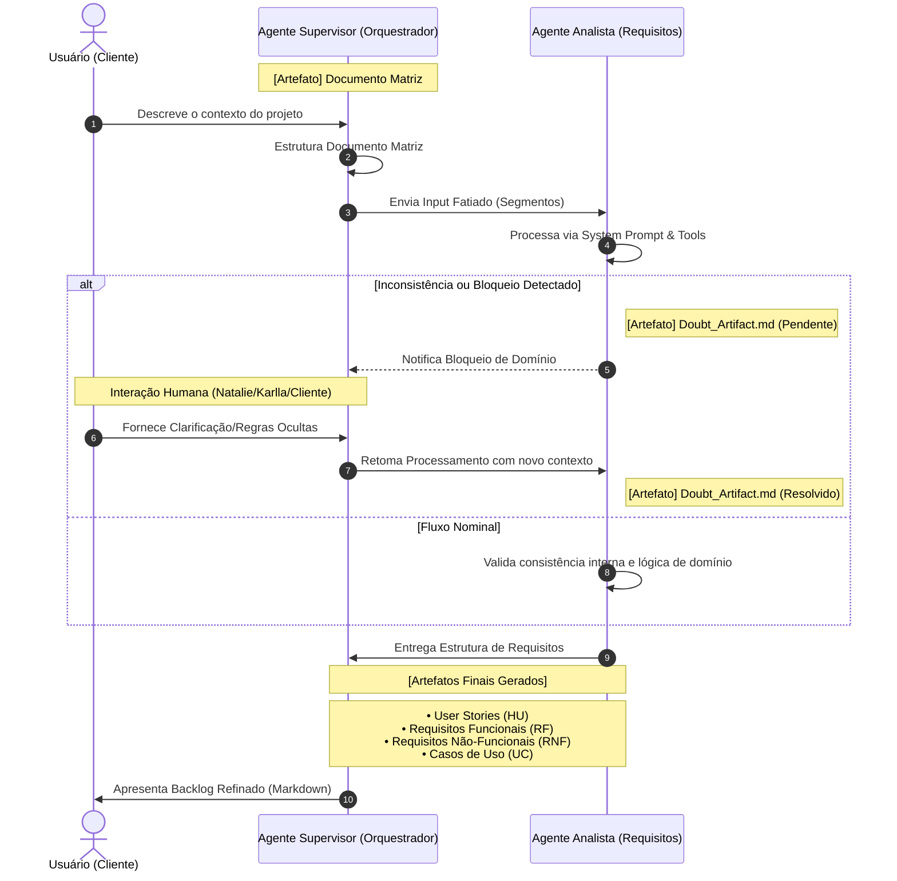

# Fluxo de Trabalho: Agente de Requisitos & Validação de Domínio

Este diagrama descreve a interação entre o Usuário, o Agente Supervisor e o Agente Analista, destacando a geração de artefatos de domínio e o tratamento de dúvidas.

## Papéis e Artefatos

*   **Usuário (Cliente):** Fonte primária de conhecimento e validador final.
*   **Agente Supervisor:** Orquestra o fatiamento e consolida o backlog final.
*   **Agente Analista (MVP):** Transforma contexto bruto em requisitos técnicos estruturados.
*   **Doubt_Artifact.md:** Canal de comunicação síncrona/assíncrona para resolução de ambiguidades de domínio (Responsabilidade: Natalie).
*   **Output Final:** Conjunto de documentos Markdown padronizados contendo HU, RF, RNF e UC.
