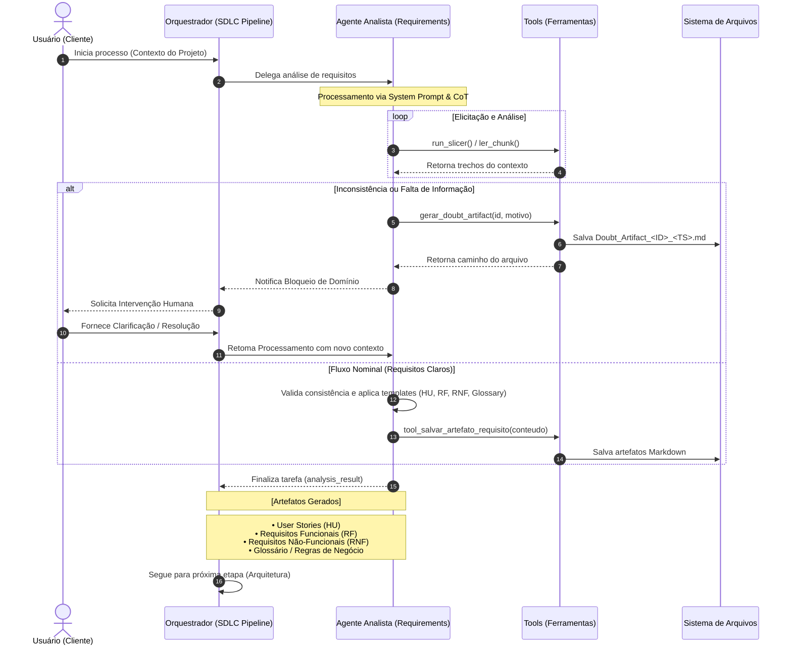

# Fluxo de Trabalho: Agente de Requisitos & Validação de Domínio (Atualizado)

Este diagrama descreve a interação entre o Usuário, o Agente Orquestrador (SDLC Pipeline) e o Agente Analista de Requisitos, detalhando o uso de ferramentas específicas e o fluxo de tratamento de dúvidas.

## Papéis e Artefatos (Atualizado)

*   **Usuário (Cliente):** Fornece o contexto inicial e resolve impedimentos documentados.
*   **Orquestrador (SDLC Pipeline):** Gerencia a sequência de agentes (Requirements -> Architect -> ...).
*   **Agente Analista (requirements_analyst):** Especialista que utiliza CoT (Chain of Thought) para elicitar e classificar requisitos.
*   **Tools (shared/tools):** 
    *   `run_slicer` / `ler_chunk`: Para navegação granular no contexto.
    *   `gerar_doubt_artifact`: Criação formal de pedidos de esclarecimento.
    *   `tool_salvar_artefato_requisito`: Persistência dos requisitos validados.
*   **Doubt_Artifact_<ID>.md:** Documento de bloqueio que exige revisão humana para prosseguir.
*   **Output Final:** Artefatos técnicos estruturados salvos no sistema de arquivos.
