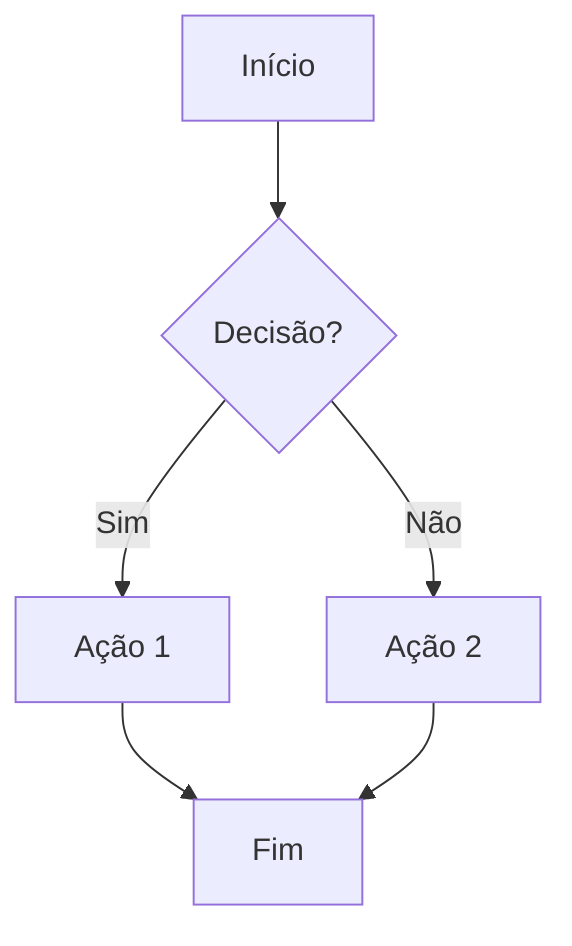
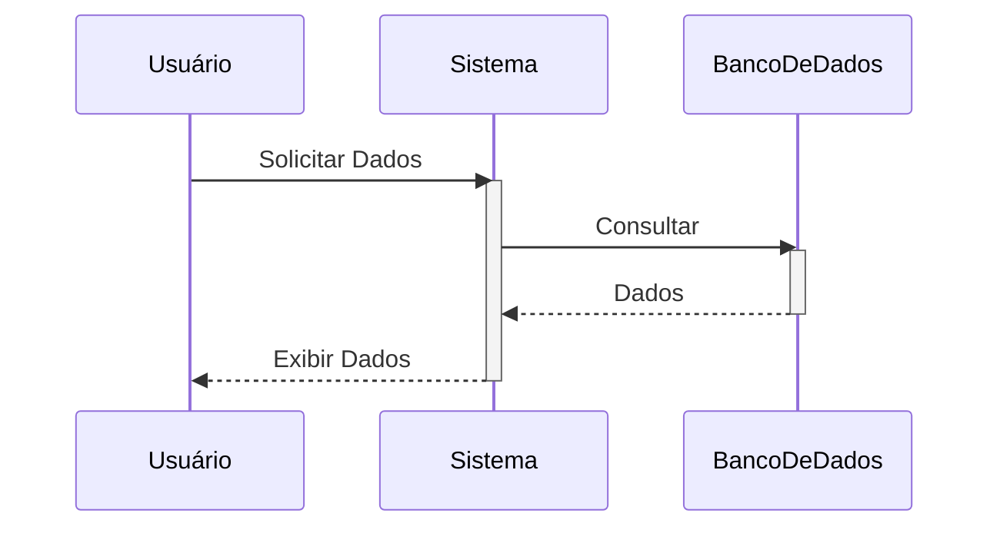
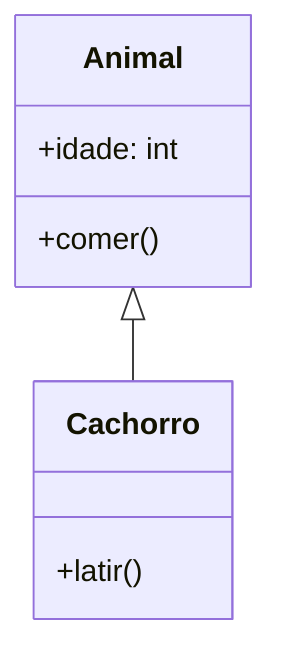
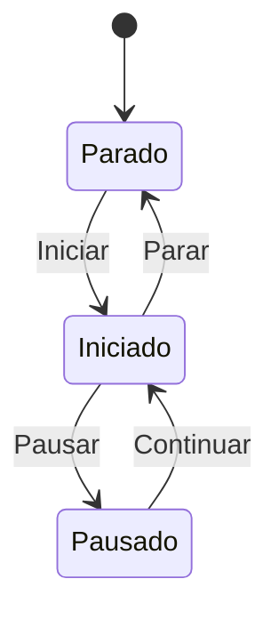

# Guia de Estilo para Diagramas: Mermaid

## 2.1. Pesquisa e Comparação de Ferramentas: Mermaid vs. PlantUML

Ambas as ferramentas, Mermaid e PlantUML, oferecem a capacidade de gerar diagramas a partir de texto, o que é fundamental para a versionabilidade e integração em fluxos de trabalho de desenvolvimento. A escolha entre elas depende das necessidades específicas do projeto em termos de complexidade, personalização e ambiente de execução.

### Tabela 1: Comparativo entre Mermaid e PlantUML

| Característica         | Mermaid                                     | PlantUML                                         |
| :--------------------- | :------------------------------------------ | :----------------------------------------------- |
| **Sintaxe**            | Mais simples e intuitiva                    | Mais complexa e detalhada                        |
| **Personalização**     | Mais limitada                               | Extensa e avançada                               |
| **Renderização**       | Baseada em navegador (SVG), não requer dependências externas | Requer Java e GraphViz                           |
| **Integração**         | Ampla (GitHub, Obsidian, VS Code, etc.)     | Boa, mas pode exigir configuração de ambiente     |
| **Curva de Aprendizado** | Mais rápida                                 | Mais acentuada                                   |
| **Recursos**           | Essenciais para diagramas comuns           | Mais rica em tipos de diagramas e opções         |

### Recomendação

Para o Agente de Design, **Mermaid** é a ferramenta recomendada para a criação de diagramas. A sua sintaxe mais simples e a renderização nativa em navegadores (SVG) facilitam a integração com ferramentas de desenvolvimento web e a visualização rápida, o que é crucial para um agente focado em design e prototipagem. A ampla compatibilidade com plataformas como GitHub também garante que os diagramas sejam facilmente compartilháveis e versionáveis. Embora PlantUML ofereça maior personalização, a simplicidade e a acessibilidade de Mermaid são mais alinhadas com a agilidade e a natureza iterativa do trabalho de um Agente de Design.

## 2.2. Definição de Padrões de Diagramação

Para garantir a consistência e legibilidade dos diagramas criados com Mermaid, os seguintes padrões devem ser seguidos:

### 2.2.1. Diagrama de Fluxo (Flowchart)

*   **Sintaxe:** `graph TD` (Top-Down), `graph LR` (Left-Right), etc.
*   **Nós:** Usar `[Texto do Nó]` para nós retangulares, `(Texto do Nó)` para nós arredondados, `{Texto do Nó}` para nós em forma de diamante (decisão).
*   **Conexões:** Usar `-->` para setas simples, `-- Texto -->` para setas com rótulo.
*   **Exemplo:**

### 2.2.2. Diagrama de Sequência (Sequence Diagram)

*   **Sintaxe:** `sequenceDiagram`
*   **Participantes:** `participant NomeDoParticipante`
*   **Mensagens:** `ParticipanteA->>ParticipanteB: Mensagem` (assíncrona), `ParticipanteA->ParticipanteB: Mensagem` (síncrona).
*   **Ativação/Desativação:** `activate Participante`, `deactivate Participante`.
*   **Exemplo:**

### 2.2.3. Diagrama de Classes (Class Diagram)

*   **Sintaxe:** `classDiagram`
*   **Classes:** `class NomeDaClasse { +atributo: Tipo \n +metodo(): Retorno }`
*   **Relacionamentos:** `ClasseA <|-- ClasseB` (Herança), `ClasseA *-- ClasseB` (Composição), `ClasseA o-- ClasseB` (Agregação), `ClasseA --> ClasseB` (Associação).
*   **Exemplo:**

### 2.2.4. Diagrama de Estado (State Diagram)

*   **Sintaxe:** `stateDiagram-v2`
*   **Estados:** `state "Nome do Estado" as EstadoID`
*   **Transições:** `EstadoA --> EstadoB: Evento`
*   **Exemplo:**

## 2.3. Criação do Guia de Estilo

Este documento serve como o guia de estilo inicial para diagramas. Ele será versionado e atualizado conforme novas necessidades e padrões surgirem.

## 2.4. Validação e Feedback

Este guia será apresentado à equipe para validação e feedback, garantindo sua aplicabilidade e eficácia no dia a dia do Agente de Design.
