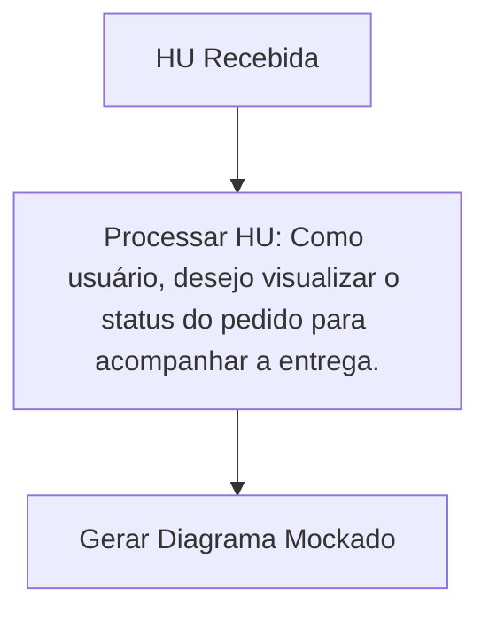

# Relatório Final: Atividades Técnicas do Agente de Design

Este relatório consolida as atividades técnicas realizadas para o Agente de Design, conforme solicitado, baseando-se no documento `PDCMacro1Squad1.pdf` e nas tarefas detalhadas previamente estabelecidas.

## 1. Configuração do Canal de Comunicação e Simulação de Consumo de HU

Foi desenvolvido um script Python (`simulate_hu_consumer.py`) para simular o recebimento de Histórias de Usuário (HUs) vindas do Agente Supervisor. O script demonstra o fluxo de consumo de uma HU em formato JSON e a geração automática de um diagrama Mermaid mockado.

### Código Python (`simulate_hu_consumer.py`)

```python
import json
import time

def consume_hu(hu_data):
    """Simula o consumo de uma História de Usuário."""
    print(f"[{time.strftime('%Y-%m-%d %H:%M:%S')}] Agente de Design recebeu uma HU.")
    print("Conteúdo da HU:")
    print(json.dumps(hu_data, indent=2, ensure_ascii=False))
    
    diagram_content = f"graph TD\\n    A[HU Recebida] --> B[Processar HU: {hu_data.get('titulo', 'Sem Título')}]\\n    B --> C[Gerar Diagrama Mockado]"
    
    diagram_filename = f"diagram_{hu_data.get('id', 'unknown')}.mmd"
    with open(diagram_filename, 'w', encoding='utf-8') as f:
        f.write(diagram_content)
    print(f"Diagrama mockado '{diagram_filename}' gerado com sucesso.")
    return diagram_filename

if __name__ == "__main__":
    sample_hu = {
        "id": "HU-001",
        "titulo": "Como usuário, desejo visualizar o status do pedido para acompanhar a entrega.",
        "descricao": "O usuário precisa de uma forma clara e intuitiva de verificar onde seu pedido se encontra no processo de entrega, desde a confirmação até a finalização.",
        "criterios_de_aceitacao": [
            "Dado que o usuário está logado, quando ele acessa a seção 'Meus Pedidos', então ele vê uma lista de seus pedidos.",
            "Quando o usuário clica em um pedido específico, então ele vê o status atual do pedido (e.g., 'Em Preparação', 'Em Transporte', 'Entregue').",
            "Quando o pedido está em transporte, então ele vê uma estimativa de data de entrega."
        ]
    }
    
    print("Simulando o envio de uma HU do Agente Supervisor para o Agente de Design...")
    generated_diagram = consume_hu(sample_hu)
    print(f"Simulação concluída. Verifique o arquivo: {generated_diagram}")
```

### Resultados da Simulação

A execução do script resultou na geração do arquivo `diagram_HU-001.mmd` com o seguinte conteúdo Mermaid:



## 2. Guia de Estilo para Diagramas (Mermaid vs PlantUML)

Após uma análise comparativa entre Mermaid e PlantUML, o **Mermaid** foi selecionado como a ferramenta recomendada para o Agente de Design devido à sua sintaxe simples, renderização nativa em navegadores (SVG) e ampla integração com plataformas de desenvolvimento.

### Tabela 1: Comparativo entre Mermaid e PlantUML

| Característica         | Mermaid                                     | PlantUML                                         |
| :--------------------- | :------------------------------------------ | :----------------------------------------------- |
| **Sintaxe**            | Mais simples e intuitiva                    | Mais complexa e detalhada                        |
| **Personalização**     | Mais limitada                               | Extensa e avançada                               |
| **Renderização**       | Baseada em navegador (SVG)                  | Requer Java e GraphViz                           |
| **Integração**         | Ampla (GitHub, Obsidian, VS Code, etc.)     | Boa, mas pode exigir configuração de ambiente     |
| **Curva de Aprendizado** | Mais rápida                                 | Mais acentuada                                   |

O guia de estilo completo, incluindo padrões para diagramas de fluxo, sequência, classes e estados, está disponível no arquivo `diagram_style_guide.md`.

## 3. Modelo de Justificativa Técnica (Trade-offs) do Agente Arquiteto

Foi estruturado um modelo padronizado em Markdown para documentar as justificativas técnicas e os *trade-offs* envolvidos nas decisões de arquitetura. O modelo inclui seções para problema/contexto, objetivo, opções consideradas, critérios de avaliação, análise de *trade-offs*, decisão final e impactos/riscos.

### Exemplo de Justificativa Técnica (Resumo)

| Seção                  | Descrição                                                              |
| :--------------------- | :--------------------------------------------------------------------- |
| **Problema/Contexto**  | Necessidade de escolha de banco de dados para microsserviço de pedidos. |
| **Opções Consideradas**| PostgreSQL (Relacional) vs. MongoDB (NoSQL).                           |
| **Critérios**          | Performance, Escalabilidade, Segurança, Custo, Consistência.           |
| **Decisão Final**      | **PostgreSQL**, priorizando consistência transacional (ACID).          |
| **Trade-offs**         | Prioriza integridade dos dados em detrimento de escalabilidade horizontal nativa. |

O modelo completo e um exemplo detalhado estão disponíveis no arquivo `technical_justification_model.md`.

## 4. Esqueleto do Protótipo Mockado (HTML/CSS)

Foi desenvolvido um esqueleto básico de protótipo mockado utilizando HTML e CSS, que representa a interface do usuário para o Agente de Design. O protótipo permite a entrada de HUs, simula o processamento e exibe o diagrama Mermaid gerado.

### Funcionalidades do Protótipo:

*   **Entrada de HUs:** Formulário para ID, título, descrição e critérios de aceitação.
*   **Processamento Simulado:** Botão para processar a HU e gerar o diagrama.
*   **Saída de Diagrama:** Exibição visual do diagrama Mermaid e do código correspondente.
*   **Histórico:** Lista de HUs processadas com carimbo de data/hora.
*   **Responsividade:** Layout adaptável para diferentes tamanhos de tela.

O código completo do protótipo está no arquivo `prototype.html` e pode ser visualizado através da URL pública gerada durante a execução.

## Definição de Pronto (DoD) - Status Final

| Critério de Pronto (DoD)                               | Status      | Evidência                                      |
| :----------------------------------------------------- | :---------- | :--------------------------------------------- |
| Documento de padronização na branch                    | Concluído   | `diagram_style_guide.md`, `technical_justification_model.md` |
| Fluxo de comunicação testado (input de HU simulado)    | Concluído   | `simulate_hu_consumer.py`, `diagram_HU-001.mmd` |
| Esqueleto do protótipo mockado (HTML/CSS básico)       | Concluído   | `prototype.html`                               |

---
**Relatório gerado por Manus AI em 24 de Março de 2026.**
