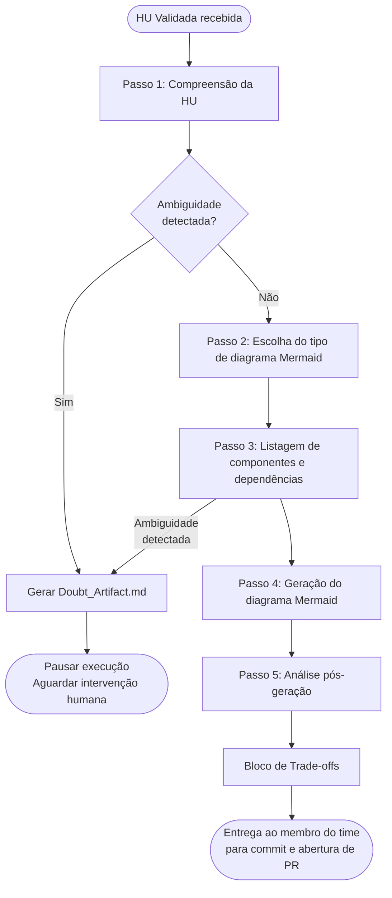
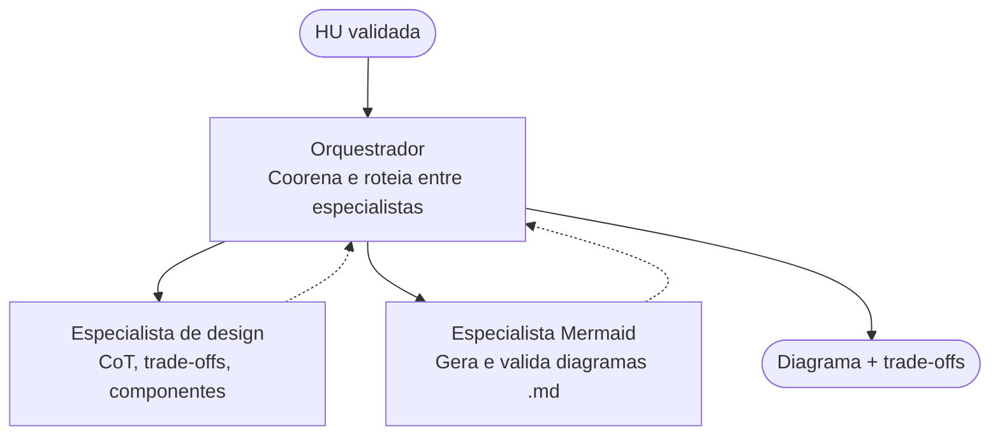

# Time 2: Design & Prototipagem (Arquitetura de Agentes)

**Coordenação:** Mariana  
**Líder Operacional:** Jeniffer  
**Autor:** Leonardo Côrtes Filho

## Subtask 1.1

Desenvolver prompts de "Chain-of-Thought" para que o agente gere diagramas de arquitetura, justificando suas escolhas.

---

## 1. Escolha da Ferramenta de Diagramação: Mermaid

### 1.1 Por que Mermaid?

O formato escolhido para esta entrega é **Mermaid**, por um conjunto de razões técnicas e operacionais alinhadas às diretrizes do Time 2:

**Integração nativa com Git e Markdown**  
Mermaid é renderizado diretamente pelo GitHub, GitLab e qualquer visualizador de Markdown moderno. Isso significa que os diagramas gerados pelo agente podem ser versionados como texto puro em arquivos `.md`, sem dependências externas de ferramentas gráficas.

**Sintaxe simples e geração confiável por LLMs**  
A sintaxe declarativa do Mermaid é substancialmente mais simples que a do PlantUML, o que reduz a taxa de erro quando um modelo de linguagem a gera.

**Suporte nativo nos ambientes do projeto**  
Ferramentas utilizadas no ecossistema do TACO IDE — incluindo o próprio GitHub e editores como VS Code com [extensão Mermaid Preview](https://marketplace.visualstudio.com/items?itemName=shd101wyy.markdown-preview-enhanced) — renderizam o formato sem instalação adicional.

**Alinhamento com o princípio de "text as source of truth"**  
A diretriz de padronização do Time 2 estabelece o uso de Mermaid ou PlantUML em Markdown para possibilitar versionamento Git via texto. Mermaid cumpre esse requisito com menor overhead e maior compatibilidade imediata.

### 1.2 Comparativo Técnico

| Critério | Mermaid | PlantUML |
| -------- | ------- | -------- |
| Renderização nativa no GitHub | ✅ Sim | ❌ Não (requer servidor externo) |
| Legibilidade do código-fonte | ✅ Alta | ⚠️ Média |
| Facilidade de geração por LLMs | ✅ Alta | ⚠️ Média |
| Riqueza de tipos de diagrama | ⚠️ Boa | ✅ Muito alta |
| Diagramas C4 e UML avançados | ⚠️ Limitado | ✅ Completo |
| Dependência de instalação local | ✅ Nenhuma | ⚠️ Requer Java/servidor |
| Maturidade do ecossistema | ✅ Alta | ✅ Alta |

### 1.3 Planos Futuros: Suporte a PlantUML

Está previsto para versões futuras do Agente MVP o desenvolvimento de um **conjunto paralelo de prompts para PlantUML**, a motivação é cobrir casos de uso que Mermaid não suporta adequadamente, especialmente:

- Diagramas de componentes C4 com granularidade avançada;
- Modelos UML completos exigidos por documentação formal de engenharia.

A arquitetura de prompts desenvolvida nesta subtask foi desenhada com esse plano em mente: os blocos de instrução (System Prompt, CoT e Trade-off) são agnósticos ao formato de saída e poderão ser reaproveitados com ajustes mínimos para PlantUML.

---

## 2. Estrutura dos Prompts Desenvolvidos

Os prompts desta subtask são compostos por três blocos interdependentes, aplicados sequencialmente pelo agente:

### Bloco 1 — System Prompt (Identidade e Regras)

Define a identidade fixa do agente, suas restrições de comportamento e os formatos de saída aceitos.

**Elementos centrais:**

- Papel: Agente Arquiteto de Software do Time 2;
- Restrição fundamental: nenhum diagrama é gerado sem bloco de raciocínio explícito;
- Gatilho para `Doubt_Artifact.md`: qualquer inconsistência ou bloqueio detectado;
- Formatos permitidos: `flowchart`, `sequenceDiagram`, `classDiagram`, `stateDiagram-v2`, `erDiagram`, `C4Context`.

### Bloco 2 — Chain-of-Thought (Raciocínio Pré-Diagrama)

Template principal que força o agente a percorrer cinco passos antes de emitir qualquer código Mermaid:

1. **Compreensão das HU** — identificação do ator, ação central, critérios de aceite com impacto arquitetural e possíveis ambiguidades;
2. **Escolha do tipo de diagrama** — seleção justificada com base em uma tabela de decisão mapeando cenários a tipos Mermaid;
3. **Identificação de componentes** — listagem de cada entidade com sua responsabilidade e dependências diretas;
4. **Geração do diagrama** — produção do bloco Mermaid somente após os três passos anteriores;
5. **Análise pós-geração** — verificação de fidelidade à HU, componentes ausentes e legibilidade para consumo pelo Time 4.

### Bloco 3 — Trade-off Block (Justificativa Arquitetural)

Template estruturado que o agente preenche para cada decisão de design relevante identificada no diagrama. Cada entrada documenta:

- Contexto da decisão;
- Alternativas consideradas com prós e contras;
- Decisão final e justificativa em termos de escalabilidade, manutenibilidade, acoplamento ou aderência a RNFs;
- Impacto esperado no curto e longo prazo;
- Nível de reversibilidade — decisões de baixa reversibilidade requerem aprovação da Coordenação antes do commit.

---

## 3. Fluxo de Execução do Agente

---

## 4. Sistema multi-agente

