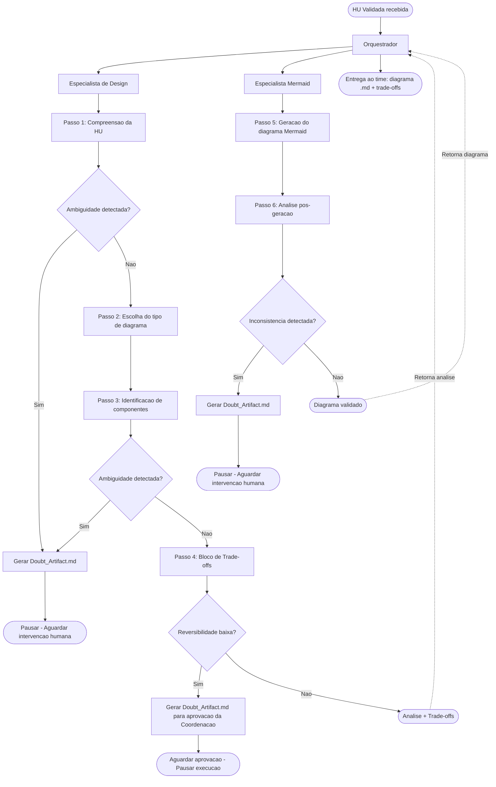
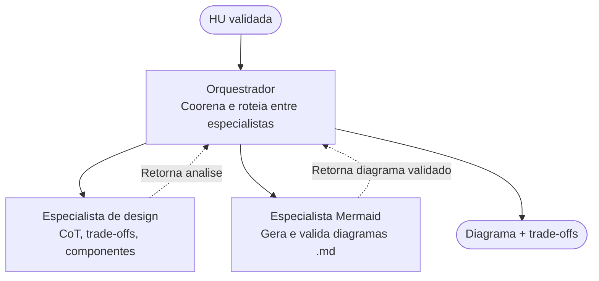

# Time 2: Design & Prototipagem (Arquitetura de Agentes)

**Coordenação:** Mariana
**Líder Operacional:** Jeniffer
**Autor:** Leonardo Côrtes Filho

## Subtask 1.1

Desenvolver prompts de "Chain-of-Thought" para que o agente gere diagramas de arquitetura, justificando suas escolhas.

---

## 1. Escolha da Ferramenta de Diagramação: Mermaid

### 1.1 Por que Mermaid?

O formato escolhido para esta entrega é **Mermaid**, por um conjunto de razões técnicas e operacionais alinhadas às diretrizes do Time 2:

**Integração nativa com Git e Markdown**
Mermaid é renderizado diretamente pelo GitHub, GitLab e qualquer visualizador de Markdown moderno. Isso significa que os diagramas gerados pelo agente podem ser versionados como texto puro em arquivos `.md`, sem dependências externas de ferramentas gráficas.

**Sintaxe simples e geração confiável por LLMs**
A sintaxe declarativa do Mermaid é substancialmente mais simples que a do PlantUML, o que reduz a taxa de erro quando um modelo de linguagem a gera.

**Suporte nativo nos ambientes do projeto**
Ferramentas utilizadas no ecossistema do projeto — incluindo o próprio GitHub e editores como VS Code com [extensão Mermaid Preview](https://marketplace.visualstudio.com/items?itemName=shd101wyy.markdown-preview-enhanced) — renderizam o formato sem instalação adicional.

**Alinhamento com o princípio de "text as source of truth"**
A diretriz de padronização do Time 2 estabelece o uso de Mermaid ou PlantUML em Markdown para possibilitar versionamento Git via texto. Mermaid cumpre esse requisito com menor overhead e maior compatibilidade imediata.

### 1.2 Comparativo Técnico

| Critério | Mermaid | PlantUML |
| -------- | ------- | -------- |
| Renderização nativa no GitHub | ✅ Sim | ❌ Não (requer servidor externo) |
| Legibilidade do código-fonte | ✅ Alta | ⚠️ Média |
| Facilidade de geração por LLMs | ✅ Alta | ⚠️ Média |
| Riqueza de tipos de diagrama | ⚠️ Boa | ✅ Muito alta |
| Diagramas C4 e UML avançados | ⚠️ Limitado | ✅ Completo |
| Dependência de instalação local | ✅ Nenhuma | ⚠️ Requer Java/servidor |
| Maturidade do ecossistema | ✅ Alta | ✅ Alta |

### 1.3 Planos Futuros: Suporte a PlantUML

Está previsto para versões futuras do Agente MVP o desenvolvimento de um **conjunto paralelo de prompts para PlantUML**, para cobrir casos de uso que Mermaid não suporta adequadamente, especialmente:

- Diagramas de componentes C4 com granularidade avançada;
- Modelos UML completos exigidos por documentação formal de engenharia.

Os blocos de raciocínio (CoT) e de trade-off desenvolvidos nesta subtask são agnósticos ao formato de saída e poderão ser reaproveitados com ajustes mínimos para PlantUML.

---

## 2. Arquitetura Multi-Agente e Distribuição de Responsabilidades

O sistema é composto por três agentes com responsabilidades distintas e não sobreponíveis. Compreender essa divisão é fundamental para interpretar corretamente os blocos de prompts e o fluxo de execução.

| Agente | Responsabilidade principal | Gera diagrama? | Pode disparar Doubt_Artifact? |
|---|---|---|---|
| **Orquestrador** | Coordena o fluxo, roteia entre especialistas e consolida a saída final | Não | Não |
| **Especialista de Design** | Analisa a HU, escolhe o tipo de diagrama, identifica componentes e documenta trade-offs via CoT | Não | Sim |
| **Especialista Mermaid** | Recebe a análise do Design, gera o diagrama Mermaid e executa a análise pós-geração | Sim | Sim |

---

## 3. Estrutura dos Prompts por Agente

Os prompts são compostos por blocos interdependentes aplicados sequencialmente. A seguir, o detalhamento do raciocínio esperado de cada agente.

### 3.1 Passos do Especialista de Design (CoT)

O Especialista de Design percorre **quatro passos** antes de entregar sua análise ao Orquestrador:

1. **Compreensão da HU** — identificação do ator principal, ação central, critérios de aceite com impacto arquitetural e possíveis ambiguidades. Se houver ambiguidade: gerar `Doubt_Artifact.md` e interromper.
2. **Escolha do tipo de diagrama** — seleção justificada com base na tabela de decisão abaixo, mapeando cenários a tipos Mermaid.
3. **Identificação de componentes** — listagem de cada entidade com sua responsabilidade e dependências diretas. Se houver ambiguidade: gerar `Doubt_Artifact.md` e interromper.
4. **Bloco de trade-off** — para cada decisão de design relevante: contexto, alternativas com prós e contras, decisão final, justificativa técnica, impacto esperado e nível de reversibilidade. Decisões de **baixa reversibilidade** disparam sinalização ao Orquestrador para aprovação da Coordenação antes de prosseguir.

**Tabela de decisão — tipo de diagrama:**

| Cenário | Diagrama recomendado |
|---|---|
| Fluxo de processos / decisões | `flowchart TD` |
| Comunicação entre componentes | `sequenceDiagram` |
| Estrutura de entidades | `classDiagram` |
| Ciclo de vida / estados | `stateDiagram-v2` |
| Modelo de dados | `erDiagram` |
| Visão de contexto C4 | `C4Context` |

### 3.2 Passos do Especialista Mermaid (CoT)

O Especialista Mermaid recebe a análise do Design e percorre **dois passos**:

1. **Geração do diagrama** — produção do bloco Mermaid com base no tipo, componentes e dependências recebidos.
2. **Análise pós-geração** — verificação obrigatória de: fidelidade à HU, componentes ausentes ou relações implícitas não representadas, legibilidade para o time de desenvolvimento e validade da sintaxe Mermaid. Se qualquer item não puder ser resolvido: gerar `Doubt_Artifact.md` e interromper.

**Convenção de nomenclatura dos arquivos gerados:**

```
diagrama_{hu_id}_{tipo}.md
```

Exemplos:
- `diagrama_HU-042_flowchart.md`
- `diagrama_HU-015_sequenceDiagram.md`
- `diagrama_HU-091_erDiagram.md`

**Cabeçalho obrigatório de cada arquivo gerado:**

```
<!-- HU de origem: HU-{id} -->
<!-- Tipo de diagrama: {tipo Mermaid} -->
<!-- Gerado por: Especialista Mermaid — Agente MVP Time 2 -->
<!-- Solicitado por: {nome do solicitante} -->
<!-- Data de criação: {YYYY-MM-DD} -->
```

### 3.3 Doubt Artifact

Qualquer especialista pode interromper o fluxo gerando um `Doubt_Artifact_HU-{id}_{YYYY-MM-DD}.md`. O Orquestrador pausa a execução e sinaliza para intervenção humana. Nenhum diagrama é gerado ou consolidado enquanto houver um `Doubt_Artifact` não resolvido.

O arquivo documenta: passo do fluxo em que ocorreu o bloqueio, severidade (Alta / Média / Baixa), descrição da inconsistência ou ambiguidade, sugestões de resolução e status de acompanhamento.

---

## 4. Fluxo de Execução Completo



---

## 5. Diagrama Resumido do Sistema Multi-Agente

