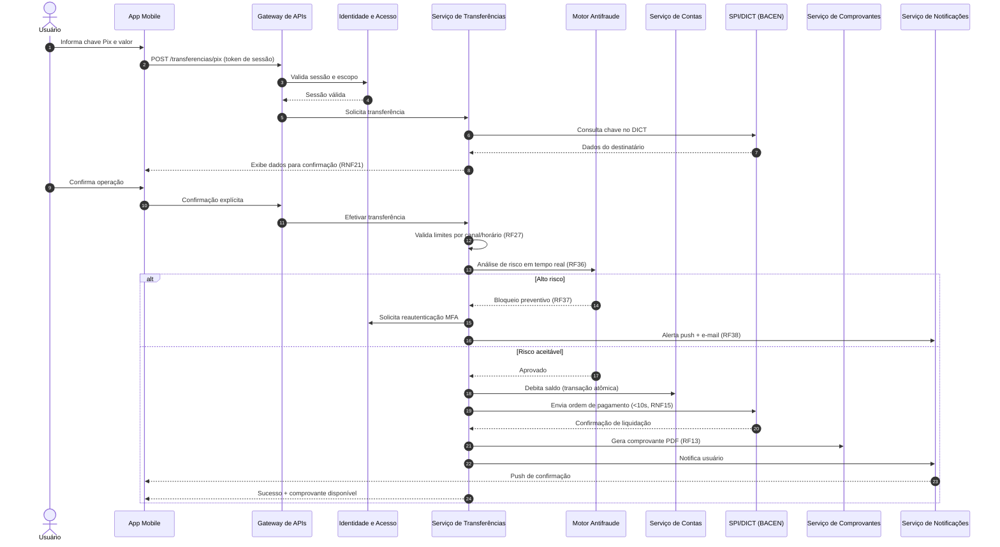
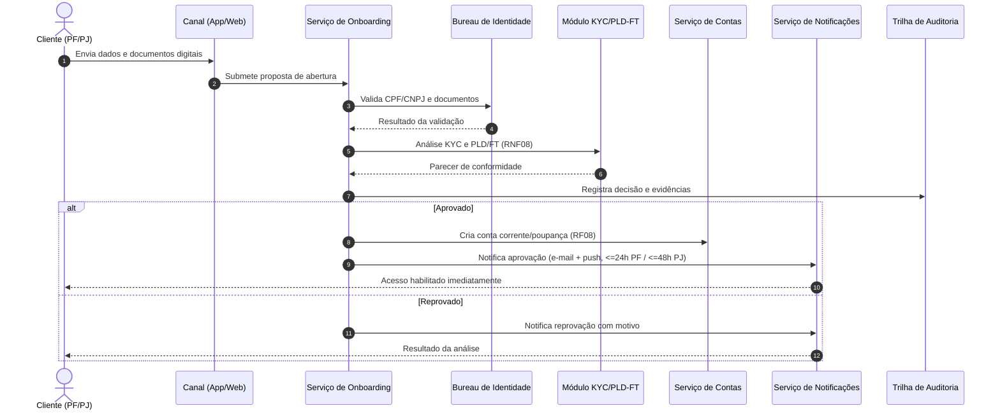

# Relatório Técnico de Arquitetura de Software
## Plataforma Financeira Digital — Sistema Bancário Digital (G01)

---

## 1. Identificação das HUs

| HU | Título | Perfil | Requisitos Vinculados |
|----|--------|--------|----------------------|
| HU01 | Abrir conta com validação de identidade | PF | RF01, RF02, RF08, RNF08 |
| HU02 | Autenticar com múltiplos fatores | PF/Todos | RF03, RF04, RF05, RF06, RNF03, RNF04 |
| HU03 | Realizar transferência via Pix | PF/Todos | RF22, RF23, RF24, RF27, RF13, RNF15, RNF21 |
| HU04 | Pagar boleto com agendamento | PF/Todos | RF28, RF29, RF30, RF31 |
| HU05 | Gerenciar cartão de crédito | PF/Todos | RF14–RF20, RNF06 |
| HU06 | Contestar transação não reconhecida | PF/Todos | RF21, RF39, RF40 |
| HU07 | Investir em renda fixa | PF/Todos | RF32, RF33, RF34, RF35 |
| HU08 | Gerenciar consentimentos do open finance | PF/Todos | RF41, RF42, RF43, RF44, RNF11 |
| HU09 | Receber alertas e responder a suspeita de fraude | PF/Todos | RF36, RF37, RF38, RF39, RF40 |
| HU10 | Abrir conta PJ com documentação societária | PJ | RF01, RF02, RF08, RNF08 |
| HU11 | Realizar TED para fornecedores | PJ | RF25, RF26, RF27, RF13 |
| HU12 | Acompanhar carteira de clientes | Gerente | RF07, RF45, RF46 |
| HU13 | Abrir solicitação de serviço em nome do cliente | Gerente | RF47, RNF12 |

Requisitos transversais aplicáveis a todas as HUs: RNF01–RNF05, RNF07, RNF09, RNF10, RNF12–RNF24; RF09–RF13 (núcleo de contas).

---

## 2. Diagramas de Arquitetura (Mermaid)

### 2.1 Diagrama de Componentes (Visão Geral)

```mermaid
flowchart TB
    subgraph Canais
        APP[App Mobile iOS/Android]
        WEB[Portal Web Responsivo]
        GER[Portal do Gerente]
    end

    subgraph Borda
        GW[Gateway de APIs<br/>TLS, Rate Limiting, Roteamento]
        OFAPI[APIs Open Finance<br/>Padrão Open Finance Brasil]
    end

    subgraph Nucleo["Serviços de Negócio"]
        IAM[Serviço de Identidade e Acesso<br/>MFA, Sessões, RBAC]
        ONB[Serviço de Onboarding e KYC]
        CONTA[Serviço de Contas<br/>Saldo, Extrato, Rendimentos]
        TRANSF[Serviço de Transferências<br/>Pix, TED, Agendamentos]
        BOLETO[Serviço de Pagamentos de Boleto]
        CARTAO[Serviço de Cartões<br/>Débito/Crédito, Fatura, Limites]
        INVEST[Serviço de Investimentos<br/>Renda Fixa]
        FRAUDE[Motor Antifraude<br/>Análise em Tempo Real]
        CONSENT[Serviço de Consentimentos<br/>Open Finance e Gerente]
        CRM[Serviço de Relacionamento<br/>Carteira, Anotações, Solicitações]
        NOTIF[Serviço de Notificações<br/>Push, E-mail]
        DOC[Serviço de Comprovantes<br/>Geração de PDF]
        CONTEST[Serviço de Contestações]
    end

    subgraph Transversal
        AUDIT[Trilha de Auditoria Imutável]
        REG[Serviço de Relatórios Regulatórios<br/>BACEN 3040, SCR]
        MON[Observabilidade e Métricas]
    end

    subgraph Externos
        SPI[SPI / DICT - Banco Central]
        STR[Rede TED - Banco Central]
        PCI[Processador de Cartões PCI-DSS]
        BUR[Bureaus de Identidade e Crédito]
        OFEXT[Instituições Open Finance]
        CIP[Câmara de Compensação de Boletos]
    end

    APP --> GW
    WEB --> GW
    GER --> GW
    OFEXT --> OFAPI
    OFAPI --> CONSENT
    OFAPI --> TRANSF
    GW --> IAM
    GW --> ONB
    GW --> CONTA
    GW --> TRANSF
    GW --> BOLETO
    GW --> CARTAO
    GW --> INVEST
    GW --> CONSENT
    GW --> CRM
    GW --> CONTEST
    ONB --> BUR
    TRANSF --> SPI
    TRANSF --> STR
    TRANSF --> FRAUDE
    TRANSF --> CONTA
    BOLETO --> CIP
    BOLETO --> CONTA
    CARTAO --> PCI
    CARTAO --> FRAUDE
    FRAUDE --> NOTIF
    FRAUDE --> AUDIT
    TRANSF --> DOC
    BOLETO --> DOC
    CONTA --> AUDIT
    CONTEST --> FRAUDE
    CRM --> CONSENT
    CONTA --> REG
    NOTIF --> APP
```

### 2.2 Diagrama de Sequência — HU03: Transferência via Pix

### 2.3 Diagrama de Sequência — HU01/HU10: Onboarding com KYC

---

## 3. Decisões de Arquitetura

| ID | Decisão | Justificativa | Requisitos |
|----|---------|---------------|------------|
| AD01 | Arquitetura de serviços independentes por domínio de negócio (contas, transferências, cartões, investimentos, fraude, consentimentos) | Escalonamento horizontal independente, isolamento de falhas, evolução regulatória por domínio | RNF16, RNF17, RNF13 |
| AD02 | Gateway de APIs como ponto único de entrada com terminação TLS ≥1.2, rate limiting e roteamento | Segurança de borda centralizada e mitigação de força bruta | RNF01, RNF04 |
| AD03 | Motor Antifraude síncrono no caminho crítico de transações, com decisão em milissegundos e política de fallback (fail-safe: bloquear alto valor, liberar baixo valor) | Análise em tempo real sem violar SLA de 10s do Pix | RF36, RF37, RNF15, RNF17 |
| AD04 | Comunicação assíncrona baseada em eventos para notificações, auditoria, relatórios regulatórios e geração de comprovantes | Desacoplamento; nada não-essencial no caminho crítico | RF20, RF38, RNF12, RNF14 |
| AD05 | Tokenização de dados de cartão delegada a processador certificado PCI-DSS; o sistema armazena apenas tokens e últimos 4 dígitos | Redução de escopo PCI e conformidade | RNF06 |
| AD06 | Ledger transacional com contabilidade de dupla entrada, escrita atômica e padrão de compensação (saga) para operações distribuídas | Consistência financeira e não perda de transações em falha | RNF17, RF09, RF12 |
| AD07 | Trilha de auditoria imutável (append-only, com encadeamento criptográfico) com retenção ≥5 anos | Conformidade e auditoria interna de fraudes | RNF12, RF40 |
| AD08 | Serviço de Consentimentos unificado cobrindo Open Finance e acesso do gerente | Modelo único de consentimento, revogação imediata e verificação em toda leitura de dados | RF41, RF42, RF07, HU12 |
| AD09 | Criptografia em repouso AES-256 para dados sensíveis e hash de senhas com algoritmo de derivação resistente (bcrypt/Argon2, conforme requisito) | Proteção de dados e LGPD | RNF02, RNF03, RNF10 |
| AD10 | Implantação em múltiplas zonas de disponibilidade, com replicação de dados e backup contínuo (RPO ≤1h, RTO ≤4h) | Disponibilidade 99,95% e recuperação de desastres | RNF13, RNF22, RNF23 |
| AD11 | Camada de leitura otimizada (projeções/cache de saldo e extrato) separada da escrita transacional | Consulta de saldo/extrato ≤1s sob pico | RNF14, RF09, RF10 |
| AD12 | Motor de agendamento centralizado para Pix, TED e boletos futuros, com lembretes automáticos | Reuso entre domínios e consistência de notificações | RF26, RF30, RF31 |
| AD13 | APIs Open Finance segregadas em perímetro próprio, aderentes às especificações do Open Finance Brasil, com autenticação de instituições parceiras | Conformidade de fases regulatórias e isolamento de risco | RF44, RNF11, RF43 |
| AD14 | Observabilidade nativa: métricas de latência, erros e disponibilidade expostas por todos os serviços a painel em tempo real | Operação do SLA e detecção proativa | RNF24, RNF13 |
| AD15 | RBAC com princípio de menor privilégio para o gerente: leitura mediante consentimento; ações transacionais em nome do cliente exigem autorização explícita registrada | Segregação de funções e auditabilidade | RF07, RF47, HU13 |

---

## 4. Tabela de Componentes e Rastreabilidade

| Componente | Responsabilidade Principal | Comunica-se com | Origem (HU / Critério de Aceite) |
|---|---|---|---|
| Gateway de APIs | Terminação TLS, autenticação de borda, rate limiting, roteamento | Todos os canais e serviços de negócio | Transversal (RNF01, RNF04) |
| Serviço de Identidade e Acesso (IAM) | Login, MFA (OTP/biometria), sessões com timeout por perfil, histórico de acessos, bloqueio remoto, RBAC | Gateway, Notificações, Auditoria | HU02 (MFA obrigatório; alerta em bloqueio); RF03–RF06 |
| Serviço de Onboarding e KYC | Cadastro PF/PJ, validação documental, KYC/PLD-FT, decisão de abertura | Bureaus externos, Contas, Notificações, Auditoria | HU01 (resultado ≤24h); HU10 (KYC de sócios, ≤48h) |
| Serviço de Contas | Saldo em tempo real, extrato com filtros, rendimentos de poupança, transferência entre contas do titular | Transferências, Boletos, Investimentos, Auditoria, Relatórios Regulatórios | RF08–RF12; HU01 (acesso imediato pós-aprovação) |
| Serviço de Transferências | Pix (todas as chaves), TED, gestão de chaves Pix, limites por canal/horário, agendamentos | SPI/DICT, rede TED, Contas, Antifraude, Comprovantes, Agendador | HU03 (confirmação de destinatário; limite noturno); HU11 (validação de destino) |
| Serviço de Pagamentos de Boleto | Leitura de código de barras/linha digitável, exibição de dados, pagamento e agendamento | Câmara de compensação, Contas, Agendador, Notificações | HU04 (confirmação; lembrete 1 dia antes) |
| Serviço de Cartões | Emissão débito/crédito, faturas, pagamento de fatura, limites, bloqueio independente ≤60s | Processador PCI-DSS, Contas, Antifraude, Notificações | HU05 (fatura por ciclo; bloqueio ≤60s; push por transação) |
| Serviço de Investimentos | Catálogo de renda fixa, aplicação/resgate, posição consolidada, Informe de Rendimentos | Contas, Comprovantes, Notificações | HU07 (posição atualizada imediatamente) |
| Motor Antifraude | Score de risco em tempo real, bloqueio preventivo, solicitação de reautenticação, histórico de alertas | Transferências, Cartões, IAM, Notificações, Auditoria | HU09 (alerta simultâneo push/e-mail; bloqueio preventivo) |
| Serviço de Contestações | Registro de contestações com motivo/evidências, acompanhamento de prazo | Antifraude, Cartões, Contas, Notificações | HU06 (contestação de qualquer transação; confirmação de recebimento) |
| Serviço de Consentimentos | Ciclo de vida de consentimentos Open Finance e do gerente, revogação imediata | APIs Open Finance, CRM, Notificações, Auditoria | HU08 (revogação imediata; e-mail em concessão/revogação); HU12 |
| APIs Open Finance | Exposição de APIs padronizadas Open Finance Brasil, iniciação de pagamentos por parceiros | Instituições externas, Consentimentos, Transferências, Contas | HU08; RF43, RF44, RNF11 |
| Serviço de Relacionamento (CRM) | Carteira do gerente, visão consolidada mediante consentimento, anotações, solicitações de serviço | Consentimentos, Contas, Cartões, Investimentos, Notificações, Auditoria | HU12 (consentimento prévio); HU13 (identificador do gerente auditado) |
| Serviço de Notificações | Envio de push e e-mail; lembretes e alertas | Todos os serviços de negócio, canais | HU01, HU04, HU05, HU08, HU09, HU13 |
| Serviço de Comprovantes | Geração de comprovantes em PDF para download | Transferências, Boletos, Investimentos | HU03, HU11 (PDF imediato pós-confirmação); RF13 |
| Motor de Agendamento | Execução de operações futuras (Pix, TED, boletos) e disparo de lembretes | Transferências, Boletos, Notificações | RF26, RF30, RF31; HU04 |
| Trilha de Auditoria | Registro imutável de operações, acessos e alterações; retenção ≥5 anos | Todos os serviços | RNF12; RF40; HU13 |
| Serviço de Relatórios Regulatórios | Geração e transmissão de BACEN 3040, SCR e demais obrigações | Contas, Cartões, Transferências, Auditoria | RNF07, RNF09 |
| Observabilidade | Coleta e exibição de métricas (latência, erros, disponibilidade) em tempo real | Todos os serviços | RNF24 |

---

## 5. Bloqueios e Pendências

| ID | Tipo | Descrição | Impacto | Ação Requerida |
|----|------|-----------|---------|----------------|
| BP01 | Pendência de negócio | Não há definição da política de análise de crédito (RF15): critérios, bureaus consultados e SLA de resposta | Bloqueia design do fluxo de emissão de cartão de crédito | Product Owner definir política e fornecedor de dados de crédito |
| BP02 | Pendência regulatória | Fase/escopo de adesão ao Open Finance (transmissor, receptor, iniciador?) não especificados | Dimensionamento das APIs e do perímetro externo | Time de conformidade confirmar papéis regulatórios |
| BP03 | Pendência técnica | Modelo de decisão do antifraude (regras, ML, híbrido) e limiares de risco não definidos | Afeta latência do caminho crítico e taxa de falsos positivos | Workshop com riscos/fraude para definir política de decisão e fallback |
| BP04 | Pendência de negócio | Prazos e fluxo de resolução de contestações (RF21/HU06) — SLA de análise e regras de estorno não especificados | Fluxo de contestação incompleto | Definir SLA e processo de back-office |
| BP05 | Pendência técnica | Fonte oficial das regras de rendimento da poupança (RF11) e periodicidade de crédito não detalhadas | Motor de cálculo de rendimentos | Especificar aniversário da poupança e integração com índices oficiais |
| BP06 | Pendência de negócio | Modelo de "autorização explícita" do cliente para ações transacionais do gerente (HU13) não detalhado | Risco de fraude interna | Definir mecanismo de aprovação in-app pelo cliente |
| BP07 | Pendência técnica | Tempo de inatividade de sessão por perfil (RF04) sem valores definidos | Configuração do IAM | Definir matriz de timeout por perfil |
| BP08 | Bloqueio externo | Homologações junto ao Banco Central (SPI/DICT, Open Finance) e certificação do processador de cartões | Datas de go-live | Iniciar processos de credenciamento antecipadamente |

---

## 6. Cobertura de Requisitos

| Grupo | Requisitos | Status | Componentes Responsáveis |
|-------|-----------|--------|--------------------------|
| Usuários e Autenticação | RF01–RF07 | ✅ Coberto | IAM, Onboarding/KYC, Consentimentos, CRM |
| Conta Corrente/Poupança | RF08–RF13 | ✅ Coberto | Contas, Comprovantes |
| Cartões | RF14–RF21 | ✅ Coberto (RF15 pendente BP01) | Cartões, Contestações, Notificações |
| Transferências | RF22–RF27 | ✅ Coberto | Transferências, Agendador, Antifraude |
| Boletos | RF28–RF31 | ✅ Coberto | Boletos, Agendador, Notificações |
| Investimentos | RF32–RF35 | ✅ Coberto | Investimentos |
| Detecção de Fraudes | RF36–RF40 | ✅ Coberto (BP03) | Antifraude, Contestações, Auditoria |
| Open Finance | RF41–RF44 | ✅ Coberto (BP02) | APIs Open Finance, Consentimentos |
| Gerente | RF45–RF47 | ✅ Coberto (BP06) | CRM, Consentimentos, Auditoria |
| Segurança | RNF01–RNF06 | ✅ Coberto | Gateway, IAM, Cartões (PCI delegado), infraestrutura de criptografia |
| Conformidade | RNF07–RNF12 | ✅ Coberto | KYC, Relatórios Regulatórios, Auditoria, Consentimentos |
| Disponibilidade/Desempenho | RNF13–RNF17 | ✅ Coberto | Multi-AZ, camada de leitura, sagas, escalonamento horizontal |
| Usabilidade/Compatibilidade | RNF18–RNF21 | ⚠️ Parcial (design de UX fora do escopo arquitetural; suportado pelos canais) | Canais App/Web |
| Infraestrutura/Dados | RNF22–RNF24 | ✅ Coberto | Backup contínuo, Multi-AZ, Observabilidade |

**Resumo:** 47/47 RFs endereçados por componentes; 24/24 RNFs endereçados por decisões arquiteturais, com 8 pendências abertas (Seção 5).

---

## 7. Gap Analysis

| # | Lacuna Identificada | Impacto Arquitetural | Ação Recomendada |
|---|---------------------|----------------------|------------------|
| G01 | Ausência de requisito de idempotência para transações (Pix/TED/boletos) em cenários de retry | Risco de débito duplicado em falhas de rede; afeta AD06 | Especificar chaves de idempotência obrigatórias em todas as APIs transacionais |
| G02 | Não há definição de comportamento fora do horário do SPI ou em indisponibilidade do SPI/DICT | Fluxo de Pix incompleto (fila, rejeição ou agendamento automático?) | Definir política de contingência e mensagens ao usuário |
| G03 | Estorno/chargeback pós-contestação (HU06) não especificado (prazos, reversão contábil) | Requer saga de compensação no ledger e integração com processador | Mapear fluxo completo de disputa com o processador PCI-DSS |
| G04 | LGPD citada sem detalhamento de direitos do titular (portabilidade, eliminação, anonimização) vs. retenção regulatória de 5 anos | Conflito entre eliminação de dados e trilha imutável | Definir política de minimização, pseudonimização em auditoria e matriz de retenção |
| G05 | Limites de valores para Pix/TED default (antes de configuração pelo usuário) não definidos | Configuração inicial do serviço de limites | Definir limites padrão conforme normas do BACEN |
| G06 | Sem requisito de reconciliação contábil diária com SPI, rede TED e processador de cartões | Risco de divergência silenciosa de saldos | Adicionar componente de reconciliação e relatórios de fechamento |
| G07 | Notificações críticas sem definição de garantia de entrega e fallback (ex.: push falha → SMS?) | HU09 depende de alerta imediato | Definir política de entrega com confirmação e canais alternativos |
| G08 | Multi-titularidade e conta conjunta não mencionadas | Modelo de dados de contas pode exigir refatoração tardia | Confirmar escopo com o negócio antes de fixar modelo de titularidade |
| G09 | Ausência de requisitos de ambientes de homologação regulatória (sandbox Open Finance, homologação SPI) | Cronograma de certificações | Planejar ambientes segregados de homologação |
| G10 | Acessibilidade WCAG 2.1 AA declarada, mas sem processo de verificação | Risco de não conformidade em auditoria | Incluir testes de acessibilidade automatizados e manuais no pipeline de qualidade |
| G11 | Sem especificação de gestão de chaves criptográficas (rotação, custódia, HSM conceitual) | AES-256 exigido sem governança de chaves | Definir política de gerenciamento de chaves e segregação de custódia |
| G12 | Comportamento de agendamentos em dia não útil (TED) ou saldo insuficiente na execução | Motor de agendamento incompleto | Especificar regras de reprocessamento, cancelamento e notificação de falha |

**Conclusão:** A arquitetura proposta cobre integralmente os requisitos declarados sob neutralidade tecnológica, com o caminho crítico transacional (Pix ≤10s, saldo ≤1s) protegido pelas decisões AD03, AD06 e AD11. As lacunas G01–G06 são as de maior risco financeiro e devem ser resolvidas antes do início da implementação dos serviços de Transferências e Contas.