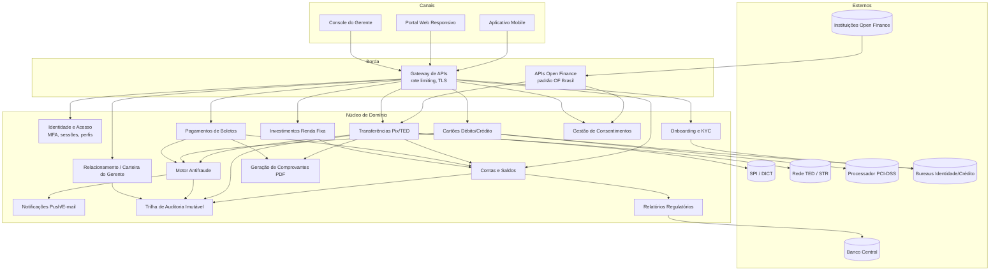
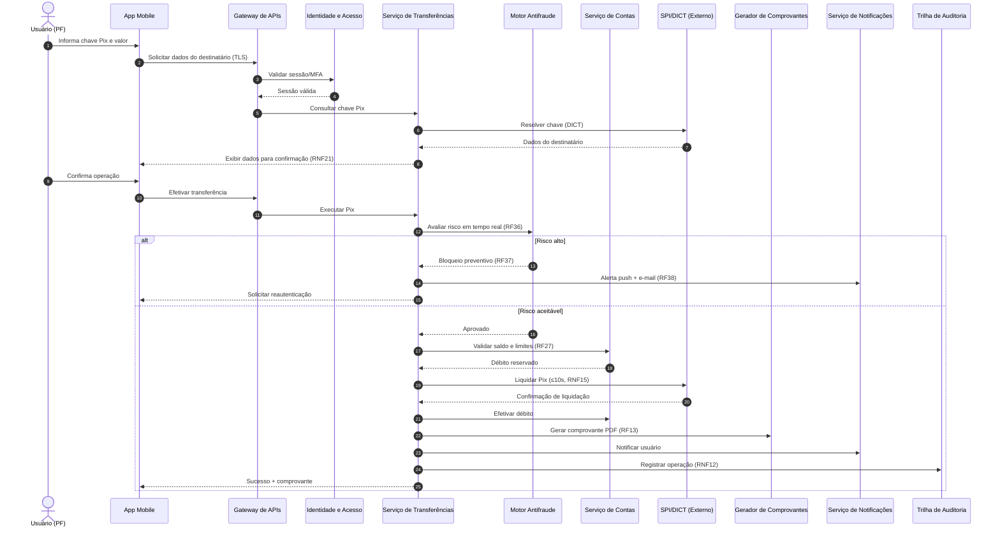
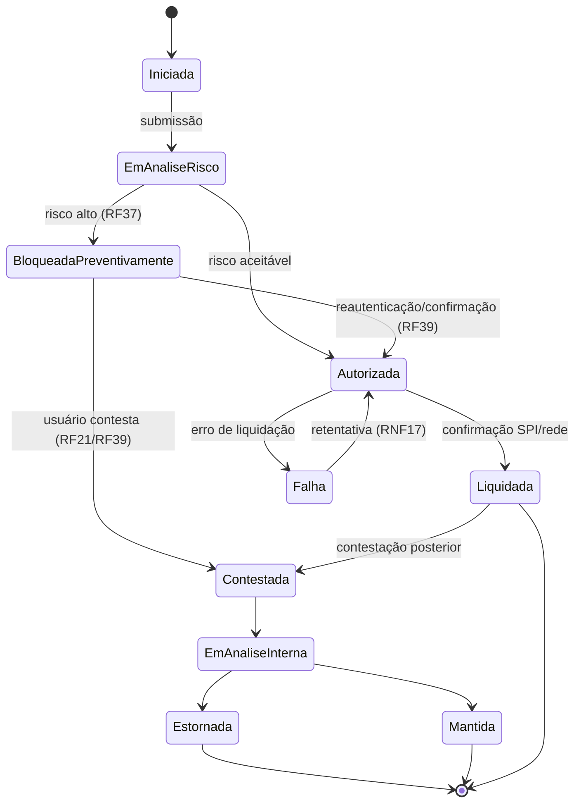

# Relatório Técnico de Arquitetura de Software
## Plataforma Financeira Digital — Sistema Bancário Digital (G01)

---

## 1. Identificação das HUs

| HU | Título | Perfil | Requisitos Relacionados |
|------|--------|--------|--------------------------|
| HU01 | Abrir conta com validação de identidade | PF | RF01, RF02, RF08; RNF08, RNF10 |
| HU02 | Autenticar com múltiplos fatores | PF/Todos | RF03, RF04, RF05, RF06; RNF01, RNF03, RNF04 |
| HU03 | Realizar transferência via Pix | PF/Todos | RF22, RF23, RF24, RF27, RF13; RNF15, RNF21 |
| HU04 | Pagar boleto com agendamento | PF/Todos | RF28, RF29, RF30, RF31; RNF21 |
| HU05 | Gerenciar cartão de crédito | PF/Todos | RF14–RF20; RNF06 |
| HU06 | Contestar transação não reconhecida | PF/Todos | RF21, RF39, RF40 |
| HU07 | Investir em renda fixa | PF/Todos | RF32, RF33, RF34, RF35 |
| HU08 | Gerenciar consentimentos do open finance | PF/Todos | RF41, RF42, RF43, RF44; RNF10, RNF11 |
| HU09 | Receber alertas e responder a suspeita de fraude | PF/Todos | RF36, RF37, RF38, RF39, RF40; RNF12 |
| HU10 | Abrir conta PJ com documentação societária | PJ | RF01, RF02, RF08; RNF08 |
| HU11 | Realizar TED para fornecedores | PJ | RF25, RF26, RF27, RF13; RNF21 |
| HU12 | Acompanhar carteira de clientes | Gerente | RF07, RF45, RF46 |
| HU13 | Abrir solicitação de serviço em nome do cliente | Gerente | RF47; RNF12 |

**Atores identificados:** Cliente PF, Cliente PJ (representante legal), Gerente de Relacionamento, Auditor Interno (implícito em RF40/RNF12), Sistemas Externos (SPI/Pix, rede TED, Banco Central, processador PCI-DSS, instituições Open Finance, bureaus de identidade/KYC).

---

## 2. Diagramas de Arquitetura (Mermaid)

### 2.1 Diagrama de Componentes (visão lógica)

### 2.2 Diagrama de Sequência — HU03 (Transferência Pix com antifraude)

### 2.3 Diagrama de Estados — Ciclo de vida da transação monitorada

---

## 3. Decisões de Arquitetura

| ID | Decisão | Justificativa | Requisitos Suportados |
|----|---------|---------------|------------------------|
| AD-01 | Arquitetura de serviços autônomos por domínio de negócio (contas, transferências, cartões, investimentos, antifraude, consentimentos) | Isolamento de falhas, escalonamento horizontal independente e evolução regulatória por domínio | RNF16, RNF17, RNF13 |
| AD-02 | Gateway de borda único como ponto de entrada, aplicando TLS ≥ 1.2, rate limiting e roteamento por perfil | Superfície de ataque reduzida e política de segurança centralizada | RNF01, RNF04 |
| AD-03 | Comunicação assíncrona baseada em eventos para notificações, auditoria e análise de fraude | Desacoplamento e monitoramento de transações em tempo real sem impacto de latência no fluxo síncrono | RF20, RF36, RF38, RNF14 |
| AD-04 | Motor antifraude inserido de forma **síncrona no caminho crítico** para decisão de bloqueio, com avaliação de risco em janela de tempo limitada e fallback conservador | RF37 exige bloqueio *preventivo*, o que impede análise puramente pós-fato | RF36, RF37, RNF15 |
| AD-05 | Tokenização e delegação total de dados de cartão a processador certificado PCI-DSS; o sistema mantém apenas token e metadados | Proibição explícita de armazenar dados de cartão | RNF06, RNF02 |
| AD-06 | Trilha de auditoria implementada como registro *append-only* imutável, com retenção ≥ 5 anos, alimentada por eventos de domínio | Requisito regulatório de imutabilidade e auditabilidade | RNF12, RF40 |
| AD-07 | Camada de APIs Open Finance segregada da API dos canais próprios, aderente às especificações do Open Finance Brasil, mediada pelo serviço de consentimentos | Compartilhamento de dados só ocorre com consentimento ativo; revogação com efeito imediato | RF41–RF44, RNF11 |
| AD-08 | Ledger contábil com dupla entrada e consistência forte no débito/crédito de contas; leituras de saldo/extrato servidas por modelo de consulta otimizado | Saldo em tempo real (RF09) + consultas ≤ 1s (RNF14) sem comprometer integridade transacional | RF09, RF10, RNF14 |
| AD-09 | Padrão de transação com estados persistidos e retentativa idempotente para integrações externas (SPI, TED, boletos) | Garantir que transações em andamento não sejam perdidas em falhas | RNF17, RNF15 |
| AD-10 | Implantação multi-zona de disponibilidade com replicação de dados e backup contínuo (RPO ≤ 1h, RTO ≤ 4h) | Disponibilidade 99,95% e redundância geográfica | RNF13, RNF22, RNF23 |
| AD-11 | Autorização baseada em perfis e consentimento explícito: gerente acessa dados do cliente apenas com consentimento registrado; nenhuma transação financeira em nome do cliente sem autorização registrada | Segregação de deveres e rastreabilidade do acesso do gerente | RF07, RF45, HU12, HU13 |
| AD-12 | Agendador central de operações futuras (Pix, TED, boletos, lembretes) com disparo de notificações antecipadas | Unifica lógica de agendamento e lembretes | RF26, RF30, RF31 |
| AD-13 | Observabilidade nativa: todos os serviços expõem métricas de latência, erros e disponibilidade a painel em tempo real | Manutenibilidade operacional | RNF24 |
| AD-14 | Senhas com hash adaptativo (bcrypt/Argon2, conforme requisito literal) e dados sensíveis cifrados em repouso com AES-256 | Requisitos literais de segurança | RNF02, RNF03 |

---

## 4. Tabela de Componentes e Rastreabilidade

| Componente | Responsabilidade Principal | Comunica-se com | Origem (HU / Critério de Aceite) |
|---|---|---|---|
| Gateway de APIs | Ponto de entrada único; TLS, rate limiting, roteamento, validação de sessão | Canais, todos os serviços de domínio, IAM | HU02 (MFA obrigatório); RNF01, RNF04 |
| Identidade e Acesso (IAM) | Autenticação, MFA (OTP/biometria), sessões com expiração por perfil, histórico de acessos, bloqueio remoto de conta | Gateway, Notificações, Auditoria | HU02 (CA: MFA em todo login, gestão de métodos, alerta de bloqueio); RF03–RF06 |
| Onboarding e KYC | Cadastro PF/PJ, validação documental e de identidade, PLD/FT, fluxo de aprovação | Bureaus externos, Contas, Notificações, Auditoria | HU01 (CA: validar CPF/documento, resultado em 24h), HU10 (CA: CNPJ/sócios, 48h) |
| Serviço de Contas | Abertura de contas, saldo em tempo real, extrato com filtros, transferência entre contas do titular, rendimento de poupança | Transferências, Boletos, Investimentos, Auditoria, Relatórios Regulatórios | HU01, HU03; RF08–RF13, RNF14 |
| Serviço de Transferências | Pix (chaves, DICT, liquidação ≤10s), TED, agendamentos, limites por canal/horário | SPI, rede TED, Contas, Antifraude, Comprovantes, Agendador | HU03 (CA: confirmação de destinatário, comprovante, limite noturno), HU11 |
| Serviço de Boletos | Leitura/validação de boleto, exibição de dados, pagamento e agendamento, lembretes | Contas, Antifraude, Agendador, Notificações, Comprovantes | HU04 (CA: exibir beneficiário/valor/vencimento; lembrete D-1) |
| Serviço de Cartões | Emissão débito/crédito, análise de crédito, fatura, pagamento de fatura, limites, bloqueio independente, contestação | Processador PCI-DSS, Contas, Antifraude, Notificações, Contestações | HU05 (CA: fatura por ciclo, pagamento total/mínimo/personalizado, bloqueio ≤60s, push por transação) |
| Serviço de Investimentos | Vitrine de renda fixa, aplicação/resgate, posição consolidada, Informe de Rendimentos | Contas, Notificações, Documentos | HU07 (CA: exibir rentabilidade/prazo/risco, posição atualizada imediatamente) |
| Motor Antifraude | Análise de risco em tempo real, bloqueio preventivo, solicitação de reautenticação, histórico de alertas | Transferências, Cartões, Boletos, IAM, Notificações, Auditoria | HU09 (CA: alerta imediato, confirmar/contestar em 2 cliques, bloqueio preventivo); RF36–RF40 |
| Serviço de Contestações | Registro de contestações com motivo e evidências, acompanhamento de prazos e resolução | Cartões, Contas, Antifraude, Notificações | HU06 (CA: contestar do extrato/fatura, anexar evidências, informar prazo) |
| Gestão de Consentimentos | Concessão, visualização e revogação imediata de consentimentos Open Finance e de acesso do gerente | APIs Open Finance, CRM/Gerente, Notificações, Auditoria | HU08 (CA: painel de consentimentos, revogação imediata, notificação por e-mail), HU12 |
| APIs Open Finance | Exposição de APIs padronizadas (dados e iniciação de pagamento) conforme Open Finance Brasil | Instituições parceiras, Consentimentos, Contas, Transferências | HU08; RF43, RF44, RNF11 |
| CRM / Carteira do Gerente | Visão consolidada da carteira, anotações e interações, solicitações de serviço em nome do cliente | Contas, Investimentos, Consentimentos, Notificações, Auditoria | HU12 (CA: consentimento prévio, anotações), HU13 (CA: registrar gerente responsável, notificar cliente) |
| Serviço de Notificações | Envio de push e e-mail para transações, alertas, lembretes e resultados de análise | Todos os serviços de domínio | HU01, HU04, HU05, HU08, HU09, HU13 (CAs de notificação) |
| Gerador de Comprovantes/Documentos | Geração de comprovantes em PDF e informes | Transferências, Boletos, Cartões, Investimentos | HU03, HU11 (CA: PDF imediato); RF13, RF35 |
| Agendador de Operações | Execução de operações futuras (Pix, TED, boletos) e disparo de lembretes | Transferências, Boletos, Notificações | HU04 (CA: lembrete D-1); RF26, RF30, RF31 |
| Trilha de Auditoria | Registro imutável append-only de operações, acessos e alertas; retenção ≥ 5 anos | Todos os serviços; Auditor interno | HU13 (CA: identificar gerente); RF40, RNF12 |
| Relatórios Regulatórios | Geração e transmissão de relatórios obrigatórios (BACEN 3040, SCR) | Contas, Cartões, Banco Central | RNF07, RNF09 |
| Observabilidade | Coleta e exposição de métricas operacionais em painel em tempo real | Todos os serviços | RNF24 |

---

## 5. Bloqueios e Pendências

| ID | Tipo | Descrição | Impacto | Ação Sugerida |
|----|------|-----------|---------|----------------|
| BL-01 | Bloqueio | Não há definição do provedor/mecanismo de validação de identidade e documentoscopia (RF02) — apenas a obrigação funcional | Impede fechamento do desenho de integração do Onboarding | Definir com área de negócio/compliance o serviço de verificação de identidade homologado |
| BL-02 | Bloqueio | Critérios de decisão da análise de crédito (RF15) não especificados (política, bureaus, score) | Serviço de Cartões não pode concluir fluxo de emissão de crédito | Levantar política de crédito com área de risco |
| BL-03 | Bloqueio | Regras do motor antifraude ("padrão suspeito", RF36) sem definição de heurísticas, thresholds ou SLA de decisão | Risco de falso-positivo excessivo ou latência incompatível com Pix ≤10s | Workshop com time de prevenção a fraudes; definir orçamento de latência da análise síncrona |
| PD-01 | Pendência | Tempo de inatividade de sessão "configurável por perfil" (RF04) sem valores padrão | Baixo; parametrizável | Definir defaults com segurança da informação |
| PD-02 | Pendência | Prazo de análise de contestações (HU06 "informar o prazo") não definido | Fluxo funciona, mas SLA em aberto | Alinhar com regras de chargeback/regulação |
| PD-03 | Pendência | Fase/escopo do Open Finance a implementar (RNF11 menciona "fases e prazos") não delimitado | Escopo das APIs indefinido | Confirmar fases aplicáveis à instituição |
| PD-04 | Pendência | Regras de rendimento da poupança (RF11) dependem de parametrização regulatória externa | Necessária fonte oficial de índices | Definir mecanismo de atualização de índices |
| PD-05 | Pendência | "Autorização explícita do cliente" para transação iniciada pelo gerente (HU13) sem definição do mecanismo (aprovação no app? assinatura?) | Risco de compliance | Especificar fluxo de dupla aprovação cliente-gerente |

---

## 6. Cobertura de Requisitos

**Requisitos Funcionais:** RF01–RF47 → **47/47 cobertos (100%)** pelos componentes da Seção 4.

| Bloco | RFs | Componente(s) responsável(is) | Status |
|---|---|---|---|
| Usuários e Autenticação | RF01–RF07 | IAM, Onboarding/KYC, CRM, Consentimentos | ✅ |
| Conta Corrente/Poupança | RF08–RF13 | Contas, Comprovantes | ✅ |
| Cartões | RF14–RF21 | Cartões, Antifraude, Contestações, Notificações | ✅ |
| Transferências | RF22–RF27 | Transferências, Agendador | ✅ |
| Boletos | RF28–RF31 | Boletos, Agendador, Notificações | ✅ |
| Investimentos | RF32–RF35 | Investimentos, Documentos | ✅ |
| Fraudes | RF36–RF40 | Antifraude, Auditoria, Notificações | ✅ |
| Open Finance | RF41–RF44 | Consentimentos, APIs Open Finance | ✅ |
| Gerente | RF45–RF47 | CRM/Carteira | ✅ |

**Requisitos Não Funcionais:** RNF01–RNF24 → **24/24 endereçados** pelas decisões AD-01 a AD-14 (Seção 3), com ressalvas: RNF05 (pentest) e RNF20 (WCAG 2.1 AA) são obrigações de **processo/UI** e requerem validação contínua, não apenas desenho arquitetural.

**Histórias de Usuário:** HU01–HU13 → **13/13 rastreadas** a componentes (Seção 4).

---

## 7. Gap Analysis

| # | Lacuna Identificada | Impacto Arquitetural | Ação Recomendada |
|---|---------------------|----------------------|-------------------|
| G-01 | **Reversibilidade Pix (MED/devolução)** não especificada — requisitos cobrem envio, mas não devolução ou recebimento de Pix | O serviço de Transferências precisa suportar fluxos de crédito recebido e devolução regulamentada; ausência gera retrabalho estrutural | Incluir requisitos de recebimento Pix, devolução e Mecanismo Especial de Devolução |
| G-02 | **Autorização de transações de cartão em tempo real** — RF20 exige notificação por transação, mas o fluxo de autorização junto ao processador PCI-DSS não é descrito | Interface crítica de baixa latência com terceiro; define SLA e contratos de integração do serviço de Cartões | Especificar protocolo de autorização/webhooks com o processador e limites de latência |
| G-03 | **Consistência entre bloqueio antifraude síncrono e SLA Pix de 10s** — os dois requisitos competem pelo mesmo orçamento de tempo | Necessário orçamento de latência explícito por etapa (risco, DICT, liquidação) e estratégia de degradação | Definir tempo máximo da decisão de risco e comportamento de fallback (aprovar/negar por padrão) |
| G-04 | **Multiusuário PJ** — contas PJ tipicamente exigem múltiplos operadores, alçadas e aprovação dupla; requisitos tratam PJ como usuário único | Modelo de autorização (IAM) precisaria de reestruturação tardia se não previsto | Levantar requisitos de perfis operadores, alçadas e workflow de aprovação PJ |
| G-05 | **Encerramento de conta e portabilidade** não previstos, apesar de exigência regulatória usual | Fluxos de saída afetam Contas, Cartões, Investimentos e retenção de dados (LGPD vs. RNF12) | Especificar fluxo de encerramento e política de retenção/anonimização compatível com auditoria de 5 anos |
| G-06 | **Direitos do titular LGPD** (acesso, correção, eliminação) citados apenas genericamente (RNF10) | Conflito potencial entre eliminação de dados e trilha imutável de 5 anos exige desenho de segregação (dados pessoais vs. registros contábeis) | Definir arquitetura de dados com separação entre dados pessoais e eventos financeiros pseudonimizados |
| G-07 | **Revogação imediata de consentimento Open Finance** (HU08) sem definição de propagação para tokens/sessões ativas de parceiros | Exige mecanismo de invalidação em tempo real na camada de APIs OF | Especificar TTL curto de credenciais de acesso e verificação de consentimento por requisição |
| G-08 | **Estorno efetivo de contestações** — HU06 inicia o processo, mas não há requisito para crédito provisório/definitivo | Impacta ledger (lançamentos de estorno) e conciliação com bandeira/processador | Definir regras de crédito provisório, prazos e conciliação |
| G-09 | **Comunicação de fallback do SPI** (indisponibilidade do Pix) não tratada | RNF17 exige resiliência; necessário estado "pendente de liquidação" e reprocessamento idempotente (AD-09 mitiga, mas sem regra de negócio definida) | Definir comportamento ao usuário e prazos de retentativa/cancelamento automático |
| G-10 | **Ambiente de homologação regulatória e certificação Open Finance** não mencionados | Pipeline de entrega precisa contemplar ambientes de certificação e testes de conformidade | Incluir requisitos de ambientes segregados e testes de conformidade regulatória no plano de releases |

**Síntese:** a especificação cobre bem o *caminho feliz* dos produtos bancários, mas apresenta lacunas concentradas em (i) fluxos reversos e de exceção (devolução, estorno, encerramento), (ii) modelo de autorização PJ multiusuário e (iii) reconciliação entre imutabilidade de auditoria e direitos LGPD. Recomenda-se resolver os bloqueios BL-01–BL-03 e os gaps G-03, G-04 e G-06 **antes** do início da implementação dos serviços de Transferências, IAM e da arquitetura de dados, por serem estruturais.