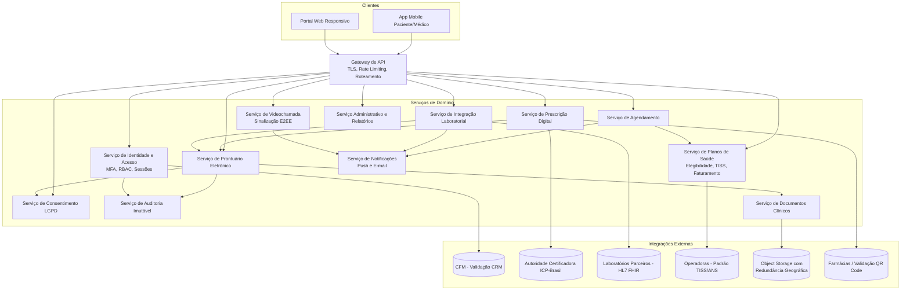
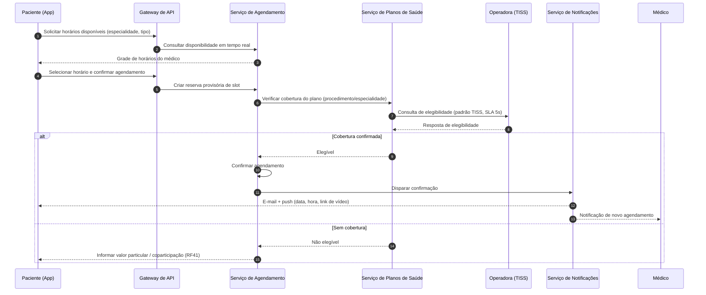
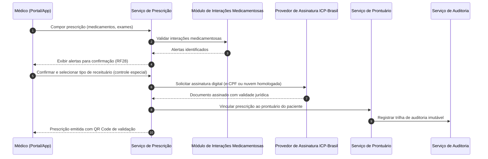

# Relatório Técnico de Arquitetura de Software
## Plataforma Integrada de Saúde Digital — Telemedicina (G02)

---

## 1. Identificação das HUs

| HU | Perfil | Resumo | RFs Relacionados | RNFs Relacionados |
|----|--------|--------|------------------|-------------------|
| HU01 | Paciente | Cadastro e consentimento LGPD para dados de saúde | RF01, RF23 | RNF07, RNF12 |
| HU02 | Paciente | Agendamento de consulta presencial/vídeo com verificação de cobertura | RF07–RF11 | RNF14 |
| HU03 | Paciente | Ingresso em videochamada segura pelo app | RF14, RF15, RF17, RF18 | RNF04, RNF16, RNF22 |
| HU04 | Paciente | Visualização de prontuário e resultados de exames | RF22, RF24, RF33 | RNF15, RNF12 |
| HU05 | Paciente | Acesso e compartilhamento de prescrição digital | RF26, RF29, RF30 | RNF06 |
| HU06 | Paciente | Notificação de resultado de exame disponível | RF31, RF32 | — |
| HU07 | Médico | Validação de CRM junto ao CFM | RF02 | RNF08 |
| HU08 | Médico | Registro de evolução clínica imutável | RF19, RF20, RF25 | RNF10, RNF11 |
| HU09 | Médico | Prescrição digital com ICP-Brasil e checagem de interações | RF26–RF28, RF30 | RNF06, RNF08 |
| HU10 | Médico | Solicitação de exame e alerta de valor crítico | RF31, RF32, RF34, RF35 | RNF26 |
| HU11 | Médico | Acesso a prontuário compartilhado mediante consentimento | RF19, RF23, RF06 | RNF05, RNF11 |
| HU12 | Admin. Clínica | Gestão de médicos, agendas e ocupação | RF12, RF42, RF43, RF45 | — |
| HU13 | Admin. Clínica | Relatórios de faturamento por convênio e glosas | RF40, RF41, RF44 | RNF09 |
| HU14 | Operador Plano | Autorização prévia de procedimentos no padrão TISS | RF36–RF39 | RNF09, RNF14, RNF26 |

---

## 2. Diagramas de Arquitetura (Mermaid)

### 2.1 Diagrama de Componentes (visão lógica)

### 2.2 Diagrama de Sequência — Agendamento com verificação de elegibilidade (HU02)

### 2.3 Diagrama de Sequência — Prescrição digital assinada (HU09)

---

## 3. Decisões de Arquitetura

| ID | Decisão | Justificativa | Requisitos Suportados |
|----|---------|---------------|----------------------|
| AD01 | **Arquitetura de serviços por domínio de negócio**, com escalonamento horizontal independente por serviço | Picos de demanda distintos (vídeo vs. prontuário vs. faturamento); isolamento de falhas | RNF13, RNF17, RNF24 |
| AD02 | **Gateway de API único** com terminação TLS ≥ 1.2, rate limiting e roteamento por perfil | Ponto único de aplicação de políticas de segurança e detecção de anomalias | RNF01, RNF05, RF04 |
| AD03 | **Prontuário como registro *append-only*** com assinatura digital por entrada; alterações apenas via adendos identificados | Imutabilidade legal exigida; adendos preservam histórico | RF25, RNF10, RNF11 |
| AD04 | **Trilha de auditoria em armazenamento imutável dedicado** (write-once), retenção de 20 anos, separada dos dados operacionais | Requisito regulatório CFM; proteção contra adulteração mesmo por administradores | RF06, RNF11 |
| AD05 | **Serviço de Consentimento como autoridade central de decisão de acesso** — todo acesso a prontuário passa por verificação de consentimento vigente | Consentimento explícito, revogável, com registro temporal (LGPD art. 11) | RF23, HU01, RNF07 |
| AD06 | **Sinalização de videochamada pela plataforma; mídia ponta-a-ponta criptografada entre pares, sem persistência de conteúdo** | E2EE exigida; apenas metadados (duração, participantes) são registrados para faturamento | RNF04, RF16, RNF16 |
| AD07 | **Camada de interoperabilidade padronizada**: adaptadores HL7 FHIR (laboratórios) e TISS (operadoras) atrás de interfaces internas canônicas | Incorporação de novos parceiros sem impacto no núcleo | RNF26, RF31, RF38–RF40 |
| AD08 | **Documentos clínicos e imagens em object storage externo com redundância geográfica**, referenciados por metadados no prontuário; criptografia em repouso AES-256 | Volumetria de imagens diagnósticas; resiliência; desempenho de carga do prontuário | RNF02, RNF18, RNF15 |
| AD09 | **Comunicação assíncrona orientada a eventos** para notificações, recebimento de resultados de exames e faturamento | Desacoplamento; resiliência a indisponibilidade de parceiros externos | RF11, RF32, RF40, RNF13 |
| AD10 | **Cache de elegibilidade com validade curta e fallback documentado** quando operadora indisponível | Cumprir SLA de 5s mesmo com latência externa; plano de contingência | RNF14, RNF13 |
| AD11 | **Assinatura digital delegada a provedor ICP-Brasil homologado** (e-CPF ou certificado em nuvem), via interface abstrata de assinatura | Conformidade CFM; flexibilidade de provedores | RNF06, RF27 |
| AD12 | **Observabilidade nativa**: métricas de latência, erro e disponibilidade expostas por módulo em painel em tempo real | Requisito explícito de manutenibilidade e SLA 99,9% | RNF25, RF46, RNF13 |
| AD13 | **RBAC com escopo contextual** (perfil + vínculo com unidade + consentimento do paciente) e expiração de sessão configurável por perfil | Modelo de autorização exige três dimensões combinadas | RF04, RF05, RF43 |

---

## 4. Tabela de Componentes e Rastreabilidade

| Componente | Responsabilidade Principal | Comunica-se com | Origem (HU / Critério de Aceite) |
|------------|---------------------------|-----------------|----------------------------------|
| Gateway de API | TLS, autenticação de borda, rate limiting, roteamento | Todos os serviços; clientes | RNF01, RNF05; HU03 (segurança) |
| Serviço de Identidade e Acesso (IAM) | Cadastro de perfis, MFA (OTP/biometria), RBAC, sessões com expiração, validação/revalidação de CRM junto ao CFM | Gateway, CFM, Auditoria | HU01, HU07 (CA: bloqueio de CRM inativo, revalidação periódica); RF01–RF05 |
| Serviço de Consentimento LGPD | Registro, consulta e revogação de consentimentos com data/hora; base legal por finalidade | Prontuário, IAM, App | HU01 (CA: consentimento explícito e revogável); HU11 (CA: acesso condicionado) |
| Serviço de Agendamento | Grade de horários, disponibilidade em tempo real, remarcação/cancelamento, encaixe urgente | Planos de Saúde, Notificações, Videochamada | HU02 (todos os CAs), HU12 (CA: grades e ocupação); RF07–RF13 |
| Serviço de Videochamada | Sala de consulta, sinalização E2EE, compartilhamento de documentos em sessão, registro de duração | Agendamento, Notificações, Documentos, Auditoria | HU03 (CA: E2EE sem gravação, ingresso 2 cliques, compartilhamento); RF14–RF18 |
| Serviço de Prontuário Eletrônico | Registro clínico único append-only por paciente (CID, anamnese, evolução), histórico consolidado, controle de acesso por consentimento | Consentimento, Documentos, Auditoria, Prescrição, Laboratório | HU04, HU08 (CA: imutabilidade, adendos), HU11; RF19–RF25 |
| Serviço de Prescrição Digital | Composição de prescrição, checagem de interações, receituário de controle especial, assinatura ICP-Brasil, QR Code de validação | ICP-Brasil, Prontuário, Farmácias, Auditoria | HU05, HU09 (todos os CAs); RF26–RF30 |
| Módulo de Interações Medicamentosas | Análise de interações e alertas pré-confirmação | Prescrição Digital | HU09 (CA: alertar interações); RF28 |
| Serviço de Integração Laboratorial | Solicitação eletrônica de exames, recepção de resultados (HL7 FHIR), vínculo ao prontuário, detecção de valores críticos | Laboratórios, Prontuário, Notificações | HU06, HU10 (CA: alerta destacado de valores críticos); RF31–RF35 |
| Serviço de Planos de Saúde | Cadastro de planos/TUSS, elegibilidade em tempo real, geração de guias TISS, autorização prévia, faturamento eletrônico, coparticipação | Operadoras, Agendamento, Administrativo | HU02 (CA: verificação de cobertura), HU13, HU14 (CA: guias TISS, resposta em 30 min); RF36–RF41 |
| Serviço Administrativo e Relatórios | Cadastro de clínicas/unidades/salas/equipamentos, relatórios de faturamento/glosa/produtividade, exportação CSV/PDF, painel operacional | Planos de Saúde, Agendamento, Observabilidade | HU12, HU13 (CA: filtros e exportação); RF42–RF46 |
| Serviço de Notificações | Envio de push e e-mail: confirmações, lembretes T-5min, resultados de exames, alterações de grade | Agendamento, Laboratório, Videochamada | HU02, HU03, HU06, HU12 (CAs de notificação); RF11, RF18, RF32 |
| Serviço de Auditoria Imutável | Trilha write-once de acessos e alterações em prontuário, retenção de 20 anos, detecção de acessos anômalos | Todos os serviços clínicos; painel de segurança | HU11 (CA: log de acesso externo com justificativa); RF06, RNF05, RNF11 |
| Serviço de Documentos Clínicos | Armazenamento criptografado (AES-256) em object storage georredundante, geração de PDF, download | Object Storage, Prontuário, Videochamada | HU04, HU05 (CA: exportar PDF); RF21, RNF02, RNF18 |
| Painel de Observabilidade | Métricas de latência, erros e disponibilidade por módulo em tempo real | Todos os serviços | RF46, RNF25 |

---

## 5. Bloqueios e Pendências

| # | Tipo | Descrição | Impacto | Ação Sugerida |
|---|------|-----------|---------|---------------|
| B01 | Bloqueio externo | Não há especificação da interface oficial do CFM para validação de CRM (existência, formato, SLA, custo) | HU07 pode exigir processo manual/assíncrono de contingência | Confirmar com CFM/conselhos regionais o mecanismo de consulta e definir fluxo de fallback |
| B02 | Bloqueio regulatório | Certificação SBIS (RNF10) exige processo formal de homologação com prazos externos | Go-live do prontuário condicionado à certificação | Iniciar processo de certificação em paralelo ao desenvolvimento |
| B03 | Pendência de negócio | Prazos configuráveis de cancelamento/remarcação (RF10) e tempo de sessão por perfil (RF05) não têm valores default definidos | Parametrização sem baseline | Definir política padrão com área de negócio |
| B04 | Pendência técnica | Conflito potencial entre E2EE "sem gravação" (RNF04) e compartilhamento de documentos na chamada (RF17): documentos compartilhados persistem no prontuário ou são efêmeros? | Decisão afeta design do serviço de vídeo e conformidade | Decidir com DPO/jurídico se documentos compartilhados são anexados ao prontuário mediante ação explícita |
| B05 | Pendência de dados | Fonte da base de interações medicamentosas (RF28) e da tabela de valores críticos de referência (RF35) não especificada | Serviços dependentes bloqueados | Selecionar e licenciar base de conhecimento clínico |
| B06 | Pendência de negócio | "Justificativa clínica" no acesso por médico externo (HU11) não consta nos RFs — é obrigatória antes do acesso ou apenas registrada? | Fluxo de autorização do prontuário | Alinhar com jurídico e refletir em RF |
| B07 | Pendência externa | Homologação junto a operadoras para transacionar TISS em produção (credenciamento por operadora) | HU14 depende de acordos comerciais | Mapear operadoras prioritárias e iniciar homologação |

---

## 6. Cobertura de Requisitos

| Grupo | Requisitos | Componente(s) Responsável(is) | Status |
|-------|-----------|-------------------------------|--------|
| Gestão de Usuários | RF01–RF06 | IAM, Consentimento, Auditoria, Gateway | ✅ Coberto |
| Agendamento | RF07–RF13 | Agendamento, Planos de Saúde, Notificações | ✅ Coberto |
| Videochamada | RF14–RF18 | Videochamada, Notificações, Documentos | ✅ Coberto (ver B04) |
| Prontuário | RF19–RF25 | Prontuário, Consentimento, Documentos, Auditoria | ✅ Coberto |
| Prescrição | RF26–RF30 | Prescrição, Interações Medicamentosas, ICP | ✅ Coberto (ver B05) |
| Laboratórios | RF31–RF35 | Integração Laboratorial, Notificações | ✅ Coberto (ver B05) |
| Planos de Saúde | RF36–RF41 | Planos de Saúde | ✅ Coberto (ver B07) |
| Administrativo | RF42–RF46 | Administrativo, Observabilidade | ✅ Coberto |
| Segurança | RNF01–RNF06 | Gateway, Documentos, IAM, Videochamada, Prescrição | ✅ Coberto |
| Conformidade | RNF07–RNF12 | Consentimento, Auditoria, Prontuário | ✅ Coberto (ver B02) |
| Disponibilidade/Desempenho | RNF13–RNF18 | Todas as camadas (AD01, AD08, AD10) | ✅ Coberto |
| Usabilidade/Compatibilidade | RNF19–RNF22 | Clientes App/Web | ✅ Coberto (validar em design de UX) |
| Infra/Dados | RNF23–RNF26 | Camada de dados, Observabilidade, Adaptadores | ✅ Coberto |

**Cobertura: 46/46 RFs e 26/26 RNFs mapeados a componentes. 14/14 HUs rastreadas.**

---

## 7. Gap Analysis

| # | Lacuna Identificada | Impacto Arquitetural | Ação Recomendada |
|---|---------------------|----------------------|------------------|
| G01 | **Ausência de fluxo de pagamento particular/coparticipação** — RF41 exige registrar valor, mas não há requisito de cobrança/pagamento | Se pagamento online for necessário, exigirá serviço de cobrança e conformidade financeira não previstos | Confirmar escopo: apenas registro contábil ou processamento de pagamento |
| G02 | **Recuperação de desastre incompleta** — RPO/RTO definidos (RNF23), mas sem requisito de failover automático entre regiões nem plano de contingência para telemedicina em curso durante indisponibilidade | Design de replicação e failover precisa de decisão antecipada | Elaborar runbook de DR e definir estratégia de replicação multi-zona (RNF24) desde o início |
| G03 | **Ciclo de vida do consentimento subespecificado** — revogação de consentimento não define efeito retroativo sobre acessos em andamento nem sobre dados já compartilhados | Motor de consentimento precisa de semântica clara (revogação imediata vs. prospectiva) | Definir política com DPO e modelar estados de consentimento explicitamente |
| G04 | **Guarda do prontuário de menores e representação legal** não abordada (responsável legal, transição aos 18 anos) | Modelo de identidade e autorização deve prever vínculos de representação | Incluir requisitos de titularidade delegada |
| G05 | **Falta de estratégia de degradação para videochamada** em rede inadequada (RNF16 só cobre "condições adequadas") | Serviço de vídeo precisa de adaptação de bitrate e fallback (ex.: áudio apenas) | Especificar comportamento sob degradação e critério de encerramento/reagendamento |
| G06 | **Glosas e reprocessamento TISS** — HU13 menciona glosas, mas não há RF para contestação/reenvio de guias glosadas | Fluxo de faturamento incompleto; possível retrabalho no serviço de Planos | Levantar processo de recurso de glosa com operadoras e adicionar RFs |
| G07 | **Interoperabilidade FHIR sem perfil definido** — RNF26 cita HL7 FHIR sem versão/perfis (ex.: recursos, terminologias, RNDS) | Adaptadores podem exigir refatoração se perfis divergirem entre laboratórios | Definir guia de implementação FHIR canônico da plataforma e avaliar alinhamento à RNDS |
| G08 | **Anonimização/pseudonimização para relatórios gerenciais** (RF44, RF46) não especificada — dados sensíveis podem vazar em painéis administrativos | Camada de relatórios precisa de política de minimização de dados | Definir quais indicadores usam dados agregados/anonimizados |
| G09 | **Onboarding/offboarding de médicos entre clínicas** — desvinculação de médico com agendamentos futuros e acesso residual a prontuários não tratado | RBAC contextual (AD13) precisa de regras de transição de vínculo | Especificar regras de revogação de vínculo e transferência de agenda |
| G10 | **Testes de conformidade contínuos ausentes** — não há requisito de verificação automatizada de conformidade (LGPD, TISS, WCAG) no ciclo de entrega | Risco de regressão regulatória | Incluir gates de conformidade no pipeline de entrega (auditoria de acessibilidade, validação de esquema TISS/FHIR) |

**Síntese:** a arquitetura proposta cobre integralmente os requisitos declarados; os gaps concentram-se em (i) fluxos regulatórios/financeiros de borda (glosas, pagamento, revogação de consentimento), (ii) resiliência operacional (DR, degradação de vídeo) e (iii) governança de dados (menores, anonimização). Recomenda-se resolver B01–B07 e G01–G04 antes do detalhamento técnico dos serviços de Prontuário, Planos de Saúde e Consentimento, por serem os de maior risco regulatório.