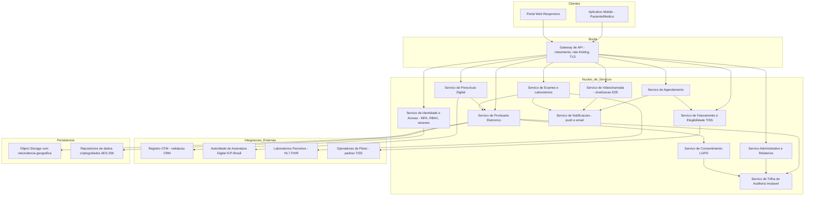
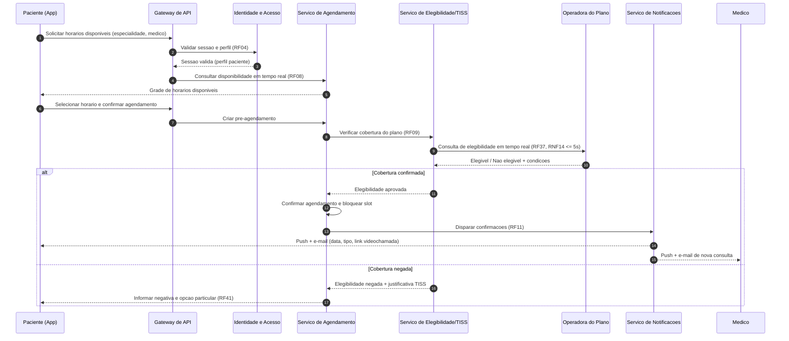
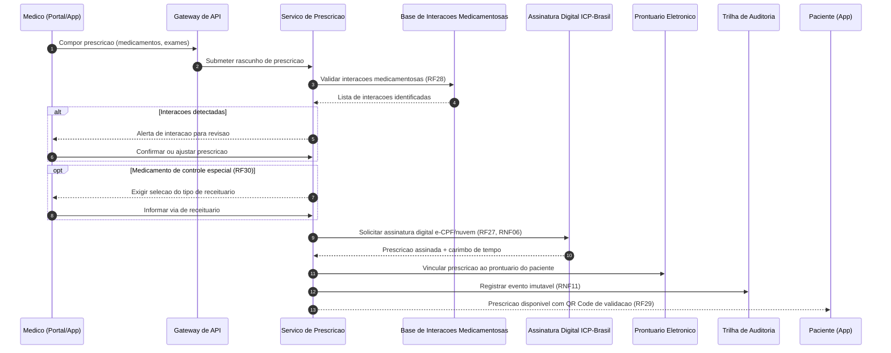

# Relatório Técnico de Arquitetura de Software
## Plataforma Integrada de Saúde Digital — Telemedicina (G02)

---

## 1. Identificação das HUs

| HU | Perfil | Título | RFs Relacionados | RNFs Relacionados |
|----|--------|--------|------------------|-------------------|
| HU01 | Paciente | Cadastro e consentimento de dados de saúde | RF01, RF23 | RNF03, RNF07, RNF12 |
| HU02 | Paciente | Agendar consulta presencial ou por videochamada | RF07, RF08, RF09, RF10, RF11 | RNF14 |
| HU03 | Paciente | Participar de consulta por videochamada | RF14, RF15, RF17, RF18 | RNF04, RNF16, RNF22 |
| HU04 | Paciente | Visualizar prontuário e resultados de exames | RF22, RF24, RF33 | RNF02, RNF15, RNF12 |
| HU05 | Paciente | Acessar e compartilhar prescrição digital | RF26, RF29, RF30 | RNF06 |
| HU06 | Paciente | Notificação de resultado de exame | RF31, RF32 | RNF26 |
| HU07 | Médico | Validar cadastro com CRM ativo | RF02 | RNF08 |
| HU08 | Médico | Registrar evolução clínica no prontuário | RF19, RF20, RF25, RF06 | RNF10, RNF11 |
| HU09 | Médico | Emitir prescrição digital com validade jurídica | RF26, RF27, RF28, RF30 | RNF06, RNF08 |
| HU10 | Médico | Solicitar exame e receber alerta de valor crítico | RF34, RF35, RF32 | RNF26 |
| HU11 | Médico | Acessar prontuário compartilhado entre especialidades | RF19, RF23, RF06 | RNF05, RNF11 |
| HU12 | Admin Clínica | Gerenciar médicos e agendas da unidade | RF12, RF42, RF43, RF45 | — |
| HU13 | Admin Clínica | Acompanhar faturamento por convênio | RF40, RF41, RF44 | RNF09 |
| HU14 | Operador Plano | Processar autorização prévia (TISS) | RF36, RF37, RF38, RF39 | RNF09, RNF14, RNF26 |

**Observação:** RF03, RF04, RF05 (segurança de acesso), RF13 (encaixe urgente), RF16 (duração de chamada), RF21 (documentos clínicos), RF46 (painel operacional) são requisitos transversais/complementares sem HU dedicada — tratados na Seção 7 (Gap Analysis) e cobertos por componentes na Seção 4.

---

## 2. Diagramas de Arquitetura (Mermaid)

### 2.1 Diagrama de Componentes (Visão Lógica)

### 2.2 Diagrama de Sequência — HU02 + HU14: Agendamento com Verificação de Elegibilidade

### 2.3 Diagrama de Sequência — HU09: Emissão de Prescrição Digital

---

## 3. Decisões de Arquitetura

| ID | Decisão | Justificativa | Requisitos Atendidos |
|----|---------|---------------|----------------------|
| AD01 | **Arquitetura de serviços independentes por domínio** (Identidade, Agendamento, Prontuário, Prescrição, Exames, Faturamento, Videochamada, Notificações) | Isolamento de dados sensíveis, escalonamento horizontal independente por módulo e evolução regulatória segmentada | RNF17, RNF25 |
| AD02 | **Gateway de API único como ponto de entrada**, com terminação TLS ≥ 1.2, rate limiting e roteamento por perfil | Centraliza controles de segurança de borda e detecção de anomalias | RNF01, RNF05, RF04 |
| AD03 | **Serviço de Consentimento LGPD dedicado**, com registro versionado (data/hora, finalidade, base legal) e verificação obrigatória em toda leitura de prontuário por terceiros | Consentimento é requisito legal transversal e ponto de decisão de autorização | RF23, RNF07, RNF12, HU01, HU11 |
| AD04 | **Trilha de auditoria em armazenamento append-only imutável**, separada dos dados operacionais, com retenção ≥ 20 anos e encadeamento criptográfico de eventos | Imutabilidade e retenção regulatória do CFM; suporta perícias e certificação SBIS | RF06, RF25, RNF10, RNF11 |
| AD05 | **Prontuário com modelo de eventos imutáveis + adendos identificados**: cada entrada assinada digitalmente é selada; correções geram novos registros vinculados | Atende imutabilidade pós-assinatura sem perder rastreabilidade clínica | RF25, HU08 |
| AD06 | **Videochamada com criptografia ponta a ponta e sem persistência de mídia**; servidor atua apenas na sinalização e no relay cifrado; metadados (duração, participantes) são registrados para faturamento | Conformidade com RNF04 e necessidade de faturamento (RF16) sem violar privacidade | RF14–RF18, RNF04, RNF16 |
| AD07 | **Camada de interoperabilidade padronizada**: adaptadores HL7 FHIR para laboratórios e TISS para operadoras, com contratos versionados por parceiro | Facilita incorporação de novos parceiros sem alteração do núcleo | RF31–RF40, RNF09, RNF26 |
| AD08 | **Notificações assíncronas via barramento de eventos interno** (publicação de eventos de domínio: consulta confirmada, resultado disponível, valor crítico) | Desacoplamento e resiliência; garante entrega multi-canal (push/e-mail) | RF11, RF13, RF18, RF32, RF35 |
| AD09 | **Documentos clínicos e imagens em object storage externo com redundância geográfica**, referenciados por metadados no prontuário; conteúdo cifrado AES-256 em repouso | Escala de armazenamento e resiliência exigidas | RF21, RNF02, RNF18 |
| AD10 | **Assinatura digital como serviço interno intermediando a autoridade ICP-Brasil** (e-CPF ou certificado em nuvem homologado CFM) | Uniformiza fluxo de assinatura para prescrições e prontuário | RNF06, RF27 |
| AD11 | **Implantação em múltiplas zonas de disponibilidade, com backup contínuo (RPO 1h / RTO 4h)** e observabilidade por módulo | Disponibilidade 99,9% e plano de contingência | RNF13, RNF23, RNF24, RNF25 |
| AD12 | **Verificação de elegibilidade síncrona com circuito de contingência**: em indisponibilidade da operadora, o agendamento pode ser confirmado condicionalmente com reprocessamento posterior (política configurável) | Cumpre SLA de 5s sem bloquear o negócio | RF09, RF37, RNF13, RNF14 |

---

## 4. Tabela de Componentes e Rastreabilidade

| Componente | Responsabilidade Principal | Comunica-se com | Origem (HU / Critério de Aceite) |
|------------|---------------------------|-----------------|----------------------------------|
| Gateway de API | Ponto único de entrada, TLS, rate limiting, roteamento, detecção de anomalias | Todos os serviços de núcleo, clientes mobile/web | Transversal (RNF01, RNF05); HU02–HU14 |
| Serviço de Identidade e Acesso (IAM) | Cadastro de perfis, MFA (OTP/biometria), RBAC, expiração de sessões, validação CRM junto ao CFM com revalidação periódica | Gateway, Registro CFM, Auditoria | HU01, HU07 ("consultar status do CRM e bloquear acesso clínico"; "revalidações periódicas") |
| Serviço de Consentimento (LGPD) | Registro explícito, revisão e revogação de consentimentos com data/hora; decisão de acesso a dados sensíveis | Prontuário, Auditoria, App do paciente | HU01 ("consentimento explícito registrado com data e hora; revogável"), HU04, HU11 |
| Serviço de Agendamento | Disponibilidade em tempo real, agendar/cancelar/remarcar, encaixe urgente, gestão de grades | Elegibilidade/TISS, Notificações, IAM | HU02 ("disponibilidade em tempo real"; "verificar cobertura antes de confirmar"), HU12 |
| Serviço de Videochamada | Sinalização, ingresso autenticado em ≤ 2 cliques, E2E sem gravação, compartilhamento de documentos, registro de duração | IAM, Notificações, Prontuário (anexos), Auditoria | HU03 ("botão habilitado 5 min antes"; "chamada criptografada ponta a ponta") |
| Serviço de Prontuário Eletrônico | Prontuário único, evoluções clínicas (CID, anamnese), imutabilidade pós-assinatura, adendos, histórico completo, visão do paciente | Consentimento, Auditoria, Object Storage, Prescrição, Exames | HU04, HU08 ("após assinatura digital, registro imutável"), HU11 ("acesso condicionado ao consentimento; log com justificativa") |
| Serviço de Prescrição Digital | Emissão, validação de interações, controle de receituário especial, QR Code, compartilhamento com farmácias | Assinatura ICP-Brasil, Prontuário, Base de interações, App paciente | HU05 ("assinatura digital + QR Code"), HU09 ("alertar interações antes da confirmação") |
| Serviço de Assinatura Digital | Intermediação ICP-Brasil (e-CPF / nuvem homologada CFM), carimbo de tempo | Prescrição, Prontuário | HU08, HU09 (RNF06, RF27) |
| Serviço de Exames e Laboratórios | Solicitação eletrônica, recepção de resultados via HL7 FHIR, vinculação automática ao prontuário, detecção de valores críticos | Laboratórios parceiros, Prontuário, Notificações | HU06 ("resultado acessível imediatamente após notificação"), HU10 ("alerta destacado de valor crítico") |
| Serviço de Faturamento e Elegibilidade (TISS) | Elegibilidade em tempo real, geração de guias TISS, autorização prévia, faturamento eletrônico, coparticipação, gestão de glosas | Operadoras, Agendamento, Administrativo | HU02, HU13 ("valores enviados, autorizados e glosas"), HU14 ("resposta em até 30 min; negativa com código TISS") |
| Serviço Administrativo e Relatórios | Cadastro de clínicas/hospitais/equipamentos/salas, painéis de ocupação, relatórios exportáveis (CSV/PDF), painel operacional da plataforma | Agendamento, Faturamento, Auditoria | HU12 ("painel de ocupação por período"), HU13 ("exportável em CSV e PDF"); RF44–RF46 |
| Serviço de Notificações | Entrega multicanal (push, e-mail): confirmações, lembretes, alertas de 5 minutos, resultados de exames | Todos os serviços de domínio, clientes | HU02, HU03, HU06, HU10, HU12 ("alterações na grade notificam médicos") |
| Serviço de Trilha de Auditoria | Registro imutável de acessos e alterações (usuário, data/hora, ação, justificativa), retenção ≥ 20 anos | Todos os serviços de núcleo | HU08, HU11 ("log com data, hora e justificativa clínica"); RNF11 |
| Repositórios de Dados Cifrados | Persistência com criptografia AES-256 em repouso; hashing seguro de credenciais | Serviços de domínio | Transversal (RNF02, RNF03) |
| Object Storage Externo | Documentos clínicos e imagens com redundância geográfica | Prontuário, Exames | HU04 ("download em PDF"); RNF18 |
| Camada de Interoperabilidade | Adaptadores HL7 FHIR (laboratórios) e TISS (operadoras), versionamento de contratos | Exames, Faturamento, parceiros externos | HU06, HU10, HU14; RNF26 |

---

## 5. Bloqueios e Pendências

| # | Tipo | Descrição | Impacto | Ação Requerida |
|---|------|-----------|---------|----------------|
| B01 | Bloqueio externo | Modalidade de integração com o CFM para validação de CRM (RF02) não especificada — não há API pública oficial garantida | Cadastro médico pode exigir validação manual ou serviço intermediário | Confirmar com stakeholders o mecanismo de consulta e SLA de 24h (HU07) |
| B02 | Bloqueio regulatório | Tensão entre "gravação da duração da chamada" (RF16) e "sem gravação de conteúdo" (RNF04): confirmar que apenas metadados são persistidos | Risco de não conformidade se escopo de "gravação" for ambíguo | Formalizar em política: somente metadados de sessão são registrados |
| B03 | Pendência de definição | Base de dados de interações medicamentosas (RF28) — fornecedor/fonte de referência não especificado | Prescrição digital bloqueada sem fonte clínica homologada | Selecionar fonte de dados farmacológica com curadoria clínica |
| B04 | Pendência de definição | Parâmetros de "valores críticos" de exames (RF35): quem define e mantém as faixas de referência (laboratório vs. plataforma)? | Alertas clínicos incorretos geram risco assistencial | Definir governança clínica das faixas de referência |
| B05 | Pendência de negócio | Prazos configuráveis de cancelamento/remarcação (RF10) e tempos de sessão por perfil (RF05) sem valores definidos | Parametrização em aberto | Levantar políticas com clínicas e área jurídica |
| B06 | Pendência técnica | Certificação SBIS (RNF10) impõe requisitos específicos de NGS1/NGS2 não detalhados nos requisitos | Pode exigir retrabalho em autenticação e assinatura | Mapear checklist SBIS antes do design detalhado do prontuário |
| B07 | Pendência de integração | Diversidade de maturidade técnica dos laboratórios parceiros (HL7 FHIR pode não ser suportado por todos) | Onboarding de parceiros pode exigir adaptadores legados | Definir estratégia de adaptação por parceiro na camada de interoperabilidade |

---

## 6. Cobertura de Requisitos

### Requisitos Funcionais

| Faixa | Status | Componente(s) Responsável(is) |
|-------|--------|-------------------------------|
| RF01–RF06 (Usuários e Acesso) | ✅ Coberto | IAM, Gateway, Auditoria |
| RF07–RF13 (Agendamento) | ✅ Coberto | Agendamento, Notificações, Elegibilidade |
| RF14–RF18 (Videochamada) | ✅ Coberto | Videochamada, Notificações |
| RF19–RF25 (Prontuário) | ✅ Coberto | Prontuário, Consentimento, Auditoria, Object Storage |
| RF26–RF30 (Prescrição) | ✅ Coberto (dependência B03) | Prescrição, Assinatura Digital |
| RF31–RF35 (Laboratórios) | ✅ Coberto (dependências B04, B07) | Exames, Interoperabilidade, Notificações |
| RF36–RF41 (Planos de Saúde) | ✅ Coberto | Faturamento/TISS, Interoperabilidade |
| RF42–RF46 (Administrativo) | ✅ Coberto | Administrativo e Relatórios |

### Requisitos Não Funcionais

| RNF | Status | Tratamento Arquitetural |
|-----|--------|-------------------------|
| RNF01–RNF06 (Segurança) | ✅ Coberto | AD02, AD06, AD09, AD10; repositórios cifrados |
| RNF07–RNF12 (Conformidade) | ✅ Coberto (dependência B06) | AD03, AD04, AD05 |
| RNF13–RNF18 (Disponibilidade/Desempenho) | ✅ Coberto | AD01, AD06, AD09, AD11, AD12 |
| RNF19–RNF22 (Usabilidade/Compatibilidade) | ⚠️ Parcial | Requisitos de camada de apresentação; WCAG 2.1 AA e "2 cliques" exigem validação em design de UX |
| RNF23–RNF26 (Infra/Dados) | ✅ Coberto | AD07, AD11 |

**Cobertura funcional: 46/46 RFs mapeados. Cobertura não funcional: 26/26 RNFs endereçados (4 dependentes de validação de UX/certificação).**

---

## 7. Gap Analysis

| # | Lacuna Identificada | Impacto Arquitetural | Ação Recomendada |
|---|---------------------|----------------------|------------------|
| G01 | **Não há requisito de recuperação de acesso/identidade do paciente** (perda de dispositivo com MFA/biometria) | Fluxos de recuperação segura precisam ser projetados no IAM; risco de lockout ou de vetor de fraude | Especificar fluxo de recuperação com prova de identidade compatível com dados sensíveis |
| G02 | **Comportamento offline/degradado da videochamada não especificado** (queda de conexão durante consulta, requeda de latência acima de 150ms) | Afeta design de reconexão, política de reagendamento automático e faturamento parcial (RF16) | Definir regras de reconexão, tolerância e tratamento de consulta interrompida |
| G03 | **Ciclo de vida do consentimento em caso de revogação retroativa** não detalhado: o que ocorre com dados já acessados/copiados por outra unidade? | Impacta modelo de autorização do prontuário e trilha de auditoria | Definir política jurídica: revogação vale prospectivamente; documentar no Serviço de Consentimento |
| G04 | **Ausência de requisito para pacientes menores de idade / representantes legais** (curadoria, responsáveis) | Modelo de identidade e consentimento precisa suportar vínculos representante-paciente | Incluir entidade de representação legal no domínio de identidade e consentimento |
| G05 | **Interoperabilidade de saída do prontuário (portabilidade LGPD, RNF12)** sem formato definido | Exportação estruturada exige modelo canônico (candidato natural: perfil FHIR já adotado nas integrações) | Padronizar exportação do prontuário no mesmo padrão aberto das integrações |
| G06 | **Encaixe urgente (RF13)** sem critérios de priorização, quem autoriza, nem impacto na agenda existente | Regras de negócio do Agendamento incompletas | Especificar workflow de urgência com aprovação médica e política de sobreposição |
| G07 | **Gestão de glosas (HU13)** mencionada apenas em relatório — não há requisito de tratamento/recurso de glosa | Faturamento pode exigir workflow de contestação junto às operadoras | Avaliar inclusão de módulo de recurso de glosa no Serviço de Faturamento |
| G08 | **Retenção de 20 anos (RNF11) vs. direito de eliminação LGPD** — conflito normativo não resolvido nos requisitos | Modelo de dados precisa segregar dados clínicos (retenção legal) de dados cadastrais (elimináveis) | Definir matriz de retenção por categoria de dado com jurídico/DPO |
| G09 | **SLA de resposta de autorização (30 min, HU14) sem tratamento para não resposta da operadora** | Necessário mecanismo de timeout, reenvio e escalonamento no adaptador TISS | Especificar política de retry, fila de pendências e notificação de expiração |
| G10 | **Monitoramento clínico-operacional (RF46, RNF25)** sem definição de métricas e alertas mínimos | Observabilidade precisa de catálogo de indicadores por módulo | Elaborar catálogo de SLIs/SLOs por serviço alinhado ao SLA de 99,9% |

---

**Fim do Relatório Canônico de Arquitetura de Software — AI4ES Time 2 / Plataforma de Telemedicina (G02).**