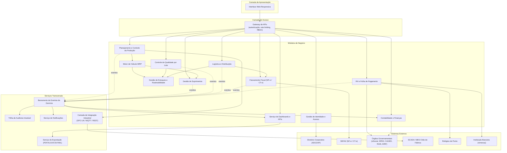
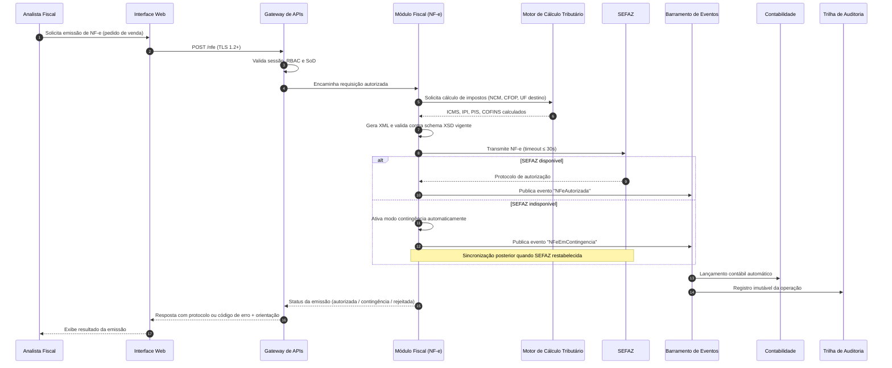
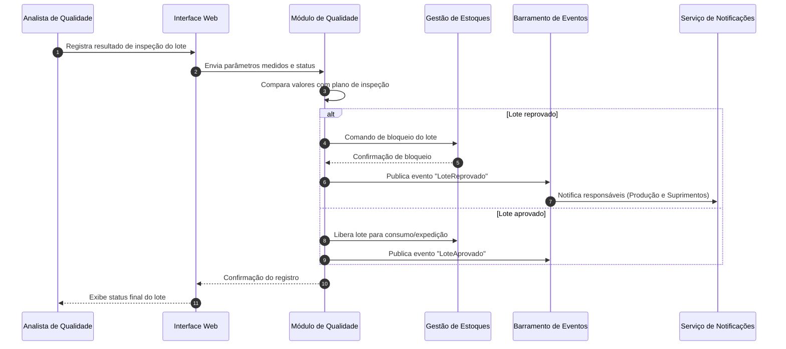

# Relatório Técnico de Arquitetura de Software
## ERP para Indústria Manufatureira (G03) — AI4ES Time 2

---

## 1. Identificação das HUs

| HU | Título | Perfil | Requisitos Relacionados |
|----|--------|--------|-------------------------|
| HU01 | Gerar ordens de produção e calcular MRP | Planejador de Produção | RF05, RF06, RF14, RNF13 |
| HU02 | Monitorar OEE e desvios em tempo real | Planejador de Produção | RF08, RF10, RF11, RF12, RNF18 |
| HU03 | Gerenciar cotações com múltiplos fornecedores | Comprador | RF13, RF15, RF16 |
| HU04 | Acompanhar desempenho de fornecedores | Gestor de Suprimentos | RF19, RF53 |
| HU05 | Registrar inspeção de lote e bloquear reprovados | Analista de Qualidade | RF20, RF21, RF22 |
| HU06 | Rastrear lote do insumo ao produto acabado | Analista de Qualidade | RF09, RF23, RF25 |
| HU07 | Emitir NF-e com cálculo automático de impostos | Analista Fiscal | RF31, RF32, RF33, RF34, RNF07, RNF15, RNF17 |
| HU08 | Manter SPED Fiscal atualizado | Analista Fiscal | RF36, RF48, RNF08 |
| HU09 | Processar folha de pagamento mensal | Analista de RH | RF37, RF38, RF39, RNF11 |
| HU10 | Gerar obrigações acessórias de RH | Analista de RH | RF40, RF41, RNF08 |
| HU11 | Visualizar DRE e Fluxo de Caixa em tempo real | Controller | RF43–RF47, RF52 |
| HU12 | Dashboard executivo de KPIs | Diretor / CEO | RF50–RF53, RNF14 |

---

## 2. Diagramas de Arquitetura (Mermaid)

### 2.1 Visão de Componentes (Contexto Modular)

### 2.2 Diagrama de Sequência — HU07: Emissão de NF-e com contingência

### 2.3 Diagrama de Sequência — HU05: Inspeção e bloqueio de lote

---

## 3. Decisões de Arquitetura

| ID | Decisão | Justificativa | Requisitos Suportados |
|----|---------|---------------|-----------------------|
| DA01 | **Arquitetura modular orientada a domínios**, com módulos de negócio autônomos comunicando-se por contratos explícitos | Isolamento por área funcional (PCP, Fiscal, RH etc.), permitindo evolução independente e atualização regulatória isolada (fiscal/trabalhista) | RNF06, RNF08, RNF11 |
| DA02 | **Barramento de eventos de domínio** para propagação assíncrona de movimentações (compras, vendas, produção, folha) | Habilita lançamentos contábeis automáticos, DRE em tempo real, dashboards e auditoria sem acoplamento síncrono entre módulos | RF43, RF45, RF50, RNF10 |
| DA03 | **Camada de integração industrial dedicada** com adaptadores por protocolo (OPC-UA, MQTT, REST/JSON), configurável por unidade fabril | Isola variabilidade de chão de fábrica; falhas de SCADA/MES não impactam o núcleo transacional | RF11, RNF18 |
| DA04 | **Modelo multi-unidade (multi-planta)** com particionamento lógico de dados por unidade fabril e camada de consolidação central | Isolamento de dados por planta com visão consolidada corporativa | RF04, RNF16 |
| DA05 | **Gateway de APIs central** com autenticação delegada (SSO/AD-LDAP), RBAC, SoD e rate limiting | Ponto único de aplicação de políticas de segurança | RF02, RNF03, RNF04, RNF19 |
| DA06 | **Trilha de auditoria imutável append-only** com retenção ≥ 10 anos, alimentada por eventos | Conformidade com CTN e LGPD; separação entre dado transacional e evidência de auditoria | RF03, RNF09, RNF10 |
| DA07 | **Motor tributário como componente independente** com tabelas de regras versionadas (NCM, alíquotas, UF) | Atualizações legais sem redeployment do módulo fiscal | RF32, RNF06 |
| DA08 | **Fila de contingência fiscal** com detecção automática de indisponibilidade da SEFAZ e sincronização posterior | Continuidade da expedição mesmo com SEFAZ fora do ar | RF34, RNF17 |
| DA09 | **Camada analítica separada da transacional** (modelo de leitura otimizado alimentado por eventos) para dashboards e drill-down | Garante carregamento ≤ 5s sem degradar o OLTP; drill-down preserva referência ao registro de origem | RF50–RF52, RNF14 |
| DA10 | **MRP como processo batch paralelizável** com particionamento por planta/família de itens | Atende SLA de 10 min para 50.000 itens | RF06, RNF13 |
| DA11 | **Criptografia em repouso (AES-256)** para domínios financeiro, fiscal e RH; TLS 1.2+ em trânsito | Requisito explícito de segurança | RNF01, RNF02 |
| DA12 | **Neutralidade de implantação**: componentes empacotados de forma portável para on-premises, nuvem privada ou híbrida | Requisito explícito de infraestrutura | RNF22 |

---

## 4. Tabela de Componentes e Rastreabilidade

| Componente | Responsabilidade Principal | Comunica-se com | Origem (HU / Critério de Aceite) |
|------------|---------------------------|-----------------|----------------------------------|
| Interface Web Responsiva | Apresentação, dashboards, formulários; sem plugins | Gateway de APIs | Todas as HUs; RNF24 |
| Gateway de APIs | Autenticação, RBAC/SoD, rate limiting, roteamento, APIs públicas documentadas | Todos os módulos; IAM | Transversal; RNF03, RNF04, RNF19 |
| Gestão de Identidade e Acesso (IAM) | SSO com AD/LDAP, perfis granulares por módulo/função/unidade | Diretório corporativo, Gateway | RF01–RF04 |
| Módulo PCP | Gestão de OPs, sequenciamento, apontamentos, cálculo de OEE, alertas de desvio | MRP, Integração Industrial, Estoques, Eventos | HU01, HU02 (todos os critérios) |
| Motor MRP | Cálculo de necessidades líquidas; geração automática de solicitações de compra | PCP, Estoques, Suprimentos | HU01 — critérios 2 e 3; RNF13 |
| Módulo de Suprimentos | Fornecedores, cotações, comparação de propostas, OC com alçada, recebimento, devoluções, desempenho | Estoques, Fiscal, Notificações, Eventos | HU03, HU04 (todos os critérios) |
| Módulo de Qualidade | Planos de inspeção, registro de resultados, bloqueio de lote, NC, relatórios de qualidade | Estoques, Notificações, Eventos | HU05, HU06 |
| Gestão de Estoques e Rastreabilidade | Saldo em tempo real, endereçamento, genealogia de lotes (entrada → OP → expedição) | PCP, Qualidade, Suprimentos, Logística | HU06 — critérios 1 e 2; RF09, RF23, RF26 |
| Módulo de Logística | Expedições, romaneios, rastreamento de entregas, RMA | Estoques, Fiscal, Eventos | RF27–RF30 |
| Módulo Fiscal (NF-e/CT-e) | Geração/validação XML (XSD), transmissão SEFAZ, cancelamento, contingência, SPED Fiscal/Contribuições | SEFAZ, Motor Tributário, Eventos, Logística | HU07, HU08 (todos os critérios) |
| Motor de Cálculo Tributário | Cálculo de ICMS, IPI, PIS, COFINS, ISS por NCM/CFOP/UF; regras versionadas | Módulo Fiscal, Contabilidade | HU07 — critério 1; RF32, RNF06 |
| Módulo de RH e Folha | Cadastro de colaboradores, ponto, folha, férias/13º/rescisões, benefícios, eSocial/CAGED/RAIS/DIRF, remessa bancária | Relógios de ponto, órgãos governamentais, banco, Eventos | HU09, HU10 (todos os critérios) |
| Módulo de Contabilidade e Finanças | Lançamentos automáticos por eventos, plano de contas, DRE/Balanço/Fluxo de Caixa, contas a pagar/receber, multi-moeda, ECD | Barramento de Eventos, Serviço de BI | HU11 (todos os critérios); RF43–RF49 |
| Serviço de Dashboards e KPIs | Modelo de leitura em tempo real, metas, alertas visuais, drill-down até transação, exportação | Barramento de Eventos, Exportação | HU12 (todos os critérios); RNF14 |
| Barramento de Eventos de Domínio | Distribuição assíncrona confiável de eventos de negócio | Todos os módulos | Transversal; RF43, RF45, RF50 |
| Camada de Integração Industrial | Adaptadores OPC-UA/MQTT/REST por planta; recepção de status de equipamentos | SCADA/MES, PCP | HU02 — critério 1; RF11, RNF18 |
| Trilha de Auditoria Imutável | Registro append-only de operações; retenção ≥ 10 anos | Barramento de Eventos | RF03, RNF10 |
| Serviço de Notificações | E-mails e alertas (desvios, aprovações, lotes reprovados, prazos legais) | Módulos de negócio | HU02, HU03, HU05, HU10 |
| Serviço de Exportação | Geração de PDF, XLSX, CSV, XML/JSON | BI, Qualidade, Suprimentos | HU04, HU06; RF53, RNF20 |
| Serviço de Backup e Monitoramento | Backup diário + contínuo (RPO ≤ 1h), métricas operacionais em tempo real | Todos os módulos | RNF21, RNF23 |

---

## 5. Bloqueios e Pendências

| # | Tipo | Descrição | Impacto | Ação Requerida |
|---|------|-----------|---------|----------------|
| B01 | Pendência de negócio | Política de alçadas de aprovação de OC (RF16) não especificada (níveis, valores, delegação) | Bloqueia design do workflow de aprovação | Definir matriz de alçadas com Suprimentos |
| B02 | Pendência técnica | Não definido se a certificação digital (A1/A3) para NF-e será centralizada ou por filial | Afeta arquitetura do módulo fiscal multi-planta | Confirmar com equipe fiscal/TI |
| B03 | Pendência de negócio | Regras de convenções coletivas (RNF11) variam por sindicato e não foram detalhadas | Motor de folha precisa de mecanismo de regras configuráveis | Levantar convenções aplicáveis por unidade |
| B04 | Pendência técnica | Volume e frequência de eventos do chão de fábrica (RF11) não dimensionados | Afeta capacidade da camada de integração industrial | Levantar telemetria esperada por planta |
| B05 | Pendência de negócio | Fluxo de "liberação formal" de lote bloqueado (HU05) sem definição de papéis/aprovadores | Bloqueia desenho da transição de estados do lote | Definir com Qualidade |
| B06 | Pendência regulatória | Estratégia de anonimização/eliminação de dados pessoais (LGPD) versus retenção fiscal de 10 anos exige política de conciliação | Risco de conflito de conformidade | Parecer do DPO/jurídico |

---

## 6. Cobertura de Requisitos

| Grupo | Requisitos | Status | Componentes Responsáveis |
|-------|-----------|--------|--------------------------|
| Usuários e Acesso | RF01–RF04 | ✅ Coberto | IAM, Gateway, Auditoria |
| PCP | RF05–RF12 | ✅ Coberto | PCP, MRP, Integração Industrial, Notificações |
| Suprimentos | RF13–RF19 | ✅ Coberto | Suprimentos, MRP, Fiscal |
| Qualidade | RF20–RF25 | ✅ Coberto | Qualidade, Estoques, Exportação |
| Logística | RF26–RF30 | ✅ Coberto | Logística, Estoques, Fiscal |
| Fiscal | RF31–RF36 | ✅ Coberto | Fiscal, Motor Tributário |
| RH e Folha | RF37–RF42 | ✅ Coberto | RH e Folha |
| Contabilidade | RF43–RF49 | ✅ Coberto | Contabilidade, Barramento de Eventos |
| Dashboards | RF50–RF53 | ✅ Coberto | BI, Exportação |
| Segurança | RNF01–RNF05 | ⚠️ Parcial | Gateway, IAM, Criptografia (RNF05 — pentests dependem de processo operacional externo) |
| Conformidade | RNF06–RNF11 | ⚠️ Parcial | Fiscal, RH, Auditoria (B03, B06 pendentes) |
| Disponibilidade/Desempenho | RNF12–RNF17 | ✅ Coberto | DA08–DA10, Backup/Monitoramento |
| Integração | RNF18–RNF20 | ✅ Coberto | Integração Industrial, Gateway, Exportação |
| Infraestrutura | RNF21–RNF24 | ✅ Coberto | Backup/Monitoramento, DA12, UI |

**Cobertura funcional: 53/53 RFs mapeados. RNFs: 22/24 plenamente cobertos; 2 com pendências (RNF05, RNF11).**

---

## 7. Gap Analysis

| # | Lacuna Identificada | Impacto Arquitetural | Ação Recomendada |
|---|---------------------|----------------------|------------------|
| G01 | Requisitos não definem estratégia de consistência entre módulos (ex.: baixa de estoque vs. lançamento contábil em falha parcial) | Necessidade de padrão de compensação/transações distribuídas no barramento de eventos; risco de divergência entre estoque e contabilidade | Definir política de consistência eventual com reconciliação e idempotência de eventos antes da implementação do barramento |
| G02 | Ausência de requisito de versionamento de dados mestres (BOM, roteiros, planos de inspeção) | Rastreabilidade de lote (HU06) pode ficar inconsistente se o roteiro/BOM mudar após a OP | Introduzir versionamento imutável de estruturas de produto vinculado à OP |
| G03 | RNF12 define disponibilidade 99,5% mas não define RTO nem estratégia de failover | Dimensionamento de redundância indefinido | Especificar RTO e topologia de alta disponibilidade com a TI |
| G04 | Threshold de alertas (RF12, RF51) sem especificação de granularidade (global, por planta, por KPI, por usuário) | Afeta modelo de configuração e o serviço de notificações | Detalhar modelo de configuração hierárquica de alertas |
| G05 | Integração com relógios de ponto (RF38) sem protocolo/formato definido | Camada de adaptação de ponto não dimensionável | Levantar equipamentos homologados e formatos (ex.: AFD/Portaria 671) com RH |
| G06 | "Tempo real" da DRE (RF45) não quantificado (latência aceitável do modelo de leitura) | Define arquitetura do pipeline de eventos analíticos | Acordar SLA de latência (ex.: ≤ 1 min) com o Controller |
| G07 | Não há requisito de ambiente de homologação fiscal (SEFAZ homologação, eSocial produção-restrita) | Risco de testes fiscais em produção | Prever ambientes segregados e chaveamento de endpoints por configuração |
| G08 | Gestão de séries/numeração de NF-e por filial e por modo de contingência não detalhada | Risco de conflito de numeração na sincronização pós-contingência | Especificar reserva de faixas de numeração por modo de emissão |
| G09 | LGPD (RNF09) sem definição de consentimento, portabilidade e direito de exclusão frente à retenção fiscal | Conflito potencial entre RNF09 e RNF10 (ver B06) | Modelar camada de governança de dados pessoais com pseudonimização seletiva |
| G10 | Multi-moeda (RF49) sem fonte oficial de taxas de câmbio nem política de data de conversão | Afeta motor contábil e DRE consolidada | Definir provedor de taxas e regra de data-base de conversão |

---
*Fim do Relatório Canônico de Arquitetura — AI4ES Time 2.*