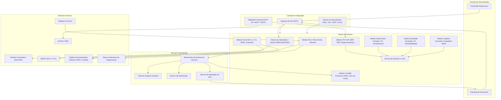
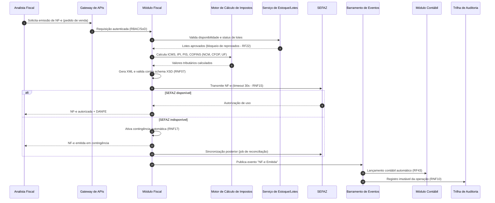
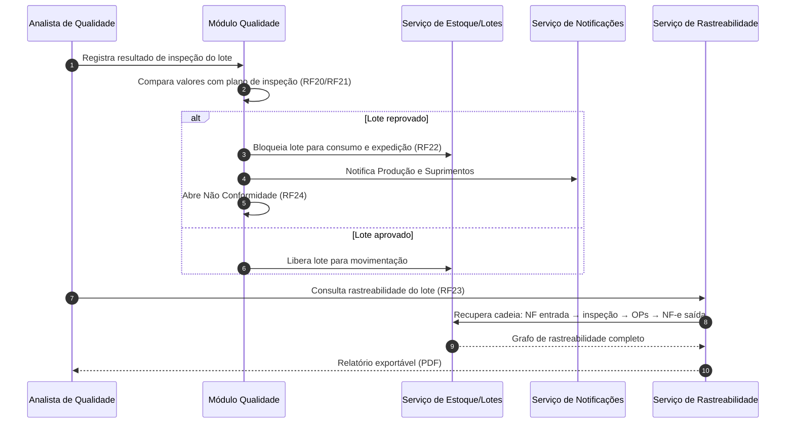

# Relatório Técnico de Arquitetura de Software
## ERP para Indústria Manufatureira (G03) — AI4ES Time 2

---

## 1. Identificação das HUs

| HU | Título | Perfil | RFs Relacionados | RNFs Relacionados |
|----|--------|--------|------------------|-------------------|
| HU01 | Gerar OPs e calcular MRP | Planejador PCP | RF05, RF06, RF14 | RNF13 |
| HU02 | Monitorar OEE e desvios em tempo real | Planejador PCP | RF08, RF10, RF11, RF12 | RNF18, RNF14 |
| HU03 | Gerenciar cotações com múltiplos fornecedores | Comprador | RF13, RF15, RF16 | RNF03 |
| HU04 | Acompanhar desempenho de fornecedores | Gestor Suprimentos | RF19, RF53 | RNF14 |
| HU05 | Registrar inspeção e bloquear lotes reprovados | Analista Qualidade | RF20, RF21, RF22, RF24 | RNF12 |
| HU06 | Rastrear lote do insumo ao produto acabado | Analista Qualidade | RF09, RF23, RF25 | RNF10 |
| HU07 | Emitir NF-e com cálculo automático de impostos | Analista Fiscal | RF31, RF32, RF33, RF34 | RNF06, RNF07, RNF15, RNF17 |
| HU08 | Manter SPED Fiscal atualizado | Analista Fiscal | RF36, RF48 | RNF08, RNF10 |
| HU09 | Processar folha de pagamento mensal | Analista RH | RF37, RF38, RF39 | RNF02, RNF11 |
| HU10 | Gerar obrigações acessórias de RH | Analista RH | RF40, RF41, RF42 | RNF08, RNF09 |
| HU11 | Visualizar DRE e Fluxo de Caixa em tempo real | Controller | RF43–RF49 | RNF02, RNF10, RNF14 |
| HU12 | Dashboard executivo de KPIs | Diretor/CEO | RF50–RF53 | RNF14, RNF16 |

RFs transversais de acesso/auditoria (RF01–RF04) e RNFs de segurança (RNF01–RNF05) aplicam-se a todas as HUs.

---

## 2. Diagramas de Arquitetura (Mermaid)

### 2.1 Diagrama de Componentes (Visão Macro)

### 2.2 Diagrama de Sequência — HU07: Emissão de NF-e com contingência

### 2.3 Diagrama de Sequência — HU05/HU06: Inspeção e rastreabilidade de lote

---

## 3. Decisões de Arquitetura

| ID | Decisão | Justificativa | Requisitos Suportados |
|----|---------|---------------|----------------------|
| AD-01 | **Arquitetura modular orientada a domínios**, com módulos de negócio (PCP, Suprimentos, Qualidade, Logística, Fiscal, RH, Contábil) e serviços transversais desacoplados. | Facilita evolução independente, isolamento regulatório e manutenção; ERPs têm alta variação de ritmo de mudança entre módulos (fiscal muda muito mais que PCP). | RNF16, RNF23 |
| AD-02 | **Barramento de eventos de domínio** para propagação assíncrona de movimentações (compras, vendas, produção, folha) até contabilidade, KPIs e auditoria. | Viabiliza DRE em tempo real (RF45), dashboards (RF50) e trilha imutável sem acoplamento síncrono entre módulos. | RF43, RF45, RF50, RNF10, RNF14 |
| AD-03 | **Serviço central de Estoque e Lotes** como fonte única de verdade de saldos e status de lote, consumido por PCP, Suprimentos, Qualidade e Logística. | Bloqueio de lotes reprovados (RF22) e rastreabilidade (RF23) exigem consistência transacional forte em um ponto único. | RF09, RF14, RF22, RF23, RF26 |
| AD-04 | **Adaptador de integração industrial** desacoplado, com suporte configurável por unidade fabril a OPC-UA, MQTT e REST/JSON. | Padrões de chão de fábrica variam por planta; padrão Adapter isola protocolos do domínio. | RF11, RNF18 |
| AD-05 | **Motor fiscal parametrizável** (tabelas de alíquotas, NCM, regras por UF) versionado e atualizável sem redeploy. | Legislação fiscal brasileira muda frequentemente; parametrização reduz risco de não conformidade. | RF32, RF36, RNF06, RNF08 |
| AD-06 | **Modo de contingência fiscal com fila de sincronização** ativada automaticamente diante de indisponibilidade da SEFAZ, com reconciliação posterior. | Continuidade de faturamento é crítica para operação fabril. | RF34, RNF17 |
| AD-07 | **Multi-tenancy lógico por unidade fabril**, com isolamento de dados por hierarquia organizacional e camada de consolidação centralizada. | Suporta múltiplas plantas com segregação (RF04) e visão consolidada executiva (RF45, RF50). | RF04, RNF16 |
| AD-08 | **Trilha de auditoria imutável (append-only)** com retenção de 10 anos, alimentada exclusivamente por eventos, sem operações de atualização/exclusão. | Exigência do CTN e suporte a auditorias fiscais/trabalhistas. | RF03, RNF05, RNF10 |
| AD-09 | **Separação leitura/escrita para relatórios e KPIs**: modelo transacional para operações e modelo analítico agregado para dashboards com drill-down até a transação de origem. | Garante carga de dashboards ≤ 5s sem degradar o transacional; drill-down preservado via referência ao registro origem. | RF45, RF50, RF52, RNF14 |
| AD-10 | **Autenticação delegada ao diretório corporativo (SSO)** com autorização interna via RBAC granular + SoD para operações críticas. | Requisito explícito; separa autenticação (externa) de autorização (interna). | RF01, RF02, RNF03, RNF04 |
| AD-11 | **Criptografia em repouso (AES-256) restrita a domínios sensíveis** (fiscal, financeiro, RH) e TLS 1.2+ em toda comunicação. | Atende RNF01/02/09 minimizando impacto de performance nos módulos operacionais. | RNF01, RNF02, RNF09 |
| AD-12 | **Processamento batch escalável para MRP e Folha**, executado como jobs assíncronos com paralelização por planta/centro de custo. | MRP de 50.000 itens em ≤10 min exige processamento fora do ciclo de requisição. | RF06, RF39, RNF13 |

---

## 4. Tabela de Componentes e Rastreabilidade

| Componente | Responsabilidade Principal | Comunica-se com | Origem (HU / Critério de Aceite) |
|------------|---------------------------|-----------------|----------------------------------|
| Portal Web Responsivo | Interface transacional multi-perfil, sem plugins | Gateway de APIs | Todas as HUs; RNF24 |
| Gateway de APIs REST | Roteamento, autenticação, rate limiting, exposição de APIs a terceiros | IAM, todos os módulos | RNF04, RNF19; HU03–HU12 |
| Módulo de Identidade e Acesso (IAM) | SSO via AD/LDAP, RBAC granular, SoD, bloqueio de contas | Diretório Corporativo, Gateway, Auditoria | RF01–RF04; RNF03, RNF04 |
| Módulo PCP | Gestão de OPs, MRP, sequenciamento de capacidade, apontamentos, OEE | Estoque/Lotes, Suprimentos, Adaptador Industrial, Barramento de Eventos | HU01 (CA: MRP com necessidades líquidas), HU02 (CA: OEE automático) |
| Motor de MRP | Cálculo batch de necessidades líquidas e geração de solicitações de compra | PCP, Estoque/Lotes, Suprimentos | HU01 (CA: gerar solicitações para necessidade não coberta); RNF13 |
| Adaptador Industrial | Ingestão de dados SCADA/MES via OPC-UA/MQTT/REST, por unidade fabril | MES/SCADA, PCP, KPI | HU02 (CA: dados do chão de fábrica); RF11, RNF18 |
| Módulo Suprimentos | Fornecedores, cotações, comparação de propostas, OC com alçada, recebimento, devolução | Estoque/Lotes, Qualidade, Fiscal, Notificações | HU03 (CA: comparar por preço/prazo/histórico; alçada com notificação), HU04 |
| Serviço de Desempenho de Fornecedores | Consolidação de índices de pontualidade, rejeição e preço | Suprimentos, Qualidade, KPI, Exportação | HU04 (CA: painel filtrável, exportável) |
| Módulo Qualidade | Planos de inspeção, registro de resultados, NC com causa-raiz, bloqueio de lotes | Estoque/Lotes, Notificações, Rastreabilidade | HU05 (CA: bloqueio automático + notificação) |
| Serviço de Rastreabilidade | Grafo lote→OP→produto→cliente, consultas bidirecionais, exportação PDF | Estoque/Lotes, PCP, Fiscal, Logística | HU06 (CA: cadeia NF entrada até NF-e saída) |
| Serviço de Estoque e Lotes | Fonte única de saldos, status de lote, endereçamento e movimentações em tempo real | PCP, Suprimentos, Qualidade, Logística, Fiscal | HU01, HU05, HU06; RF09, RF22, RF26 |
| Módulo Logística | Expedição, romaneios, rastreamento de entregas, RMA | Estoque/Lotes, Fiscal, Notificações | RF26–RF30 |
| Módulo Fiscal | Emissão/cancelamento NF-e e CT-e, contingência, geração de SPED | SEFAZ, Motor de Impostos, Contábil, Auditoria | HU07 (CA: autorização ≤30s, contingência automática), HU08 |
| Motor de Cálculo de Impostos | Cálculo parametrizado de ICMS/IPI/PIS/COFINS/ISS por NCM/CFOP/UF | Módulo Fiscal | HU07 (CA: cálculo automático); RNF06 |
| Módulo RH e Folha | Cadastro, ponto eletrônico integrado, cálculo de folha, férias/13º/rescisões, benefícios | Relógios de ponto, Bancos, Contábil, Órgãos Gov. | HU09 (CA: cálculo com tabelas vigentes, remessa bancária) |
| Gerador de Obrigações Acessórias | eSocial, CAGED, RAIS, DIRF, SPED (ECD/EFD) com validação prévia e alerta de prazos | RH, Fiscal, Contábil, Notificações | HU08, HU10 (CA: leiaute vigente, alerta 5 dias úteis) |
| Módulo Contábil-Financeiro | Lançamentos automáticos, plano de contas, DRE/Balanço/Fluxo de Caixa, contas a pagar/receber, multimoeda | Barramento de Eventos, KPI, Obrigações Acessórias | HU11 (CA: DRE por centro de custo, drill-down até lançamento) |
| Barramento de Eventos de Domínio | Propagação assíncrona de eventos de negócio entre módulos | Todos os módulos, Auditoria, KPI, Notificações | AD-02; RF43, RF45 |
| Serviço de Agregação de KPIs | Modelo analítico agregado, metas, alertas de desvio, drill-down | Barramento, Dashboards, Notificações | HU02, HU12 (CA: KPIs abaixo da meta destacados; drill-down ≤3 cliques) |
| Dashboards Executivos | Painéis configuráveis, navegação por período/unidade, exportação PDF/Excel | KPI, Gateway | HU12; RF50–RF53, RNF14 |
| Serviço de Notificações | Alertas por e-mail e visuais (desvios, aprovações, prazos, reprovações) | Todos os módulos | HU02, HU03, HU05, HU10 |
| Trilha de Auditoria Imutável | Registro append-only de operações com retenção de 10 anos | Barramento de Eventos | RF03, RNF10 |
| Serviço de Import/Export | Intercâmbio XML/CSV/JSON/XLSX; exportação de relatórios em PDF/Excel | Módulos de negócio, Dashboards | HU04, HU06; RF53, RNF20 |

---

## 5. Bloqueios e Pendências

| ID | Tipo | Descrição | Impacto | Ação Sugerida |
|----|------|-----------|---------|---------------|
| BP-01 | Pendência | Não há definição de qual modalidade de contingência de NF-e adotar (SVC, FS-DA, EPEC), o que afeta o desenho do fluxo offline. | Alto (HU07) | Definir com o time fiscal a estratégia de contingência por UF. |
| BP-02 | Pendência | Volumetria de eventos do chão de fábrica (frequência de leitura SCADA/MES) não especificada. | Alto (dimensionamento do Adaptador Industrial e do KPI) | Levantar taxa de mensagens por planta com engenharia industrial. |
| BP-03 | Pendência | "DRE em tempo real" carece de SLA de latência (ex.: eventos refletidos em segundos ou minutos?). | Médio | Acordar latência aceitável de consistência eventual com o Controller. |
| BP-04 | Bloqueio | Convenções coletivas aplicáveis (RNF11) não listadas; regras de folha variam por sindicato/região. | Alto (HU09) | Obter lista de convenções e regras por unidade antes do design detalhado da folha. |
| BP-05 | Pendência | Estratégia de certificado digital (A1/A3, HSM) para assinatura de NF-e/CT-e e ECD não definida. | Médio | Definir com TI/Jurídico o modelo de custódia de certificados. |
| BP-06 | Pendência | Política de anonimização/expurgo LGPD conflita potencialmente com retenção de 10 anos (RNF10); necessária matriz de base legal por dado. | Médio | Mapeamento de dados pessoais com o DPO. |
| BP-07 | Pendência | Definição de "unidade fabril" versus "filial fiscal" (CNPJ) não explicitada — impacta multi-tenancy e emissão fiscal. | Alto | Validar modelo organizacional com o negócio. |

---

## 6. Cobertura de Requisitos

| Grupo | Requisitos | Componentes Responsáveis | Status |
|-------|-----------|--------------------------|--------|
| Usuários e Acesso | RF01–RF04 | IAM, Trilha de Auditoria, Gateway | ✅ Coberto |
| PCP | RF05–RF12 | Módulo PCP, Motor MRP, Adaptador Industrial, KPI, Notificações | ✅ Coberto |
| Suprimentos | RF13–RF19 | Módulo Suprimentos, Desempenho de Fornecedores, Estoque/Lotes | ✅ Coberto |
| Qualidade | RF20–RF25 | Módulo Qualidade, Rastreabilidade, Estoque/Lotes | ✅ Coberto |
| Logística | RF26–RF30 | Módulo Logística, Estoque/Lotes, Fiscal | ✅ Coberto |
| Fiscal / NF-e | RF31–RF36 | Módulo Fiscal, Motor de Impostos, Obrigações Acessórias | ✅ Coberto (BP-01, BP-05) |
| RH e Folha | RF37–RF42 | Módulo RH e Folha, Obrigações Acessórias | ✅ Coberto (BP-04) |
| Contábil | RF43–RF49 | Módulo Contábil, Barramento de Eventos | ✅ Coberto (BP-03) |
| Dashboards | RF50–RF53 | KPI, Dashboards, Import/Export | ✅ Coberto |
| Segurança | RNF01–RNF05 | IAM, Gateway, criptografia transversal | ✅ Coberto (RNF05 = processo, não componente) |
| Conformidade | RNF06–RNF11 | Motor de Impostos, Obrigações Acessórias, Auditoria | ✅ Coberto (BP-04, BP-06) |
| Disponibilidade/Desempenho | RNF12–RNF17 | AD-06, AD-07, AD-09, AD-12 | ✅ Coberto |
| Interoperabilidade | RNF18–RNF20 | Adaptador Industrial, Gateway, Import/Export | ✅ Coberto |
| Infra/Dados | RNF21–RNF24 | Estratégia de backup, portabilidade de implantação (AD-01), painel de métricas | ⚠️ Parcial — plano de backup/DR requer detalhamento operacional |

**Resumo:** 53/53 RFs cobertos; 23/24 RNFs plenamente cobertos; RNF21 coberto conceitualmente, pendente de plano operacional.

---

## 7. Gap Analysis

| # | Lacuna Identificada | Impacto Arquitetural | Ação Recomendada |
|---|---------------------|----------------------|------------------|
| G-01 | Não há RF para **gestão de pedidos de venda/CRM**, embora RF27 e RF30 referenciem "pedidos de venda". | O Módulo Logística e o Fiscal dependem de uma entidade Pedido de Venda inexistente na especificação; pode indicar integração com sistema externo não declarada. | Confirmar se pedidos de venda são geridos internamente (novo módulo) ou via integração; se externo, especificar contrato de API. |
| G-02 | **Engenharia de produto (BOM/roteiros)** não possui RFs explícitos, mas MRP (RF06) e roteiros (HU01) os pressupõem. | O Motor de MRP não funciona sem estrutura de produto versionada; risco de retrabalho no modelo de dados central. | Especificar módulo de cadastro de BOM/roteiros com versionamento e vigência. |
| G-03 | **Estratégia de recuperação de desastres (RTO)** não definida — apenas RPO de 1h (RNF21). | Sem RTO, não é possível dimensionar redundância e failover para os 99,5% de disponibilidade. | Definir RTO por módulo crítico (fiscal e PCP prioritários). |
| G-04 | **Reconciliação de eventos** em caso de falha do barramento não especificada; DRE em tempo real depende de entrega garantida. | Perda de eventos causaria divergência contábil silenciosa. | Adotar entrega ao-menos-uma-vez com idempotência nos consumidores e rotina de conciliação contábil periódica. |
| G-05 | **Custeio de produção** (custo padrão vs. real, absorção) não especificado, mas "custo da não qualidade" (RF25) e margem bruta (HU12) o exigem. | KPIs financeiros do dashboard ficam sem fonte confiável. | Especificar método de custeio e integração PCP→Contábil. |
| G-06 | Regras de **workflow de aprovação** (alçadas de OC, liberação de lote reprovado) descritas apenas como "configuráveis". | Pode exigir um motor de workflow transversal reutilizável, decisão estrutural relevante. | Decidir entre motor de workflow genérico transversal ou fluxos codificados por módulo. |
| G-07 | **Concorrência no ponto de reabastecimento** (RF14) vs. MRP (RF06): ambos geram solicitações de compra — risco de duplicidade. | Duplicação de solicitações infla compras e estoque. | Definir regra de precedência/deduplicação no Serviço de Estoque e Motor MRP. |
| G-08 | Requisitos de **retenção e expurgo LGPD** conflitam com trilha imutável de 10 anos (BP-06). | Design da Trilha de Auditoria pode exigir pseudonimização estrutural. | Projetar auditoria com segregação entre dados de evento e identificadores pessoais pseudonimizáveis. |
| G-09 | **Threshold de alertas** (RF12, RF51) sem definição de escopo (por produto? por centro? por turno?). | Modelo de configuração de alertas impacta o serviço de KPI. | Especificar granularidade de configuração com PCP e diretoria. |
| G-10 | Ambiente **on-premises/nuvem híbrida** (RNF22) sem definição de quais unidades operam em qual modalidade. | Afeta topologia do multi-tenancy (AD-07) e latência de consolidação. | Mapear política de TI por planta antes do design de implantação. |

---

*Fim do Relatório Canônico — AI4ES Time 2 · ERP Manufatura (G03)*