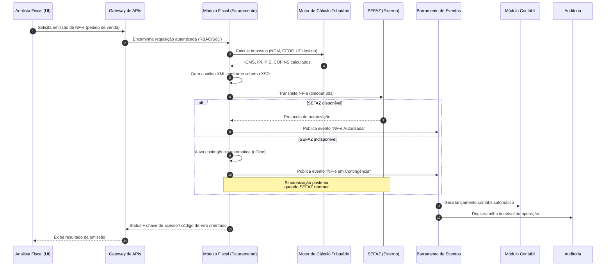
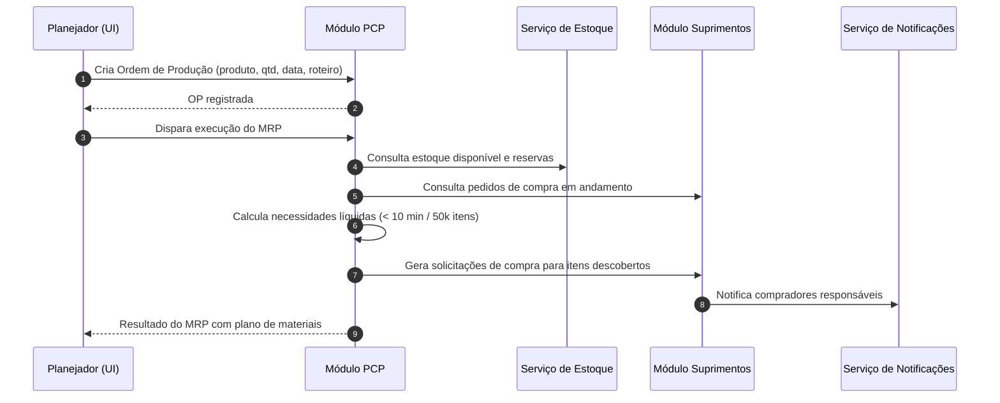

# Relatório Técnico de Arquitetura de Software
## ERP para Indústria Manufatureira (G03) — AI4ES Time 2

---

## 1. Identificação das HUs

| HU | Perfil | Objetivo | RFs Relacionados |
|----|--------|----------|------------------|
| HU01 | Planejador de Produção | Criar OPs e executar MRP com geração automática de solicitações de compra | RF05, RF06, RF14 |
| HU02 | Planejador de Produção | Monitorar OEE e desvios de produção em tempo real com drill-down | RF08, RF10, RF11, RF12, RF52 |
| HU03 | Comprador | Gerenciar cotações multi-fornecedor com comparação automática e aprovação por alçada | RF13, RF15, RF16 |
| HU04 | Gestor de Suprimentos | Acompanhar desempenho de fornecedores (prazo, qualidade, preço) | RF19, RF25, RF53 |
| HU05 | Analista de Qualidade | Registrar inspeção de lote e bloquear reprovados automaticamente | RF20, RF21, RF22 |
| HU06 | Analista de Qualidade | Rastreabilidade completa de lote (insumo → produto acabado → cliente) | RF23, RF17, RF28 |
| HU07 | Analista Fiscal | Emitir NF-e com cálculo automático de impostos e contingência | RF31, RF32, RF33, RF34, RNF15, RNF17 |
| HU08 | Analista Fiscal | Manter SPED Fiscal alimentado automaticamente | RF36, RF48, RNF08 |
| HU09 | Analista de RH | Processar folha de pagamento mensal integrada ao ponto | RF37, RF38, RF39 |
| HU10 | Analista de RH | Gerar obrigações acessórias (eSocial, CAGED, RAIS, DIRF) | RF40, RF41, RNF08 |
| HU11 | Controller | DRE e Fluxo de Caixa em tempo real com drill-down contábil | RF43–RF47, RF52 |
| HU12 | Diretor/CEO | Dashboard executivo com KPIs consolidados em tempo real | RF50, RF51, RF52, RF53, RNF14 |

---

## 2. Diagramas de Arquitetura (Mermaid)

### 2.1 Visão de Componentes (Contexto Modular)

```mermaid
flowchart TB
    subgraph Apresentacao["Camada de Apresentação"]
        UI["Interface Web Responsiva"]
        DASH["Módulo de Dashboards e KPIs"]
    end

    subgraph Gateway["Camada de Integração e Acesso"]
        APIGW["Gateway de APIs REST"]
        AUTH["Serviço de Identidade e Acesso<br/>(SSO / RBAC / SoD)"]
        INTEG["Hub de Integração Industrial<br/>(OPC-UA / MQTT / REST)"]
    end

    subgraph Nucleo["Núcleo de Domínio ERP"]
        PCP["Módulo PCP<br/>(OP / MRP / OEE / Sequenciamento)"]
        SUP["Módulo Suprimentos<br/>(Cotação / OC / Recebimento)"]
        QLT["Módulo Qualidade<br/>(Inspeção / Lotes / NC / Rastreabilidade)"]
        LOG["Módulo Logística<br/>(Armazém / Expedição / RMA)"]
        FIS["Módulo Fiscal<br/>(NF-e / CT-e / SPED / Impostos)"]
        RH["Módulo RH e Folha<br/>(Ponto / Folha / eSocial)"]
        CTB["Módulo Contábil-Financeiro<br/>(Lançamentos / DRE / Fluxo de Caixa)"]
    end

    subgraph Transversal["Serviços Transversais"]
        EVT["Barramento de Eventos de Domínio"]
        AUD["Serviço de Auditoria Imutável"]
        NOTIF["Serviço de Notificações e Alertas"]
        EST["Serviço de Estoque Unificado"]
    end

    subgraph Externos["Sistemas Externos"]
        SEFAZ["SEFAZ"]
        SCADA["SCADA / MES"]
        DIR["Diretório Corporativo AD/LDAP"]
        GOV["Órgãos Governamentais<br/>(eSocial / RAIS / DIRF)"]
        BANCO["Bancos (Remessa)"]
    end

    UI --> APIGW
    DASH --> APIGW
    APIGW --> AUTH
    AUTH --> DIR
    APIGW --> PCP & SUP & QLT & LOG & FIS & RH & CTB
    SCADA --> INTEG --> PCP
    PCP & SUP & QLT & LOG --> EST
    PCP & SUP & QLT & LOG & FIS & RH --> EVT
    EVT --> CTB
    EVT --> AUD
    EVT --> NOTIF
    EVT --> DASH
    FIS --> SEFAZ
    RH --> GOV
    RH --> BANCO
```

### 2.2 Diagrama de Sequência — Emissão de NF-e com Contingência (HU07)

### 2.3 Diagrama de Sequência — MRP e Reabastecimento (HU01)

---

## 3. Decisões de Arquitetura

| ID | Decisão | Justificativa | Requisitos Suportados |
|----|---------|---------------|----------------------|
| ADR-01 | **Arquitetura modular orientada a domínios** com módulos autônomos (PCP, Suprimentos, Qualidade, Logística, Fiscal, RH, Contábil) integrados por barramento de eventos de domínio | Permite evolução independente, isolamento de falhas e desacoplamento entre módulos operacionais e financeiros | RNF16, RF43 |
| ADR-02 | **Barramento de eventos de domínio** como espinha dorsal: cada transação operacional publica evento consumido por Contabilidade, Auditoria, SPED e Dashboards | Garante DRE "em tempo real" sem fechamento manual, trilha de auditoria completa e alimentação automática do SPED | RF43, RF45, RF36, RNF10 |
| ADR-03 | **Serviço de Estoque Unificado** com controle de lote e status (disponível/bloqueado/em inspeção) como fonte única de verdade | Bloqueio automático de lotes reprovados e rastreabilidade dependem de visão consistente de estoque entre módulos | RF09, RF22, RF23, RF26 |
| ADR-04 | **Hub de Integração Industrial** com adaptadores configuráveis por protocolo (OPC-UA, MQTT, REST/JSON) e por unidade fabril | Isola a variabilidade dos ambientes de chão de fábrica do núcleo do ERP | RF11, RNF18 |
| ADR-05 | **Serviço de Identidade centralizado** com SSO federado ao diretório corporativo, RBAC granular por módulo/função/unidade e SoD para operações críticas | Requisito explícito de segurança e segregação organizacional | RF01–RF04, RNF03 |
| ADR-06 | **Trilha de auditoria imutável (append-only)** segregada do banco transacional, com retenção ≥ 10 anos e criptografia em repouso | Conformidade com CTN, LGPD e auditorias externas | RF03, RNF02, RNF09, RNF10 |
| ADR-07 | **Segregação leitura/escrita para dashboards**: modelo analítico de leitura alimentado por eventos, separado do modelo transacional, preservando ponteiros para drill-down até a origem | Atende carga de dashboard ≤ 5s sem degradar operações transacionais | RF50–RF52, RNF14 |
| ADR-08 | **Motor de Cálculo Tributário como componente isolado** com regras versionadas por vigência (alíquotas, NCM, UF) | Legislação fiscal muda com frequência; isolamento reduz risco de regressão nos demais módulos | RF32, RNF06 |
| ADR-09 | **Modo de contingência fiscal com fila de sincronização** ativado automaticamente ao detectar indisponibilidade da SEFAZ | Requisito de resiliência explícito | RF34, RNF17 |
| ADR-10 | **Multi-tenant lógico por unidade fabril** com isolamento de dados na camada de acesso e consolidação centralizada para relatórios corporativos | Escalabilidade multi-planta com hierarquia organizacional | RF04, RNF16 |
| ADR-11 | **Neutralidade de implantação**: componentes empacotados de forma portável para on-premises, nuvem privada ou híbrida | Requisito explícito de infraestrutura | RNF22 |

---

## 4. Tabela de Componentes e Rastreabilidade

| Componente | Responsabilidade Principal | Comunica-se com | Origem (HU / Critério de Aceite) |
|------------|---------------------------|-----------------|----------------------------------|
| Serviço de Identidade e Acesso | SSO via AD/LDAP, RBAC granular, SoD, rate limiting e bloqueio de conta | Gateway de APIs, Diretório Corporativo, Auditoria | RF01–RF04, RNF03, RNF04 |
| Gateway de APIs REST | Ponto único de entrada, autenticação, roteamento, exposição de APIs documentadas | Todos os módulos, Serviço de Identidade | RNF19; todas as HUs |
| Módulo PCP | Gestão de OP, MRP, sequenciamento de capacidade, apontamentos, cálculo de OEE | Estoque, Suprimentos, Hub Industrial, Eventos, Notificações | HU01 (CA1–CA3), HU02 (CA1–CA3) |
| Hub de Integração Industrial | Ingestão de dados SCADA/MES via OPC-UA/MQTT/REST, normalização por unidade fabril | Módulo PCP, Barramento de Eventos | HU02 (CA1); RF11, RNF18 |
| Módulo Suprimentos | Fornecedores, solicitações de compra, cotação comparativa, OC com alçada, recebimento, devolução, desempenho de fornecedor | Estoque, Qualidade, Fiscal, Notificações, Eventos | HU03 (CA1–CA3), HU04 (CA1–CA3), HU01 (CA3) |
| Módulo Qualidade | Planos de inspeção, registro de resultados, bloqueio de lote, NC com causa-raiz, rastreabilidade fim-a-fim | Estoque, PCP, Suprimentos, Logística, Notificações | HU05 (CA1–CA3), HU06 (CA1–CA3) |
| Serviço de Estoque Unificado | Fonte única de saldo por item/lote/local, status de bloqueio, endereçamento de armazém | PCP, Suprimentos, Qualidade, Logística, Eventos | HU01 (CA2), HU05 (CA2); RF09, RF22, RF26 |
| Módulo Logística | Expedição, romaneios, rastreamento de entrega, RMA vinculado a pedido | Estoque, Fiscal, Qualidade, Eventos | RF26–RF30; HU06 (CA1) |
| Módulo Fiscal (Faturamento) | Emissão/cancelamento/inutilização de NF-e e CT-e, contingência, geração de SPED Fiscal/Contribuições | Motor Tributário, SEFAZ, Logística, Contábil, Eventos | HU07 (CA1–CA4), HU08 (CA1–CA3) |
| Motor de Cálculo Tributário | Cálculo de ICMS, IPI, PIS, COFINS, ISS por NCM/CFOP/UF com regras versionadas | Módulo Fiscal, Módulo Logística | HU07 (CA1); RF32, RNF06 |
| Módulo RH e Folha | Cadastro de colaboradores, ponto eletrônico, folha, encargos, férias/rescisão, benefícios, obrigações acessórias, remessa bancária | Contábil, Eventos, Relógios de ponto, Órgãos governamentais, Bancos | HU09 (CA1–CA3), HU10 (CA1–CA3) |
| Módulo Contábil-Financeiro | Lançamentos automáticos por evento, plano de contas, DRE, Balanço, fluxo de caixa, contas a pagar/receber, multi-moeda, SPED Contábil | Barramento de Eventos, Fiscal, RH, Dashboards | HU11 (CA1–CA3); RF43–RF49 |
| Barramento de Eventos de Domínio | Publicação/assinatura de eventos transacionais entre módulos | Todos os módulos, Auditoria, Dashboards | ADR-02; RF43, RF36 |
| Serviço de Auditoria Imutável | Registro append-only de todas as operações com retenção ≥ 10 anos | Barramento de Eventos, todos os módulos | RF03, RNF10 |
| Serviço de Notificações e Alertas | Alertas de desvio, notificações de aprovação, lote reprovado, prazos de obrigações | PCP, Suprimentos, Qualidade, RH, Dashboards | HU02 (CA2), HU03 (CA3), HU05 (CA3), HU10 (CA2) |
| Módulo de Dashboards e KPIs | Modelo analítico de leitura, KPIs configuráveis, metas, drill-down até transação, exportação PDF/Excel | Barramento de Eventos, Gateway, módulos de origem (drill-down) | HU12 (CA1–CA4), HU04 (CA3), HU11 (CA3); RF50–RF53 |
| Serviço de Backup e Continuidade | Backup diário (retenção 90 dias), backup contínuo transacional (RPO ≤ 1h) | Repositórios de dados de todos os módulos | RNF21 |
| Painel de Monitoramento Operacional | Métricas de saúde de todos os módulos para equipe de TI | Todos os módulos | RNF23 |

---

## 5. Bloqueios e Pendências

| ID | Tipo | Descrição | Impacto | Ação Sugerida |
|----|------|-----------|---------|---------------|
| P-01 | Pendência | Regras de alçada de aprovação de OC (níveis, valores, delegação) não especificadas | Bloqueia modelagem do workflow de aprovação (HU03) | Levantar política de alçadas com o negócio |
| P-02 | Pendência | Critérios de convenções coletivas variam por sindicato/região e não estão detalhados | Parametrização da folha (RNF11) indefinida | Definir mecanismo de regras configuráveis por convenção |
| P-03 | Pendência | Volumetria de eventos do chão de fábrica (frequência, nº de sensores/máquinas) não informada | Dimensionamento do Hub Industrial e do modelo analítico | Solicitar estimativas de throughput por planta |
| P-04 | Pendência | Definição de "tempo real" para DRE (latência aceitável do lançamento até a visualização) não quantificada | Escolha entre consistência forte vs. eventual no fluxo contábil | Acordar SLA de latência com o Controller |
| P-05 | Bloqueio | Certificados digitais (A1/A3) e responsabilidades de custódia para assinatura de NF-e não definidos | Emissão de NF-e não pode ser implementada sem definição | Alinhar com TI/Fiscal a gestão de certificados |
| P-06 | Pendência | Estratégia de anonimização/exclusão de dados pessoais (LGPD) conflita potencialmente com retenção fiscal de 10 anos | Risco de conformidade | Parecer jurídico sobre bases legais e pseudonimização |
| P-07 | Pendência | RF32 menciona ISS, mas não há RF de faturamento de serviços/NFS-e | Escopo fiscal ambíguo | Confirmar se a empresa emite notas de serviço municipais |

---

## 6. Cobertura de Requisitos

| Grupo | Requisitos | Componentes Responsáveis | Status |
|-------|-----------|--------------------------|--------|
| Usuários e Acesso | RF01–RF04 | Serviço de Identidade, Auditoria, Gateway | ✅ Coberto |
| PCP | RF05–RF12 | Módulo PCP, Hub Industrial, Estoque, Notificações | ✅ Coberto |
| Suprimentos | RF13–RF19 | Módulo Suprimentos, Estoque, Fiscal (devoluções) | ✅ Coberto |
| Qualidade | RF20–RF25 | Módulo Qualidade, Estoque, Dashboards | ✅ Coberto |
| Logística | RF26–RF30 | Módulo Logística, Estoque, Fiscal | ✅ Coberto |
| Fiscal | RF31–RF36 | Módulo Fiscal, Motor Tributário | ✅ Coberto (ver P-05, P-07) |
| RH e Folha | RF37–RF42 | Módulo RH e Folha | ✅ Coberto (ver P-02) |
| Contábil | RF43–RF49 | Módulo Contábil, Barramento de Eventos | ✅ Coberto |
| Dashboards | RF50–RF53 | Módulo de Dashboards e KPIs | ✅ Coberto |
| Segurança | RNF01–RNF05 | Identidade, Gateway, Auditoria, criptografia em repouso | ✅ Coberto |
| Conformidade | RNF06–RNF11 | Motor Tributário, Fiscal, RH, Auditoria Imutável | ✅ Coberto (ver P-06) |
| Disponibilidade/Desempenho | RNF12–RNF17 | ADR-07, ADR-09, ADR-10; contingência fiscal | ✅ Coberto |
| Interoperabilidade | RNF18–RNF20 | Hub Industrial, Gateway de APIs, exportação de dados | ✅ Coberto |
| Infraestrutura | RNF21–RNF24 | Backup, portabilidade de implantação, monitoramento, UI web responsiva | ✅ Coberto |

**Cobertura: 53/53 RFs e 24/24 RNFs mapeados a componentes (100%), com 7 pendências de especificação registradas na Seção 5.**

---

## 7. Gap Analysis

| # | Lacuna Identificada | Impacto Arquitetural | Ação Recomendada |
|---|---------------------|----------------------|------------------|
| G-01 | Ausência de módulo de **Vendas/Pedidos**: RF27 e RF31 referenciam "pedidos de venda", mas não há RFs para captação e gestão de pedidos | Expedição e faturamento dependem de entidade não especificada; risco de integração improvisada | Formalizar módulo/interface de Pedidos de Venda ou definir integração com CRM/sistema comercial existente |
| G-02 | Estratégia de **conciliação bancária** e retorno de remessa (CNAB) não especificada, embora HU09 exija remessa bancária | Contas a pagar/receber (RF47) incompletas sem baixa automática | Especificar formatos de remessa/retorno e fluxo de conciliação |
| G-03 | **Gestão mestre de dados (MDM)**: cadastro de itens, BOM (lista de materiais) e roteiros de produção são pressupostos pelo MRP mas não têm RFs próprios | MRP (RF06) e rastreabilidade (RF23) inviáveis sem estrutura de produto formal | Adicionar requisitos de engenharia de produto (BOM, roteiros, versões) |
| G-04 | Comportamento do sistema em **falha do barramento de eventos** não definido (lançamentos contábeis e SPED dependem dele) | Risco de perda de lançamentos e inconsistência DRE/transacional | Definir garantias de entrega (ao menos uma vez), idempotência e reconciliação periódica |
| G-05 | **Fechamento contábil** (períodos, bloqueio de lançamentos retroativos, ajustes) não especificado apesar da DRE em tempo real | Sem controle de período, integridade do Balanço e SPED Contábil fica comprometida | Especificar processo de fechamento e regras de lançamento retroativo |
| G-06 | Requisitos de **RTO** (tempo de recuperação) ausentes — apenas RPO ≤ 1h definido | Plano de continuidade incompleto; disponibilidade 99,5% pode ser inviável sem RTO | Definir RTO por criticidade de módulo (fiscal e chão de fábrica prioritários) |
| G-07 | **Versionamento de regras tributárias e trabalhistas** com vigência retroativa (reprocessamento de folha, SPED de períodos passados — HU08 CA3) não detalhado | Motor Tributário e Folha precisam de arquitetura temporal (regras bi-temporais) | Projetar repositório de regras com vigência e capacidade de recálculo histórico |
| G-08 | Estratégia de **migração de dados legados** (saldos contábeis, estoque, histórico de fornecedores) não mencionada | Go-live impossível sem carga inicial consistente | Planejar fase de migração com validação e reconciliação de saldos |
| G-09 | **Limites de concorrência do MRP** (execuções simultâneas por planta, travamento de dados durante cálculo) não especificados | Risco de resultados inconsistentes em ambiente multi-planta | Definir política de execução (fila, snapshot de dados, escopo por unidade) |
| G-10 | **Portal/canal para fornecedores** responder cotações (HU03) não especificado — envio por e-mail? portal externo? | Afeta topologia de segurança (exposição externa) e o Gateway de APIs | Decidir canal de interação com fornecedores e requisitos de segurança associados |

---

*Fim do Relatório Canônico de Arquitetura — AI4ES Time 2 | ERP Manufatura G03*