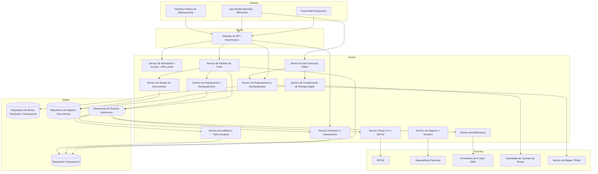
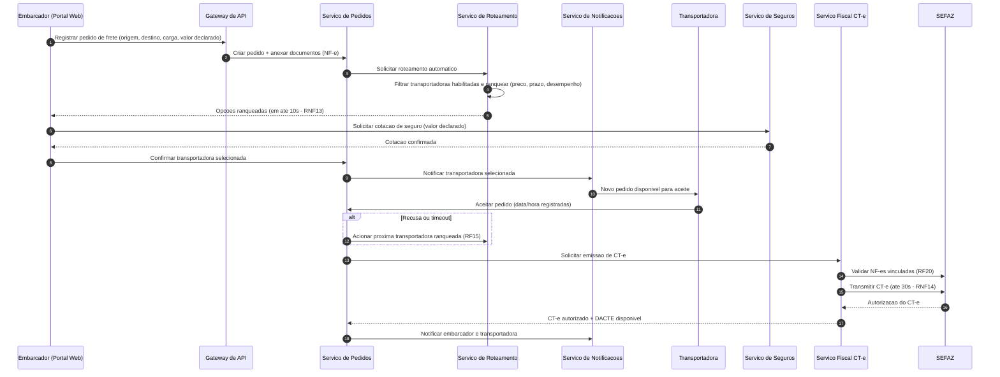
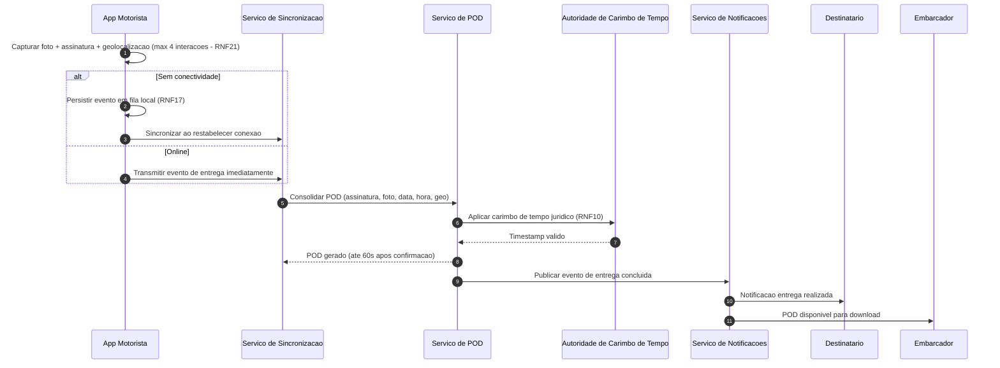

# Relatório Técnico de Arquitetura de Software
## Plataforma de Gestão de Transporte de Cargas (G04)

---

## 1. Identificação das HUs

| HU | Perfil | Resumo | Requisitos Vinculados |
|----|--------|--------|----------------------|
| HU01 | Embarcador | Registrar pedido de frete com carga, prazo e documentos, disparando roteamento automático | RF05, RF06, RF09, RF10, RNF13 |
| HU02 | Embarcador | Selecionar transportadora ranqueada e contratar seguro em fluxo único | RF11, RF12, RF41, RF17 |
| HU03 | Embarcador | Acompanhar fretes consolidados e receber POD | RF07, RF37, RF39, RF34 |
| HU04 | Embarcador | Abrir e acompanhar sinistro vinculado ao frete | RF42, RF43, RF44 |
| HU05 | Transportadora | Aceitar/recusar pedidos e gerenciar frota | RF03, RF13, RF14, RF15 |
| HU06 | Transportadora | Monitorar motoristas e entregas em tempo real | RF25, RF26, RNF06, RNF15 |
| HU07 | Transportadora | Consultar demonstrativo de repasse | RF46, RF48 |
| HU08 | Motorista | Registrar coleta com evidências (fotos, assinatura, volumes) | RF23, RF24, RF26 |
| HU09 | Motorista | Registrar entrega com assinatura digital e POD, incluindo modo offline | RF27, RF28, RF37, RF38, RF40, RNF10, RNF17, RNF21 |
| HU10 | Motorista | Registrar ocorrências categorizadas com fotos | RF26, RF33–RF35 |
| HU11 | Destinatário | Rastrear carga por link sem cadastro | RF30, RF31, RF32, RNF05 |
| HU12 | Destinatário | Receber notificações por e-mail/SMS com preferências | RF33 |
| HU13 | Administrador | Monitorar SLA de fretes e acionar contingência | RF36, RNF25 |
| HU14 | Administrador | Painel financeiro consolidado da plataforma | RF47, RF49 |

---

## 2. Diagramas de Arquitetura (Mermaid)

### 2.1 Diagrama de Componentes (Visão Lógica)

### 2.2 Diagrama de Sequência — Fluxo de Contratação de Frete (HU01/HU02/HU05)

### 2.3 Diagrama de Sequência — Entrega com POD e Modo Offline (HU09)

---

## 3. Decisões de Arquitetura

| ID | Decisão | Justificativa | Requisitos |
|----|---------|---------------|------------|
| DA01 | **Arquitetura orientada a serviços com barramento de eventos assíncrono** | Desacopla domínios (pedidos, fiscal, rastreamento, financeiro), permite reação a eventos (notificações, cascata de recusa de transportadoras, cálculo de comissão) e escala independente | RF13–RF15, RF33–RF36, RNF16, RNF24 |
| DA02 | **App do motorista offline-first com fila local de eventos e sincronização idempotente** | Garante que nenhum evento de coleta/entrega/ocorrência seja perdido; requer resolução de ordem de eventos e deduplicação no servidor | RF28, RNF17, HU09 |
| DA03 | **Repositório especializado em séries temporais/geoespacial para telemetria, separado do transacional** | Alto volume de escrita de posições sem degradar operações transacionais; consultas geoespaciais para ETA e monitoramento | RF25, RF32, RNF16, RNF23 |
| DA04 | **Serviço fiscal isolado com contrato versionado e suporte a contingência** | Emissão em contingência com fila de sincronização posterior; isolamento de mudanças de leiaute XSD da SEFAZ sem impacto no núcleo | RF17–RF22, RNF07, RNF08, RNF24 |
| DA05 | **Camada de integração externa com adaptadores por parceiro (SEFAZ, seguradoras, mensageria, carimbo de tempo)** | Contratos versionados e atualização independente de cada integração; monitoramento de disponibilidade por integração | RF41, RNF24, RNF25 |
| DA06 | **Trilha de auditoria imutável (append-only) com retenção configurável mínima de 5 anos** | Conformidade com CTN e LGPD; eventos de auditoria capturados via barramento sem acoplamento aos serviços de negócio | RF04, RNF09, RNF11 |
| DA07 | **Tokens de escopo restrito para rastreamento público** | Link do destinatário com token único, expiração pós-entrega e visibilidade restrita ao frete específico | RF30, RNF05, RNF06 |
| DA08 | **Distribuição de posição em tempo (quase) real via canal de publicação/assinatura para painéis e rastreamento** | Atualização no mapa em até 30s após transmissão; evita polling intensivo | RF32, RNF15, HU06, HU11 |
| DA09 | **Criptografia em repouso (AES-256) para dados financeiros, fiscais e de geolocalização; TLS 1.2+ em trânsito; MFA para perfis sensíveis** | Requisitos explícitos de segurança | RNF01–RNF04 |
| DA10 | **Motor de regras configurável para políticas de negócio** (cancelamento, prazos de aceite, critérios de ranqueamento, intervalos de geolocalização) | Múltiplos requisitos exigem parametrização sem reimplantação | RF08, RF11, RF15, RF25 |

---

## 4. Tabela de Componentes e Rastreabilidade

| Componente | Responsabilidade Principal | Comunica-se com | Origem (HU / Critério de Aceite) |
|---|---|---|---|
| Gateway de API / Autenticação | Ponto único de entrada, roteamento, autenticação, autorização por perfil, rate limiting | Todos os serviços de núcleo, IAM | RF02, RNF01, RNF03–RNF05 |
| Serviço de Identidade e Acesso | Cadastro de usuários por perfil, MFA, tokens de sessão renováveis, vínculo transportadora↔motoristas/veículos | Gateway, Auditoria | HU05; RF01–RF03, RNF03, RNF04 |
| Serviço de Pedidos de Frete | Ciclo de vida do pedido (registro, cancelamento, status consolidado), orquestração da confirmação | Roteamento, Fiscal, Documentos, Barramento | HU01, HU03; RF05–RF09 |
| Serviço de Roteamento e Ranqueamento | Filtragem de transportadoras elegíveis, ranqueamento por critérios configuráveis, cascata em recusa/timeout, índice de desempenho | Pedidos, Notificações, Barramento | HU01, HU02, HU05; RF10–RF16, RNF13 |
| Serviço Fiscal CT-e | Emissão/transmissão/cancelamento/inutilização de CT-e, modalidades legais, contingência, validação de NF-e, geração de DACTE | SEFAZ (adaptador), Pedidos, Documentos | HU02; RF17–RF22, RNF07, RNF08, RNF14 |
| Serviço de Rastreamento e Geolocalização | Ingestão de posições em alto volume, histórico de eventos da carga, cálculo dinâmico de ETA, distribuição em tempo real | Repositório geoespacial, Serviço de Mapas, canais pub/sub | HU06, HU11; RF25, RF30–RF32, RNF15, RNF16, RNF23 |
| Serviço de Sincronização Offline | Recepção idempotente de eventos do app, ordenação, deduplicação, reconciliação de estado | App Motorista, POD, Rastreamento, Pedidos | HU08–HU10; RF28, RNF17 |
| Serviço de POD | Consolidação de assinatura, foto, geolocalização; carimbo de tempo jurídico; registro de recusa de recebimento | TSA (adaptador), Documentos, Notificações | HU03, HU09; RF37–RF40, RNF10 |
| Serviço de Seguros e Sinistros | Cotação/contratação por viagem, abertura e acompanhamento de sinistro com evidências vinculadas | Seguradoras (adaptador), Pedidos, Documentos, Notificações | HU02, HU04; RF41–RF44 |
| Serviço Financeiro e Faturamento | Cálculo de frete, retenção de comissão, fatura do embarcador, repasse da transportadora, painel financeiro, exportação CSV/PDF | Barramento, Repositório transacional, Auditoria | HU07, HU14; RF45–RF49 |
| Serviço de Notificações | Envio multicanal (e-mail/SMS), preferências do destinatário, alertas de SLA e prazos críticos | Provedores de mensageria, Barramento | HU12, HU13; RF33–RF36 |
| Serviço de Auditoria | Trilha imutável de operações críticas e movimentações fiscais/financeiras, retenção ≥ 5 anos | Barramento, Repositório transacional | RF04, RNF11 |
| Serviço de Gestão de Documentos | Armazenamento estruturado de NF-e, DACTE, fotos, laudos, BO, POD | Repositório de objetos, Pedidos, Sinistros | RF09, RF22, RF44 |
| App Mobile do Motorista | Ordens do dia, rotas otimizadas multi-parada, coleta/entrega com evidências, ocorrências, operação offline, UI para luvas/baixa luz | Sincronização, Gateway, Serviço de Mapas | HU08–HU10; RF23–RF29, RNF17–RNF19, RNF21 |
| Portal Web | Interfaces de embarcador, transportadora e administrador (painéis, aceites, financeiro, monitoramento SLA) | Gateway | HU01–HU07, HU13, HU14; RNF20 |
| Interface Pública de Rastreamento | Acesso por token único sem cadastro, mapa, histórico, ETA, preferências de notificação | Gateway, Rastreamento, Notificações | HU11, HU12; RF30–RF32, RNF05 |
| Painel de Monitoramento Operacional | Métricas de latência de roteamento, taxa de aceite, disponibilidade de integrações | Todos os serviços (telemetria) | RNF25, HU13 |

---

## 5. Bloqueios e Pendências

| # | Item | Tipo | Impacto |
|---|------|------|---------|
| B01 | Definição do provedor/autoridade de carimbo de tempo qualificado para validade jurídica do POD (Lei 14.063/2020) — nível de assinatura exigido (simples, avançada, qualificada) não especificado | Bloqueio regulatório | Alto — afeta design do Serviço de POD |
| B02 | Regras exatas de contingência de CT-e (modalidade FS-DA, EPEC ou SVC) não especificadas | Bloqueio funcional | Alto — RF19 |
| B03 | Meios de pagamento e fluxo de cobrança do embarcador (a fatura é gerada, mas não há requisito de pagamento/gateway) | Pendência de escopo | Médio — RF47, RF49 (inadimplência pressupõe cobrança) |
| B04 | Política de retenção/anonimização de geolocalização de motoristas frente à LGPD (base legal, prazo de retenção) | Pendência de conformidade | Médio — RNF09, RNF23 |
| B05 | SLA das seguradoras parceiras e formato de integração (síncrono vs. assíncrono, webhook de status de sinistro) | Pendência de integração | Médio — RF41–RF43 |
| B06 | Critérios de cálculo do índice de desempenho da transportadora (pesos, janela temporal, penalizações) | Pendência de regra de negócio | Médio — RF16 |
| B07 | Estratégia de resolução de conflitos na sincronização offline (eventos fora de ordem, relógio do dispositivo não confiável) | Pendência técnica | Alto — RNF17 |

---

## 6. Cobertura de Requisitos

| Grupo | Requisitos | Cobertura | Componentes Responsáveis |
|-------|-----------|-----------|--------------------------|
| Usuários e Acesso | RF01–RF04 | ✅ Total | IAM, Auditoria, Gateway |
| Pedidos de Frete | RF05–RF09 | ✅ Total | Pedidos, Documentos |
| Roteamento | RF10–RF16 | ✅ Total | Roteamento e Ranqueamento |
| CT-e | RF17–RF22 | ✅ Total (contingência pendente de detalhamento — B02) | Serviço Fiscal |
| Operação Motorista | RF23–RF29 | ✅ Total | App Motorista, Sincronização, Mapas |
| Rastreamento | RF30–RF32 | ✅ Total | Rastreamento, Interface Pública |
| Notificações | RF33–RF36 | ✅ Total | Notificações |
| POD | RF37–RF40 | ✅ Total (TSA pendente — B01) | Serviço de POD |
| Seguros/Sinistros | RF41–RF44 | ✅ Total | Seguros e Sinistros |
| Financeiro | RF45–RF49 | ✅ Total (cobrança fora de escopo — B03) | Financeiro |
| Segurança | RNF01–RNF06 | ✅ Total | Gateway, IAM, camada de dados |
| Conformidade | RNF07–RNF11 | ✅ Total (com pendências B01, B04) | Fiscal, POD, Auditoria |
| Disponibilidade/Desempenho | RNF12–RNF17 | ✅ Total | Barramento, Rastreamento, Sincronização |
| Usabilidade/Compatibilidade | RNF18–RNF21 | ✅ Total | App Motorista, Portal Web |
| Infra e Dados | RNF22–RNF25 | ✅ Total | Repositórios, Adaptadores, Painel de Monitoramento |

**Cobertura: 49/49 RFs e 25/25 RNFs endereçados (100%), com 7 pendências de refinamento (Seção 5).**

---

## 7. Gap Analysis

| # | Lacuna Identificada | Impacto Arquitetural | Ação Recomendada |
|---|---------------------|----------------------|------------------|
| G01 | **Ausência de requisito de pagamento/liquidação financeira**: o sistema fatura e calcula repasse, mas não há fluxo de recebimento nem de pagamento à transportadora | O Serviço Financeiro pode precisar de integração com meios de pagamento e conciliação bancária, alterando fronteiras do domínio | Levantar com o negócio se a liquidação ocorre na plataforma; se sim, especificar RFs de cobrança, split de pagamento e conciliação |
| G02 | **Modo offline sem estratégia de conflito definida**: eventos concorrentes (ex.: cancelamento do frete enquanto motorista opera offline) podem gerar estados inconsistentes | Exige máquina de estados do frete com regras de reconciliação e eventos idempotentes com ordenação causal | Definir matriz de transições de estado válidas e política de resolução (ex.: evento de campo com evidência prevalece); usar identificadores únicos gerados no dispositivo |
| G03 | **Cadeia de custódia jurídica do POD incompleta**: requisitos citam timestamp, mas não hash de integridade, verificação posterior ou repositório probatório | Serviço de POD deve incluir selagem criptográfica e verificação pública de integridade | Especificar formato do POD selado (hash + timestamp + metadados) e mecanismo de verificação por terceiros |
| G04 | **LGPD sem requisitos operacionais**: não há RFs de consentimento, direito de exclusão, anonimização de trajetos de motoristas | Pode exigir componente de gestão de privacidade e políticas de retenção por tipo de dado, conflitando com trilha imutável de 5 anos | Mapear bases legais por dado; separar dados pessoais (elimináveis) de registros fiscais (retidos), com pseudonimização na trilha de auditoria |
| G05 | **Previsão de entrega (ETA) sem definição de método**: RF32/HU11 exigem ETA dinâmico, mas não há critério de precisão nem fonte de dados de trânsito | Determina necessidade (ou não) de serviço externo de roteamento/tráfego e do modelo de cálculo | Definir tolerância de precisão do ETA e fonte de dados; iniciar com estimativa por distância/velocidade média e evoluir |
| G06 | **Capacidade e limites não quantificados**: RNF16 exige "alto volume" sem números (fretes/dia, posições/segundo, motoristas simultâneos) | Impossível dimensionar ingestão de telemetria, partições do barramento e retenção do repositório geoespacial | Solicitar volumetria projetada (12–24 meses) para definir metas de throughput e testes de carga |
| G07 | **Multitenancy e isolamento entre transportadoras/embarcadores não especificado** | Afeta modelo de dados, autorização (RNF06) e relatórios | Definir modelo de isolamento lógico por tenant com autorização baseada em vínculo ao frete |
| G08 | **Comunicação transportadora↔motorista (HU06: "contatar pelo painel")** sem definição de canal (chamada, chat, push) | Pode requerer componente de mensageria interna ou apenas exposição de contato | Refinar critério de aceite: chat integrado implica novo domínio; contato telefônico é solução mínima |
| G09 | **Ausência de plano de degradação para indisponibilidade da SEFAZ e seguradoras** além da contingência de CT-e | Requer filas de retry, circuit breakers conceituais e visibilidade no painel (RNF25) | Especificar comportamento por integração: fila de reprocessamento, notificação de operação degradada e SLA interno de sincronização |
| G10 | **Regra de expiração e reemissão do link de rastreamento** (perda do link, múltiplos destinatários, reenvio) não coberta | Impacta gestão de tokens no Gateway e no Serviço de Rastreamento | Definir fluxo de reemissão de token e limite de acessos/validade antes da entrega |

---
*Relatório gerado pelo Sistema Multi-Agente de Design de Software — AI4ES Time 2. Design tecnologicamente neutro: escolhas de produtos e plataformas devem ocorrer na fase de arquitetura de implementação, respeitando as decisões e restrições aqui documentadas.*