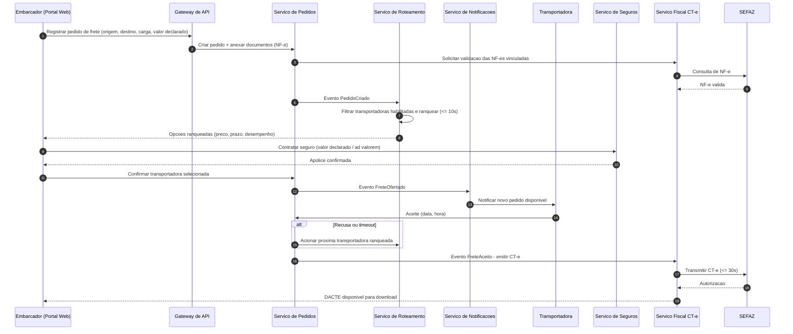
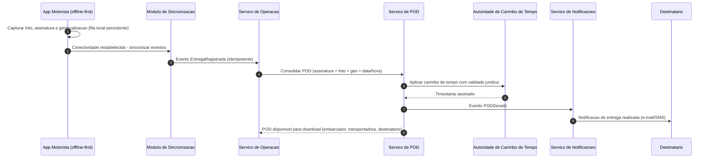

# Relatório Técnico de Arquitetura de Software
## Plataforma de Gestão de Transporte de Cargas (G04)

---

## 1. Identificação das HUs

| HU | Perfil | Título | Requisitos Relacionados |
|----|--------|--------|------------------------|
| HU01 | Embarcador | Registrar pedido de frete | RF05, RF06, RF09, RF10, RF13, RNF13 |
| HU02 | Embarcador | Selecionar transportadora e contratar seguro | RF11, RF12, RF17, RF41, RNF07 |
| HU03 | Embarcador | Acompanhar pedidos e receber POD | RF07, RF34, RF37, RF39 |
| HU04 | Embarcador | Abrir sinistro por avaria ou extravio | RF42, RF43, RF44 |
| HU05 | Transportadora | Aceitar pedidos e gerenciar frota | RF03, RF13, RF14, RF15, RF35 |
| HU06 | Transportadora | Acompanhar operação em tempo real | RF25, RF26, RF32, RNF06, RNF16 |
| HU07 | Transportadora | Consultar demonstrativo de repasse | RF46, RF48 |
| HU08 | Motorista | Executar coleta com evidências | RF23, RF24, RF26, RF28, RNF17 |
| HU09 | Motorista | Registrar entrega com assinatura digital | RF27, RF37, RF38, RF40, RNF10, RNF17, RNF21 |
| HU10 | Motorista | Registrar ocorrência no transporte | RF26, RF33, RF34, RF35 |
| HU11 | Destinatário | Rastrear carga sem cadastro | RF30, RF31, RF32, RNF05, RNF15 |
| HU12 | Destinatário | Receber notificações por etapa | RF33, RNF05 |
| HU13 | Administrador | Monitorar SLA e contingência | RF36, RNF25 |
| HU14 | Administrador | Painel financeiro consolidado | RF45–RF49, RNF11 |

---

## 2. Diagramas de Arquitetura (Mermaid)

### 2.1 Diagrama de Componentes (visão lógica)

```mermaid
graph TB
    subgraph Clientes
        WEB[Portal Web Responsivo]
        APP[App Mobile Motorista - modo offline]
        TRK[Interface Publica de Rastreamento]
    end

    GW[Gateway de API / Autenticacao MFA]

    subgraph Nucleo
        IAM[Servico de Identidade e Acesso]
        PED[Servico de Pedidos de Frete]
        ROT[Servico de Roteamento e Ranqueamento]
        FIS[Servico Fiscal CT-e]
        OPE[Servico de Operacao de Transporte]
        GEO[Servico de Geolocalizacao]
        POD[Servico de Comprovante de Entrega]
        SEG[Servico de Seguros e Sinistros]
        FIN[Servico Financeiro e Faturamento]
        NOT[Servico de Notificacoes]
        AUD[Servico de Auditoria Imutavel]
        DOC[Servico de Gestao Documental]
        MON[Servico de Monitoramento e SLA]
    end

    BUS((Barramento de Eventos Assincrono))

    subgraph Externos
        SEFAZ[SEFAZ]
        SEGX[Seguradoras Parceiras]
        TSA[Autoridade de Carimbo de Tempo]
        MSG[Provedores E-mail e SMS]
        MAP[Provedor de Mapas e Rotas]
    end

    WEB --> GW
    APP --> GW
    TRK --> GW
    GW --> IAM
    GW --> PED
    GW --> OPE
    GW --> GEO
    GW --> FIN
    GW --> SEG
    GW --> MON

    PED --> BUS
    ROT --> BUS
    OPE --> BUS
    GEO --> BUS
    POD --> BUS
    FIS --> BUS
    NOT --> BUS
    FIN --> BUS
    AUD --> BUS
    MON --> BUS

    PED --> DOC
    SEG --> DOC
    POD --> DOC
    FIS --> SEFAZ
    SEG --> SEGX
    POD --> TSA
    NOT --> MSG
    ROT --> MAP
    GEO --> MAP
```

### 2.2 Diagrama de Sequência — Fluxo de Pedido, Roteamento e Emissão de CT-e (HU01/HU02/HU05)

### 2.3 Diagrama de Sequência — Entrega Offline com POD (HU09)

---

## 3. Decisões de Arquitetura

| ID | Decisão | Justificativa | Requisitos |
|----|---------|---------------|------------|
| AD01 | Arquitetura orientada a serviços com comunicação assíncrona por eventos | Desacoplamento entre roteamento, fiscal, notificações e rastreamento; suporta alto volume de geolocalização (RNF16) e resiliência (RNF12) | RNF12, RNF16 |
| AD02 | App mobile offline-first com fila local persistente e sincronização idempotente | Garante que nenhum evento de coleta/entrega/ocorrência seja perdido | RF28, RNF17 |
| AD03 | Serviço de geolocalização dedicado com armazenamento em base otimizada para séries temporais e consultas geoespaciais | Escrita massiva + consultas por trajeto e proximidade | RF25, RNF15, RNF16, RNF23 |
| AD04 | Serviço fiscal (CT-e) isolado com contrato versionado e modo de contingência com fila de retransmissão | Legislação SEFAZ muda com frequência; contingência offline exigida | RF17–RF22, RNF07, RNF08, RNF24 |
| AD05 | Integrações externas (SEFAZ, seguradoras, mensageria, carimbo de tempo) via adaptadores com contratos versionados | Atualização independente de cada integração | RNF24 |
| AD06 | Trilha de auditoria imutável (append-only) com retenção mínima de 5 anos | Conformidade fiscal (CTN) e LGPD | RF04, RNF09, RNF11 |
| AD07 | Rastreamento público via token único com escopo restrito ao frete e expiração após entrega | Segurança sem exigir cadastro do destinatário | RF30, RNF05, RNF06 |
| AD08 | Criptografia em repouso (AES-256) para dados financeiros, fiscais e de localização; TLS 1.2+ em trânsito; MFA para perfis sensíveis | Requisitos literais de segurança | RNF01–RNF04 |
| AD09 | Motor de roteamento com critérios configuráveis e cascata automática de ofertas com timeout | Ranqueamento em ≤10s e reoferta automática | RF10–RF16, RNF13 |
| AD10 | Serviço financeiro com cálculo de comissão, faturamento e repasse desacoplado do fluxo operacional (event-driven) | Consistência eventual aceitável; auditoria completa | RF45–RF49 |

---

## 4. Tabela de Componentes e Rastreabilidade

| Componente | Responsabilidade Principal | Comunica-se com | Origem (HU / Critério de Aceite) |
|---|---|---|---|
| Gateway de API | Roteamento de requisições, autenticação, autorização por perfil, throttling | Todos os serviços, clientes | RF02, RNF01, RNF03 |
| Serviço de Identidade e Acesso | Cadastro de usuários/perfis, MFA, tokens de sessão renováveis, vínculo transportadora↔motorista/veículo | Gateway, Auditoria | HU05; RF01–RF03, RNF03–RNF04 |
| Serviço de Pedidos de Frete | Ciclo de vida do pedido (registro, cancelamento, status consolidado) | Roteamento, Fiscal, Documental, Barramento | HU01, HU03 / campos obrigatórios; RF05–RF09 |
| Serviço de Roteamento e Ranqueamento | Filtragem de transportadoras habilitadas, ranqueamento configurável, cascata de ofertas com timeout, índice de desempenho | Pedidos, Notificações, Provedor de Mapas | HU01, HU02, HU05 / "aceite dentro do prazo"; RF10–RF16, RNF13 |
| Serviço Fiscal CT-e | Emissão, transmissão, contingência, cancelamento/inutilização de CT-e; validação de NF-e; DACTE | SEFAZ, Pedidos, Documental | HU02 / "confirmação dispara emissão do CT-e"; RF17–RF22, RNF07–RNF08 |
| Serviço de Operação de Transporte | Ordens de coleta/entrega, registro de coleta, entrega, recusa e ocorrências | App Motorista, POD, Geolocalização, Barramento | HU08–HU10 / registro com evidências; RF23–RF27, RF40 |
| Serviço de Geolocalização | Ingestão de posições em alto volume, histórico de trajeto, previsão dinâmica de entrega (ETA) | App Motorista, Rastreamento, Monitoramento | HU06, HU11 / "posição atualizada no mapa"; RF25, RF32, RNF15–RNF16, RNF23 |
| Serviço de Comprovante de Entrega (POD) | Consolidação de assinatura, foto, geo e data/hora; carimbo de tempo jurídico; disponibilização para download | TSA, Documental, Notificações | HU09 / "POD em até 60s"; RF37–RF39, RNF10 |
| Serviço de Seguros e Sinistros | Cotação/contratação por viagem, abertura e acompanhamento de sinistro com documentação vinculada | Seguradoras, Documental, Notificações | HU02, HU04 / "vínculo automático ao pedido"; RF41–RF44 |
| Serviço Financeiro e Faturamento | Cálculo de frete, comissão, fatura do embarcador, repasse da transportadora, painel financeiro, exportação CSV/PDF | Barramento, Auditoria | HU07, HU14 / filtros e exportação; RF45–RF49 |
| Serviço de Notificações | Envio multicanal (e-mail/SMS), gestão de preferências do destinatário, alertas por perfil | Provedores de mensageria, Barramento | HU10, HU12 / eventos de status; RF13, RF33–RF36 |
| Serviço de Auditoria | Trilha imutável de operações críticas e movimentações financeiras/fiscais (retenção ≥5 anos) | Barramento (consumidor universal) | RF04, RNF11 |
| Serviço de Gestão Documental | Armazenamento criptografado de NF-e, fichas técnicas, fotos, laudos, BO, DACTE, POD | Pedidos, Sinistros, POD, Fiscal | HU01, HU04 / anexos; RF09, RF44, RNF02 |
| Serviço de Monitoramento e SLA | Detecção de fretes com SLA em risco, pedidos sem aceite, métricas operacionais em tempo real | Geolocalização, Pedidos, Notificações | HU13 / "alerta com ação rápida"; RF36, RNF25 |
| App Mobile do Motorista | Operação offline-first, captura de evidências, rotas otimizadas multi-parada, UX para luvas/baixa luz, fluxo ≤4 interações | Gateway, Módulo de Sincronização | HU08–HU10; RF23–RF29, RNF17–RNF19, RNF21 |
| Interface Pública de Rastreamento | Mapa em tempo real, histórico de eventos, ETA dinâmico, acesso por token único expirável | Gateway, Geolocalização | HU11, HU12; RF30–RF32, RNF05 |

---

## 5. Bloqueios e Pendências

| ID | Tipo | Descrição | Impacto |
|----|------|-----------|---------|
| B01 | Pendência de negócio | Política de cancelamento configurável (RF08) não define regras padrão, multas ou janelas temporais | Bloqueia modelagem do ciclo de vida do pedido |
| B02 | Pendência regulatória | Definir provedor/padrão de carimbo de tempo aderente à Lei nº 14.063/2020 (assinatura simples, avançada ou qualificada?) | Impacta arquitetura do POD e custos |
| B03 | Pendência de negócio | Fórmula do índice de desempenho da transportadora (RF16) não especificada (pesos, janela de cálculo) | Impacta motor de ranqueamento |
| B04 | Pendência de integração | Contratos das seguradoras parceiras (cotação, sinistro, callbacks de status) não documentados | Bloqueia design do adaptador de seguros |
| B05 | Pendência de negócio | Regras de inadimplência e meios de cobrança/pagamento não especificados (RF49 menciona inadimplência sem fluxo de pagamento) | Escopo financeiro incompleto |
| B06 | Pendência técnica | Intervalo padrão de geolocalização e política de retenção desses dados (LGPD × RNF22) não definidos | Impacta dimensionamento e conformidade |
| B07 | Pendência de negócio | Prazos configuráveis de aceite/timeout da cascata de transportadoras sem valores default | Impacta SLA de roteamento |

---

## 6. Cobertura de Requisitos

| Grupo | Requisitos | Cobertura | Componentes Responsáveis |
|-------|-----------|-----------|--------------------------|
| Usuários e Acesso | RF01–RF04 | ✅ Total | Identidade e Acesso, Auditoria, Gateway |
| Pedidos de Frete | RF05–RF09 | ✅ Total | Pedidos, Documental |
| Roteamento | RF10–RF16 | ✅ Total (B03, B07 pendentes) | Roteamento e Ranqueamento, Notificações |
| CT-e | RF17–RF22 | ✅ Total | Serviço Fiscal CT-e |
| Operação do Motorista | RF23–RF29 | ✅ Total | App Mobile, Operação, Geolocalização |
| Rastreamento | RF30–RF32 | ✅ Total | Interface Pública, Geolocalização |
| Notificações | RF33–RF36 | ✅ Total | Notificações, Monitoramento e SLA |
| POD | RF37–RF40 | ✅ Total (B02 pendente) | POD, TSA |
| Seguros/Sinistros | RF41–RF44 | ⚠️ Parcial (B04) | Seguros e Sinistros, Documental |
| Financeiro | RF45–RF49 | ⚠️ Parcial (B05) | Financeiro e Faturamento |
| RNFs Segurança | RNF01–RNF06 | ✅ Total | Gateway, IAM, Documental, Geolocalização |
| RNFs Conformidade | RNF07–RNF11 | ✅ Total (B02, B06) | Fiscal, POD, Auditoria |
| RNFs Desempenho/Disponibilidade | RNF12–RNF17 | ✅ Total | Barramento, Geolocalização, App offline-first |
| RNFs Usabilidade/Compatibilidade | RNF18–RNF21 | ✅ Total | App Mobile, Portal Web |
| RNFs Infraestrutura/Dados | RNF22–RNF25 | ✅ Total | Backup, Base geoespacial, Adaptadores versionados, Monitoramento |

**Cobertura geral: 49/49 RFs mapeados; 25/25 RNFs endereçados; 7 pendências de refinamento registradas.**

---

## 7. Gap Analysis

| # | Lacuna Identificada | Impacto Arquitetural | Ação Recomendada |
|---|---------------------|----------------------|------------------|
| G01 | Ausência de fluxo de pagamento (como o embarcador paga? boleto, cartão, faturamento pós-pago?) | Pode exigir integração com gateway de pagamento e reconciliação bancária não previstos | Levantar com produto o modelo de cobrança antes de fechar o serviço financeiro |
| G02 | Nível de assinatura eletrônica exigido para o POD não definido | Assinatura qualificada exige integração com ICP; assinatura avançada muda o fluxo do app | Consulta jurídica sobre Lei 14.063/2020 e escolha do nível de assinatura |
| G03 | Resolução de conflitos na sincronização offline (ex.: entrega registrada offline enquanto frete foi cancelado no servidor) | Necessidade de estratégia de idempotência, versionamento de eventos e reconciliação | Definir política de conflito (server-wins com registro de exceção) e desenhar contrato de sincronização |
| G04 | Retenção e anonimização de dados de geolocalização de motoristas (dado pessoal sensível sob LGPD) | Conflito potencial entre trilha histórica de rastreamento e minimização de dados | Definir política de retenção/anonimização com o DPO; segmentar geodados por finalidade |
| G05 | Não há requisito sobre MDF-e (Manifesto Eletrônico), geralmente exigido junto ao CT-e no transporte rodoviário | Possível retrabalho no serviço fiscal se exigido posteriormente | Validar com especialista fiscal a necessidade de MDF-e e reservar extensibilidade no serviço fiscal |
| G06 | Cálculo de ETA "dinâmico" não especifica precisão, fonte de trânsito ou frequência de recálculo | Impacta escolha do provedor de mapas e carga computacional | Definir SLA de precisão do ETA e critérios de recálculo com produto |
| G07 | Ausência de requisitos de multi-tenancy/isolamento entre transportadoras e embarcadores concorrentes | Risco de vazamento de dados comerciais (preços, rotas, desempenho) | Formalizar modelo de isolamento lógico de dados por organização no design de dados |
| G08 | Recusa de recebimento (RF40) não define fluxo subsequente (reentrega, devolução, armazenagem) | Máquina de estados do frete incompleta | Especificar estados pós-recusa e regras de reentrega com o negócio |
| G09 | Comunicação direta transportadora↔motorista e admin↔partes (HU06, HU13) sem requisito funcional detalhado (chat? telefone? registro?) | Pode exigir componente de mensageria interna não previsto | Definir escopo mínimo (ex.: exibição de contato vs. canal integrado auditável) |
| G10 | Métricas de painel de monitoramento (RNF25) sem thresholds de alerta definidos | Alertas do Monitoramento e SLA ficam sem parametrização inicial | Definir baseline de SLOs operacionais na fase de refinamento |

---

*Relatório gerado pelo Sistema Multi-Agente de Design de Software — AI4ES Time 2. Design tecnologicamente neutro: escolhas de produtos e plataformas deverão ocorrer na fase de arquitetura de implementação, respeitando os contratos e responsabilidades aqui definidos.*