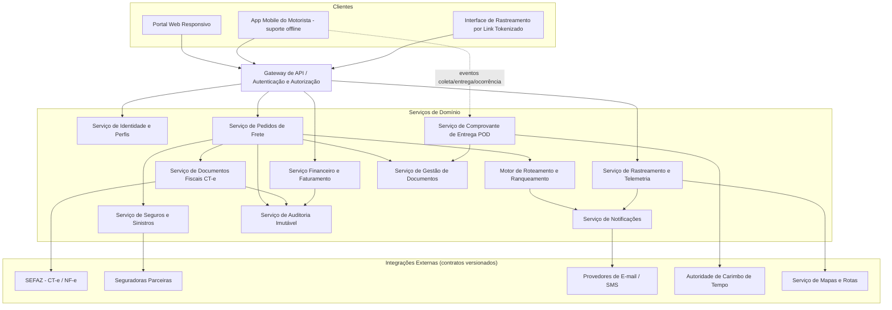
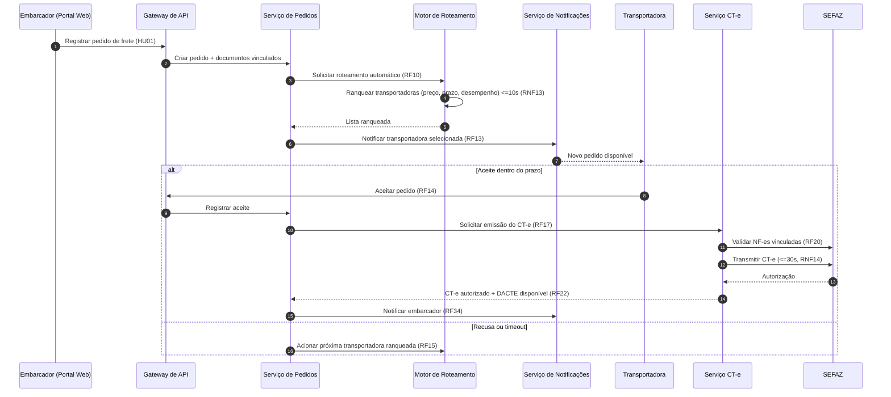
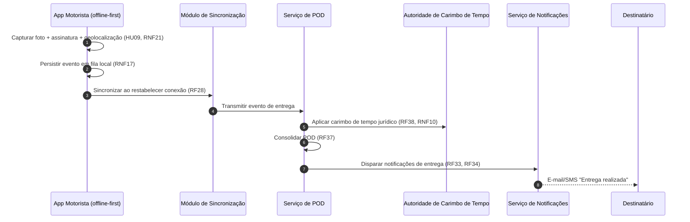

# Relatório Técnico de Arquitetura de Software
## Plataforma de Logística e Rastreamento de Cargas (G04)

---

## 1. Identificação das HUs

| HU | Perfil | Resumo | Requisitos Relacionados |
|----|--------|--------|------------------------|
| HU01 | Embarcador | Registrar pedido de frete com dados da carga e documentos | RF05, RF06, RF09, RF10 |
| HU02 | Embarcador | Selecionar transportadora ranqueada e contratar seguro | RF11, RF12, RF17, RF41 |
| HU03 | Embarcador | Acompanhar pedidos e receber POD | RF07, RF34, RF37, RF39 |
| HU04 | Embarcador | Abrir e acompanhar sinistro | RF42, RF43, RF44 |
| HU05 | Transportadora | Aceitar/recusar pedidos e gerenciar frota | RF03, RF13, RF14, RF15, RF35 |
| HU06 | Transportadora | Monitorar motoristas em tempo real | RF25, RF26, RF32, RNF16 |
| HU07 | Transportadora | Consultar demonstrativo de repasse | RF46, RF48 |
| HU08 | Motorista | Registrar coleta com evidências | RF24, RF26, RNF17 |
| HU09 | Motorista | Registrar entrega com assinatura digital | RF27, RF37, RF38, RF40, RNF17, RNF21 |
| HU10 | Motorista | Registrar ocorrência em trânsito | RF26, RF33, RF34, RF35 |
| HU11 | Destinatário | Rastrear carga por link sem cadastro | RF30, RF31, RF32, RNF05 |
| HU12 | Destinatário | Receber notificações por etapa | RF33, RNF05 |
| HU13 | Administrador | Monitorar SLA e acionar contingência | RF36, RNF25 |
| HU14 | Administrador | Painel financeiro consolidado | RF45–RF49 |

---

## 2. Diagramas de Arquitetura (Mermaid)

### 2.1 Diagrama de Componentes (visão macro)

### 2.2 Diagrama de Sequência — Fluxo Pedido → Roteamento → Aceite → CT-e

### 2.3 Diagrama de Sequência — Entrega Offline com POD

---

## 3. Decisões de Arquitetura

| ID | Decisão | Justificativa | Requisitos |
|----|---------|---------------|------------|
| AD01 | Arquitetura orientada a serviços com comunicação assíncrona por eventos para telemetria e notificações | Alto volume de geolocalização sem degradação; desacoplamento | RNF16, RF25, RF33–36 |
| AD02 | App do motorista com padrão **offline-first**: fila local de eventos com sincronização idempotente e resolução por timestamp do dispositivo | Nenhum evento pode ser perdido | RF28, RNF17 |
| AD03 | Armazenamento de geolocalização em repositório otimizado para séries temporais e consultas geoespaciais (categoria exigida literalmente pelo requisito) | RNF23, RF31, RF32 |
| AD04 | Camada de integração externa (SEFAZ, seguradoras, e-mail/SMS, carimbo de tempo) isolada por adaptadores com contratos versionados | Evolução independente de cada integração | RNF24 |
| AD05 | Emissão de CT-e com máquina de estados explícita (rascunho → transmitido → autorizado → cancelado/inutilizado) e modo de contingência com fila de sincronização posterior | RF17–RF21, RNF07, RNF08 |
| AD06 | Trilha de auditoria em repositório **append-only** com retenção ≥ 5 anos | Imutabilidade fiscal/financeira | RF04, RNF11 |
| AD07 | Link de rastreamento público via token único opaco, com escopo restrito ao frete e expiração após entrega | RNF05, RF30 |
| AD08 | Autorização baseada em papéis (RBAC) com filtragem de dados por vínculo ao frete (geolocalização visível apenas a autorizados) | RF02, RNF06 |
| AD09 | POD gerado como artefato imutável combinando assinatura, foto, geolocalização e carimbo de tempo de autoridade confiável | RF37–RF39, RNF10 |
| AD10 | Criptografia em repouso (AES-256) para dados financeiros, fiscais e de localização; TLS 1.2+ em trânsito | RNF01, RNF02 |
| AD11 | Motor de roteamento com critérios configuráveis e timeout/escalonamento automático (cascata de transportadoras) | RF10–RF16, RNF13 |
| AD12 | Painel de observabilidade expondo métricas operacionais (latência, taxa de aceite, saúde das integrações) | RNF25, HU13 |

---

## 4. Tabela de Componentes e Rastreabilidade

| Componente | Responsabilidade Principal | Comunica-se com | Origem (HU / Critério de Aceite) |
|---|---|---|---|
| Gateway de API | Autenticação (MFA quando aplicável), autorização RBAC, roteamento de requisições | Todos os serviços; clientes | RF02, RNF03, RNF04 |
| Serviço de Identidade e Perfis | Cadastro de usuários, vínculos transportadora↔motorista/veículo | Gateway, Auditoria | HU05 / RF01, RF03 |
| Serviço de Pedidos de Frete | Ciclo de vida do pedido, cancelamento configurável, visão consolidada | Roteamento, CT-e, Documentos, Notificações | HU01, HU03 / RF05–RF09 |
| Motor de Roteamento e Ranqueamento | Seleção automática, ranking multicritério, cascata em recusa/timeout, índice de desempenho | Pedidos, Notificações | HU02, HU05 / RF10–RF16, RNF13 |
| Serviço de Documentos Fiscais CT-e | Emissão, contingência, cancelamento/inutilização, DACTE, validação de NF-e | Adaptador SEFAZ, Auditoria | HU02 / RF17–RF22, RNF07–08, RNF14 |
| Serviço de Rastreamento e Telemetria | Ingestão de posições, histórico de eventos, ETA dinâmico, mapa | App Motorista, Notificações, Repositório geoespacial | HU06, HU11 / RF25, RF30–RF32, RNF15–16, RNF23 |
| Serviço de POD | Consolidar assinatura, foto, geolocalização; carimbo de tempo; recusa de recebimento | Autoridade de Timestamp, Documentos, Notificações | HU09 / RF37–RF40, RNF10 |
| Serviço de Seguros e Sinistros | Cotação/contratação por viagem, abertura e acompanhamento de sinistro | Adaptador de Seguradoras, Documentos, Notificações | HU02, HU04 / RF41–RF44 |
| Serviço Financeiro e Faturamento | Cálculo de frete, comissão, fatura, repasse, painel financeiro, exportação CSV/PDF | Pedidos, Auditoria | HU07, HU14 / RF45–RF49 |
| Serviço de Notificações | Orquestração multicanal (e-mail/SMS), preferências do destinatário, alertas de SLA | Provedores de mensageria, todos os serviços de domínio | HU10, HU12, HU13 / RF33–RF36 |
| Serviço de Auditoria Imutável | Log append-only de operações críticas, retenção ≥ 5 anos | Todos os serviços | RF04, RNF11 |
| Serviço de Gestão de Documentos | Armazenamento estruturado de NF-e, fotos, laudos, BO, DACTE, POD | Pedidos, POD, Sinistros | HU01, HU04 / RF09, RF44 |
| App Mobile do Motorista | Ordens do dia, coleta/entrega com evidências, ocorrências, rotas com múltiplas paradas, modo offline | Gateway, Módulo de Sincronização | HU08–HU10 / RF23–RF29, RNF17–19, RNF21 |
| Módulo de Sincronização Offline | Fila local durável, envio idempotente, reconciliação de eventos | App Motorista, serviços de domínio | HU09 / RF28, RNF17 |
| Interface de Rastreamento Público | Exibição de mapa, histórico e ETA via link tokenizado sem cadastro | Gateway, Rastreamento | HU11, HU12 / RF30–RF32, RNF05 |
| Painel de Monitoramento Operacional | SLA em risco, pedidos sem aceite, métricas operacionais, ação de reassignação | Rastreamento, Pedidos, Notificações | HU13 / RF36, RNF25 |

---

## 5. Bloqueios e Pendências

| ID | Tipo | Descrição | Ação Necessária |
|----|------|-----------|-----------------|
| BP01 | Pendência | Política de cancelamento "configurável" (RF08) sem regras definidas (janelas, multas, estados permitidos) | Definir matriz de regras com o negócio |
| BP02 | Bloqueio | Escolha da Autoridade de Carimbo de Tempo homologada e nível de assinatura (simples/avançada/qualificada) para a Lei 14.063/2020 | Parecer jurídico antes da implementação do POD |
| BP03 | Pendência | Contratos das seguradoras parceiras (RF41–43) não especificados — formatos, SLAs e webhooks desconhecidos | Levantar contratos de integração |
| BP04 | Pendência | Fórmula de cálculo do índice de desempenho (RF16) e pesos padrão do ranking não definidos | Definição de produto |
| BP05 | Pendência | Regras de contingência de CT-e (RF19): modalidades (EPEC, FS-DA?) não explicitadas | Alinhar com requisitos fiscais |
| BP06 | Pendência | Estratégia de detecção de conflitos na sincronização offline (eventos duplicados, relógio do dispositivo adulterado) | Definir política de idempotência e confiabilidade de timestamp |
| BP07 | Pendência | Regras de inadimplência (RF49) e meios de cobrança/pagamento não especificados | Definição financeira |

---

## 6. Cobertura de Requisitos

| Bloco | Requisitos | Cobertura | Componentes |
|-------|-----------|-----------|-------------|
| Usuários e Acesso | RF01–RF04 | ✅ Total | Identidade, Gateway, Auditoria |
| Pedidos de Frete | RF05–RF09 | ✅ Total | Pedidos, Documentos |
| Roteamento | RF10–RF16 | ✅ Total | Motor de Roteamento, Notificações |
| CT-e | RF17–RF22 | ✅ Total (contingência pendente de detalhamento — BP05) | Serviço CT-e, Adaptador SEFAZ |
| Operação Motorista | RF23–RF29 | ✅ Total | App Motorista, Sincronização, Rastreamento |
| Rastreamento | RF30–RF32 | ✅ Total | Rastreamento, Interface Pública |
| Notificações | RF33–RF36 | ✅ Total | Notificações, Painel Operacional |
| POD | RF37–RF40 | ✅ Total (dependente de BP02) | Serviço de POD |
| Seguros/Sinistros | RF41–RF44 | ⚠️ Parcial (BP03) | Seguros, Documentos |
| Financeiro | RF45–RF49 | ✅ Total (BP07 para inadimplência) | Financeiro |
| RNFs Segurança | RNF01–RNF06 | ✅ Endereçados (AD07, AD08, AD10) | Gateway, todos |
| RNFs Conformidade | RNF07–RNF11 | ⚠️ Parcial (BP02, BP05) | CT-e, POD, Auditoria |
| RNFs Desempenho/Disponibilidade | RNF12–RNF17 | ✅ Endereçados (AD01, AD02, AD03) | Roteamento, Rastreamento, Sincronização |
| RNFs Usabilidade/Compatibilidade | RNF18–RNF21 | ✅ Endereçados | App Motorista, Portal Web |
| RNFs Infra/Dados | RNF22–RNF25 | ✅ Endereçados (AD03, AD04, AD12) | Todos |

**Resumo: 49/49 RFs e 25/25 RNFs mapeados; 4 itens com dependências externas registradas na Seção 5.**

---

## 7. Gap Analysis

| # | Lacuna | Impacto Arquitetural | Ação Recomendada |
|---|--------|----------------------|------------------|
| 1 | Ausência de definição sobre **pagamento do frete** (só há faturamento/repasse; não há requisito de gateway de pagamento ou fluxo de quitação) | Indefinição de novo domínio (Pagamentos) que impactaria Financeiro e integrações | Confirmar com o negócio se cobrança é externa; se interna, criar serviço dedicado |
| 2 | RF32/HU11 exigem **ETA dinâmico**, mas não há algoritmo/fonte de dados de trânsito especificada | Necessidade de serviço externo de rotas com contrato versionado; impacto em custo e latência | Especificar precisão esperada do ETA e frequência de recálculo |
| 3 | Semântica de "tempo real" ambígua entre RNF15 (30s) e painéis de HU06/HU13 (sem SLA) | Dimensionamento do pipeline de eventos e da camada de push aos painéis | Padronizar SLAs de propagação por interface |
| 4 | **Reassignação manual** (HU13) pode conflitar com CT-e já emitido | Necessidade de fluxo de cancelamento/substituição de CT-e acoplado à reassignação | Modelar máquina de estados conjunta pedido↔documento fiscal |
| 5 | Falta especificação de **retenção e anonimização LGPD** (prazo de guarda de geolocalização, direito de eliminação vs. retenção fiscal de 5 anos) | Conflito potencial entre RNF09 e RNF11; exige segregação de dados pessoais e fiscais | Elaborar matriz de retenção por categoria de dado com DPO |
| 6 | Modo offline não define **limite de armazenamento local** nem comportamento em dispositivo cheio/corrompido | Risco de perda de eventos, violando RNF17 | Definir capacidade mínima, compactação de mídia e alertas ao motorista |
| 7 | Contato direto com motorista (HU06) e comunicação pelo painel (HU13) sem canal definido (chat? telefonia?) | Possível novo componente de comunicação em tempo real | Especificar canal e requisitos de registro/auditoria dessas comunicações |
| 8 | Critérios de **habilitação de transportadora** por tipo de carga (RF10) — ex.: carga perigosa exige certificações — não modelados | Estrutura de cadastro de capacidades/certificações da transportadora | Definir taxonomia de tipos de carga e requisitos de habilitação |
| 9 | Assinatura digital do remetente/destinatário: não definido se é assinatura manuscrita capturada ou certificado digital | Diferença significativa de arquitetura (captura de imagem vs. infraestrutura de chaves) | Resolver junto com BP02 (validade jurídica) |
| 10 | Ausência de requisitos de **testes de contingência/DR** além de backup (RNF22) | Estratégia de recuperação não coberta para atingir 99,5% (RNF12) | Definir RTO e plano de recuperação de desastres |

---
*Fim do Relatório Canônico — AI4ES Time 2.*