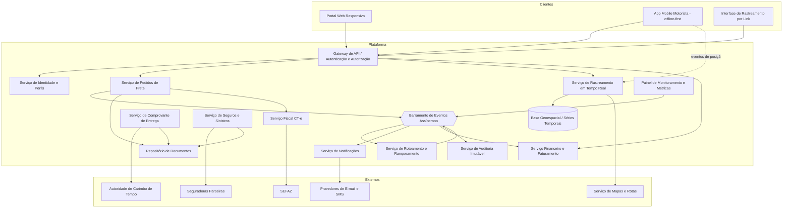
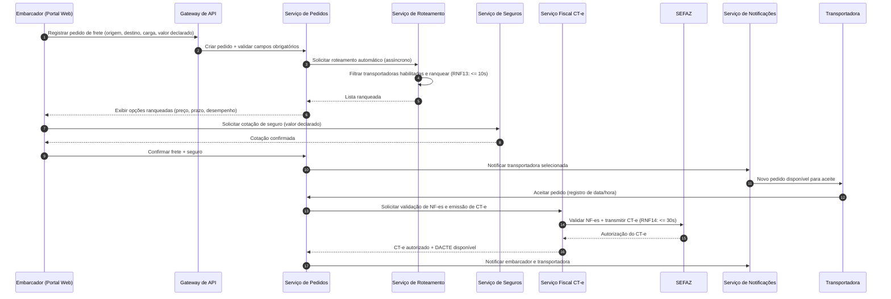
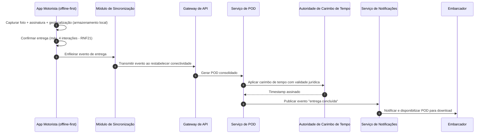

# Relatório Técnico de Arquitetura de Software
## Plataforma de Gestão de Transporte de Cargas (G04)

---

## 1. Identificação das HUs

| HU | Perfil | Título | Requisitos Vinculados |
|----|--------|--------|----------------------|
| HU01 | Embarcador | Registrar pedido de frete | RF05, RF06, RF09, RF10, RF13 |
| HU02 | Embarcador | Selecionar transportadora e contratar seguro | RF11, RF12, RF17, RF41 |
| HU03 | Embarcador | Acompanhar pedidos e receber POD | RF07, RF34, RF37, RF39 |
| HU04 | Embarcador | Abrir sinistro por avaria ou extravio | RF42, RF43, RF44 |
| HU05 | Transportadora | Aceitar pedidos e gerenciar frota | RF03, RF13, RF14, RF15 |
| HU06 | Transportadora | Acompanhar motoristas em tempo real | RF25, RF26, RNF06, RNF16 |
| HU07 | Transportadora | Consultar demonstrativo de repasse | RF46, RF48 |
| HU08 | Motorista | Executar coleta com evidências | RF23, RF24, RF26, RF28 |
| HU09 | Motorista | Registrar entrega com assinatura digital | RF27, RF37, RF38, RF40, RNF17, RNF21 |
| HU10 | Motorista | Registrar ocorrência durante transporte | RF26, RF33, RF34, RF35 |
| HU11 | Destinatário | Rastrear carga sem cadastro | RF30, RF31, RF32, RNF05 |
| HU12 | Destinatário | Receber notificações por etapa | RF33 |
| HU13 | Administrador | Monitorar SLA e contingência | RF36, RNF25 |
| HU14 | Administrador | Painel financeiro da plataforma | RF45, RF46, RF47, RF49 |

---

## 2. Diagramas de Arquitetura (Mermaid)

### 2.1 Diagrama de Componentes (Visão Lógica)

### 2.2 Diagrama de Sequência — Fluxo de Frete (HU01, HU02, HU05)

### 2.3 Diagrama de Sequência — Entrega Offline e POD (HU09)

---

## 3. Decisões de Arquitetura

| ID | Decisão | Justificativa | Requisitos |
|----|---------|---------------|------------|
| DA01 | Arquitetura orientada a serviços com comunicação assíncrona via barramento de eventos | Desacopla roteamento, notificações, financeiro e auditoria; suporta alto volume de eventos de geolocalização | RNF16, RF33–36 |
| DA02 | Serviço de rastreamento dedicado com armazenamento otimizado para séries temporais e consultas geoespaciais | Requisito explícito de infraestrutura e latência de atualização ≤ 30s | RNF15, RNF23 |
| DA03 | App mobile do motorista com padrão offline-first (fila local persistente + sincronização idempotente) | Nenhum evento pode ser perdido; contingência de conectividade em rodovias | RF28, RNF17 |
| DA04 | Integrações externas (SEFAZ, seguradoras, mensageria) encapsuladas em adaptadores com contrato versionado (padrão anti-corruption layer) | Evolução independente de cada integração | RNF24, RF17–21, RF41 |
| DA05 | Emissão de CT-e com modo de contingência: emissão local + fila de sincronização posterior com a SEFAZ | Requisito explícito de contingência fiscal | RF19 |
| DA06 | Auditoria em repositório imutável (append-only) com retenção mínima de 5 anos | Trilha fiscal/financeira conforme CTN | RF04, RNF11 |
| DA07 | Autorização baseada em perfis (RBAC) com MFA para perfis críticos e tokens de curta duração no mobile | Segregação por perfil e segurança de sessão | RF02, RNF03, RNF04 |
| DA08 | Link de rastreamento com token único opaco, escopo limitado ao frete e expiração após a entrega | Acesso sem cadastro sem vazamento de dados de terceiros | RF30, RNF05 |
| DA09 | Cálculo financeiro (frete, comissão, repasse, fatura) em serviço isolado alimentado por eventos de conclusão de frete | Consistência contábil e conciliação | RF45–49 |
| DA10 | Criptografia em repouso (AES-256) para dados financeiros, fiscais e de localização; TLS 1.2+ em trânsito | Requisitos explícitos de segurança | RNF01, RNF02 |
| DA11 | POD com carimbo de tempo emitido por autoridade externa qualificada | Validade jurídica (Lei nº 14.063/2020) | RF38, RNF10 |
| DA12 | Máquina de estados formal do frete (registrado → roteado → aceito → coletado → em trânsito → saiu para entrega → entregue/recusado) publicando eventos de transição | Base única para rastreamento, notificações, SLA e financeiro | RF07, RF31, RF36 |

---

## 4. Tabela de Componentes e Rastreabilidade

| Componente | Responsabilidade Principal | Comunica-se com | Origem (HU / Critério de Aceite) |
|---|---|---|---|
| Gateway de API | Ponto único de entrada, TLS, autenticação, roteamento de requisições | Todos os serviços internos, clientes | Transversal (RNF01, RF02) |
| Serviço de Identidade e Perfis | Cadastro de usuários, RBAC, MFA, sessões mobile, vínculo motorista/veículo/transportadora | Gateway, Auditoria | HU05 (gerenciar frota), RF01–03, RNF03/04 |
| Serviço de Pedidos de Frete | Ciclo de vida do pedido (máquina de estados), cancelamento, visão consolidada | Roteamento, CT-e, Documentos, Barramento | HU01 (campos obrigatórios), HU03 (visão consolidada), RF05–09 |
| Serviço de Roteamento e Ranqueamento | Filtragem de transportadoras habilitadas, ranqueamento configurável, fallback por recusa/timeout, índice de desempenho | Pedidos, Notificações, Barramento | HU02 (opções ranqueadas), HU05 (prazo de aceite), RF10–16 |
| Serviço Fiscal CT-e | Emissão, transmissão, contingência, cancelamento/inutilização de CT-e, validação de NF-e, DACTE | Adaptador SEFAZ, Pedidos, Documentos | HU02 (confirmação dispara CT-e), RF17–22, RNF07/08 |
| Serviço de Rastreamento | Ingestão de posições, cálculo de previsão de entrega, histórico de eventos, mapa em tempo real | Base geoespacial, Serviço de Mapas, Gateway | HU06 (mapa por motorista), HU11 (mapa + ETA dinâmico), RF25/30–32 |
| Serviço de POD | Consolidação de assinatura, foto, geolocalização; carimbo de tempo; registro de recusa | Autoridade de Carimbo de Tempo, Documentos, Notificações | HU09 (POD em 60s, recusa com evidências), RF37–40 |
| Serviço de Seguros e Sinistros | Cotação/contratação por viagem, abertura e acompanhamento de sinistro | Adaptadores de Seguradoras, Documentos, Notificações | HU02 (seguro no fluxo), HU04 (vínculo com ocorrências), RF41–44 |
| Serviço Financeiro | Cálculo de frete, comissão, fatura, demonstrativo de repasse, painel financeiro, exportação CSV/PDF | Barramento, Auditoria, Gateway | HU07 (demonstrativo detalhado), HU14 (painel), RF45–49 |
| Serviço de Notificações | Envio multicanal (e-mail/SMS/push), preferências do destinatário, alertas de SLA | Provedores de mensageria, Barramento | HU12 (preferências), HU10 (alerta imediato), RF33–36 |
| Repositório de Documentos | Armazenamento estruturado de NF-e, DACTE, fotos, laudos, PODs com criptografia em repouso | Pedidos, POD, Sinistros, CT-e | HU04 (anexos), RF09, RF44, RNF02 |
| Serviço de Auditoria | Trilha imutável de operações críticas e movimentações financeiras/fiscais (retenção ≥ 5 anos) | Barramento (consumidor universal) | RF04, RNF11 |
| App Mobile Motorista | Ordens do dia, coleta/entrega com evidências, ocorrências, rotas multi-parada, modo offline completo | Gateway, Rastreamento (posições), Módulo de Sincronização | HU08, HU09, HU10, RF23–29, RNF17–19, RNF21 |
| Módulo de Sincronização Offline | Fila local persistente, reenvio idempotente, ordenação de eventos | App Mobile, Gateway | HU09 (fluxo offline completo), RF28, RNF17 |
| Interface de Rastreamento por Link | Página pública tokenizada com mapa, histórico e ETA; gestão de preferências de notificação | Gateway, Rastreamento, Notificações | HU11, HU12, RF30–32, RNF05 |
| Painel de Monitoramento e SLA | Fretes com SLA em risco, pedidos sem aceite, reassignação manual, métricas operacionais | Barramento, Roteamento, Notificações | HU13, RF36, RNF25 |

---

## 5. Bloqueios e Pendências

| ID | Tipo | Descrição | Impacto |
|----|------|-----------|---------|
| BP01 | Pendência | Definição da política de cancelamento configurável (RF08): janelas, penalidades, quem configura | Bloqueia regras do Serviço de Pedidos |
| BP02 | Pendência | Fórmula do índice de desempenho da transportadora (RF16): pesos de prazo, ocorrências e volume | Bloqueia ranqueamento (RF11/12) |
| BP03 | Bloqueio | Escolha da autoridade de carimbo de tempo e nível de assinatura (simples/avançada/qualificada) conforme Lei 14.063/2020 | Validade jurídica do POD (RNF10) |
| BP04 | Pendência | Contratos das APIs das seguradoras parceiras (cotação, sinistro, callbacks de status) não especificados | Bloqueia RF41–43 |
| BP05 | Pendência | Regras tributárias da fatura consolidada (RF47): impostos discriminados e regimes fiscais dos envolvidos | Bloqueia Serviço Financeiro |
| BP06 | Pendência | Intervalo padrão e política de configuração da geolocalização (RF25) e limites de retenção de posições (LGPD) | Impacta dimensionamento e conformidade |
| BP07 | Pendência | Definição de "inadimplência" (RF49): meios de pagamento e ciclo de cobrança não constam nos requisitos | Painel financeiro incompleto |
| BP08 | Pendência | Estratégia de resolução de conflitos na sincronização offline (eventos fora de ordem, duplicidades) | Risco de inconsistência de estado do frete |

---

## 6. Cobertura de Requisitos

| Grupo | Requisitos | Status | Componente Responsável |
|-------|-----------|--------|------------------------|
| Usuários e Acesso | RF01–RF04 | Coberto | Identidade e Perfis, Auditoria |
| Pedidos de Frete | RF05–RF09 | Coberto (RF08 pendente de política — BP01) | Serviço de Pedidos, Documentos |
| Roteamento | RF10–RF16 | Coberto (RF16 pendente de fórmula — BP02) | Serviço de Roteamento |
| CT-e | RF17–RF22 | Coberto | Serviço Fiscal CT-e |
| Operação Motorista | RF23–RF29 | Coberto | App Mobile, Sincronização Offline |
| Rastreamento | RF30–RF32 | Coberto | Serviço de Rastreamento, Interface por Link |
| Notificações | RF33–RF36 | Coberto | Serviço de Notificações, Painel de SLA |
| POD | RF37–RF40 | Coberto (BP03 em aberto) | Serviço de POD |
| Seguros/Sinistros | RF41–RF44 | Coberto (BP04 em aberto) | Serviço de Seguros e Sinistros |
| Financeiro | RF45–RF49 | Coberto (BP05, BP07 em aberto) | Serviço Financeiro |
| Segurança | RNF01–RNF06 | Coberto | Gateway, Identidade, Criptografia em repouso |
| Conformidade | RNF07–RNF11 | Coberto (RNF10 depende de BP03) | CT-e, POD, Auditoria |
| Disponibilidade/Desempenho | RNF12–RNF17 | Coberto | Barramento, Rastreamento, Sincronização |
| Usabilidade/Compatibilidade | RNF18–RNF21 | Coberto (design de UI mobile a detalhar) | App Mobile, Portal Web |
| Infraestrutura/Dados | RNF22–RNF25 | Coberto | Base geoespacial, Adaptadores, Monitoramento |

**Cobertura: 49/49 RFs e 25/25 RNFs endereçados arquiteturalmente; 8 pendências de especificação registradas.**

---

## 7. Gap Analysis

| # | Lacuna Identificada | Impacto Arquitetural | Ação Recomendada |
|---|---------------------|----------------------|------------------|
| G01 | Ausência de fluxo de pagamento (como o embarcador paga e como a transportadora recebe) — apenas cálculo e demonstrativos são especificados | Indefinição sobre integração com meios de pagamento, conciliação e escrow; afeta definição de "inadimplência" (RF49) | Levantar requisitos de pagamento com o negócio antes de fechar o Serviço Financeiro |
| G02 | Não há especificação de reentrega/redespacho após tentativa sem sucesso ou recusa de recebimento (RF40) | A máquina de estados do frete precisa de estados/transições adicionais; impacta ETA, SLA e notificações | Definir política de reentrega e incorporar à máquina de estados (DA12) |
| G03 | Ausência de requisitos para MDF-e e demais documentos fiscais correlatos ao transporte rodoviário | Possível lacuna regulatória; adaptador fiscal pode exigir expansão | Validar escopo fiscal com especialista tributário; projetar o Serviço Fiscal com extensibilidade |
| G04 | Modo offline do motorista não define resolução de conflitos e ordenação de eventos (ex.: entrega sincronizada antes da coleta) | Risco de estados inconsistentes e notificações incorretas | Especificar protocolo de sincronização com identificadores idempotentes e ordenação causal (BP08) |
| G05 | LGPD citada genericamente (RNF09): sem definição de retenção de geolocalização, consentimento do motorista, anonimização e direitos do titular | Risco de conformidade; impacta modelagem da base geoespacial e políticas de expurgo | Realizar mapeamento de dados pessoais (RIPD) e definir políticas de retenção/expurgo por tipo de dado |
| G06 | Critérios de "SLA em risco" (RF36/HU13) não formalizados (como calcular risco a partir de posição + prazo) | Motor de predição de atraso sem regras definidas | Definir algoritmo/heurística de risco (ex.: ETA vs. prazo com margem) junto ao negócio |
| G07 | Contato direto com o motorista pela plataforma (HU06) sem requisito funcional correspondente | Funcionalidade de comunicação (chat/chamada) não arquitetada | Formalizar como novo RF e avaliar canal de comunicação in-app |
| G08 | Multi-tenancy e isolamento de dados entre transportadoras/embarcadores não especificado | Decisão estrutural de modelo de dados e autorização | Definir estratégia de isolamento lógico por tenant no design detalhado |
| G09 | Não há requisitos de reprocessamento/resiliência quando SEFAZ, seguradoras ou mensageria estiverem indisponíveis (além do CT-e em contingência) | Falhas em cascata podem violar RNF12 | Padronizar nos adaptadores: retentativas com backoff, filas de compensação e circuit breaking conceitual, com métricas expostas (RNF25) |
| G10 | Versionamento e ciclo de vida do token de rastreamento em cenários de reentrega ou frete prolongado (RNF05: expira após entrega) | Token pode expirar/ser reativado incorretamente | Especificar regras de renovação e revogação do token vinculadas à máquina de estados do frete |

---

*Fim do Relatório Canônico — AI4ES Time 2.*