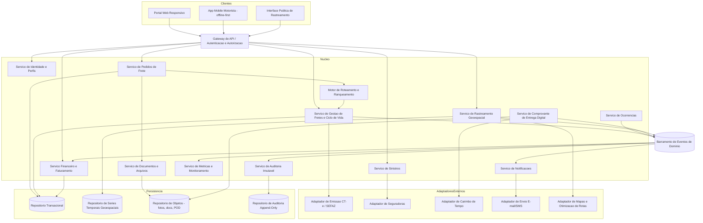
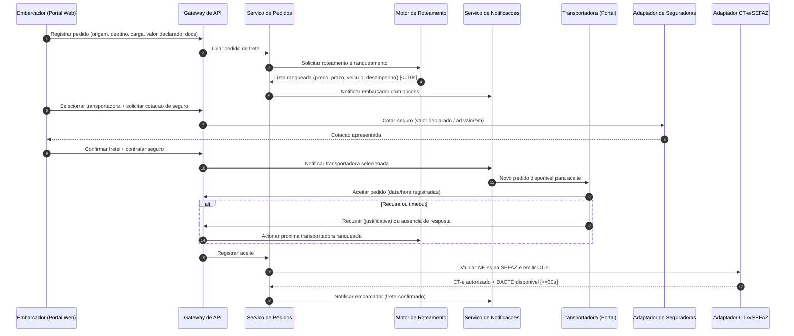
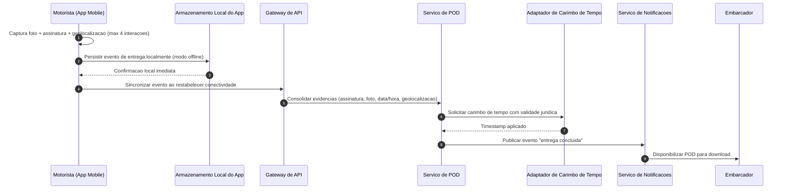

# Relatório Técnico de Arquitetura de Software
## Plataforma de Gestão de Transporte de Cargas (G04)

---

## 1. Identificação das HUs

| HU | Perfil | Resumo | RFs Relacionados | RNFs Relacionados |
|----|--------|--------|------------------|-------------------|
| HU01 | Embarcador | Registrar pedido de frete com carga, documentos e valor declarado | RF05, RF06, RF09, RF10, RF13 | RNF01, RNF13 |
| HU02 | Embarcador | Selecionar transportadora ranqueada e contratar seguro em fluxo único | RF11, RF12, RF17, RF41 | RNF13, RNF24 |
| HU03 | Embarcador | Acompanhar fretes consolidados e receber POD | RF07, RF34, RF37, RF39 | RNF12 |
| HU04 | Embarcador | Abrir e acompanhar sinistro vinculado ao frete | RF42, RF43, RF44 | RNF24 |
| HU05 | Transportadora | Receber, aceitar/recusar pedidos e gerenciar frota | RF03, RF13, RF14, RF15, RF35 | RNF13 |
| HU06 | Transportadora | Monitorar motoristas em tempo real e ocorrências | RF25, RF26, RF32 | RNF06, RNF15, RNF16 |
| HU07 | Transportadora | Consultar demonstrativo de repasse financeiro | RF46, RF48 | RNF02, RNF11 |
| HU08 | Motorista | Registrar coleta com evidências (fotos, assinatura, volumes) | RF23, RF24, RF26 | RNF17, RNF18, RNF19 |
| HU09 | Motorista | Registrar entrega com assinatura digital e POD, offline-first | RF27, RF28, RF37, RF38, RF40 | RNF10, RNF17, RNF21 |
| HU10 | Motorista | Registrar ocorrências categorizadas com fotos | RF26, RF33, RF34, RF35 | RNF17 |
| HU11 | Destinatário | Rastrear carga por link sem cadastro, com ETA dinâmico | RF30, RF31, RF32 | RNF05, RNF12, RNF15 |
| HU12 | Destinatário | Receber notificações por e-mail/SMS e gerenciar preferências | RF33 | RNF05, RNF09 |
| HU13 | Administrador | Monitorar SLA de fretes e acionar contingência/reassignação | RF15, RF36 | RNF12, RNF25 |
| HU14 | Administrador | Painel financeiro consolidado com filtros e exportação | RF46, RF47, RF49 | RNF02, RNF11 |

---

## 2. Diagramas de Arquitetura (Mermaid)

### 2.1 Diagrama de Componentes (Visão Lógica)

### 2.2 Diagrama de Sequência — HU01/HU02: Pedido, Roteamento, Aceite e Emissão de CT-e

### 2.3 Diagrama de Sequência — HU09: Entrega Offline com POD e Carimbo de Tempo

---

## 3. Decisões de Arquitetura

| ID | Decisão | Justificativa | Requisitos Suportados |
|----|---------|---------------|-----------------------|
| DA01 | **Arquitetura orientada a eventos com barramento de domínio** — mudanças de estado do frete (coleta, trânsito, entrega, ocorrência) são publicadas como eventos consumidos por notificações, financeiro, auditoria e métricas. | Desacopla produtores e consumidores; suporta alto volume de geolocalização e múltiplos assinantes por evento. | RF33–RF36, RF46, RNF16, RNF25 |
| DA02 | **App mobile offline-first** — todos os eventos operacionais (coleta, entrega, ocorrência, posições) são gravados localmente com fila de sincronização idempotente e resolução por identificadores únicos gerados no dispositivo. | Garante que nenhum evento seja perdido por falta de conectividade. | RF28, RNF17, RNF21 |
| DA03 | **Repositório especializado para geolocalização** — dados de posição segregados em armazenamento otimizado para séries temporais e consultas geoespaciais, com canal de leitura em tempo quase real para o rastreamento. | Volume massivo de escrita e consultas espaciais têm padrão distinto do transacional. | RF25, RF30–RF32, RNF15, RNF16, RNF23 |
| DA04 | **Adaptadores externos com contrato versionado (ports & adapters)** — SEFAZ/CT-e, seguradoras, carimbo de tempo, mensageria e mapas ficam atrás de interfaces abstratas versionadas. | Permite evolução independente de cada integração e troca de fornecedor sem impacto no núcleo. | RF17–RF21, RF41–RF43, RNF07, RNF24 |
| DA05 | **Emissão de CT-e com máquina de estados e modo contingência** — o adaptador CT-e mantém fila de emissões pendentes e reconcilia com a SEFAZ quando a conectividade retorna. | Continuidade operacional exigida pela legislação. | RF18, RF19, RF21, RNF14 |
| DA06 | **Trilha de auditoria append-only** — eventos críticos (financeiros, fiscais, acessos) gravados em repositório imutável com retenção mínima de 5 anos. | Conformidade fiscal (CTN) e rastreabilidade de operações críticas. | RF04, RNF11 |
| DA07 | **Autorização baseada em perfil e escopo por frete** — controle de acesso centralizado no gateway, com regras que restringem geolocalização apenas a usuários com permissão sobre o frete; link de rastreamento via token único com expiração. | Segurança e privacidade dos dados de localização. | RF02, RF30, RNF03–RNF06, RNF09 |
| DA08 | **POD como agregado imutável com carimbo de tempo** — o comprovante é gerado uma única vez, consolidando evidências, e recebe timestamp jurídico no momento da assinatura; alterações posteriores são vedadas. | Validade jurídica conforme Lei nº 14.063/2020. | RF37–RF40, RNF10 |
| DA09 | **Motor de roteamento como componente isolado com critérios configuráveis** — ranqueamento parametrizável (preço, prazo, veículo, desempenho) e escalonamento automático em recusa/timeout. | Regras de negócio voláteis isoladas; SLA de 10s. | RF10–RF16, RNF13 |
| DA10 | **Criptografia em repouso (AES-256) e em trânsito (TLS 1.2+)** aplicada por política transversal aos dados financeiros, fiscais e de localização. | Requisito literal de segurança. | RNF01, RNF02 |

---

## 4. Tabela de Componentes e Rastreabilidade

| Componente | Responsabilidade Principal | Comunica-se com | Origem (HU / Critério de Aceite) |
|------------|---------------------------|-----------------|----------------------------------|
| Gateway de API / Autenticação | Roteamento de requisições, autenticação (MFA, tokens de sessão, tokens de rastreamento) e autorização por perfil | Todos os serviços de núcleo, clientes | HU11 (link com token único); RF02; RNF03–RNF05 |
| Serviço de Identidade e Perfis | Cadastro de usuários, perfis, vínculo transportadora↔motoristas/veículos | Gateway, Auditoria | RF01, RF03; HU05 (gerenciar frota) |
| Serviço de Pedidos de Frete | Ciclo de vida do pedido (criação, cancelamento, documentos, valor declarado) | Motor de Roteamento, Documentos, Barramento | HU01 (campos obrigatórios, upload de docs); RF05–RF09 |
| Motor de Roteamento e Ranqueamento | Seleção e ranqueamento de transportadoras; escalonamento em recusa/timeout; índice de desempenho | Pedidos, Fretes, Notificações | HU02 (opções com preço/prazo/desempenho); RF10–RF16; RNF13 |
| Serviço de Gestão de Fretes | Máquina de estados do frete (aceito → coleta → trânsito → entrega), SLA e prazos | Barramento, Adaptador CT-e, Roteamento | HU03, HU05, HU13; RF07, RF14, RF36 |
| Adaptador CT-e / SEFAZ | Emissão, transmissão, contingência, cancelamento/inutilização de CT-e; validação de NF-e; DACTE | Fretes, Repositório de Objetos | HU02 (confirmação dispara CT-e); RF17–RF22; RNF07, RNF08, RNF14 |
| Serviço de Rastreamento Geoespacial | Ingestão de posições, cálculo de ETA dinâmico, consultas em tempo real | App Motorista, Repositório Geoespacial, Adaptador de Mapas | HU06, HU11 (mapa + ETA recalculado); RF25, RF32; RNF15, RNF16, RNF23 |
| Serviço de Ocorrências | Registro categorizado de ocorrências com fotos e disparo de alertas | Barramento, Documentos | HU10 (lista predefinida + fotos + notificação imediata); RF26, RF40 |
| Serviço de POD | Consolidação de evidências, carimbo de tempo, geração e disponibilização do comprovante imutável | Adaptador de Carimbo de Tempo, Repositório de Objetos, Notificações | HU09 (POD em ≤60s, fluxo offline); RF37–RF40; RNF10 |
| Serviço de Documentos e Arquivos | Upload, versionamento e acesso controlado a NF-es, fichas, laudos, fotos | Pedidos, Sinistros, Repositório de Objetos | HU01, HU04 (anexos comprobatórios); RF09, RF44 |
| Serviço de Sinistros | Abertura, vinculação a frete/ocorrências, acompanhamento junto à seguradora | Adaptador de Seguradoras, Documentos, Notificações | HU04 (formulário vinculado + notificação de status); RF42–RF44 |
| Adaptador de Seguradoras | Cotação, contratação e acompanhamento de sinistro via contratos versionados | Sinistros, Pedidos | HU02 (contratar seguro no fluxo); RF41, RF43; RNF24 |
| Serviço Financeiro e Faturamento | Cálculo de frete, retenção de comissão, faturas, demonstrativos de repasse, painel financeiro, exportação CSV/PDF | Barramento, Auditoria | HU07 (demonstrativo com valores e filtros), HU14; RF45–RF49 |
| Serviço de Notificações | Orquestração multicanal (e-mail/SMS/push), preferências do destinatário | Adaptador de Mensageria, Barramento | HU12 (eventos e preferências); RF33–RF36 |
| Serviço de Auditoria Imutável | Trilha append-only de operações críticas, financeiras e fiscais (retenção ≥5 anos) | Barramento, Repositório de Auditoria | RF04; RNF11 |
| Serviço de Métricas e Monitoramento | Métricas operacionais (latência de roteamento, taxa de aceite, disponibilidade de integrações), painel de SLA | Barramento, Painel do Administrador | HU13 (fretes com SLA em risco); RNF12, RNF25 |
| App Mobile do Motorista | Ordens do dia, coleta/entrega com evidências, ocorrências, rotas com múltiplas paradas, operação offline-first | Gateway, Armazenamento local | HU08, HU09, HU10; RF23–RF29; RNF17–RNF19, RNF21 |
| Interface Pública de Rastreamento | Visualização por link tokenizado: mapa, histórico, ETA, preferências de notificação | Gateway, Rastreamento, Notificações | HU11, HU12; RF30–RF32; RNF05 |
| Adaptador de Mapas e Rotas | Geocodificação, otimização de rotas multi-parada, cálculo de ETA | Rastreamento, App Motorista | HU09/RF29, RF32 |
| Adaptador de Carimbo de Tempo | Aplicação de timestamp com validade jurídica | Serviço de POD | RF38; RNF10 |

---

## 5. Bloqueios e Pendências

| # | Tipo | Descrição | Impacto | Ação Sugerida |
|---|------|-----------|---------|---------------|
| B01 | Pendência de negócio | Política de cancelamento "configurável" (RF08) sem regras definidas (janelas, multas, quem configura). | Modelagem do fluxo de cancelamento e financeiro. | Definir matriz de políticas com o Product Owner. |
| B02 | Pendência regulatória | Definição de qual provedor/nível de assinatura eletrônica (simples/avançada/qualificada) atende a Lei nº 14.063/2020 para o POD. | Escolha do mecanismo de carimbo de tempo e assinatura. | Consultoria jurídica antes do design detalhado do POD. |
| B03 | Pendência de negócio | Fórmula do índice de desempenho da transportadora (RF16) não especificada (pesos, janela temporal, penalidades). | Núcleo do motor de ranqueamento. | Workshop com stakeholders para definir a fórmula versionável. |
| B04 | Pendência técnica | Estratégia de resolução de conflitos na sincronização offline (ex.: entrega registrada offline após cancelamento do frete no servidor). | Consistência de dados do app do motorista. | Definir política de reconciliação por precedência de evento com timestamp do dispositivo. |
| B05 | Pendência de negócio | Meios de pagamento e regras de inadimplência (RF49) não detalhados (não há requisito de gateway de pagamento). | Escopo do módulo financeiro. | Confirmar se cobrança é interna ou via integração futura. |
| B06 | Pendência técnica | Intervalos de geolocalização "configuráveis" (RF25) sem limites definidos — impacta bateria, volume de dados e custo. | Dimensionamento do pipeline geoespacial. | Definir faixas mínima/máxima e política adaptativa. |
| B07 | Pendência regulatória | Escopo LGPD: prazos de retenção e anonimização da geolocalização de motoristas após conclusão dos fretes. | Modelo de dados e políticas de descarte. | Elaborar RIPD (Relatório de Impacto) com o DPO. |

---

## 6. Cobertura de Requisitos

| Requisito | Coberto por | Status |
|-----------|-------------|--------|
| RF01–RF04 | Serviço de Identidade, Gateway, Auditoria | ✅ Coberto |
| RF05–RF09 | Serviço de Pedidos, Documentos | ✅ Coberto (RF08 com pendência B01) |
| RF10–RF16 | Motor de Roteamento e Ranqueamento | ✅ Coberto (RF16 com pendência B03) |
| RF17–RF22 | Adaptador CT-e/SEFAZ, Fretes | ✅ Coberto |
| RF23–RF29 | App Mobile do Motorista, Ocorrências, Adaptador de Mapas | ✅ Coberto |
| RF30–RF32 | Interface Pública de Rastreamento, Serviço Geoespacial | ✅ Coberto |
| RF33–RF36 | Serviço de Notificações, Métricas | ✅ Coberto |
| RF37–RF40 | Serviço de POD, Adaptador de Carimbo de Tempo | ✅ Coberto (com pendência B02) |
| RF41–RF44 | Serviço de Sinistros, Adaptador de Seguradoras | ✅ Coberto |
| RF45–RF49 | Serviço Financeiro | ✅ Coberto (RF49 com pendência B05) |
| RNF01–RNF06 | DA07, DA10, Gateway | ✅ Coberto |
| RNF07–RNF11 | DA04, DA05, DA06, DA08 | ✅ Coberto |
| RNF12–RNF17 | DA01, DA02, DA03, DA05 | ✅ Coberto |
| RNF18–RNF21 | App Mobile (design de UI), Portal Web responsivo | ✅ Coberto |
| RNF22–RNF25 | Persistência segregada, DA04, Serviço de Métricas, política de backup | ✅ Coberto |

**Cobertura: 49/49 RFs e 25/25 RNFs endereçados arquiteturalmente; 7 pendências de refinamento registradas na Seção 5.**

---

## 7. Gap Analysis

| # | Lacuna Identificada | Impacto Arquitetural | Ação Recomendada |
|---|---------------------|----------------------|------------------|
| G01 | **Ausência de requisito de pagamento/cobrança efetiva** — o sistema fatura e calcula repasse, mas não especifica como o dinheiro transita (embarcador → plataforma → transportadora). | Pode exigir integração futura com meios de pagamento e reconciliação bancária, afetando o Serviço Financeiro e a auditoria. | Confirmar escopo com o negócio; projetar o Financeiro com ponto de extensão para adaptador de pagamentos. |
| G02 | **Concorrência no aceite de fretes** — RF13/RF15 não definem se o pedido é ofertado a uma transportadora por vez ou simultaneamente a várias (risco de duplo aceite). | Necessidade de mecanismo de lock/reserva com timeout no Motor de Roteamento. | Especificar modelo de oferta (sequencial vs. broadcast) e projetar controle de exclusividade transacional. |
| G03 | **ETA dinâmico sem definição de algoritmo** — RF32/HU11 exigem previsão recalculada, mas sem critérios (trânsito, histórico, paradas restantes). | Determina a complexidade do Serviço Geoespacial e a dependência do adaptador de mapas. | Iniciar com heurística simples (distância/velocidade média) e evoluir; documentar tolerância de erro aceitável. |
| G04 | **Retenção e purga de mídia** — fotos de coleta/entrega/ocorrências/sinistros crescem indefinidamente; só o financeiro tem retenção definida (5 anos). | Dimensionamento do repositório de objetos e conformidade LGPD. | Definir política de ciclo de vida por tipo de evidência (jurídica vs. operacional). |
| G05 | **Comunicação transportadora↔motorista pela plataforma (HU06)** — "contatar diretamente" não especifica canal (chat, telefone, push). | Pode introduzir um componente de mensageria interna não previsto. | Refinar critério de aceite; avaliar se push/telefone atendem antes de projetar chat. |
| G06 | **Multitenancy e isolamento de dados** — transportadoras e embarcadores concorrentes coexistem; não há requisito explícito de isolamento além do RNF06 (geolocalização). | Modelo de autorização precisa de escopo por tenant em todos os serviços, não só no rastreamento. | Generalizar o modelo de permissão por frete/organização (DA07) para todos os agregados. |
| G07 | **Reassignação manual pelo administrador (HU13)** — efeitos colaterais não definidos (CT-e já emitido? seguro já contratado?). | Fluxos de compensação (saga) entre Fretes, CT-e e Seguros. | Mapear estados válidos para reassignação e projetar transações compensatórias. |
| G08 | **Degradação do rastreamento público sob pico** — RNF12/RNF16 exigem disponibilidade, mas não definem comportamento em degradação (ex.: última posição conhecida). | Estratégia de leitura em cache conceitual e fallback no Serviço Geoespacial. | Definir SLO de frescor dos dados e comportamento de fallback exibido ao destinatário. |

---

*Relatório gerado pelo Sistema Multi-Agente de Design de Software — AI4ES Time 2. Design tecnologicamente neutro: componentes descrevem responsabilidades e interfaces conceituais; a seleção de produtos e plataformas ocorrerá na fase de design detalhado, orientada pelas decisões e pendências aqui registradas.*