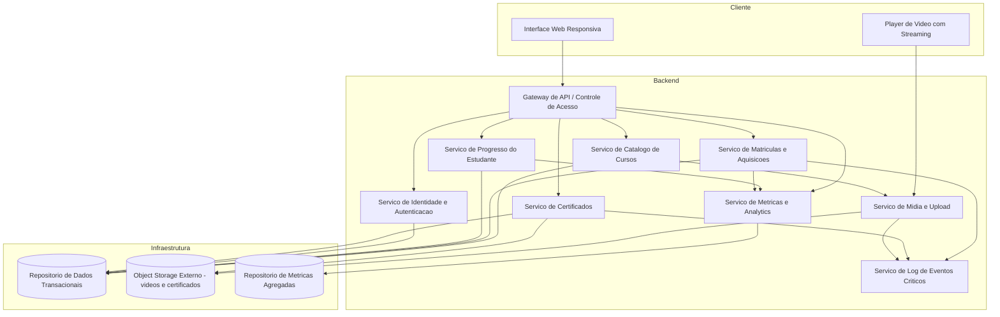
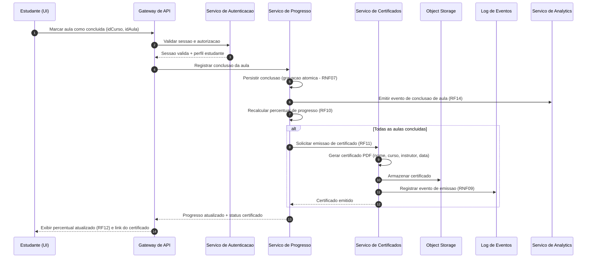
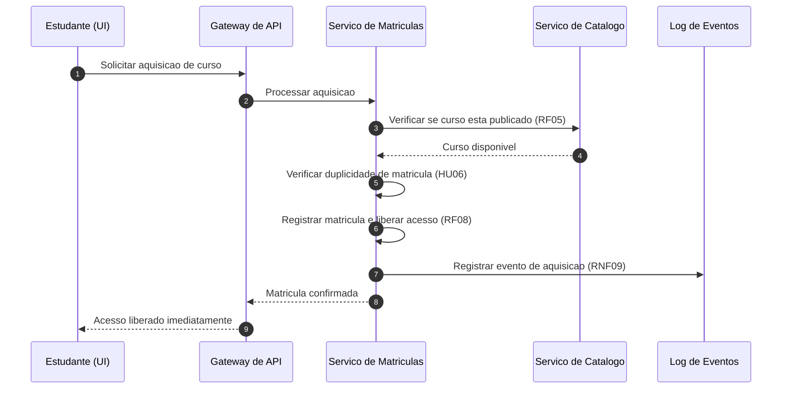

# Relatório Técnico de Arquitetura de Software
## Plataforma de Cursos Online (M01) — AI4ES Time 2

---

## 1. Identificação das HUs

| HU | Perfil | Título | RFs Relacionados | RNFs Relacionados |
|----|--------|--------|------------------|-------------------|
| HU01 | Instrutor | Criar e estruturar um curso | RF01, RF02, RF03, RF04 | RNF04, RNF09 |
| HU02 | Instrutor | Publicar e despublicar curso | RF05 | RNF01 |
| HU03 | Instrutor | Acompanhar matrículas do curso | RF13 | RNF06 |
| HU04 | Instrutor | Acompanhar engajamento por aula | RF14 | RNF06 |
| HU05 | Estudante | Cadastrar-se na plataforma | RF06, RF16 | RNF02 |
| HU06 | Estudante | Adquirir um curso | RF07, RF08 | RNF01, RNF09 |
| HU07 | Estudante | Assistir aulas e acompanhar progresso | RF09, RF10, RF12 | RNF03, RNF07, RNF10 |
| HU08 | Estudante | Receber e baixar certificado | RF11, RF15 | RNF09 |
| HU09 | Estudante | Acessar meus cursos adquiridos | RF08, RF12 | RNF05, RNF08 |

---

## 2. Diagramas de Arquitetura (Mermaid)

### 2.1 Diagrama de Componentes (Visão Lógica)

### 2.2 Diagrama de Sequência — Conclusão de Aula e Emissão de Certificado (HU07 + HU08)

### 2.3 Diagrama de Sequência — Aquisição de Curso (HU06)

---

## 3. Decisões de Arquitetura

| ID | Decisão | Justificativa | Requisitos |
|----|---------|---------------|------------|
| DA01 | Separação em serviços por domínio (Catálogo, Matrícula, Progresso, Certificado, Analytics) | Coesão funcional, evolução independente e rastreabilidade direta às HUs | Todos |
| DA02 | Vídeos e certificados armazenados em object storage externo, desacoplado do servidor de aplicação | Exigência literal do requisito; escalabilidade de mídia | RNF04 |
| DA03 | Entrega de vídeo por streaming progressivo/adaptativo via URLs assinadas com expiração, validadas contra a matrícula | Impede acesso não autorizado ao conteúdo e evita download integral | RNF01, RNF03, RF08 |
| DA04 | Autorização centralizada no Gateway com verificação de matrícula por recurso | Garantia sistêmica do controle de acesso, não delegada à interface | RNF01, RF08 |
| DA05 | Senhas armazenadas com hash seguro com salt e fator de custo (ex.: bcrypt, citado no requisito) | Requisito literal de segurança | RNF02 |
| DA06 | Progresso persistido de forma síncrona e atômica antes da confirmação ao cliente | Garantia de não perda de progresso | RNF07 |
| DA07 | Métricas do painel do instrutor servidas de repositório agregado (pré-computado por eventos), com defasagem máxima de 1 hora | Painel em ≤3s sem sobrecarregar a base transacional | RNF06, HU03, HU04 |
| DA08 | Emissão de certificado disparada por evento de "curso concluído" no Serviço de Progresso, de forma idempotente | Emissão automática garantida na última aula; evita duplicidade | RF11, HU08 |
| DA09 | Matrícula com restrição de unicidade (estudante × curso) | Impede aquisição duplicada | HU06 |
| DA10 | Acesso de estudantes matriculados preservado após despublicação (visibilidade ≠ direito de acesso) | Critério de aceite explícito da HU02 | HU02, RF05 |
| DA11 | Log estruturado de eventos críticos (aquisição, certificado, falha de upload) em componente dedicado | Auditabilidade e manutenibilidade | RNF09 |
| DA12 | Interface única responsiva compatível com navegadores modernos; player com controles de acessibilidade | Usabilidade, compatibilidade e acessibilidade | RNF05, RNF08, RNF10 |

---

## 4. Tabela de Componentes e Rastreabilidade

| Componente | Responsabilidade Principal | Comunica-se com | Origem (HU / Critério de Aceite) |
|---|---|---|---|
| Interface Web Responsiva | Apresentação, formulários, painéis de instrutor e área do estudante | Gateway de API, Player | HU01–HU09; RNF05, RNF08 |
| Player de Vídeo | Reprodução via streaming com controles de acessibilidade | Serviço de Mídia | HU07 (streaming); RNF03, RNF10 |
| Gateway de API | Ponto único de entrada, autenticação de sessão, autorização por recurso | Todos os serviços de backend | RNF01; RF16 |
| Serviço de Identidade e Autenticação | Cadastro, login/logout, hash de senha, validação de e-mail único e senha ≥8 caracteres | Gateway, Repositório de Dados | HU05 (critérios de aceite); RF06, RF16; RNF02 |
| Serviço de Catálogo de Cursos | CRUD de cursos, módulos e aulas; reordenação; controle de status publicado/rascunho | Repositório de Dados, Serviço de Mídia | HU01, HU02; RF01–RF05 |
| Serviço de Mídia e Upload | Upload de vídeo, geração de URLs assinadas, entrega via streaming | Object Storage, Log de Eventos | HU01 (upload por aula), HU07; RF03; RNF03, RNF04, RNF09 |
| Serviço de Matrículas e Aquisições | Registro de aquisição, unicidade de matrícula, liberação de acesso imediata | Catálogo, Repositório de Dados, Analytics, Log | HU06; RF07, RF08; RNF01, RNF09 |
| Serviço de Progresso | Registro de conclusão de aulas, cálculo de percentual, detecção de conclusão do curso | Repositório de Dados, Certificados, Analytics | HU07, HU09; RF09, RF10, RF12; RNF07 |
| Serviço de Certificados | Emissão automática, geração de PDF, disponibilização para download | Object Storage, Repositório de Dados, Log | HU08; RF11, RF15; RNF09 |
| Serviço de Métricas e Analytics | Agregação de matrículas, visualizações e taxas de conclusão por aula/curso | Repositório de Métricas, Gateway | HU03, HU04; RF13, RF14; RNF06 |
| Serviço de Log de Eventos Críticos | Registro auditável de aquisições, certificados e erros de upload | Serviços emissores | RNF09 |
| Repositório de Dados Transacionais | Persistência de usuários, cursos, matrículas, progresso | Serviços de domínio | Todos os RFs |
| Object Storage Externo | Armazenamento de vídeos e certificados PDF | Serviço de Mídia, Serviço de Certificados | RNF04; HU08 |
| Repositório de Métricas Agregadas | Dados pré-computados para o painel do instrutor | Serviço de Analytics | RNF06; HU03, HU04 |

---

## 5. Bloqueios e Pendências

| ID | Tipo | Descrição | Impacto | Ação |
|----|------|-----------|---------|------|
| BP01 | Bloqueio | RF07 fala em "adquirir" e RF01 define "preço", mas não há especificação de fluxo de pagamento (meio, gateway, estorno, cursos gratuitos) | Impossível fechar o desenho do Serviço de Matrículas/Pagamento | Escalar ao Product Owner: definir escopo de cobrança |
| BP02 | Pendência | "Visualização" de aula (RF14) não tem definição (abrir a página? assistir X%?) | Métricas de engajamento ambíguas | Definir evento canônico de visualização |
| BP03 | Pendência | Formatos, tamanho máximo e necessidade de transcodificação de vídeo não especificados | Dimensionamento do pipeline de mídia | Definir política de ingestão de vídeo |
| BP04 | Pendência | Não há fluxo de recuperação de senha nem verificação de e-mail | Lacuna de segurança/usabilidade | Confirmar escopo com stakeholders |
| BP05 | Pendência | Comportamento ao editar/remover curso com estudantes matriculados (RF04) não definido | Risco de perda de acesso pago | Definir regra de retenção de conteúdo |
| BP06 | Pendência | Não há requisito de perfil administrativo/moderação da plataforma | Governança indefinida | Validar necessidade de papel Admin |

---

## 6. Cobertura de Requisitos

| Requisito | Coberto por | Status |
|-----------|-------------|--------|
| RF01–RF05 | Serviço de Catálogo, Serviço de Mídia | ✅ Coberto |
| RF06, RF16 | Serviço de Identidade e Autenticação | ✅ Coberto |
| RF07, RF08 | Serviço de Matrículas + Gateway (autorização) | ⚠️ Parcial (BP01 — pagamento) |
| RF09, RF10, RF12 | Serviço de Progresso | ✅ Coberto |
| RF11, RF15 | Serviço de Certificados + Object Storage | ✅ Coberto |
| RF13, RF14 | Serviço de Analytics + Repositório de Métricas | ⚠️ Parcial (BP02 — definição de visualização) |
| RNF01 | Gateway + URLs assinadas (DA03, DA04) | ✅ Coberto |
| RNF02 | Serviço de Autenticação (DA05) | ✅ Coberto |
| RNF03 | Serviço de Mídia (streaming) | ✅ Coberto |
| RNF04 | Object Storage externo (DA02) | ✅ Coberto |
| RNF05, RNF08 | Interface Web Responsiva | ✅ Coberto |
| RNF06 | Repositório de Métricas Agregadas (DA07) | ✅ Coberto |
| RNF07 | Persistência atômica de progresso (DA06) | ✅ Coberto |
| RNF09 | Serviço de Log de Eventos Críticos | ✅ Coberto |
| RNF10 | Player de Vídeo | ✅ Coberto |

**Cobertura: 16/16 RFs endereçados (2 parciais), 10/10 RNFs cobertos.**

---

## 7. Gap Analysis

| # | Lacuna | Impacto Arquitetural | Ação Recomendada |
|---|--------|----------------------|------------------|
| G01 | Ausência de fluxo de pagamento apesar da existência de "preço" | O Serviço de Matrículas pode precisar orquestrar um componente externo de pagamento, com transações compensatórias (estorno → revogação de acesso) | Definir junto ao negócio se haverá cobrança real; se sim, isolar um componente conceitual "Serviço de Pagamento" com interface bem definida |
| G02 | Definição de "visualização" de aula inexistente | Muda o ponto de instrumentação (frontend vs. serviço de mídia) e o volume de eventos do pipeline de analytics | Especificar evento canônico e contrato de telemetria antes de implementar RF14 |
| G03 | Sem política de ciclo de vida de mídia (transcodificação, resoluções, limites) | Afeta latência de publicação da aula, custos de storage e qualidade de streaming | Definir pipeline de ingestão (validação, transcodificação assíncrona, notificação de conclusão) |
| G04 | Sem requisitos de concorrência/consistência para conclusão simultânea da última aula | Risco de emissão duplicada de certificado | Implementar emissão idempotente com chave única (estudante × curso), conforme DA08 |
| G05 | Sem tratamento de exclusão de conteúdo com matrículas ativas | Conflito entre RF04 e o critério da HU02 (acesso preservado) | Adotar exclusão lógica/arquivamento de cursos com estudantes matriculados |
| G06 | Autenticidade do certificado não especificada (verificação por terceiros) | Certificado PDF sem mecanismo de validação pode ser forjado | Avaliar código de verificação único no certificado com endpoint público de validação |
| G07 | Sem requisitos de retenção/observabilidade além dos logs críticos | Dificulta diagnóstico de incidentes de streaming e pagamento | Definir política mínima de logs, métricas operacionais e retenção |
| G08 | Ausência de recuperação de senha e verificação de e-mail | Contas irrecuperáveis e e-mails inválidos comprometem certificados nominais | Incluir fluxo de redefinição de senha e confirmação de e-mail no Serviço de Identidade |

---
*Fim do Relatório Canônico — AI4ES Time 2 · Plataforma de Cursos Online (M01)*