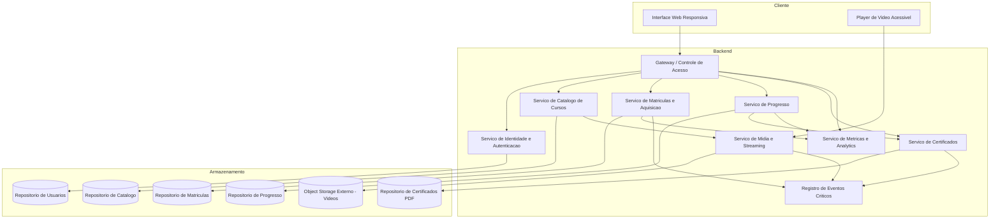
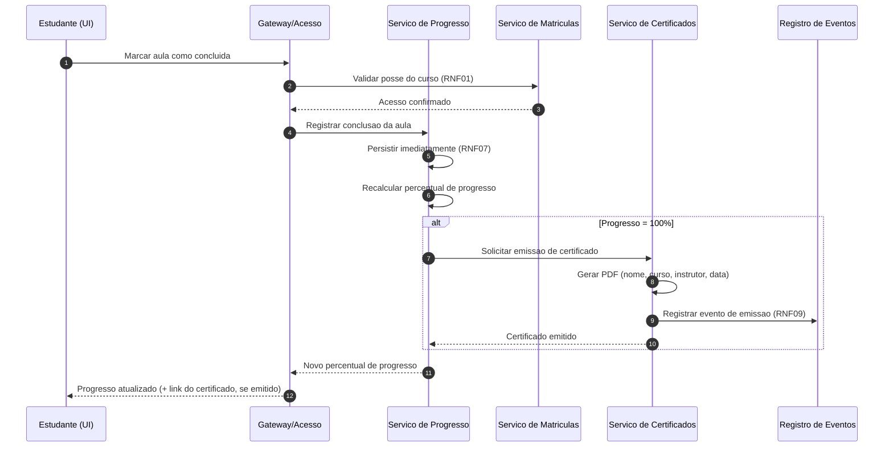
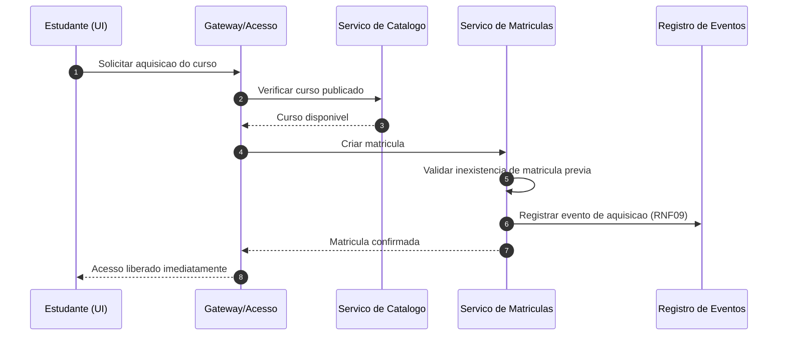

# Relatório Técnico de Arquitetura de Software
**Projeto:** Plataforma de Cursos Online (M01) — AI4ES Time 2

---

## 1. Identificação das HUs

| HU | Perfil | Objetivo | RFs Relacionados | RNFs Relacionados |
|----|--------|----------|------------------|-------------------|
| HU01 | Instrutor | Criar e estruturar curso (módulos, aulas, upload de vídeo) | RF01, RF02, RF03, RF04 | RNF04, RNF09 |
| HU02 | Instrutor | Publicar/despublicar curso com controle de visibilidade | RF05 | RNF01 |
| HU03 | Instrutor | Acompanhar total de matrículas por curso | RF13 | RNF06 |
| HU04 | Instrutor | Métricas de engajamento por aula (visualizações, taxa de conclusão) | RF14 | RNF06 |
| HU05 | Estudante | Cadastro com nome, e-mail e senha | RF06, RF16 | RNF02 |
| HU06 | Estudante | Adquirir curso e ter acesso imediato | RF07, RF08 | RNF01, RNF09 |
| HU07 | Estudante | Assistir aulas via streaming e marcar conclusão | RF09, RF10, RF12 | RNF03, RNF07, RNF10 |
| HU08 | Estudante | Receber e baixar certificado (PDF) | RF11, RF15 | RNF09 |
| HU09 | Estudante | Área central com cursos adquiridos e progresso | RF12 | RNF05, RNF08 |

---

## 2. Diagramas de Arquitetura (Mermaid)

### 2.1 Diagrama de Componentes (visão lógica)

### 2.2 Diagrama de Sequência — HU07/HU08 (Conclusão de aula e emissão de certificado)

### 2.3 Diagrama de Sequência — HU06 (Aquisição de curso)

---

## 3. Decisões de Arquitetura

| ID | Decisão | Justificativa | Requisitos |
|----|---------|---------------|------------|
| DA01 | Separação em serviços por domínio (Catálogo, Matrícula, Progresso, Certificado, Mídia, Analytics) | Baixo acoplamento, evolução independente, alinhado ao ciclo de vida distinto de cada domínio | Geral |
| DA02 | Mídia desacoplada em object storage externo, com entrega via streaming (URLs assinadas/temporárias conceituais) | Escalabilidade e proteção do conteúdo | RNF03, RNF04, RNF01 |
| DA03 | Controle de acesso centralizado no Gateway, verificando matrícula antes de servir conteúdo | Garante que só compradores acessem, inclusive após despublicação (HU02) | RF08, RNF01 |
| DA04 | Persistência síncrona e transacional do progresso a cada conclusão de aula | Sem risco de perda de progresso | RNF07 |
| DA05 | Emissão de certificado disparada por evento de "progresso 100%", gerando PDF persistido para download posterior | Emissão automática e disponibilidade permanente | RF11, RF15, HU08 |
| DA06 | Métricas pré-agregadas/materializadas com defasagem máxima de 1h | Painel carregado em ≤ 3s sem consulta pesada em tempo real | RNF06, HU03, HU04 |
| DA07 | Senhas armazenadas com hash seguro com salt (algoritmo adaptativo, ex.: bcrypt — citado no requisito) | Segurança de credenciais | RNF02 |
| DA08 | Registro estruturado de eventos críticos (aquisição, certificado, erro de upload) em componente dedicado | Auditabilidade e manutenibilidade | RNF09 |
| DA09 | UI responsiva com player HTML padrão de navegadores modernos e controles acessíveis | Compatibilidade e acessibilidade | RNF05, RNF08, RNF10 |
| DA10 | Despublicação altera apenas visibilidade no catálogo, sem revogar matrículas existentes | Critério de aceite explícito da HU02 | RF05, HU02 |

---

## 4. Tabela de Componentes e Rastreabilidade

| Componente | Responsabilidade Principal | Comunica-se com | Origem (HU / Critério de Aceite) |
|---|---|---|---|
| Interface Web Responsiva | Interação de instrutores e estudantes em desktop/mobile | Gateway, Player | HU01–HU09; RNF05, RNF08 |
| Player de Vídeo Acessível | Reprodução via streaming com controles (play/pause, volume, velocidade) | Serviço de Mídia | HU07 (streaming); RNF03, RNF10 |
| Gateway / Controle de Acesso | Autenticação de sessão, autorização por matrícula, roteamento | Todos os serviços | RF08, RF16; RNF01 |
| Serviço de Identidade e Autenticação | Cadastro, login/logout, hash de senhas, unicidade de e-mail | Repositório de Usuários | HU05 (e-mail único, senha ≥ 8); RF06, RF16; RNF02 |
| Serviço de Catálogo de Cursos | CRUD de cursos/módulos/aulas, reordenação, publicação/despublicação, status | Repositório de Catálogo, Serviço de Mídia | HU01, HU02; RF01–RF05 |
| Serviço de Mídia e Streaming | Upload para object storage, entrega por streaming, controle de acesso a vídeos | Object Storage, Registro de Eventos | HU01 (upload por aula), HU07; RNF03, RNF04, RNF09 |
| Serviço de Matrículas e Aquisição | Aquisição de cursos, prevenção de compra duplicada, liberação imediata de acesso | Repositório de Matrículas, Analytics, Registro de Eventos | HU06 (acesso imediato, sem duplicidade); RF07, RF08 |
| Serviço de Progresso | Registro de aulas concluídas, cálculo de percentual, persistência imediata | Repositório de Progresso, Certificados, Analytics | HU07 (progresso imediato); RF09, RF10, RF12; RNF07 |
| Serviço de Certificados | Emissão automática ao atingir 100%, geração de PDF, download a qualquer momento | Repositório de Certificados, Registro de Eventos | HU08 (conteúdo do certificado, PDF); RF11, RF15 |
| Serviço de Métricas e Analytics | Agregação de matrículas, visualizações e taxa de conclusão por aula | Repositórios agregados, Gateway | HU03 (defasagem ≤ 1h), HU04; RF13, RF14; RNF06 |
| Registro de Eventos Críticos | Log de aquisição, emissão de certificado e erros de upload | Serviços produtores de eventos | RNF09 |
| Object Storage Externo | Armazenamento escalável e desacoplado dos vídeos | Serviço de Mídia | RNF04 |

---

## 5. Bloqueios e Pendências

| ID | Tipo | Descrição | Impacto |
|----|------|-----------|---------|
| B01 | Bloqueio | RF07 fala em "adquirir cursos" com preço (RF01), mas não há requisito de integração/meio de pagamento | Impossível fechar o fluxo de aquisição sem definição de cobrança (gateway externo? cursos gratuitos?) |
| P01 | Pendência | Definição de "visualização" de aula (RF14): início de reprodução? tempo mínimo assistido? | Afeta modelo de eventos do player e Analytics |
| P02 | Pendência | Formatos, tamanho máximo e processamento de vídeo (transcodificação, múltiplas resoluções) não especificados | Afeta pipeline de mídia e custos |
| P03 | Pendência | Recuperação de senha e verificação de e-mail não constam nos requisitos | Fluxo de identidade incompleto |
| P04 | Pendência | Regras de exclusão de curso com estudantes matriculados (RF04 vs. HU02) | Risco de perda de acesso adquirido |
| P05 | Pendência | Validade/autenticidade do certificado (código verificável?) não especificada | Afeta modelo do Serviço de Certificados |

---

## 6. Cobertura de Requisitos

| Requisito | Componente(s) Responsável(is) | Status |
|-----------|-------------------------------|--------|
| RF01–RF05 | Serviço de Catálogo, Serviço de Mídia | ✅ Coberto |
| RF06, RF16 | Serviço de Identidade | ✅ Coberto |
| RF07, RF08 | Serviço de Matrículas, Gateway | ⚠️ Coberto com bloqueio (B01 — pagamento) |
| RF09, RF10, RF12 | Serviço de Progresso | ✅ Coberto |
| RF11, RF15 | Serviço de Certificados | ✅ Coberto |
| RF13, RF14 | Serviço de Métricas e Analytics | ⚠️ Coberto com pendência (P01) |
| RNF01 | Gateway + Serviço de Mídia (acesso controlado a vídeos) | ✅ Coberto |
| RNF02 | Serviço de Identidade (hash com salt) | ✅ Coberto |
| RNF03, RNF04 | Serviço de Mídia + Object Storage | ✅ Coberto |
| RNF05, RNF08, RNF10 | Interface Web + Player | ✅ Coberto |
| RNF06 | Analytics com agregação materializada (DA06) | ✅ Coberto |
| RNF07 | Serviço de Progresso (persistência síncrona) | ✅ Coberto |
| RNF09 | Registro de Eventos Críticos | ✅ Coberto |

**Cobertura:** 16/16 RFs e 10/10 RNFs endereçados; 2 itens com ressalvas (B01, P01).

---

## 7. Gap Analysis

| # | Lacuna Identificada | Impacto Arquitetural | Ação Recomendada |
|---|---------------------|----------------------|------------------|
| G01 | Ausência de fluxo de pagamento apesar de "preço" (RF01) e "aquisição" (RF07) | Necessidade futura de componente de Pagamentos com integração externa, idempotência e conciliação; alteração no fluxo da HU06 | Confirmar com o negócio se haverá cobrança; se sim, definir interface abstrata de Pagamento antes da implementação de Matrículas |
| G02 | Definição de "visualização" de aula não especificada | Modelo de eventos do Player → Analytics indefinido; risco de métricas inconsistentes | Definir evento canônico de visualização (ex.: início de reprodução autenticada, deduplicado por estudante/aula/dia) |
| G03 | Ciclo de vida de mídia (transcodificação, retentativas, limpeza de uploads falhos) não coberto | Pipeline assíncrono de processamento pode ser necessário; afeta RNF09 (erros de upload) | Especificar estados do vídeo (enviado, processando, disponível, falha) e política de retry |
| G04 | Exclusão de curso/aula com matrículas ativas (RF04) conflita com garantia de acesso pós-despublicação (HU02) | Necessidade de exclusão lógica (soft delete) e versionamento de conteúdo | Adotar exclusão lógica para cursos com matrículas; validar regra com o negócio |
| G05 | Sem requisitos de recuperação de senha, expiração de sessão ou limite de tentativas de login | Superfície de segurança incompleta apesar de RNF01/RNF02 | Incluir requisitos de gestão de credenciais e sessão no próximo refinamento |
| G06 | Certificado sem mecanismo de verificação de autenticidade | Risco de fraude em comprovação de aprendizado | Avaliar inclusão de identificador único verificável no certificado |
| G07 | Proteção do link de streaming contra compartilhamento não detalhada | RNF01 pode ser violado por URLs vazadas | Definir URLs temporárias/assinadas vinculadas à sessão do estudante |
| G08 | Ausência de requisitos de backup/retenção de dados de progresso e certificados | RNF07 exige "sem risco de perda", mas sem política de recuperação de desastres | Definir RPO/RTO e política de retenção com o time de operação |

---
*Fim do Relatório Canônico — AI4ES Time 2.*