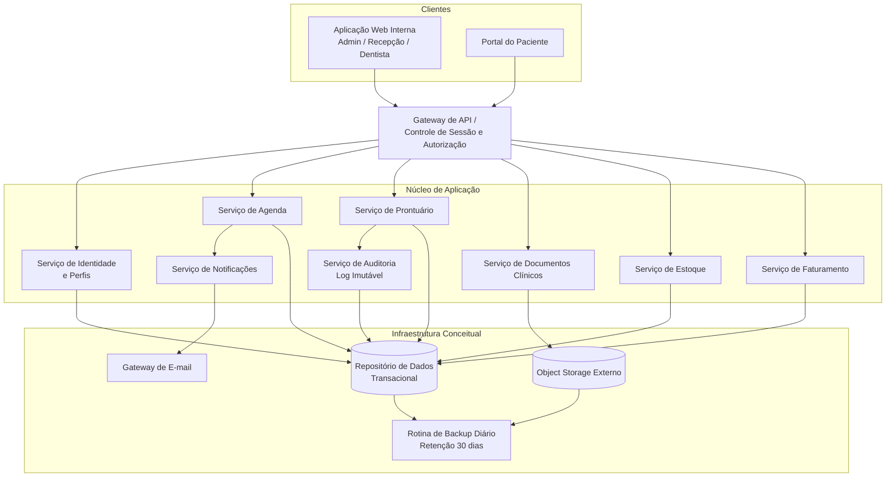
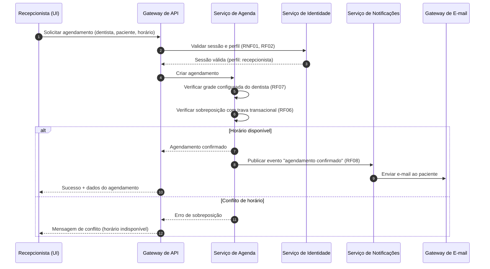
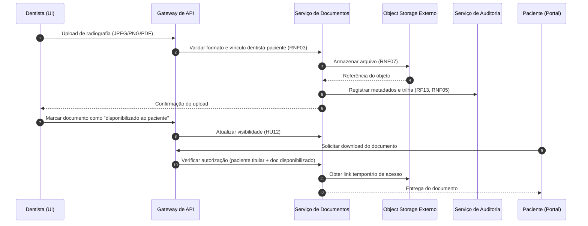

# Relatório Técnico de Arquitetura de Software
## Sistema de Gestão de Clínica Odontológica (M02) — AI4ES Time 2

---

## 1. Identificação das HUs

| HU | Título | Perfil | RFs Relacionados | RNFs Relacionados |
|----|--------|--------|------------------|-------------------|
| HU01 | Visualizar agenda unificada dos dentistas | Recepcionista | RF03, RF04 | RNF06, RNF09 |
| HU02 | Agendar, cancelar e remarcar consulta | Recepcionista | RF05, RF06, RF07, RF08 | RNF01, RNF06 |
| HU03 | Registrar pagamento de cobrança | Recepcionista | RF21 | RNF01 |
| HU04 | Registrar procedimento no prontuário | Dentista | RF09, RF10, RF13 | RNF02, RNF05 |
| HU05 | Anexar radiografias e documentos clínicos | Dentista | RF11, RF13 | RNF03, RNF07 |
| HU06 | Consultar prontuário completo | Dentista | RF09, RF12 | RNF02, RNF03 |
| HU07 | Gerar cobrança após atendimento | Dentista | RF18, RF19, RF20 | — |
| HU08 | Gerenciar dentistas e grades de horário | Administrador | RF01, RF03, RF07 | RNF01 |
| HU09 | Gerenciar materiais e alertas de estoque | Administrador | RF14, RF15, RF16, RF17 | — |
| HU10 | Consultar relatório de faturamento | Administrador | RF22 | — |
| HU11 | Acessar agendamentos pelo portal | Paciente | RF23, RF24 | RNF01, RNF09, RNF10 |
| HU12 | Acessar e baixar documentos clínicos | Paciente | RF23, RF25 | RNF03, RNF07 |

---

## 2. Diagramas de Arquitetura (Mermaid)

### 2.1 Diagrama de Componentes (visão lógica)

### 2.2 Diagrama de Sequência — HU02: Agendamento com validação e notificação

### 2.3 Diagrama de Sequência — HU05/HU12: Upload e acesso a documento clínico

---

## 3. Decisões de Arquitetura

| ID | Decisão | Justificativa | Requisitos |
|----|---------|---------------|------------|
| DA01 | **Arquitetura modular por domínio** (Agenda, Prontuário, Documentos, Estoque, Faturamento, Identidade, Notificações, Auditoria), com fronteiras claras e comunicação via interfaces internas | Domínios com ciclos de vida distintos; facilita evolução e restrição de acesso por perfil | RF01–RF25 |
| DA02 | **Gateway de API único** como ponto de entrada, aplicando autenticação, autorização por perfil (RBAC) e timeout de sessão de 30 min | Centraliza segurança e evita replicação de regras de acesso | RF02, RNF01 |
| DA03 | **Controle de concorrência transacional na Agenda** (verificação atômica de sobreposição no ato da gravação) | Garantia forte contra agendamentos duplos, mesmo com acessos simultâneos | RF06 |
| DA04 | **Notificações assíncronas** via evento após confirmação transacional do agendamento | O envio de e-mail não deve bloquear ou desfazer o agendamento; permite reprocessamento | RF08 |
| DA05 | **Prontuário append-only + log imutável de auditoria**: edições geram novas versões; nada é apagado fisicamente | Rastreabilidade clínica exigida por LGPD/CFO | RF13, RNF02, RNF05 |
| DA06 | **Object storage externo para documentos clínicos**, com apenas metadados no repositório transacional e acesso via links temporários autorizados | Requisito explícito de desacoplamento e escalabilidade; controle de acesso fino | RF11, RNF03, RNF07 |
| DA07 | **Autorização em nível de recurso**: verificação de vínculo dentista↔paciente e flag de "disponibilizado ao paciente" antes de qualquer leitura de documento | Segregação exigida (dentista vinculado + paciente titular apenas) | RNF03, HU12 |
| DA08 | **Precificação por estratégia**: cobrança resolve valor via tabela do convênio quando modalidade = convênio; senão, tabela particular | Regra explícita de aplicação automática de valores | RF19, RF20, HU07 |
| DA09 | **Grade de horários versionada**: alterações de grade têm data de vigência, afetando só agendamentos futuros | Critério de aceite da HU08 | RF07, HU08 |
| DA10 | **Consulta otimizada de agenda unificada** (visão de leitura pré-agregada/materializável por dia/semana) | Carregamento ≤ 3 s para todos os dentistas | RF04, RNF06 |
| DA11 | **Hash seguro de senhas** com algoritmo adaptativo (ex.: bcrypt, citado no requisito) | Requisito literal | RNF04 |
| DA12 | **Backup diário automatizado** com retenção mínima de 30 dias, cobrindo repositório transacional e object storage | Requisito explícito | RNF11, RNF08 |

---

## 4. Tabela de Componentes e Rastreabilidade

| Componente | Responsabilidade Principal | Comunica-se com | Origem (HU / Critério de Aceite) |
|---|---|---|---|
| Aplicação Web Interna | Interface responsiva para admin, recepção e dentista | Gateway de API | HU01–HU10; RNF09, RNF10 |
| Portal do Paciente | Visualização de agendamentos, histórico e documentos disponibilizados | Gateway de API | HU11, HU12; RF23–RF25 |
| Gateway de API | Autenticação, autorização por perfil, expiração de sessão (30 min), roteamento | Todos os serviços do núcleo | RF02; RNF01 |
| Serviço de Identidade e Perfis | Cadastro de usuários, perfis (admin/recepção/dentista/paciente), hash de senhas | Gateway, Repositório de Dados | HU08; RF01; RNF04 |
| Serviço de Agenda | Grades por dentista (versionadas), agendamento/cancelamento/remarcação, bloqueio de sobreposição, visão unificada | Notificações, Repositório de Dados | HU01, HU02, HU08; RF03–RF08; RNF06 |
| Serviço de Prontuário | Registros clínicos append-only com autoria, data/hora; busca por nome/CPF; histórico cronológico | Auditoria, Documentos, Repositório de Dados | HU04, HU06; RF09, RF10, RF12, RF13; RNF05 |
| Serviço de Documentos Clínicos | Upload (JPEG/PNG/PDF), metadados, controle de visibilidade ao paciente, links temporários de download | Object Storage, Auditoria, Gateway | HU05, HU12; RF11, RF25; RNF03, RNF07 |
| Serviço de Estoque | Cadastro de materiais, entradas/saídas, alertas de mínimo, vínculo de consumo a atendimento | Repositório de Dados, Painel Admin | HU09; RF14–RF17 |
| Serviço de Faturamento | Cadastro de procedimentos e convênios, geração de cobrança, pagamentos totais/parciais, relatórios com exportação CSV/PDF | Repositório de Dados, Agenda (atendimentos) | HU03, HU07, HU10; RF18–RF22 |
| Serviço de Notificações | Envio assíncrono de e-mails de confirmação/cancelamento/remarcação | Gateway de E-mail | HU02; RF08 |
| Serviço de Auditoria | Log imutável de alterações em prontuário e acessos a documentos | Repositório de Dados | HU04, HU05; RNF05, RNF02 |
| Object Storage Externo | Armazenamento desacoplado de radiografias e documentos | Serviço de Documentos | HU05; RNF07 |
| Rotina de Backup | Backup diário automatizado com retenção de 30 dias | Repositório de Dados, Object Storage | RNF11 |

---

## 5. Bloqueios e Pendências

| ID | Tipo | Descrição | Impacto | Ação Sugerida |
|----|------|-----------|---------|---------------|
| B01 | Pendência | Não está definido como o paciente obtém credenciais do portal (auto-cadastro vs. convite pela recepção) | Fluxo de onboarding do RF23 indefinido | Alinhar com Product Owner |
| B02 | Pendência | Definição de "dentista vinculado ao paciente" (RNF03/RF12) não formalizada: vínculo por atendimento realizado? Por atribuição explícita? | Modelo de autorização de prontuário | Definir regra de vínculo antes da implementação |
| B03 | Pendência | Política de cancelamento (prazo mínimo, cobrança de no-show) não especificada | Regras de negócio da Agenda | Levantar regras da clínica |
| B04 | Pendência | Tamanho máximo de arquivos e volume estimado de documentos não definidos | Dimensionamento do object storage e limites de upload | Definir limites operacionais |
| B05 | Bloqueio parcial | Requisitos de retenção legal de prontuário (CFO exige guarda de longa duração) vs. direitos LGPD de eliminação — não harmonizados no documento | Política de retenção/anonimização | Parecer jurídico/compliance |
| B06 | Pendência | Pagamento parcial (HU03) sem definição de estados intermediários da cobrança (parcialmente paga, vencida) | Máquina de estados do Faturamento | Especificar ciclo de vida da cobrança |

---

## 6. Cobertura de Requisitos

| Requisito | Coberto por | Status |
|-----------|-------------|--------|
| RF01–RF02 | Serviço de Identidade + Gateway (RBAC) | ✅ Coberto |
| RF03–RF07 | Serviço de Agenda (grades versionadas, trava transacional, visão unificada) | ✅ Coberto |
| RF08 | Serviço de Notificações + Gateway de E-mail | ✅ Coberto |
| RF09–RF13 | Serviço de Prontuário + Auditoria | ✅ Coberto |
| RF14–RF17 | Serviço de Estoque | ✅ Coberto |
| RF18–RF22 | Serviço de Faturamento (estratégia de preço, relatórios exportáveis) | ✅ Coberto |
| RF23–RF25 | Portal do Paciente + Serviço de Documentos | ✅ Coberto |
| RNF01 | Gateway (sessão 30 min) | ✅ Coberto |
| RNF02 | DA05 + Auditoria (parcial — depende de B05) | ⚠️ Parcial |
| RNF03 | DA07 (autorização em nível de recurso) | ✅ Coberto |
| RNF04 | Serviço de Identidade (hash adaptativo) | ✅ Coberto |
| RNF05 | Serviço de Auditoria (log imutável) | ✅ Coberto |
| RNF06 | DA10 (visão de leitura otimizada) | ✅ Coberto |
| RNF07 | Object storage externo desacoplado | ✅ Coberto |
| RNF08 | Arquitetura sem ponto único crítico + backups; SLO 99,5% | ⚠️ Parcial (depende de topologia de implantação) |
| RNF09–RNF10 | UI responsiva multiplataforma/navegadores | ✅ Coberto |
| RNF11 | Rotina de Backup (diário, 30 dias) | ✅ Coberto |

**Cobertura: 25/25 RFs (100%) • 11/11 RNFs endereçados (2 com ressalvas).**

---

## 7. Gap Analysis

| # | Lacuna | Impacto Arquitetural | Ação Recomendada |
|---|--------|----------------------|------------------|
| G01 | Ausência de conceito explícito de **"Atendimento"** como entidade central — RF17 e RF20 referenciam "atendimento", mas os RFs só modelam "agendamento" e "prontuário" | Sem entidade agregadora, o vínculo consumo de material ↔ cobrança ↔ prontuário fica ambíguo | Modelar entidade Atendimento como agregado que conecta agendamento, procedimentos, consumo e cobrança |
| G02 | Regra de vínculo dentista↔paciente indefinida (ver B02) | O modelo de autorização de prontuário/documentos não pode ser implementado com segurança | Definir formalmente (ex.: vínculo criado no primeiro atendimento) e registrar como regra de autorização |
| G03 | LGPD citada sem detalhamento de consentimento, portabilidade e eliminação vs. retenção clínica obrigatória | Pode exigir camada de gestão de consentimento e políticas de anonimização | Elaborar matriz de tratamento de dados pessoais; incluir gestão de consentimento no Serviço de Identidade |
| G04 | Alertas de estoque (RF16) definidos só para painel; não há canal de notificação ativa (e-mail) especificado | Serviço de Notificações pode precisar de novos tipos de evento | Confirmar se alerta deve ser também por e-mail; extensão simples do componente existente |
| G05 | Não há requisito de recuperação de senha / MFA | Fluxo essencial de autenticação ausente | Especificar recuperação segura de credenciais como requisito complementar |
| G06 | RNF08 (99,5% uptime) sem definição de janela de manutenção ou estratégia de degradação | Métricas de SLO e monitoramento não derivam automaticamente do design | Definir plano de observabilidade (health checks, alertas) e janela de manutenção fora do horário da clínica |
| G07 | Falta de fila/retentativa explícita para falhas de envio de e-mail (RF08) | E-mails perdidos comprometem critério de aceite da HU02 | Adotar mecanismo de fila com retentativa e dead-letter conceitual no Serviço de Notificações |
| G08 | Estorno/cancelamento de cobrança e reembolso não especificados | Máquina de estados do Faturamento incompleta | Especificar estados adicionais (cancelada, estornada) junto ao negócio |
| G09 | Concorrência entre múltiplas recepcionistas na mesma agenda tratada apenas implicitamente | DA03 cobre a gravação, mas a UI pode exibir dados desatualizados | Definir estratégia de atualização da visão de agenda (polling/atualização em tempo quase real) |

---

*Fim do Relatório Canônico de Arquitetura — AI4ES Time 2 • Módulo M02.*