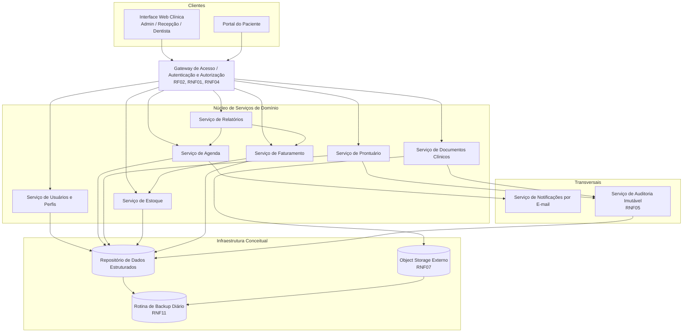
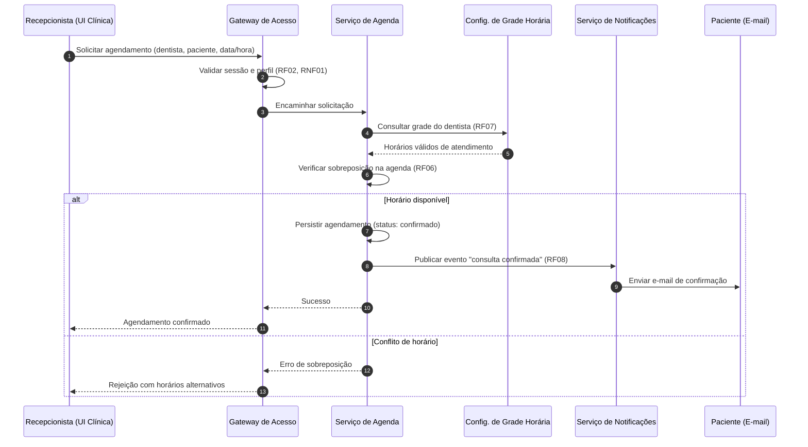
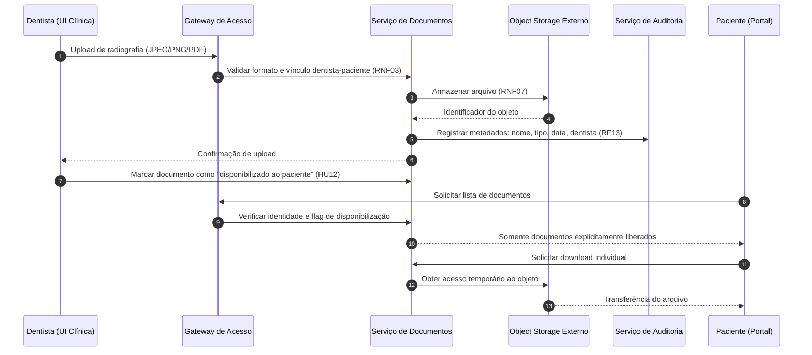

# Relatório Técnico de Arquitetura de Software
## Sistema de Gestão de Clínica Odontológica (M02) — AI4ES Time 2

---

## 1. Identificação das HUs

| HU | Perfil | Título | RFs Relacionados | RNFs Relacionados |
|----|--------|--------|------------------|-------------------|
| HU01 | Recepcionista | Visualizar agenda unificada dos dentistas | RF03, RF04 | RNF06, RNF09 |
| HU02 | Recepcionista | Agendar, cancelar e remarcar consulta | RF05, RF06, RF07, RF08 | RNF01, RNF06 |
| HU03 | Recepcionista | Registrar pagamento de cobrança | RF20, RF21 | RNF01 |
| HU04 | Dentista | Registrar procedimento no prontuário | RF09, RF10, RF13 | RNF02, RNF05 |
| HU05 | Dentista | Anexar radiografias e documentos clínicos | RF11, RF13 | RNF03, RNF07 |
| HU06 | Dentista | Consultar prontuário completo do paciente | RF09, RF12 | RNF02, RNF03 |
| HU07 | Dentista | Gerar cobrança após atendimento | RF18, RF19, RF20 | RNF02 |
| HU08 | Administrador | Gerenciar dentistas e grades de horário | RF01, RF03, RF07 | RNF01 |
| HU09 | Administrador | Gerenciar materiais e alertas de estoque | RF14, RF15, RF16, RF17 | RNF09 |
| HU10 | Administrador | Consultar relatório de faturamento | RF22 | RNF06 (analogia de desempenho) |
| HU11 | Paciente | Acessar agendamentos pelo portal | RF23, RF24 | RNF01, RNF09, RNF10 |
| HU12 | Paciente | Acessar e baixar documentos clínicos | RF23, RF25 | RNF03, RNF07 |

Requisitos transversais sem HU dedicada: RF02 (autorização por perfil), RNF04 (hash de senhas), RNF08 (disponibilidade), RNF11 (backup) — tratados como preocupações arquiteturais transversais (ver Seções 3 e 7).

---

## 2. Diagramas de Arquitetura (Mermaid)

### 2.1 Diagrama de Componentes (visão conceitual)

### 2.2 Diagrama de Sequência — HU02: Agendamento com validação de sobreposição e notificação

### 2.3 Diagrama de Sequência — HU05/HU12: Upload e acesso controlado a documentos

---

## 3. Decisões de Arquitetura

| ID | Decisão | Justificativa | Requisitos |
|----|---------|---------------|------------|
| DA-01 | Camada única de autenticação/autorização (Gateway) com controle de acesso baseado em perfis (RBAC) e timeout de sessão de 30 min | Centraliza RF02, RNF01, RNF04; evita duplicação de regras de acesso entre UI clínica e portal | RF01, RF02, RNF01, RNF04 |
| DA-02 | Serviços de domínio separados por contexto delimitado (Agenda, Prontuário, Documentos, Estoque, Faturamento) | Coesão funcional, evolução independente e isolamento de dados clínicos sensíveis (LGPD/CFO) | Todos os RF; RNF02 |
| DA-03 | Documentos clínicos armazenados em object storage externo; banco estruturado guarda apenas metadados e política de acesso | Requisito explícito de desacoplamento; downloads via URLs de acesso temporário | RF11, RF25, RNF03, RNF07 |
| DA-04 | Trilha de auditoria em modelo *append-only* (imutável) para prontuário e documentos | Edições de prontuário (RF12) preservam versões anteriores; log com usuário, data e hora | RF13, RNF05 |
| DA-05 | Notificações por e-mail assíncronas via eventos de domínio | Falha no envio não bloqueia o agendamento; permite reprocessamento | RF08 |
| DA-06 | Verificação de sobreposição de agenda com controle de concorrência transacional (lock/versão otimista por slot dentista+horário) | Duas recepcionistas não podem criar conflito simultâneo | RF06, RNF06 |
| DA-07 | Agenda unificada servida por consulta otimizada/visão de leitura pré-agregada | Garante carregamento ≤ 3 s | RF04, RNF06 |
| DA-08 | Portal do Paciente como aplicação distinta consumindo os mesmos serviços via Gateway, com escopo de dados restrito (sem anotações clínicas internas) | Superfície de exposição mínima ao público externo | RF23–RF25, RNF03, HU12 |
| DA-09 | Precificação de cobrança resolvida no momento da geração (snapshot de valores do convênio/particular) | Alterações futuras em tabelas não afetam cobranças já emitidas | RF19, RF20, HU07 |
| DA-10 | Alterações de grade horária com vigência prospectiva (versionamento de grade) | Critério da HU08: agendamentos existentes não são impactados | RF07, HU08 |
| DA-11 | Interface responsiva e compatível com navegadores modernos como restrição de design da camada de apresentação | Requisito literal | RNF09, RNF10 |
| DA-12 | Backup automático diário com retenção ≥ 30 dias cobrindo dados estruturados e objetos | Requisito literal | RNF11 |

---

## 4. Tabela de Componentes e Rastreabilidade

| Componente | Responsabilidade Principal | Comunica-se com | Origem (HU / Critério de Aceite) |
|------------|---------------------------|-----------------|----------------------------------|
| Gateway de Acesso | Autenticação, autorização por perfil, expiração de sessão (30 min), hash seguro de senhas | Todas as UIs e serviços de domínio | HU11 (portal exige autenticação); RF02, RNF01, RNF04 |
| Serviço de Usuários e Perfis | Cadastro e gestão de administradores, recepcionistas, dentistas e pacientes | Gateway, Serviço de Agenda | HU08 (cadastrar dentistas); RF01 |
| Serviço de Agenda | Agendas individuais, agenda unificada, agendar/cancelar/remarcar, bloqueio de sobreposição, grades de horário versionadas | Gateway, Notificações, Relatórios, Config. de Grade | HU01 (visões diária/semanal, filtro por dentista), HU02 (bloqueio de sobreposição), HU08 (grade afeta só futuro) |
| Serviço de Notificações | Envio assíncrono de e-mails de confirmação/cancelamento/remarcação | Serviço de Agenda (eventos) | HU02 ("e-mail automático"); RF08 |
| Serviço de Prontuário | Registro e consulta de procedimentos com autoria, data/hora; histórico cronológico decrescente; busca por nome/CPF | Gateway, Auditoria, Serviço de Documentos | HU04 (autoria automática), HU06 (abas, busca por CPF); RF09–RF13 |
| Serviço de Documentos Clínicos | Upload (JPEG/PNG/PDF), metadados, controle de acesso por vínculo, flag de disponibilização ao paciente, download | Object Storage, Auditoria, Portal | HU05 (formatos, metadados, restrição), HU12 (somente documentos liberados) |
| Serviço de Auditoria Imutável | Log *append-only* de alterações em prontuário/documentos | Prontuário, Documentos | RNF05; HU04 (rastreabilidade) |
| Serviço de Estoque | Cadastro de materiais, entradas/saídas, alertas de mínimo, vínculo de consumo a atendimento | Gateway, Faturamento, Painel Admin | HU09 (alerta destacado, reposição a partir do alerta); RF14–RF17 |
| Serviço de Faturamento | Cadastro de procedimentos e convênios, geração de cobrança com snapshot de valores, pagamentos totais/parciais, cobranças em aberto | Gateway, Estoque, Relatórios | HU03 (pagamento parcial, status imediato), HU07 (tabela de convênio automática); RF18–RF21 |
| Serviço de Relatórios | Relatórios de faturamento por período/dentista/modalidade; exportação CSV/PDF | Faturamento, Agenda | HU10 (filtros, totais agrupados, exportação); RF22 |
| Interface Web Clínica | Camada de apresentação responsiva para admin/recepção/dentista | Gateway | HU01–HU10; RNF09, RNF10 |
| Portal do Paciente | Visualização de agendamentos, histórico e download de documentos liberados | Gateway | HU11, HU12; RF23–RF25 |
| Object Storage Externo | Armazenamento desacoplado de radiografias/documentos | Serviço de Documentos, Backup | HU05; RNF07 |
| Rotina de Backup | Backup diário automático, retenção ≥ 30 dias | Repositórios de dados e objetos | RNF11 |

---

## 5. Bloqueios e Pendências

| ID | Tipo | Descrição | Impacto | Ação Sugerida |
|----|------|-----------|---------|---------------|
| BP-01 | Pendência de Negócio | RF12 restringe edição aos "próprios pacientes" do dentista, mas o critério de vínculo dentista-paciente não é definido (por agendamento? por atribuição explícita?) | Regra de autorização central (RNF03) fica ambígua | Definir com o cliente a regra formal de vínculo |
| BP-02 | Pendência de Negócio | Pagamento parcial (HU03) sem definição de parcelamento, estorno ou meios de pagamento | Modelo de cobrança incompleto | Levantar regras financeiras da clínica |
| BP-03 | Pendência Legal | Retenção legal de prontuários (CFO exige guarda de longo prazo) não especificada; RNF11 fala apenas de backup de 30 dias | Risco de não conformidade | Consultar assessoria jurídica/CFO |
| BP-04 | Pendência Técnica | Limites de tamanho de arquivo e volumetria de radiografias não especificados | Dimensionamento de storage e timeouts | Definir limites de upload |
| BP-05 | Pendência de Negócio | Edição de prontuário (RF12) vs. imutabilidade (RNF05): confirmar se edição = nova versão, nunca sobrescrita | Design da auditoria | Validar modelo de versionamento (assumido em DA-04) |
| BP-06 | Pendência de Negócio | Antecedência mínima para cancelamento/remarcação pelo negócio não definida | Regras de agenda | Confirmar políticas da clínica |

---

## 6. Cobertura de Requisitos

| Requisito | Coberto por | Status |
|-----------|-------------|--------|
| RF01–RF02 | Serviço de Usuários, Gateway (DA-01) | ✅ Coberto |
| RF03–RF07 | Serviço de Agenda, Grade versionada (DA-06, DA-07, DA-10) | ✅ Coberto |
| RF08 | Serviço de Notificações (DA-05) | ✅ Coberto |
| RF09–RF13 | Serviço de Prontuário + Auditoria (DA-04) | ✅ Coberto (BP-01, BP-05 pendentes) |
| RF14–RF17 | Serviço de Estoque | ✅ Coberto |
| RF18–RF21 | Serviço de Faturamento (DA-09) | ✅ Coberto (BP-02 pendente) |
| RF22 | Serviço de Relatórios | ✅ Coberto |
| RF23–RF25 | Portal do Paciente + Serviço de Documentos (DA-08) | ✅ Coberto |
| RNF01–RNF04 | Gateway, RBAC, hash seguro, controle de acesso a documentos | ✅ Coberto |
| RNF05 | Auditoria append-only | ✅ Coberto |
| RNF06 | Visão de leitura pré-agregada (DA-07) | ✅ Coberto (validar em testes de carga) |
| RNF07 | Object storage externo (DA-03) | ✅ Coberto |
| RNF08 | Preocupação operacional (redundância/monitoramento) | ⚠️ Parcial — depende de decisões de implantação |
| RNF09–RNF10 | Restrições da camada de apresentação (DA-11) | ✅ Coberto |
| RNF11 | Rotina de backup (DA-12) | ✅ Coberto (BP-03 pendente) |

**Cobertura:** 25/25 RFs cobertos; 10/11 RNFs plenamente endereçados; RNF08 parcialmente (dependente de topologia de implantação fora do escopo do design abstrato).

---

## 7. Gap Analysis

| # | Lacuna Identificada | Impacto Arquitetural | Ação Recomendada |
|---|--------------------|----------------------|------------------|
| G1 | **Recuperação de senha e onboarding do paciente** não especificados (como o paciente obtém acesso ao portal?) | Fluxo de identidade incompleto; risco de canal inseguro de primeiro acesso | Especificar fluxo de convite/ativação com verificação de identidade e e-mail |
| G2 | **Consentimento LGPD** citado apenas genericamente (RNF02): não há requisitos de registro de consentimento, anonimização ou exclusão de dados | Pode exigir componente de gestão de consentimento não previsto | Incluir requisitos de consentimento, direito de acesso/exclusão e DPO no backlog |
| G3 | **Conceito de "Atendimento"** é referenciado por RF17 e RF20 mas nunca definido como entidade (relação com agendamento, procedimentos e cobrança) | Entidade central implícita; sem ela, faturamento e consumo de materiais ficam desconexos | Modelar explicitamente a entidade Atendimento ligando agenda → prontuário → estoque → cobrança |
| G4 | **Falha no envio de e-mail** (RF08) sem política de retry ou registro de falha | Notificações perdidas silenciosamente | Definir política de reenvio, dead-letter e visibilidade de falhas para a recepção |
| G5 | **Baixa automática de estoque** por procedimento não especificada (RF17 permite vínculo, mas o mapeamento procedimento→materiais é manual?) | Decide se Faturamento/Prontuário disparam eventos ao Estoque | Definir se haverá "ficha técnica" de materiais por procedimento |
| G6 | **Glosas e faturamento de convênios** (envio de lote, rejeição, reapresentação) ausentes — RF19 cobre só tabela de valores | Integração futura com operadoras pode exigir novo serviço | Confirmar escopo: convênio apenas como modalidade de preço ou fluxo completo de faturamento TISS |
| G7 | **Métricas de disponibilidade (RNF08)** sem definição de janela de manutenção, monitoramento ou alarmes | SLO não verificável | Definir estratégia de observabilidade (health checks, métricas, alertas) |
| G8 | **Cancelamento pelo paciente** via portal não previsto (portal é somente leitura) | Possível gap de usabilidade; se adicionado depois, muda superfície de segurança do portal | Validar com stakeholders se o portal deve permitir solicitações de remarcação/cancelamento |
| G9 | **Assinatura/validade legal de documentos clínicos** (receitas, laudos) não abordada | Pode exigir mecanismo de assinatura digital conforme normas do CFO | Levantar exigências normativas de assinatura eletrônica |
| G10 | **Concorrência de agendamento multiusuário** só implícita em RF06 | Sem controle transacional explícito, testes podem passar e produção falhar | Formalizar como requisito testável e cobrir com testes de concorrência (DA-06) |

**Síntese:** a arquitetura proposta cobre integralmente o escopo funcional declarado, com riscos concentrados em (i) definição da entidade Atendimento (G3), (ii) governança de identidade do paciente (G1) e (iii) conformidade regulatória de longo prazo (G2, G9, BP-03). Recomenda-se resolver G1–G3 antes do início da implementação dos serviços de Prontuário e Faturamento.