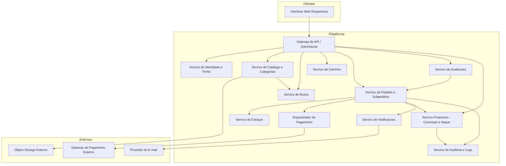
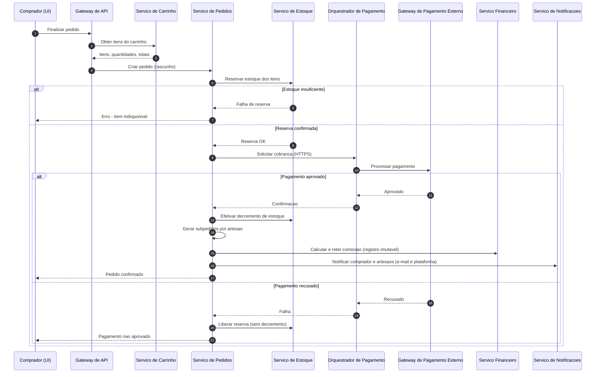
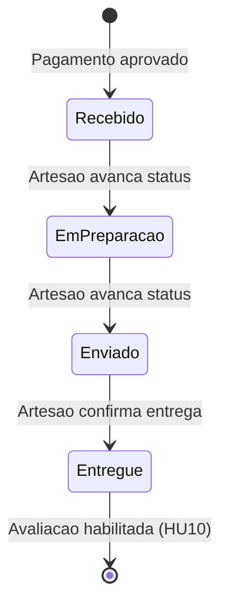

# Relatório Técnico de Arquitetura de Software
**Projeto:** Marketplace de Produtos Artesanais (M03) — AI4ES Time 2

---

## 1. Identificação das HUs

| HU | Perfil | Objetivo | RFs Relacionados |
|----|--------|----------|------------------|
| HU01 | Artesão | Cadastrar produto com fotos | RF04, RF06, RNF04 |
| HU02 | Artesão | Gerenciar estoque | RF07, RF08, RF09 |
| HU03 | Artesão | Acompanhar/atualizar status de pedidos | RF19, RF20, RF21 |
| HU04 | Artesão | Visualizar painel financeiro | RF26, RF28, RF29, RNF06 |
| HU05 | Artesão | Solicitar saque | RF29, RF30, RNF09 |
| HU06 | Artesão | Responder avaliações | RF25 |
| HU07 | Comprador | Navegar e pesquisar produtos | RF10, RF11, RF24, RNF05 |
| HU08 | Comprador | Carrinho e checkout multi-artesão | RF13–RF18, RF22, RNF03, RNF08 |
| HU09 | Comprador | Acompanhar status dos pedidos | RF21, RF22 |
| HU10 | Comprador | Avaliar produto após entrega | RF23, RF24 |
| HU11 | Admin | Gerenciar categorias | RF12 |
| HU12 | Admin | Configurar comissão | RF26, RF27, RNF13 |

Requisitos transversais: RF01–RF03 (identidade/perfis), RNF01, RNF02, RNF07, RNF10–RNF12.

---

## 2. Diagramas de Arquitetura (Mermaid)

### 2.1 Diagrama de Componentes

### 2.2 Diagrama de Sequência — Checkout com Múltiplos Artesãos (HU08 / RNF08)

### 2.3 Diagrama de Estados — Subpedido (HU03/HU09)

---

## 3. Decisões de Arquitetura

| ID | Decisão | Justificativa | Requisitos |
|----|---------|---------------|------------|
| AD01 | Separação em serviços por domínio (catálogo, pedidos, financeiro, avaliações) | Isolamento de responsabilidades, escalabilidade independente e manutenibilidade | RNF05, RNF12, RNF13 |
| AD02 | Padrão de reserva de estoque + efetivação pós-pagamento (transação compensável) | Garante atomicidade: falha de pagamento ⇒ nenhum decremento nem cobrança | RNF08, RF08, RF09 |
| AD03 | Delegação total de dados de cartão ao gateway externo (tokenização) | Conformidade PCI-DSS; o sistema nunca persiste dados de cartão | RNF03 |
| AD04 | Ledger financeiro *append-only* (registros imutáveis) para vendas, comissões e saques | Rastreabilidade e auditoria; saldo derivado do ledger | RNF09, RF26, RF28–RF30 |
| AD05 | Percentual de comissão versionado com vigência temporal; snapshot do percentual em cada venda | Alterações afetam apenas vendas futuras (HU12) | RF27 |
| AD06 | Armazenamento de fotos em object storage externo, com URLs referenciadas pelo catálogo | Desacoplamento e escalabilidade de mídia | RNF04 |
| AD07 | Índice de busca desnormalizado, sincronizado por eventos do catálogo | Busca parcial em tempo real e listagem < 2s | RF11, RNF05, HU07 |
| AD08 | Notificações assíncronas (fila de eventos conceitual) para e-mails e alertas na plataforma | Desacopla confirmação de pedido do envio de e-mail; resiliência | RF18, RF19, HU03 |
| AD09 | Autorização baseada em papéis (RBAC) com múltiplos perfis por conta | Suporte a usuário comprador+artesão | RF01–RF03, RNF01 |
| AD10 | Pedido "pai" com subpedidos por artesão, cada um com ciclo de status próprio | Compras multi-vendedor em transação única | RF22, HU09 |
| AD11 | Visão financeira pré-agregada (materializada) por artesão/período | Painel financeiro < 3s | RNF06, HU04 |
| AD12 | Trilha de auditoria centralizada para eventos críticos | Logs de pedido, falha de pagamento, saque e comissão | RNF13, RNF11 |

---

## 4. Tabela de Componentes e Rastreabilidade

| Componente | Responsabilidade Principal | Comunica-se com | Origem (HU / Critério de Aceite) |
|---|---|---|---|
| Interface Web Responsiva | UI para os três perfis, responsiva multi-dispositivo | Gateway de API | Todas as HUs; RNF07, RNF10 |
| Gateway de API / Autorização | Roteamento, autenticação de sessão, verificação de perfil (RBAC) | Todos os serviços internos | RF02; RNF01 |
| Serviço de Identidade e Perfis | Cadastro, login/logout, hash seguro de senhas, múltiplos perfis | Gateway de API | HU implícita; RF01–RF03, RNF02 |
| Serviço de Catálogo e Categorias | CRUD de produtos, publicação/despublicação, CRUD de categorias, gestão de fotos | Object Storage, Serviço de Busca, Notificações | HU01, HU11 / "produto no catálogo imediatamente após publicação" |
| Serviço de Busca | Pesquisa parcial em tempo real por nome/categoria/artesão; exclusão de itens sem estoque | Catálogo, Estoque | HU07 / "resultados parciais em tempo real" |
| Serviço de Estoque | Reserva, decremento, liberação e ajuste manual de quantidades; bloqueio de estoque zero | Pedidos, Catálogo | HU02 / "decremento automático após venda confirmada" |
| Serviço de Carrinho | Adição/remoção/ajuste de itens; resumo com totais | Catálogo, Pedidos | HU08 / RF13–RF15 |
| Serviço de Pedidos e Subpedidos | Criação de pedido, split por artesão, máquina de estados de status | Estoque, Pagamento, Financeiro, Notificações, Auditoria | HU03, HU08, HU09 / RF22 |
| Orquestrador de Pagamento | Integração HTTPS com gateway externo, sem persistência de dados de cartão | Gateway de Pagamento Externo, Pedidos | HU08 / RNF03, RNF08 |
| Serviço Financeiro | Cálculo de comissão, ledger imutável, saldos, solicitações de saque, config. de percentual | Pedidos, Auditoria, Gateway de API | HU04, HU05, HU12 / "saldo atualizado imediatamente após solicitação" |
| Serviço de Avaliações | Notas 1–5, comentários, resposta única do artesão, média por produto, validação de entrega | Pedidos, Catálogo | HU06, HU10 / "avaliação só após entregue; item avaliado uma única vez" |
| Serviço de Notificações | E-mails (confirmação, novo pedido) e alertas in-app (status, reclassificação de categoria) | Provedor de E-mail, UI | HU03, HU08, HU11 / RF18, RF19 |
| Serviço de Auditoria e Logs | Registro imutável de eventos críticos e transações financeiras | Pedidos, Financeiro | HU12 / RNF09, RNF13 |
| Object Storage Externo | Armazenamento desacoplado de fotos de produtos | Catálogo | HU01 / RNF04 |

---

## 5. Bloqueios e Pendências

| # | Item | Tipo | Impacto |
|---|------|------|---------|
| B01 | Não especificado se o pagamento multi-artesão usa *split payment* nativo do gateway ou repasse posterior pela plataforma | Bloqueio de negócio | Define a arquitetura do Serviço Financeiro e o fluxo de saque |
| B02 | Processo de aprovação/execução do saque (manual pelo admin? integração bancária?) não descrito | Pendência | Fluxo de status "processado" indefinido |
| B03 | Política de frete/entrega ausente (cálculo, quem envia, rastreamento) | Pendência | Afeta total do pedido e status "enviado" |
| B04 | Regras de cancelamento/estorno de pedido não especificadas | Pendência | Impacta reversão de estoque, comissão e ledger |
| B05 | Prazo de expiração da reserva de estoque durante checkout não definido | Pendência técnica | Necessário para AD02 |
| B06 | Requisitos LGPD sem detalhamento operacional (consentimento, exclusão de conta, retenção) | Pendência de conformidade | RNF11 |
| B07 | Método(s) de pagamento definitivos (cartão e/ou PIX) não fechados | Pendência | Contrato do Orquestrador de Pagamento |

---

## 6. Cobertura de Requisitos

| Requisito | Componente(s) Responsável(is) | Status |
|---|---|---|
| RF01–RF03 | Identidade e Perfis, Gateway de API | Coberto |
| RF04–RF07 | Catálogo, Estoque, Object Storage | Coberto |
| RF08, RF09 | Estoque, Pedidos | Coberto (AD02) |
| RF10, RF11 | Catálogo, Busca | Coberto |
| RF12 | Catálogo (categorias), Notificações | Coberto |
| RF13–RF15 | Carrinho | Coberto |
| RF16–RF18 | Pedidos, Orquestrador de Pagamento, Notificações | Coberto (pendência B07) |
| RF19–RF21 | Pedidos, Notificações | Coberto |
| RF22 | Pedidos (subpedidos) | Coberto (AD10) |
| RF23–RF25 | Avaliações | Coberto |
| RF26–RF29 | Financeiro (ledger, comissão versionada, painel) | Coberto |
| RF30 | Financeiro (saque) | Parcial (B01, B02) |
| RNF01–RNF04 | Gateway, Identidade, Orquestrador de Pagamento, Object Storage | Coberto |
| RNF05, RNF06 | Busca (índice), Financeiro (agregações) | Coberto |
| RNF07, RNF10 | Interface Web Responsiva | Coberto |
| RNF08 | Pedidos + Estoque (reserva/compensação) | Coberto (AD02) |
| RNF09 | Auditoria, Ledger financeiro | Coberto (AD04) |
| RNF11 | Transversal | Parcial (B06) |
| RNF12 | Arquitetura distribuída, redundância operacional | Coberto conceitualmente |
| RNF13 | Auditoria e Logs | Coberto |

**Resumo:** 30/30 RFs endereçados (1 parcial); 13/13 RNFs endereçados (1 parcial).

---

## 7. Gap Analysis

| Gap | Descrição | Impacto Arquitetural | Ação Recomendada |
|-----|-----------|----------------------|------------------|
| G01 | Modelo de repasse financeiro indefinido (split no gateway vs. retenção+saque manual) | Determina se o Financeiro é apenas contábil ou movimenta valores reais; afeta PCI-DSS e ledger | Workshop de negócio antes do design detalhado do Serviço Financeiro |
| G02 | Frete e endereço de entrega ausentes dos requisitos | Novo subdomínio (endereços, cálculo de frete por artesão em subpedidos) | Levantar requisitos; reservar extensão no modelo de Pedido |
| G03 | Cancelamento, devolução e estorno não previstos | Máquina de estados do pedido precisa de transições de exceção; ledger precisa de lançamentos de reversão | Definir política; projetar ledger com lançamentos compensatórios desde o início |
| G04 | "Tempo real" (HU07, HU09) sem métrica objetiva | Escolha entre polling e push de eventos para a UI | Definir SLA de latência de atualização; projetar canal de eventos para a interface |
| G05 | Moderação de conteúdo (avaliações ofensivas, produtos irregulares) não especificada | Possível novo módulo administrativo | Confirmar com produto; prever pontos de extensão em Avaliações e Catálogo |
| G06 | Concorrência em estoque baixo (dois compradores, último item) sem regra explícita | Exige reserva atômica com expiração (AD02/B05) | Definir TTL de reserva e comportamento na UI |
| G07 | Operacionalização LGPD (anonimização, exclusão de conta com histórico financeiro imutável) | Conflito entre RNF09 (imutabilidade) e direito à exclusão | Definir estratégia de pseudonimização no ledger com apoio jurídico |
| G08 | Limites de upload de fotos (tamanho, formatos, quantidade) não definidos | Contrato do fluxo de mídia com o object storage | Especificar limites e validações no Serviço de Catálogo |

---
*Fim do relatório canônico — AI4ES Time 2.*