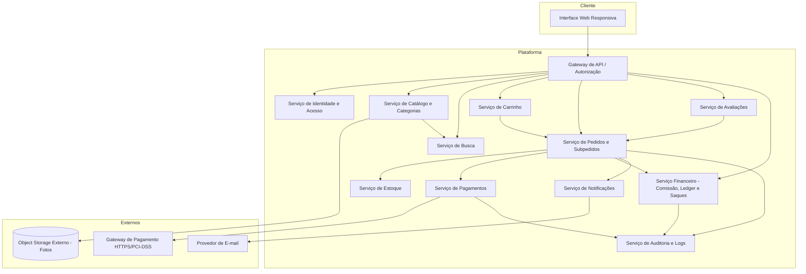
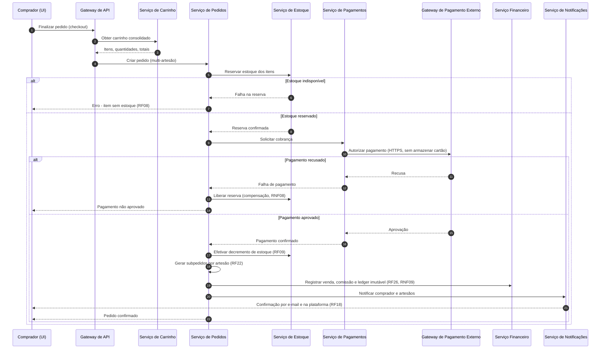

# Relatório Técnico de Arquitetura de Software
## Marketplace de Produtos Artesanais (M03) — AI4ES Time 2

---

## 1. Identificação das HUs

| HU | Perfil | Título | Requisitos Relacionados |
|----|--------|--------|------------------------|
| HU01 | Artesão | Cadastrar produto com fotos | RF04, RF06, RNF04 |
| HU02 | Artesão | Gerenciar estoque dos produtos | RF07, RF08, RF09, RNF08 |
| HU03 | Artesão | Acompanhar e atualizar status dos pedidos | RF19, RF20, RF21 |
| HU04 | Artesão | Visualizar painel financeiro | RF26, RF28, RF29, RNF06, RNF09 |
| HU05 | Artesão | Solicitar saque do saldo disponível | RF29, RF30, RNF09, RNF13 |
| HU06 | Artesão | Responder avaliações de compradores | RF25 |
| HU07 | Comprador | Navegar e pesquisar produtos | RF10, RF11, RF24, RNF05 |
| HU08 | Comprador | Adicionar itens ao carrinho e finalizar compra | RF13–RF18, RF22, RNF03, RNF08 |
| HU09 | Comprador | Acompanhar status dos pedidos | RF21, RF22 |
| HU10 | Comprador | Avaliar produto após entrega | RF23, RF24 |
| HU11 | Administrador | Gerenciar categorias da plataforma | RF12 |
| HU12 | Administrador | Configurar percentual de comissão | RF26, RF27, RNF13 |

Requisitos transversais (sem HU dedicada): RF01–RF03 (identidade e acesso), RNF01, RNF02, RNF07, RNF10, RNF11, RNF12.

---

## 2. Diagramas de Arquitetura (Mermaid)

### 2.1 Diagrama de Componentes (visão lógica)

### 2.2 Diagrama de Sequência — Finalização de Compra (HU08, RNF08)

### 2.3 Diagrama de Sequência — Solicitação de Saque (HU05)

```mermaid
sequenceDiagram
    autonumber
    participant A as Artesão (UI)
    participant GW as Gateway de API
    participant FIN as Serviço Financeiro
    participant LOG as Serviço de Auditoria
    participant NOT as Serviço de Notificações

    A->>GW: Solicitar saque com dados bancários
    GW->>FIN: Validar saldo disponível
    FIN->>FIN: Criar solicitação (pendente) e bloquear valor
    FIN->>LOG: Registrar evento imutável (RNF09, RNF13)
    FIN->>NOT: Notificar artesão
    FIN-->>A: Saldo atualizado com valor em processamento
```

---

## 3. Decisões de Arquitetura

| ID | Decisão | Justificativa | Requisitos |
|----|---------|---------------|-----------|
| DA01 | Separação em serviços lógicos por domínio (catálogo, pedidos, financeiro, avaliações) | Escalabilidade independente e clareza de responsabilidades; painel financeiro e catálogo têm SLAs de desempenho distintos | RNF05, RNF06, RNF12 |
| DA02 | Padrão de reserva-com-compensação (transação distribuída tipo saga) no checkout | Garante que falha de pagamento não decrementa estoque nem efetiva cobrança | RNF08, RF08, RF09 |
| DA03 | Ledger financeiro append-only (registros imutáveis) | Rastreabilidade de vendas, comissões e saques com data, valor e partes | RNF09, RF26, RF28 |
| DA04 | Snapshot do percentual de comissão no momento da venda | Alterações de comissão afetam apenas vendas futuras | RF27, HU12 |
| DA05 | Delegação total de dados de cartão ao gateway de pagamento (tokenização) | Conformidade PCI-DSS; nenhum dado sensível de cartão persiste no sistema | RNF03 |
| DA06 | Fotos em object storage externo com URLs referenciadas pelo catálogo | Desacoplamento do servidor de aplicação e escalabilidade de mídia | RNF04 |
| DA07 | Índice de busca dedicado, atualizado a partir do catálogo | Pesquisa parcial em tempo real e listagem ≤ 2s com grande volume | RF11, RNF05, HU07 |
| DA08 | Modelo de usuário único com múltiplos papéis (comprador + artesão + admin) | Autorização baseada em papéis atende RF03 e RNF01 | RF01–RF03, RNF01 |
| DA09 | Notificações assíncronas (e-mail e in-app) desacopladas do fluxo transacional | Falha de e-mail não deve impedir confirmação de pedido | RF18, RF19, HU03 |
| DA10 | Auditoria centralizada de eventos críticos | Logs de confirmação de pedido, falha de pagamento, saque e alteração de comissão | RNF13 |
| DA11 | Anonimização/minimização de dados pessoais e política de consentimento | Conformidade LGPD | RNF11 |

---

## 4. Tabela de Componentes e Rastreabilidade

| Componente | Responsabilidade Principal | Comunica-se com | Origem (HU / Critério de Aceite) |
|---|---|---|---|
| Interface Web Responsiva | Apresentação em desktop e mobile; navegadores modernos | Gateway de API | Todas as HUs; RNF07, RNF10 |
| Gateway de API / Autorização | Roteamento, autenticação de sessão, controle por perfil | Todos os serviços internos | RF02, RNF01 |
| Serviço de Identidade e Acesso | Cadastro, perfis múltiplos, hash seguro de senhas, sessão | Gateway | HU transversal; RF01–RF03, RNF02 |
| Serviço de Catálogo e Categorias | CRUD de produtos e categorias, publicação/despublicação, upload de fotos | Object Storage, Serviço de Busca | HU01, HU11; RF04–RF06, RF12 |
| Serviço de Busca | Indexação e pesquisa parcial em tempo real; filtro de estoque zerado | Catálogo, Estoque | HU07 (crit. 2 e 3); RF10, RF11, RNF05 |
| Serviço de Estoque | Reserva, decremento e liberação de estoque; bloqueio de estoque zero | Pedidos, Catálogo | HU02 (todos os critérios); RF07–RF09 |
| Serviço de Carrinho | Gestão de itens, quantidades e resumo consolidado | Catálogo, Pedidos | HU08 (crit. 1 e 2); RF13–RF15 |
| Serviço de Pedidos e Subpedidos | Criação de pedido multi-artesão, ciclo de vida de status, orquestração do checkout | Estoque, Pagamentos, Financeiro, Notificações | HU03, HU08, HU09; RF16, RF20–RF22 |
| Serviço de Pagamentos | Integração com gateway externo via HTTPS; tokenização; sem armazenar cartão | Gateway de Pagamento, Pedidos, Auditoria | HU08 (crit. 3 e 4); RF16, RF17, RNF03, RNF08 |
| Serviço Financeiro (Comissão/Ledger/Saques) | Cálculo e retenção de comissão, ledger imutável, saldo e saques | Pedidos, Auditoria, Notificações | HU04, HU05, HU12; RF26–RF30, RNF09 |
| Serviço de Avaliações | Notas, comentários, resposta única do artesão, média por produto | Pedidos (validar entrega), Catálogo | HU06, HU10; RF23–RF25 |
| Serviço de Notificações | E-mails e notificações in-app (pedido, status, saque) | Provedor de E-mail, UI | HU03 (crit. 3), HU08 (crit. 3); RF18, RF19 |
| Serviço de Auditoria e Logs | Registro de eventos críticos e trilha de auditoria | Pedidos, Pagamentos, Financeiro | HU12 (crit. 2); RNF13, RNF09 |
| Object Storage Externo | Armazenamento de fotos de produtos | Catálogo | HU01 (crit. 2); RNF04 |

---

## 5. Bloqueios e Pendências

| # | Item | Tipo | Impacto |
|---|------|------|---------|
| B01 | Método(s) de pagamento definitivos (cartão e/ou PIX) não decididos | Pendência de negócio | Contrato com o serviço de pagamentos e fluxo de checkout |
| B02 | Processo de liquidação de saques (manual pelo admin ou automático via transferência) não especificado | Bloqueio | Design do Serviço Financeiro e painel administrativo |
| B03 | Política de cancelamento/estorno de pedidos ausente nos requisitos | Pendência | Impacta estoque, ledger e comissão |
| B04 | Limites de tamanho/formato de fotos e quantidade máxima por produto não definidos | Pendência | Contrato com object storage e UX de upload |
| B05 | Definição de "tempo real" para atualização de status (HU09) — polling vs. push | Pendência técnica | Escolha do mecanismo de notificação in-app |
| B06 | Retenção e prazos LGPD (exclusão de conta, anonimização de histórico financeiro) não detalhados | Pendência de conformidade | Modelo de dados e ledger imutável vs. direito de exclusão |

---

## 6. Cobertura de Requisitos

| Requisito | Componente(s) Responsável(is) | Status |
|---|---|---|
| RF01–RF03 | Identidade e Acesso | Coberto |
| RF04–RF07 | Catálogo, Estoque, Object Storage | Coberto |
| RF08–RF09 | Estoque, Pedidos (saga) | Coberto |
| RF10–RF11 | Busca, Catálogo | Coberto |
| RF12 | Catálogo (categorias) | Coberto |
| RF13–RF15 | Carrinho | Coberto |
| RF16–RF18 | Pedidos, Pagamentos, Notificações | Coberto |
| RF19–RF22 | Pedidos, Notificações | Coberto |
| RF23–RF25 | Avaliações | Coberto |
| RF26–RF30 | Financeiro, Auditoria | Coberto |
| RNF01–RNF03 | Gateway/IAM, Pagamentos | Coberto |
| RNF04 | Object Storage | Coberto |
| RNF05–RNF06 | Busca, Financeiro (agregações pré-calculadas) | Coberto |
| RNF07, RNF10 | Interface Web | Coberto |
| RNF08 | Saga de checkout (DA02) | Coberto |
| RNF09 | Ledger imutável (DA03) | Coberto |
| RNF11 | Transversal (DA11) | Parcial — ver B06 |
| RNF12 | Arquitetura distribuída (DA01) | Coberto (requer estratégia operacional) |
| RNF13 | Auditoria e Logs | Coberto |

**Cobertura: 30/30 RFs cobertos; 12/13 RNFs plenamente cobertos, 1 parcial (RNF11).**

---

## 7. Gap Analysis

| # | Lacuna | Impacto Arquitetural | Ação Recomendada |
|---|--------|----------------------|------------------|
| G01 | Ausência de fluxo de cancelamento, estorno e devolução | Saga de compensação incompleta; ledger imutável precisa suportar lançamentos de estorno (nunca alteração) | Especificar estados adicionais de pedido e lançamentos compensatórios no ledger |
| G02 | Concorrência de estoque (dois compradores no último item) não especificada | Requer reserva com controle de concorrência e expiração de reserva no checkout | Definir TTL de reserva e política de conflito (first-commit-wins) |
| G03 | Recuperação de senha e verificação de e-mail ausentes | Fluxos de identidade incompletos; risco de contas fraudulentas de artesãos | Adicionar RFs de recuperação/verificação e possível validação de vendedor |
| G04 | Regra de liberação de saldo (imediata na confirmação vs. após entrega) indefinida | Modelo do Serviço Financeiro muda substancialmente (escrow vs. crédito imediato) | Decidir com o negócio; recomenda-se liberar saldo apenas após "entregue" |
| G05 | "Tempo real" na busca e no status sem métrica objetiva | Escolha entre índice síncrono/assíncrono e push/polling | Definir SLA (ex.: indexação ≤ 5s; status ≤ 10s) |
| G06 | Conflito potencial entre ledger imutável (RNF09) e direito de exclusão LGPD (RNF11) | Necessidade de pseudonimização das partes no ledger | Projetar ledger com identificadores pseudônimos e chave de resolução destrutível |
| G07 | Moderação de conteúdo (avaliações e respostas) não prevista | Risco reputacional/legal; resposta do artesão é irreversível por critério de HU06 | Incluir mecanismo de denúncia e moderação administrativa |
| G08 | Falta de definição de frete/entrega (custo, endereço, rastreio) | Checkout e subpedidos podem exigir cálculo de frete por artesão | Levantar requisitos de logística antes da implementação do checkout |
| G09 | Percentual de comissão único vs. por categoria/artesão | Modelo de configuração da comissão pode precisar de granularidade | Confirmar escopo com o negócio; snapshot por venda (DA04) permanece válido |
| G10 | Ausência de requisitos de observabilidade além de logs críticos | Disponibilidade de 99,5% exige monitoramento e alertas | Definir métricas, health checks e estratégia de resiliência entre serviços |

---
*Fim do Relatório Canônico — AI4ES Time 2 — Marketplace de Produtos Artesanais (M03).*