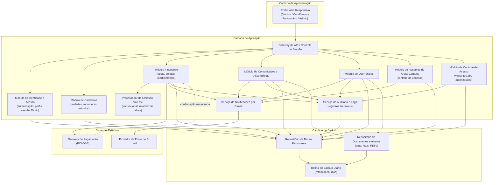
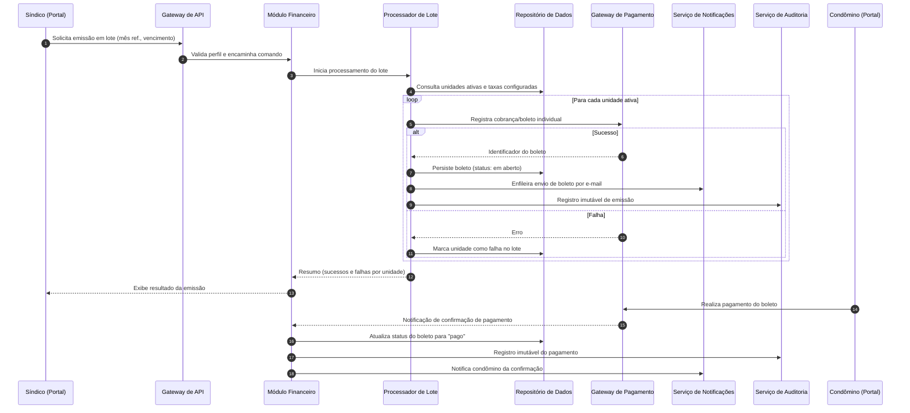
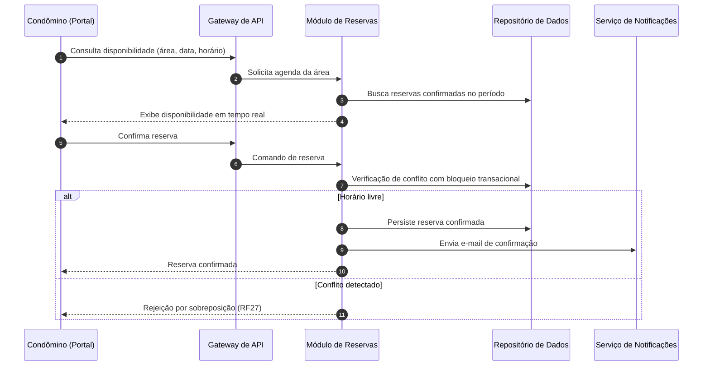

# Relatório Técnico de Arquitetura de Software
## Sistema de Gestão de Condomínio Residencial (M04) — AI4ES Time 2

---

## 1. Identificação das HUs

| HU | Perfil | Título | RFs Relacionados |
|----|--------|--------|------------------|
| HU01 | Síndico | Cadastrar unidades e moradores | RF04, RF05, RF06, RF07, RF08 |
| HU02 | Síndico | Emitir boletos em lote | RF09, RF10, RF13, RNF11 |
| HU03 | Síndico | Acompanhar inadimplências | RF15, RNF08 |
| HU04 | Síndico | Publicar comunicados | RF16, RF17 |
| HU05 | Síndico | Gerenciar ocorrências | RF23, RF24 |
| HU06 | Síndico | Criar e registrar assembleias | RF18, RF19 |
| HU07 | Síndico | Gerenciar áreas comuns e reservas | RF25, RF28, RF29 |
| HU08 | Condômino | Visualizar e pagar boleto pelo portal | RF10, RF11, RF12 |
| HU09 | Condômino | Reservar área comum | RF26, RF27 |
| HU10 | Condômino | Registrar e acompanhar ocorrência | RF21, RF24 |
| HU11 | Condômino | Pré-autorizar entrada de visitante | RF31 |
| HU12 | Condômino | Acompanhar assembleias e consultar atas | RF20 |
| HU13 | Funcionário | Registrar entrada e saída de visitantes | RF30, RF33, RNF06 |
| HU14 | Funcionário | Consultar pré-autorizações de acesso | RF32 |

Requisitos transversais sem HU dedicada: RF01–RF03 (identidade e acesso), RF14 (pagamento manual), RF22 (ocorrência interna por funcionário), RNF01–RNF13.

---

## 2. Diagramas de Arquitetura (Mermaid)

### 2.1 Diagrama de Componentes (visão lógica)

### 2.2 Diagrama de Sequência — Emissão de Boletos em Lote e Pagamento (HU02 / HU08)

### 2.3 Diagrama de Sequência — Reserva de Área Comum com Controle de Conflito (HU09)

---

## 3. Decisões de Arquitetura

| ID | Decisão | Justificativa | Requisitos |
|----|---------|---------------|------------|
| DA01 | Arquitetura modular por domínio (Cadastros, Financeiro, Comunicação, Ocorrências, Reservas, Acesso) atrás de um Gateway de API único | Coesão por contexto de negócio, evolução independente e manutenibilidade | Todos os RFs, RNF13 |
| DA02 | Controle de acesso baseado em papéis (RBAC) centralizado no Módulo de Identidade | Perfis distintos com permissões diferenciadas | RF01–RF03, RNF01 |
| DA03 | Sessões com expiração por inatividade (30 min) gerenciadas no Gateway/IAM; senhas com hash criptográfico forte com salt | Requisito explícito de segurança | RNF01, RNF02 |
| DA04 | Integração com gateway de pagamento por delegação total: nenhum dado de cartão transita ou é armazenado no sistema; confirmação via callback assíncrono | Conformidade PCI-DSS e atualização automática de status | RF11, RF12, RNF03 |
| DA05 | Emissão em lote como processo assíncrono idempotente com granularidade por unidade: falha em uma unidade não afeta as demais; relatório final de falhas | Confiabilidade transacional exigida | RF13, RNF11, HU02 |
| DA06 | Trilha de auditoria append-only (imutável) para operações financeiras, acessos de visitantes e eventos críticos | Rastreabilidade e logs obrigatórios | RNF05, RNF06, RNF13 |
| DA07 | Exclusão lógica (soft delete) para moradores e entidades com histórico | Desativar sem perder histórico | RF07 |
| DA08 | Serviço de Notificações desacoplado, consumindo eventos de domínio (comunicado publicado, status de ocorrência alterado, reserva confirmada, boleto emitido) | Evita acoplamento entre módulos e o provedor de e-mail; resiliência a falhas de envio | RF17, RF24, HU02, HU09 |
| DA09 | Controle de concorrência transacional (bloqueio ou restrição de unicidade por área+intervalo) na criação de reservas | Impedir reservas sobrepostas mesmo sob acesso simultâneo | RF27 |
| DA10 | Painel de inadimplência com consultas otimizadas (agregações pré-calculadas ou visões materializadas conceituais) | Carregamento ≤ 3s | RF15, RNF08 |
| DA11 | Minimização e governança de dados pessoais: base legal registrada, retenção definida, anonimização de visitantes após prazo | Conformidade LGPD | RNF04 |
| DA12 | Repositório de documentos separado do repositório transacional para atas, anexos e fotos | Escalabilidade de armazenamento binário e backup diferenciado | HU06, HU10, RF19 |
| DA13 | Backup automatizado diário com retenção mínima de 90 dias e teste periódico de restauração | Requisito explícito | RNF12 |
| DA14 | Interface web responsiva única (mobile-first) compatível com navegadores modernos | Usabilidade e compatibilidade | RNF09, RNF10 |
| DA15 | Redundância na camada de aplicação e monitoramento de disponibilidade para SLA de 99,5% | Disponibilidade 24/7 | RNF07 |

---

## 4. Tabela de Componentes e Rastreabilidade

| Componente | Responsabilidade Principal | Comunica-se com | Origem (HU / Critério de Aceite) |
|---|---|---|---|
| Portal Web Responsivo | Interface única para todos os perfis, adaptável a mobile/desktop | Gateway de API | Todas as HUs; RNF09, RNF10 |
| Gateway de API | Ponto único de entrada; roteamento, autorização por perfil, controle de sessão | Todos os módulos, IAM | RF02, RNF01 |
| Módulo de Identidade e Acesso (IAM) | Cadastro de usuários, autenticação, perfis, hash de senhas, expiração de sessão | Gateway, Repositório | RF01–RF03; RNF01, RNF02 |
| Módulo de Cadastros | CRUD de unidades, moradores (proprietário/inquilino), veículos; soft delete; unicidade de CPF | Repositório, Auditoria | HU01 (CPF único, campos obrigatórios); RF04–RF08 |
| Módulo Financeiro | Configuração de taxas, emissão individual, pagamento manual, painel de inadimplência com filtros e exportação CSV | Gateway de Pagamento, Processador de Lote, Repositório, Notificações, Auditoria | HU02, HU03, HU08; RF09–RF15 |
| Processador de Emissão em Lote | Emissão mensal por unidade ativa, isolamento de falhas, relatório de unidades afetadas | Módulo Financeiro, Gateway de Pagamento, Repositório, Notificações | HU02 (indicar unidades que falharam); RF13, RNF11 |
| Módulo de Comunicados e Assembleias | Publicação e fixação de comunicados; assembleias, atas e anexos | Notificações, Repositório de Documentos, Auditoria | HU04, HU06, HU12; RF16–RF20 |
| Módulo de Ocorrências | Registro (condômino/funcionário), categorização, ciclo de status, histórico, anexos de fotos | Notificações, Repositório, Repositório de Documentos, Auditoria | HU05, HU10; RF21–RF24 |
| Módulo de Reservas | Cadastro de áreas, regras (antecedência, horários), reservas sem sobreposição, cancelamentos, calendário | Repositório, Notificações | HU07, HU09; RF25–RF29, RNF08 |
| Módulo de Controle de Acesso | Registro de entrada/saída de visitantes, pré-autorizações e vínculo entre ambos, histórico por unidade | Repositório, Auditoria | HU11, HU13, HU14; RF30–RF33, RNF06 |
| Serviço de Notificações | Envio assíncrono de e-mails orientado a eventos de domínio | Provedor de E-mail, módulos de domínio | RF17, RF24; critérios de e-mail em HU02, HU04, HU05, HU09, HU10 |
| Serviço de Auditoria e Logs | Registro imutável de operações financeiras, acessos e eventos críticos | Repositório (append-only) | RNF05, RNF06, RNF13 |
| Repositório de Dados Persistente | Persistência transacional de todas as entidades | Todos os módulos, Backup | Todos os RFs; RNF12 |
| Repositório de Documentos | Armazenamento de atas, anexos e fotos | Módulos de Comunicação e Ocorrências, Backup | HU06, HU10 |
| Rotina de Backup | Backup diário com retenção de 90 dias | Repositórios | RNF12 |

---

## 5. Bloqueios e Pendências

| # | Tipo | Descrição | Impacto |
|---|------|-----------|---------|
| B01 | Bloqueio | Gateway de pagamento não especificado (contrato de integração, formatos de callback, suporte a boleto bancário) | Impede fechamento do design da integração financeira (RF11, RF12) |
| B02 | Bloqueio | Ausência de definição do provedor/contrato de envio de e-mails e política de retentativa | Afeta garantias de notificação "imediata" (HU04) |
| P01 | Pendência | Regras de cálculo da taxa: reajustes, multa e juros por atraso não especificados | Painel de inadimplência exibe valor — original ou corrigido? |
| P02 | Pendência | Prazo de retenção de dados de visitantes (LGPD) não definido | Necessário para DA11 |
| P03 | Pendência | Política de recuperação de senha e primeiro acesso não especificada | Fluxo de IAM incompleto |
| P04 | Pendência | Definição de "sessão inativa" (frontend, backend ou ambos) requer alinhamento | RNF01 |
| P05 | Pendência | Limites de tamanho/formato de anexos (atas, fotos) não definidos | Dimensionamento do repositório de documentos |
| P06 | Pendência | Fuso horário e regras de calendário (feriados) para reservas e vencimentos | RF26–RF28 |

---

## 6. Cobertura de Requisitos

| Requisito | Coberto por | Status |
|-----------|-------------|--------|
| RF01–RF03 | IAM, Gateway de API | ✅ Coberto |
| RF04–RF08 | Módulo de Cadastros (soft delete p/ RF07) | ✅ Coberto |
| RF09–RF12 | Módulo Financeiro + Gateway de Pagamento | ✅ Coberto (dep. B01) |
| RF13 | Processador de Lote | ✅ Coberto |
| RF14–RF15 | Módulo Financeiro (registro manual auditado; painel) | ✅ Coberto |
| RF16–RF20 | Módulo de Comunicados e Assembleias + Notificações + Documentos | ✅ Coberto |
| RF21–RF24 | Módulo de Ocorrências + Notificações | ✅ Coberto |
| RF25–RF29 | Módulo de Reservas (DA09 p/ RF27) | ✅ Coberto |
| RF30–RF33 | Módulo de Controle de Acesso + Auditoria | ✅ Coberto |
| RNF01–RNF02 | IAM/Gateway (DA02, DA03) | ✅ Coberto |
| RNF03 | DA04 (delegação PCI-DSS) | ✅ Coberto (dep. B01) |
| RNF04 | DA11 | ⚠️ Parcial (dep. P02) |
| RNF05–RNF06 | Serviço de Auditoria (DA06) | ✅ Coberto |
| RNF07 | DA15 | ✅ Coberto |
| RNF08 | DA10 | ✅ Coberto |
| RNF09–RNF10 | DA14 | ✅ Coberto |
| RNF11 | DA05 | ✅ Coberto |
| RNF12 | Rotina de Backup (DA13) | ✅ Coberto |
| RNF13 | Serviço de Auditoria e Logs | ✅ Coberto |

**Cobertura: 33/33 RFs mapeados; 12/13 RNFs plenamente cobertos; 1 parcial (RNF04, dependente de decisão de negócio).**

---

## 7. Gap Analysis

| # | Lacuna | Impacto Arquitetural | Ação Recomendada |
|---|--------|----------------------|-------------------|
| G01 | Multas/juros sobre boletos vencidos não especificados | Motor de cálculo financeiro pode exigir componente de regras de cobrança; afeta painel (RF15) e valor exibido ao condômino | Elicitar regras de correção com o negócio antes do design detalhado do Módulo Financeiro |
| G02 | Ausência de fluxo de aprovação de reservas (todas são confirmadas automaticamente?) | HU09 diz "confirmada imediatamente", mas certas áreas podem exigir aprovação do síndico; muda máquina de estados da reserva | Confirmar com stakeholders; projetar estados extensíveis (solicitada → confirmada/cancelada) |
| G03 | Não há requisito de gestão de segunda via/cancelamento de boleto individual | Correções de emissão errada exigirão intervenção fora do sistema; risco à trilha imutável | Adicionar RF de estorno/cancelamento com registro de auditoria compensatório |
| G04 | Sem definição de retenção e anonimização de dados de visitantes e ex-moradores (LGPD) | Auditoria imutável (RNF05/06) pode conflitar com direito ao apagamento; requer estratégia de pseudonimização | Definir política de dados com DPO; projetar auditoria com pseudonimização de identificadores pessoais |
| G05 | Falha no envio de e-mail não tem comportamento definido (retentativas, fila, dead-letter) | Notificações "imediatas" (HU04) sem garantia de entrega podem gerar reclamações | Especificar SLA de notificação e projetar fila com retentativas e registro de falhas |
| G06 | Perfil "administrador" citado em RF01 sem nenhuma funcionalidade descrita | Escopo de permissões indefinido; risco de super-usuário sem controle | Elicitar responsabilidades do administrador; aplicar princípio de menor privilégio |
| G07 | Não há requisito de multi-condomínio (o sistema atende um único condomínio?) | Decisão de multi-tenancy afeta profundamente modelo de dados e isolamento | Confirmar escopo; se multi-condomínio, incluir isolamento lógico por tenant desde o início |
| G08 | Concorrência entre pré-autorizações e cancelamento durante registro de entrada (HU11/HU13) | Condição de corrida: condômino cancela enquanto porteiro registra | Definir regra de precedência e aplicar verificação transacional no vínculo pré-autorização↔visita |
| G09 | Exportação CSV (HU03) sem definição de volume máximo e campos | Exportações grandes podem violar RNF08 se síncronas | Definir geração assíncrona para volumes elevados, com notificação ao concluir |
| G10 | Ausência de requisitos de acessibilidade (além de responsividade) | Portais condominiais atendem público idoso; risco de exclusão de usuários | Recomendar adoção de diretrizes de acessibilidade web como RNF adicional |

---

*Fim do Relatório Canônico de Arquitetura — AI4ES Time 2.*