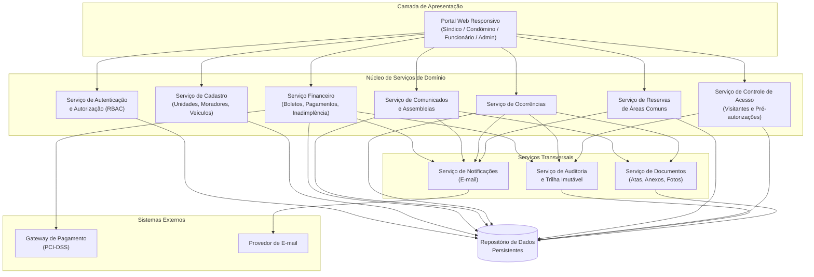
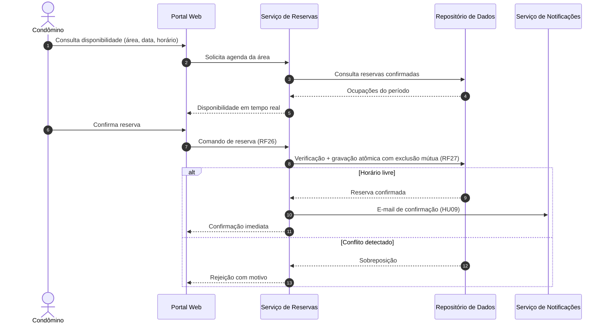

# Relatório Técnico de Arquitetura de Software
## Sistema de Administração de Condomínio Residencial (M04) — AI4ES Time 2

---

## 1. Identificação das HUs

| HU | Perfil | Título | RFs Relacionados | RNFs Relacionados |
|------|-----------|--------------------------------------------------|--------------------------|--------------------|
| HU01 | Síndico | Cadastrar unidades e moradores | RF04, RF05, RF06, RF07, RF08 | RNF04 |
| HU02 | Síndico | Emitir boletos em lote | RF09, RF10, RF13 | RNF05, RNF11, RNF13 |
| HU03 | Síndico | Acompanhar inadimplências | RF15 | RNF08 |
| HU04 | Síndico | Publicar comunicados | RF16, RF17 | RNF13 |
| HU05 | Síndico | Gerenciar ocorrências | RF23, RF24 | RNF13 |
| HU06 | Síndico | Criar e registrar assembleias | RF18, RF19 | — |
| HU07 | Síndico | Gerenciar áreas comuns e reservas | RF25, RF28, RF29 | RNF08 |
| HU08 | Condômino | Visualizar e pagar boleto pelo portal | RF10, RF11, RF12 | RNF03, RNF05 |
| HU09 | Condômino | Reservar área comum | RF26, RF27 | RNF08 |
| HU10 | Condômino | Registrar e acompanhar ocorrência | RF21, RF24 | RNF13 |
| HU11 | Condômino | Pré-autorizar entrada de visitante | RF31 | RNF04 |
| HU12 | Condômino | Acompanhar assembleias e consultar atas | RF20 | — |
| HU13 | Funcionário | Registrar entrada e saída de visitantes | RF30, RF22 | RNF06 |
| HU14 | Funcionário | Consultar pré-autorizações de acesso | RF32, RF33 | RNF06 |

**Requisitos transversais (sem HU dedicada):** RF01, RF02, RF03 (gestão de usuários/autenticação), RF14 (registro manual de pagamento — coberto parcialmente pelo domínio Financeiro), RNF01, RNF02, RNF07, RNF09, RNF10, RNF12.

---

## 2. Diagramas de Arquitetura (Mermaid)

### 2.1 Diagrama de Componentes (visão lógica)

### 2.2 Diagrama de Sequência — Emissão de Boletos em Lote e Pagamento (HU02 / HU08)

```mermaid
sequenceDiagram
    autonumber
    actor S as Síndico
    participant P as Portal Web
    participant A as Serviço de Autorização
    participant F as Serviço Financeiro
    participant R as Repositório de Dados
    participant N as Serviço de Notificações
    participant AU as Serviço de Auditoria
    participant G as Gateway de Pagamento
    actor C as Condômino

    S->>P: Solicita emissão em lote (mês ref., vencimento)
    P->>A: Valida perfil "síndico" (RF02)
    A-->>P: Autorizado
    P->>F: Comando de emissão em lote (RF13)
    F->>R: Consulta unidades ativas e taxas (RF09)
    R-->>F: Lista de unidades + valores
    loop Para cada unidade ativa
        F->>G: Solicita geração do boleto (RF11)
        alt Sucesso
            G-->>F: Boleto gerado
            F->>R: Persiste boleto "em aberto"
            F->>AU: Registro imutável de emissão (RNF05)
            F->>N: Envia boleto por e-mail (HU02)
        else Falha
            G-->>F: Erro
            F->>R: Marca unidade como "falha de emissão" (RNF11)
        end
    end
    F-->>P: Resultado consolidado (sucessos e falhas)
    P-->>S: Exibe relatório da emissão

    C->>G: Efetua pagamento do boleto
    G-->>F: Webhook de confirmação de pagamento (RF11)
    F->>R: Atualiza status para "pago" (RF12)
    F->>AU: Registro imutável de pagamento (RNF05)
    F->>N: Confirma pagamento ao condômino
```

### 2.3 Diagrama de Sequência — Reserva de Área Comum com Prevenção de Sobreposição (HU09)

---

## 3. Decisões de Arquitetura

| ID | Decisão | Justificativa | Requisitos Atendidos |
|------|---------|---------------|----------------------|
| DA01 | **Núcleo modular por domínio** (Cadastro, Financeiro, Comunicação, Ocorrências, Reservas, Acesso) com interfaces bem definidas | Isolamento de mudanças, manutenibilidade e mapeamento direto com áreas de requisitos | Todos os RFs; RNF13 |
| DA02 | **Controle de acesso baseado em papéis (RBAC)** centralizado em serviço de autorização | Perfis distintos com permissões diferentes; ponto único de política | RF01–RF03, RNF01 |
| DA03 | **Armazenamento de senhas exclusivamente via hash criptográfico com salt (algoritmo adaptativo, ex.: bcrypt, citado no requisito)** | Requisito literal | RNF02 |
| DA04 | **Delegação integral do processamento de cartão ao gateway externo**; o sistema armazena apenas referências e status de transação | Conformidade PCI-DSS; nenhum dado de cartão em domínio próprio | RNF03, RF11, RF12 |
| DA05 | **Confirmação de pagamento assíncrona via callback/webhook do gateway**, com mecanismo de reconciliação | Atualização automática de status resiliente a falhas de rede | RF12 |
| DA06 | **Emissão em lote com processamento por unidade com isolamento de falhas** (padrão "melhor esforço com relatório de exceções") | Falha parcial não pode corromper as demais emissões | RF13, RNF11, HU02 |
| DA07 | **Trilha de auditoria imutável (append-only)** para operações financeiras e acessos de visitantes | Rastreabilidade forense; registros não editáveis nem excluíveis | RNF05, RNF06, RNF13 |
| DA08 | **Exclusão lógica (soft delete)** para moradores e entidades com histórico | Desativar sem perder histórico | RF07 |
| DA09 | **Serviço de notificações desacoplado** consumindo eventos de domínio (comunicado publicado, status alterado, boleto emitido, reserva confirmada) | Um único ponto de envio de e-mail; evita acoplamento entre domínios | RF17, RF24, HU02, HU05, HU06, HU09 |
| DA10 | **Controle de concorrência com exclusão mútua na gravação de reservas** (verificação e gravação em operação atômica) | Impedir sobreposição sob concorrência | RF27 |
| DA11 | **Serviço de documentos** para atas, anexos de PDF e fotos de ocorrências, com metadados vinculados às entidades de domínio | Anexos requeridos por HU06 e HU10 | RF19, HU06, HU10 |
| DA12 | **Sessões com expiração por inatividade (30 min)** gerenciadas pelo serviço de autenticação | Requisito literal de segurança | RNF01, RF03 |
| DA13 | **Estratégia de dados pessoais aderente à LGPD**: minimização, base legal registrada, retenção de visitantes definida, anonimização em desativações onde aplicável | Conformidade legal | RNF04 |
| DA14 | **Consultas de painel (inadimplência, calendário) com modelo de leitura otimizado**/agregações pré-computadas quando necessário | Carga em até 3 segundos | RNF08, RF15, RF29 |
| DA15 | **Backup automatizado diário com retenção ≥ 90 dias e testes periódicos de restauração** | Requisito literal | RNF12 |

---

## 4. Tabela de Componentes e Rastreabilidade

| Componente | Responsabilidade Principal | Comunica-se com | Origem (HU / Critério de Aceite) |
|---|---|---|---|
| Portal Web Responsivo | Interface única para todos os perfis; renderização responsiva multi-dispositivo e multi-navegador | Todos os serviços de domínio; Serviço de Autenticação | Todas as HUs; RNF09, RNF10 |
| Serviço de Autenticação e Autorização | Login/logout, sessões com timeout de 30 min, RBAC por perfil, hash de senhas | Portal; Repositório de Dados | RF01–RF03; RNF01, RNF02 |
| Serviço de Cadastro | CRUD de unidades, moradores (proprietário/inquilino), veículos; desativação lógica; unicidade de CPF | Portal; Repositório; Auditoria | HU01 (CA: CPF único, bloco/número obrigatórios, múltiplos moradores por unidade); RF04–RF08 |
| Serviço Financeiro | Configuração de taxas, emissão individual e em lote, registro manual de pagamento, painel de inadimplência com filtros e exportação CSV | Gateway de Pagamento; Notificações; Auditoria; Repositório | HU02 (CA: mês ref., relatório de falhas), HU03 (CA: filtros, CSV), HU08; RF09–RF15; RNF05, RNF11 |
| Serviço de Comunicados e Assembleias | Publicação e fixação de comunicados; criação de assembleias; registro de atas com anexos | Notificações; Documentos; Repositório | HU04 (CA: fixar no topo, e-mail imediato), HU06 (CA: anexos em PDF), HU12; RF16–RF20 |
| Serviço de Ocorrências | Registro por condôminos/funcionários; categorização; fluxo de status (aberta → em andamento → encerrada); histórico | Notificações; Documentos; Auditoria; Repositório | HU05 (CA: filtros, notificação por mudança), HU10 (CA: fotos, histórico); RF21–RF24 |
| Serviço de Reservas | Cadastro de áreas comuns e regras; reserva com bloqueio de sobreposição; cancelamento dentro do prazo; calendário consolidado | Notificações; Repositório | HU07 (CA: antecedência mín/máx, cancelamento pelo síndico), HU09 (CA: disponibilidade em tempo real); RF25–RF29; RNF08 |
| Serviço de Controle de Acesso | Registro de entrada/saída de visitantes; pré-autorizações; vinculação de entrada à pré-autorização; histórico consultável | Auditoria; Repositório | HU11 (CA: cancelamento antes da visita), HU13 (CA: destaque de pré-autorização, encerramento na saída), HU14 (CA: vínculo); RF30–RF33; RNF06 |
| Serviço de Notificações | Composição e envio de e-mails a partir de eventos de domínio; controle de falhas de entrega | Provedor de E-mail; serviços de domínio | HU02, HU04, HU05, HU06, HU09, HU10; RF17, RF24 |
| Serviço de Auditoria | Registro imutável de operações financeiras, acessos e eventos críticos com usuário/data/hora | Repositório (append-only) | RNF05, RNF06, RNF13 |
| Serviço de Documentos | Armazenamento e recuperação de atas, PDFs e fotos com metadados e controle de acesso | Repositório; serviços de domínio | HU06 (CA: anexos), HU10 (CA: fotos), HU12 (CA: download de PDF) |
| Adaptador de Gateway de Pagamento | Geração de boletos, recepção de webhooks, reconciliação; nenhum dado de cartão persistido | Serviço Financeiro; Gateway externo | RF11, RF12; RNF03 |
| Módulo de Backup e Retenção | Backup diário automatizado; retenção mínima de 90 dias | Repositório de Dados | RNF12 |

---

## 5. Bloqueios e Pendências

| # | Tipo | Descrição | Impacto | Ação Requerida |
|---|------|-----------|---------|----------------|
| B01 | Bloqueio | Gateway de pagamento não especificado (contrato de API, suporte a webhook, formatos de boleto) | Impede fechamento do design do Adaptador de Pagamento (DA04/DA05) | Product Owner definir fornecedor ou contrato conceitual mínimo |
| B02 | Pendência | Perfil "administrador" (RF01) não possui nenhuma HU ou RF que descreva suas capacidades | Matriz de permissões RBAC incompleta | Elicitar responsabilidades do administrador |
| B03 | Pendência | Prazo de cancelamento de reserva (RF28) é "configurável pelo síndico", mas não há RF de tela/fluxo de configuração global | Modelo de configuração indefinido | Confirmar escopo do módulo de parametrização |
| B04 | Pendência | Política de retenção LGPD para dados de visitantes (RNF04 × RNF06) não define prazo de guarda | Risco de conformidade | Definir prazos com jurídico |
| B05 | Pendência | Falta definição de fluxo de recuperação/redefinição de senha | Lacuna funcional de autenticação | Especificar RF complementar |
| B06 | Pendência | RF14 (pagamento manual) não possui HU nem critérios de aceite (comprovante? estorno?) | Risco de retrabalho no domínio financeiro | Detalhar história com o síndico |

---

## 6. Cobertura de Requisitos

| Requisito | Status | Componente Responsável |
|-----------|--------|------------------------|
| RF01–RF03 | ✅ Coberto | Serviço de Autenticação e Autorização |
| RF04–RF08 | ✅ Coberto | Serviço de Cadastro |
| RF09–RF15 | ✅ Coberto (RF14 com pendência B06) | Serviço Financeiro + Adaptador de Gateway |
| RF16–RF20 | ✅ Coberto | Serviço de Comunicados e Assembleias + Notificações + Documentos |
| RF21–RF24 | ✅ Coberto | Serviço de Ocorrências + Notificações |
| RF25–RF29 | ✅ Coberto | Serviço de Reservas |
| RF30–RF33 | ✅ Coberto | Serviço de Controle de Acesso |
| RNF01–RNF02 | ✅ Coberto | Autenticação (DA03, DA12) |
| RNF03 | ✅ Coberto | Adaptador de Gateway (DA04) |
| RNF04 | ⚠️ Parcial | Transversal (DA13) — depende de B04 |
| RNF05–RNF06 | ✅ Coberto | Serviço de Auditoria (DA07) |
| RNF07 | ⚠️ Parcial | Requisito operacional; exige definição de topologia de implantação (fora do escopo do design lógico) |
| RNF08 | ✅ Coberto | Modelos de leitura otimizados (DA14) |
| RNF09–RNF10 | ✅ Coberto | Portal Web Responsivo |
| RNF11 | ✅ Coberto | Serviço Financeiro (DA06) |
| RNF12 | ✅ Coberto | Módulo de Backup e Retenção (DA15) |
| RNF13 | ✅ Coberto | Serviço de Auditoria + logging transversal |

**Resumo:** 33/33 RFs cobertos (1 com pendência de detalhamento); 13/13 RNFs endereçados (2 parciais dependentes de decisões externas).

---

## 7. Gap Analysis

| # | Lacuna Identificada | Impacto Arquitetural | Ação Recomendada |
|---|---------------------|----------------------|------------------|
| G01 | **Multitenancy não especificado**: o sistema atende um único condomínio ou vários? | Afeta modelo de dados, isolamento de segurança e RBAC de forma estrutural — mudança tardia é custosa | Decidir antes do início do desenvolvimento; se multi-condomínio, incluir dimensão de tenant em todas as entidades |
| G02 | **Ciclo de vida do boleto incompleto**: não há regras para 2ª via, juros/multa por atraso, cancelamento ou estorno | Domínio financeiro pode exigir máquina de estados mais rica que "em aberto/pago/vencido" | Modelar máquina de estados completa do boleto com o PO antes da implementação do Serviço Financeiro |
| G03 | **Ausência de fluxo de aprovação/penalidade em reservas**: cancelamento fora do prazo, no-show e limites de reservas por unidade não são tratados | Regras de negócio adicionais no Serviço de Reservas | Elicitar regras de uso; projetar motor de regras configurável por área |
| G04 | **Direitos do titular LGPD** (acesso, correção, exclusão/anonimização de dados) sem RF correspondente | Necessidade de rotinas de anonimização compatíveis com trilha de auditoria imutável (tensão RNF04 × RNF05/06) | Definir estratégia de pseudonimização nos registros de auditoria |
| G05 | **Canal de notificação único (e-mail)** sem tratamento de falha de entrega ou preferências do usuário | Serviço de Notificações precisa de fila de reenvio e status de entrega | Especificar política de retentativa e registro de falhas de envio |
| G06 | **Volumetria e concorrência não estimadas** (nº de unidades, picos de emissão em lote) | Dimensionamento do processamento em lote (DA06) e do modelo de leitura (DA14) sem base quantitativa | Levantar volumetria esperada e definir metas de throughput do lote |
| G07 | **Funcionário sem gestão própria**: não há RF de cadastro/desligamento de funcionários nem de turnos de portaria | Cadastro incompleto; auditoria de acesso (RNF06) referencia "funcionário responsável" | Complementar RFs de gestão de funcionários |
| G08 | **Acessibilidade não mencionada** (apenas responsividade) | Portal pode nascer sem conformidade a padrões de acessibilidade | Incluir requisito de acessibilidade (ex.: conformidade com diretrizes reconhecidas) no backlog de UI |
| G09 | **Assembleia sem controle de presença/votação digital** — atas mencionam "listas de presença em PDF" apenas como anexo | Se votação digital for desejada futuramente, o Serviço de Comunicados/Assembleias exigirá extensão significativa | Confirmar com o PO se registro de presença/votação está fora do escopo do MVP e documentar a decisão |

---

*Fim do Relatório Canônico — AI4ES Time 2. Documento sujeito a revisão após resolução dos bloqueios B01–B06.*