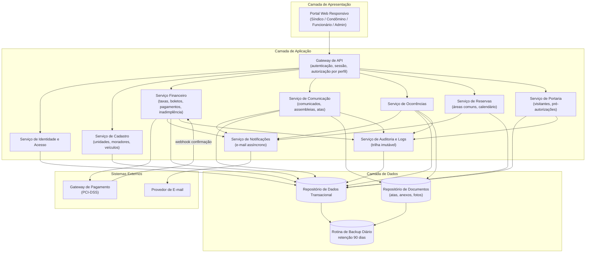
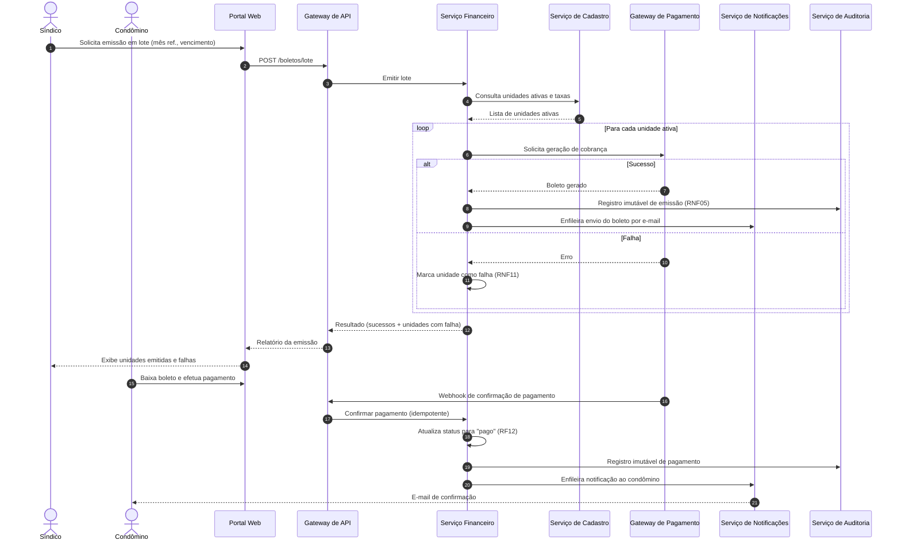
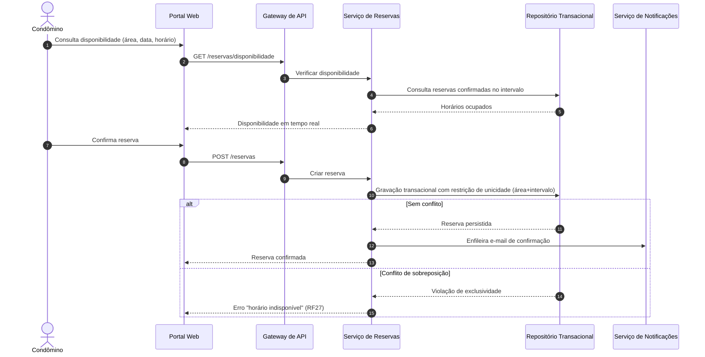

# Relatório Técnico de Arquitetura de Software
## Sistema de Gestão de Condomínio Residencial (M04) — AI4ES Time 2

---

## 1. Identificação das HUs

| HU | Perfil | Título | RFs Relacionados |
|----|--------|--------|------------------|
| HU01 | Síndico | Cadastrar unidades e moradores | RF04, RF05, RF06, RF07, RF08 |
| HU02 | Síndico | Emitir boletos em lote | RF09, RF10, RF13, RNF11 |
| HU03 | Síndico | Acompanhar inadimplências | RF14, RF15, RNF08 |
| HU04 | Síndico | Publicar comunicados | RF16, RF17 |
| HU05 | Síndico | Gerenciar ocorrências | RF23, RF24 |
| HU06 | Síndico | Criar e registrar assembleias | RF18, RF19 |
| HU07 | Síndico | Gerenciar áreas comuns e reservas | RF25, RF28, RF29 |
| HU08 | Condômino | Visualizar e pagar boleto pelo portal | RF10, RF11, RF12 |
| HU09 | Condômino | Reservar área comum | RF26, RF27 |
| HU10 | Condômino | Registrar e acompanhar ocorrência | RF21, RF24 |
| HU11 | Condômino | Pré-autorizar entrada de visitante | RF31 |
| HU12 | Condômino | Acompanhar assembleias e consultar atas | RF20 |
| HU13 | Funcionário | Registrar entrada e saída de visitantes | RF22, RF30, RNF06 |
| HU14 | Funcionário | Consultar pré-autorizações de acesso | RF32, RF33 |

Requisitos transversais sem HU dedicada: RF01–RF03 (acesso), RNF01–RNF13 (atributos de qualidade).

---

## 2. Diagramas de Arquitetura (Mermaid)

### 2.1 Diagrama de Componentes (visão lógica)

### 2.2 Diagrama de Sequência — Emissão de Boletos em Lote e Pagamento (HU02 / HU08)

### 2.3 Diagrama de Sequência — Reserva de Área Comum com Controle de Concorrência (HU09 / RF27)

---

## 3. Decisões de Arquitetura

| ID | Decisão | Justificativa | Requisitos |
|----|---------|---------------|------------|
| DA01 | Arquitetura modular por domínios (Cadastro, Financeiro, Comunicação, Ocorrências, Reservas, Portaria) atrás de um Gateway de API único | Isolamento de responsabilidades, evolução independente, ponto único de autorização por perfil | RF01–RF03, RNF01 |
| DA02 | Autenticação centralizada com expiração de sessão de 30 min e hash seguro de senhas (algoritmo com fator de custo, ex.: bcrypt — citado nos requisitos) | Segurança de credenciais e sessões | RNF01, RNF02 |
| DA03 | Nenhum dado de cartão trafega ou é armazenado no sistema; pagamento delegado integralmente ao gateway externo via redirecionamento/token e confirmação por webhook idempotente | Conformidade PCI-DSS; simplicidade de escopo de segurança | RNF03, RF11, RF12 |
| DA04 | Emissão em lote processada de forma assíncrona, item a item, com registro individual de sucesso/falha (padrão "lote resiliente" — falha parcial não corrompe o restante) | Confiabilidade transacional exigida | RNF11, HU02 |
| DA05 | Serviço de Notificações assíncrono (fila conceitual de mensagens) desacoplado dos serviços de domínio | Envio de e-mail não bloqueia transações; resiliência a indisponibilidade do provedor | RF17, RF24, HU02, HU09 |
| DA06 | Trilha de auditoria imutável (somente inserção, sem alteração/exclusão) para operações financeiras e acessos de visitantes | Rastreabilidade e evidência legal | RNF05, RNF06, RNF13 |
| DA07 | Controle de sobreposição de reservas resolvido na camada de persistência via restrição de exclusividade por área+intervalo, dentro de transação atômica | Elimina condição de corrida entre reservas simultâneas | RF27 |
| DA08 | Exclusão lógica (soft delete) para moradores e entidades com histórico | Preservação de histórico exigida | RF07, RF33 |
| DA09 | Repositório de documentos separado do repositório transacional para atas, anexos e fotos | Escalabilidade de arquivos binários; backup diferenciado | HU06, HU10, RF19 |
| DA10 | Interface web responsiva única (mobile e desktop), compatível com navegadores modernos | Evita duplicação de front-ends | RNF09, RNF10 |
| DA11 | Minimização de dados pessoais, consentimento e política de retenção configurável; dados de visitantes com finalidade e prazo definidos | Conformidade LGPD | RNF04 |
| DA12 | Consultas do painel de inadimplência e calendário servidas por visões de leitura pré-agregadas/otimizadas | Meta de 3s de carregamento | RNF08 |
| DA13 | Backup automático diário com retenção mínima de 90 dias e testes periódicos de restauração | Continuidade e recuperação | RNF12, RNF07 |

---

## 4. Tabela de Componentes e Rastreabilidade

| Componente | Responsabilidade Principal | Comunica-se com | Origem (HU / Critério de Aceite) |
|---|---|---|---|
| Portal Web Responsivo | Interface única por perfil; formulários, painéis, calendário e download de documentos | Gateway de API | Todas as HUs; RNF09, RNF10 |
| Gateway de API | Roteamento, autenticação de requisições, autorização por perfil, expiração de sessão | Todos os serviços de aplicação | RF02, RF03, RNF01 |
| Serviço de Identidade e Acesso | Cadastro de usuários/perfis, credenciais com hash seguro, gestão de sessões | Gateway de API, Repositório Transacional | RF01–RF03, RNF01, RNF02 |
| Serviço de Cadastro | CRUD de unidades, moradores (proprietário/inquilino, CPF único), veículos; desativação lógica | Repositório Transacional, Serviço Financeiro | HU01 (CPF único, campos obrigatórios), RF04–RF08 |
| Serviço Financeiro | Configuração de taxas, emissão individual e em lote, registro manual de pagamentos, painel de inadimplência, exportação CSV | Gateway de Pagamento externo, Cadastro, Notificações, Auditoria, Repositório | HU02, HU03, HU08; RF09–RF15; RNF03, RNF05, RNF11 |
| Serviço de Comunicação | Comunicados (com fixação no topo), assembleias, atas com anexos | Notificações, Repositório de Documentos, Auditoria | HU04, HU06, HU12; RF16–RF20 |
| Serviço de Ocorrências | Registro por condômino/funcionário, categorização, ciclo de status, histórico, anexos de fotos | Notificações, Repositório de Documentos, Auditoria | HU05, HU10; RF21–RF24 |
| Serviço de Reservas | Cadastro de áreas comuns e regras, verificação de disponibilidade, bloqueio de sobreposição, cancelamentos com prazo, calendário | Notificações, Repositório Transacional | HU07, HU09; RF25–RF29; RNF08 |
| Serviço de Portaria | Registro de entrada/saída de visitantes, pré-autorizações, vinculação registro↔pré-autorização, histórico por unidade | Auditoria, Repositório Transacional | HU11, HU13, HU14; RF30–RF33; RNF06 |
| Serviço de Notificações | Envio assíncrono de e-mails (boletos, comunicados, status de ocorrência, confirmações de reserva) com retentativa | Provedor de E-mail externo | RF17, RF24; HU02, HU04, HU05, HU07, HU09, HU10 |
| Serviço de Auditoria e Logs | Trilha imutável de eventos críticos com usuário, data e hora | Repositório Transacional | RNF05, RNF06, RNF13 |
| Repositório de Dados Transacional | Persistência ACID das entidades de domínio; restrições de unicidade (CPF, reserva) | Todos os serviços | Transversal |
| Repositório de Documentos | Armazenamento de atas (PDF), anexos e fotos | Comunicação, Ocorrências | HU06, HU10 |
| Rotina de Backup | Backup diário automático, retenção ≥ 90 dias | Repositórios | RNF12 |
| Gateway de Pagamento (externo) | Geração de cobranças e confirmação de pagamentos (PCI-DSS) | Serviço Financeiro | RF11, RF12, RNF03 |

---

## 5. Bloqueios e Pendências

| # | Tipo | Descrição | Impacto |
|---|------|-----------|---------|
| B01 | Bloqueio | Contrato do gateway de pagamento não definido (modelo de webhook, formato de boleto, taxas, SLA) | Impede fechamento do design da integração financeira (RF11–RF12) |
| B02 | Pendência | Política de retenção de dados pessoais (LGPD) não especificada: prazo de guarda de visitantes, anonimização de moradores desativados | RNF04, DA11 |
| B03 | Pendência | Regras de cálculo de multa/juros sobre boletos vencidos não definidas | Painel de inadimplência exibe apenas valor original? (HU03) |
| B04 | Pendência | Definição de perfil "administrador": escopo de permissões não descrito em nenhum RF além do RF01 | Matriz de autorização incompleta |
| B05 | Pendência | Limites de tamanho/formato de anexos (atas, fotos de ocorrências) não especificados | Dimensionamento do repositório de documentos |
| B06 | Pendência | Fuso horário e regras de "dia" para pré-autorizações de visitantes (validade, expiração automática) | HU11, HU14 |
| B07 | Pendência | Confirmação se e-mail é o único canal de notificação exigido ou se há previsão futura de outros canais | Extensibilidade do Serviço de Notificações |

---

## 6. Cobertura de Requisitos

| Requisito | Coberto por | Status |
|---|---|---|
| RF01–RF03 | Serviço de Identidade e Acesso, Gateway de API | ✅ Coberto |
| RF04–RF08 | Serviço de Cadastro (DA08) | ✅ Coberto |
| RF09–RF15 | Serviço Financeiro (DA03, DA04, DA12) | ✅ Coberto |
| RF16–RF20 | Serviço de Comunicação + Notificações + Documentos | ✅ Coberto |
| RF21–RF24 | Serviço de Ocorrências + Notificações | ✅ Coberto |
| RF25–RF29 | Serviço de Reservas (DA07) | ✅ Coberto |
| RF30–RF33 | Serviço de Portaria + Auditoria | ✅ Coberto |
| RNF01–RNF02 | Identidade e Acesso (DA02) | ✅ Coberto |
| RNF03 | DA03 — dados de cartão fora do sistema | ✅ Coberto |
| RNF04 | DA11 | ⚠️ Coberto com pendência (B02) |
| RNF05–RNF06 | Serviço de Auditoria (DA06) | ✅ Coberto |
| RNF07 | Redundância/monitoramento (decisão de implantação) | ⚠️ Parcial — requer estratégia de infraestrutura |
| RNF08 | DA12 — visões de leitura otimizadas | ✅ Coberto |
| RNF09–RNF10 | DA10 — portal responsivo | ✅ Coberto |
| RNF11 | DA04 — lote resiliente | ✅ Coberto |
| RNF12 | Rotina de Backup (DA13) | ✅ Coberto |
| RNF13 | Serviço de Auditoria e Logs | ✅ Coberto |

**Cobertura funcional: 33/33 RFs (100%). Não funcional: 11/13 plenos, 2 parciais (RNF04, RNF07).**

---

## 7. Gap Analysis

| # | Lacuna | Impacto Arquitetural | Ação Recomendada |
|---|--------|----------------------|------------------|
| G01 | Ausência de especificação de recuperação de senha / bloqueio por tentativas | Superfície de ataque de autenticação não tratada | Definir fluxo de redefinição de senha, política de bloqueio e complexidade mínima antes do design detalhado de Identidade |
| G02 | Idempotência do webhook de pagamento não é exigida explicitamente | Risco de duplo processamento de baixa de boleto (inconsistência financeira) | Adotar chave de idempotência por transação e reconciliação diária com o gateway |
| G03 | Concorrência em reservas descrita apenas como "impedir sobreposição" | Sem definição, duas requisições simultâneas podem criar conflito | Formalizar restrição de exclusividade na persistência (DA07) e critério de granularidade de intervalo (hora fechada? blocos?) |
| G04 | RNF07 (99,5% uptime) sem definição de janela de manutenção nem estratégia de redundância | Metas de disponibilidade sem meios verificáveis | Definir arquitetura de implantação redundante, health checks e plano de monitoramento com SLO mensurável |
| G05 | LGPD citada genericamente; sem mapa de dados, base legal, nem direitos do titular (acesso/exclusão) | Componentes de anonimização e atendimento ao titular ausentes | Elaborar Registro de Operações de Tratamento; incluir funcionalidade de exportação/eliminação de dados pessoais |
| G06 | Ciclo de vida do boleto incompleto: não há requisito para cancelamento, segunda via ou reemissão com novo vencimento | Modelo de estados do boleto pode exigir refatoração tardia | Definir máquina de estados completa do boleto (emitido → pago/vencido/cancelado/reemitido) |
| G07 | Perfil "administrador" (RF01) sem funcionalidades associadas | Matriz de autorização incompleta; risco de permissões implícitas excessivas | Levantar com o cliente o escopo do administrador e formalizar matriz RBAC por funcionalidade |
| G08 | Notificações por e-mail sem tratamento de falha de entrega (bounce, provedor indisponível) | Condôminos podem não receber boletos/comunicados sem detecção | Incluir fila com retentativa, dead-letter conceitual e painel de falhas de envio |
| G09 | Exportação CSV (HU03) sem definição de campos, encoding e limite de volume | Divergência de interpretação na implementação | Especificar layout do CSV e limites de exportação |
| G10 | Histórico de acessos de visitantes (RF33) sem prazo de retenção ou volume estimado | Crescimento não controlado da base; conflito potencial com LGPD | Definir política de retenção/arquivamento alinhada à B02 |

---

**Conclusão:** a arquitetura proposta cobre integralmente os 33 requisitos funcionais e as 14 histórias de usuário por meio de módulos de domínio desacoplados, notificação assíncrona, auditoria imutável e integração segura com gateway de pagamento externo. As pendências B01–B07 e lacunas G01–G10 devem ser priorizadas com o cliente antes do início do design detalhado dos módulos Financeiro e de Portaria, por concentrarem os maiores riscos regulatórios e de consistência.