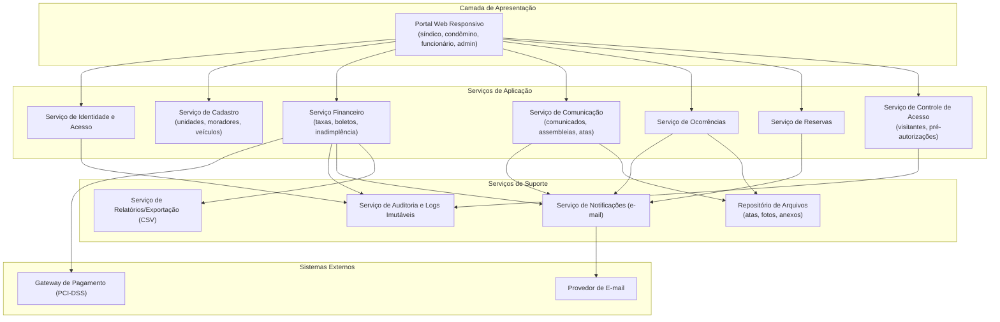
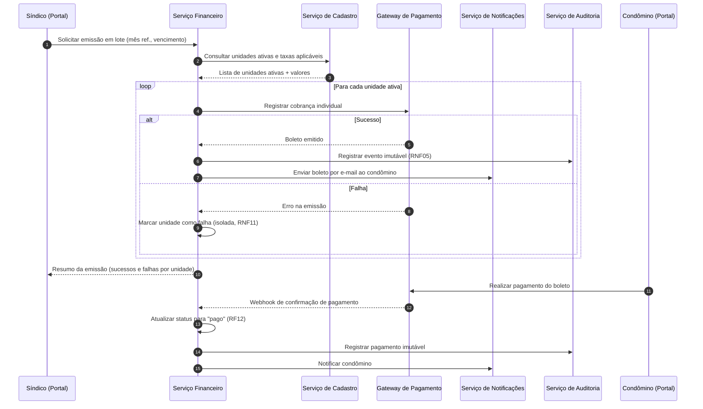
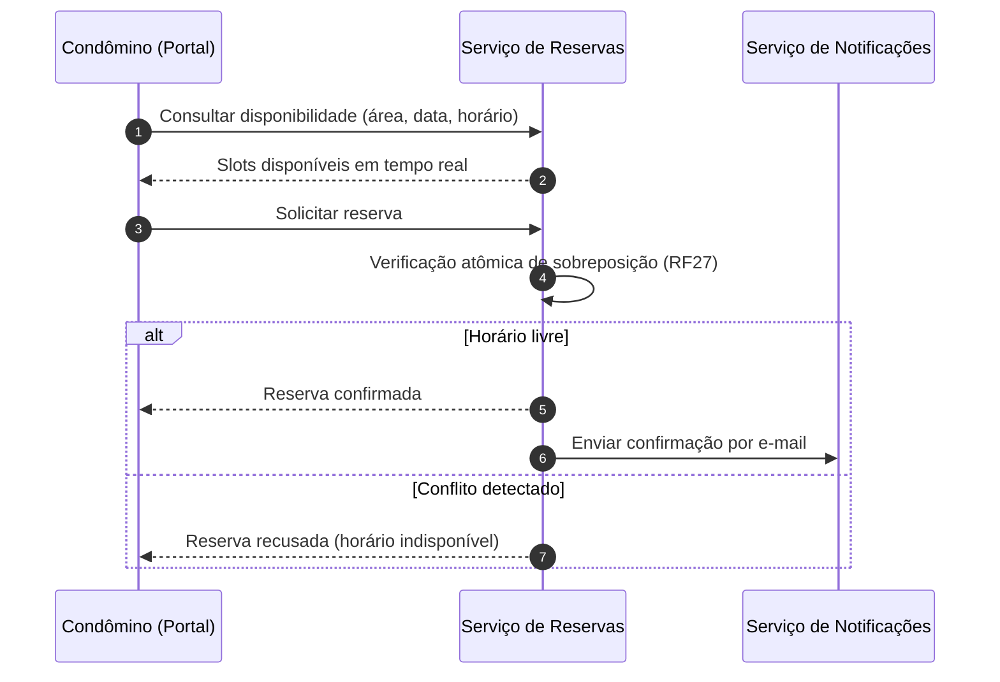

# Relatório Técnico de Arquitetura de Software
## Sistema de Gestão de Condomínio Residencial (M04) — AI4ES Time 2

---

## 1. Identificação das HUs

| HU | Perfil | Título | RFs Relacionados | RNFs Relacionados |
|----|--------|--------|------------------|-------------------|
| HU01 | Síndico | Cadastrar unidades e moradores | RF04, RF05, RF06, RF07, RF08 | RNF04 |
| HU02 | Síndico | Emitir boletos em lote | RF10, RF13 | RNF05, RNF11, RNF13 |
| HU03 | Síndico | Acompanhar inadimplências | RF15 | RNF08 |
| HU04 | Síndico | Publicar comunicados | RF16, RF17 | RNF13 |
| HU05 | Síndico | Gerenciar ocorrências | RF23, RF24 | RNF13 |
| HU06 | Síndico | Criar e registrar assembleias | RF18, RF19 | — |
| HU07 | Síndico | Gerenciar áreas comuns e reservas | RF25, RF28, RF29 | RNF08 |
| HU08 | Condômino | Visualizar e pagar boleto | RF11, RF12 | RNF03, RNF05 |
| HU09 | Condômino | Reservar área comum | RF26, RF27 | RNF08 |
| HU10 | Condômino | Registrar e acompanhar ocorrência | RF21, RF24 | RNF13 |
| HU11 | Condômino | Pré-autorizar entrada de visitante | RF31 | RNF04 |
| HU12 | Condômino | Acompanhar assembleias e atas | RF20 | — |
| HU13 | Funcionário | Registrar entrada/saída de visitantes | RF30, RF22 | RNF06 |
| HU14 | Funcionário | Consultar pré-autorizações | RF32, RF33 | RNF06 |

Requisitos transversais sem HU dedicada: RF01–RF03 (identidade e acesso), RF09, RF14 (financeiro complementar) — cobertos por componentes de plataforma (ver Seção 6).

---

## 2. Diagramas de Arquitetura (Mermaid)

### 2.1 Diagrama de Componentes (Visão Lógica)

### 2.2 Diagrama de Sequência — Emissão de Boletos em Lote e Pagamento (HU02 / HU08)

### 2.3 Diagrama de Sequência — Reserva de Área Comum com Controle de Conflito (HU09)

---

## 3. Decisões de Arquitetura

| ID | Decisão | Justificativa | Requisitos Suportados |
|----|---------|---------------|----------------------|
| DA01 | **Arquitetura modular por domínio de negócio** (Cadastro, Financeiro, Comunicação, Ocorrências, Reservas, Controle de Acesso), com interfaces bem definidas entre módulos | Alta coesão e baixo acoplamento; permite evolução para serviços independentes se a escala exigir | Todos os RFs; RNF13 |
| DA02 | **Controle de acesso baseado em papéis (RBAC)** centralizado no Serviço de Identidade, com sessões expiráveis (timeout de 30 min) | Quatro perfis com permissões distintas; requisito explícito de segurança de sessão | RF01–RF03, RNF01 |
| DA03 | **Armazenamento de credenciais com hash criptográfico forte com salt** | Requisito explícito de proteção de senhas | RNF02 |
| DA04 | **Integração com gateway de pagamento via redirecionamento/tokenização — nenhum dado de cartão trafega ou persiste no sistema** | Conformidade PCI-DSS por delegação; reduz escopo de auditoria | RF11, RF12, RNF03 |
| DA05 | **Confirmação de pagamento assíncrona (webhook/callback) com mecanismo de reconciliação periódica** | Garante atualização automática de status mesmo com falhas de entrega do callback | RF12, RNF07 |
| DA06 | **Emissão em lote com processamento item a item e isolamento de falhas** (padrão de trabalho por unidade, com relatório de falhas parciais) | Falha em uma unidade não corrompe as demais; rastreabilidade do lote | RF13, RNF11, HU02 |
| DA07 | **Trilha de auditoria imutável (append-only)** para operações financeiras e registros de acesso de visitantes | Registros não editáveis com usuário, data/hora e ação | RNF05, RNF06, RNF13 |
| DA08 | **Notificações desacopladas via serviço dedicado com fila de envio e política de reprocessamento** | Envio de e-mail não deve bloquear operações de negócio; resiliência a falhas do provedor | RF17, RF24, HU02, HU04, HU09 |
| DA09 | **Controle de concorrência no serviço de reservas** (verificação e gravação atômicas com bloqueio ou restrição de unicidade por área/intervalo) | Impedir reservas sobrepostas sob acesso concorrente | RF27 |
| DA10 | **Exclusão lógica (soft delete) para moradores e entidades com histórico** | Preservação de histórico ao desativar registros | RF07 |
| DA11 | **Camada de anonimização/minimização de dados pessoais + política de retenção** | Conformidade LGPD para moradores, funcionários e visitantes | RNF04 |
| DA12 | **Consultas de painel otimizadas** (visões materializadas ou modelos de leitura dedicados para inadimplência e calendário) | Tempo de carga ≤ 3 s | RF15, RF29, RNF08 |
| DA13 | **Interface web responsiva compatível com navegadores modernos** | Acesso mobile e desktop | RNF09, RNF10 |
| DA14 | **Backup automatizado diário com retenção de 90 dias e testes periódicos de restauração** | Requisito explícito de backup | RNF12 |

---

## 4. Tabela de Componentes e Rastreabilidade

| Componente | Responsabilidade Principal | Comunica-se com | Origem (HU / Critério de Aceite) |
|------------|---------------------------|-----------------|----------------------------------|
| Portal Web Responsivo | Interface única para todos os perfis, com menus condicionais por papel | Todos os serviços de aplicação | Todas as HUs; RNF09, RNF10 |
| Serviço de Identidade e Acesso | Cadastro de usuários, autenticação, sessão (timeout 30 min), RBAC por perfil | Portal, Auditoria | RF01–RF03; RNF01, RNF02 |
| Serviço de Cadastro | CRUD de unidades, moradores (soft delete), vínculo proprietário/inquilino, veículos; unicidade de CPF | Portal, Financeiro | HU01 (CA: CPF único, campos obrigatórios); RF04–RF08 |
| Serviço Financeiro | Configuração de taxas, emissão individual/lote, registro de pagamento manual, status de boletos, painel de inadimplência | Gateway, Cadastro, Notificações, Auditoria, Relatórios | HU02, HU03, HU08 (CA: status automático, falhas por unidade); RF09–RF15 |
| Adaptador de Gateway de Pagamento | Encapsular integração externa (emissão de cobranças, recepção de confirmações) sem persistir dados de cartão | Serviço Financeiro, Gateway externo | RF11, RF12; RNF03 |
| Serviço de Comunicação | Comunicados (com fixação no topo), assembleias, atas com anexos | Portal, Notificações, Repositório de Arquivos | HU04 (CA: fixar comunicado), HU06 (CA: anexos PDF), HU12; RF16–RF20 |
| Serviço de Ocorrências | Registro por condôminos e funcionários, categorização, ciclo de status, histórico, anexos de fotos | Portal, Notificações, Repositório de Arquivos | HU05, HU10 (CA: histórico de atualizações); RF21–RF24 |
| Serviço de Reservas | Cadastro de áreas comuns e regras (antecedência, horários), reserva com verificação atômica, cancelamento com prazo, calendário | Portal, Notificações | HU07, HU09 (CA: disponibilidade em tempo real, confirmação imediata); RF25–RF29 |
| Serviço de Controle de Acesso (Visitantes) | Registro de entrada/saída, pré-autorizações, vínculo pré-autorização↔visita, histórico por unidade | Portal, Auditoria | HU11, HU13 (CA: destaque de pré-autorização), HU14 (CA: vínculo do registro); RF30–RF33; RNF06 |
| Serviço de Notificações | Envio assíncrono de e-mails com fila e reprocessamento | Provedor de e-mail; consumido por Financeiro, Comunicação, Ocorrências, Reservas | RF17, RF24; HU02, HU04, HU05, HU06, HU09, HU10 |
| Serviço de Auditoria e Logs Imutáveis | Trilha append-only de operações financeiras, acessos de visitantes e eventos críticos | Financeiro, Controle de Acesso, Identidade | RNF05, RNF06, RNF13 |
| Repositório de Arquivos | Armazenar e servir anexos (atas PDF, fotos de ocorrências) | Comunicação, Ocorrências | HU06, HU10 (CA: anexos) |
| Serviço de Relatórios/Exportação | Geração de exportações CSV e modelos de leitura para painéis | Financeiro, Portal | HU03 (CA: exportação CSV); RNF08 |
| Rotina de Backup | Backup diário automatizado, retenção 90 dias | Camada de persistência | RNF12 |

---

## 5. Bloqueios e Pendências

| # | Tipo | Descrição | Impacto | Responsável Sugerido |
|---|------|-----------|---------|----------------------|
| B01 | Bloqueio | Gateway de pagamento não especificado (contrato de API, suporte a boletos, webhooks) | Impede o detalhamento do Adaptador de Pagamento e do fluxo de reconciliação | Product Owner / Financeiro |
| B02 | Pendência | Política de consentimento e retenção de dados pessoais (LGPD) não definida — especialmente para dados de visitantes | Design do módulo de anonimização e do histórico de acessos | DPO / Jurídico |
| B03 | Pendência | Regras de negócio para "faixa de atraso" (HU03) e cálculo de juros/multa não especificadas | Modelo de dados do painel de inadimplência | PO |
| B04 | Pendência | Prazo de cancelamento de reserva (RF28) é "configurável", mas granularidade (global vs. por área) não está definida | Modelo de configuração do Serviço de Reservas | PO |
| B05 | Pendência | Limites de tamanho e formatos de anexos (atas, fotos) não especificados | Dimensionamento do Repositório de Arquivos | PO / Arquitetura |
| B06 | Pendência | Provedor de e-mail e política de falha de entrega (retry, dead-letter) a definir | SLA das notificações obrigatórias | Infraestrutura |

---

## 6. Cobertura de Requisitos

### Requisitos Funcionais

| Faixa | Componente Responsável | Status |
|-------|------------------------|--------|
| RF01–RF03 | Serviço de Identidade e Acesso | ✅ Coberto |
| RF04–RF08 | Serviço de Cadastro | ✅ Coberto |
| RF09–RF15 | Serviço Financeiro + Adaptador de Gateway + Relatórios | ✅ Coberto |
| RF16–RF20 | Serviço de Comunicação + Notificações + Repositório de Arquivos | ✅ Coberto |
| RF21–RF24 | Serviço de Ocorrências + Notificações | ✅ Coberto |
| RF25–RF29 | Serviço de Reservas | ✅ Coberto |
| RF30–RF33 | Serviço de Controle de Acesso + Auditoria | ✅ Coberto |

### Requisitos Não Funcionais

| RNF | Tratamento Arquitetural | Status |
|-----|-------------------------|--------|
| RNF01 | Sessões com timeout de 30 min (DA02) | ✅ |
| RNF02 | Hash seguro de senhas (DA03) | ✅ |
| RNF03 | Delegação PCI-DSS ao gateway; sem dados de cartão (DA04) | ✅ |
| RNF04 | Minimização/retenção LGPD (DA11) | ⚠️ Depende de B02 |
| RNF05 | Trilha imutável financeira (DA07) | ✅ |
| RNF06 | Trilha imutável de acessos (DA07) | ✅ |
| RNF07 | Redundância e monitoramento para uptime 99,5% | ✅ (detalhar na visão de implantação) |
| RNF08 | Modelos de leitura otimizados (DA12) | ✅ |
| RNF09/10 | Interface responsiva multiplataforma (DA13) | ✅ |
| RNF11 | Emissão em lote com isolamento de falhas (DA06) | ✅ |
| RNF12 | Backup diário, retenção 90 dias (DA14) | ✅ |
| RNF13 | Logs de eventos críticos via Auditoria (DA07) | ✅ |

**Cobertura: 33/33 RFs e 13/13 RNFs endereçados (1 RNF condicionado a pendência externa).**

---

## 7. Gap Analysis

| # | Lacuna Identificada | Impacto Arquitetural | Ação Recomendada |
|---|---------------------|----------------------|------------------|
| G01 | **Recuperação de senha e gestão do ciclo de vida do usuário** não constam nos RFs (apenas cadastro/autenticação) | Serviço de Identidade incompleto; risco operacional para suporte | Especificar fluxo de redefinição de senha e desativação de usuários |
| G02 | **Boleto vencido**: não há regra sobre segunda via, atualização de valor ou reemissão | Serviço Financeiro pode gerar cobranças inválidas | Definir política de vencidos (juros, multa, reemissão) com o gateway escolhido |
| G03 | **Notificação por e-mail é ponto único de comunicação** — sem canal alternativo nem tratamento de e-mail inválido | Falhas silenciosas comprometem CAs de HU02, HU04, HU05 | Registrar status de entrega por destinatário e prever painel de falhas de notificação |
| G04 | **Concorrência entre síndicos/administradores** na emissão de lote não tratada (dois lotes simultâneos do mesmo mês) | Boletos duplicados | Impor restrição de unicidade lote×mês de referência e idempotência na emissão |
| G05 | **Perfil "administrador"** citado no RF01 sem nenhuma HU ou permissão associada | RBAC incompleto | Levantar responsabilidades do administrador junto ao PO |
| G06 | **Visitantes sem saída registrada** (visita em aberto indefinidamente) sem regra de encerramento | Histórico inconsistente (RF33, RNF06) | Definir rotina de encerramento/alerta de visitas em aberto |
| G07 | **Direitos do titular (LGPD)**: exclusão/portabilidade de dados conflita com trilhas imutáveis (RNF05/06) | Tensão entre imutabilidade e direito de eliminação | Adotar pseudonimização nos registros imutáveis, preservando rastreabilidade sem dados pessoais diretos |
| G08 | **Fuso horário e agenda de reservas** — regras de horário não definem timezone nem tratamento de feriados | Conflitos e reservas inválidas em bordas de dia | Padronizar fuso do condomínio e calendário de exceções por área |
| G09 | **Métricas e alertas de disponibilidade** (RNF07) sem definição de monitoramento | Uptime 99,5% inauditável | Definir observabilidade (health checks, alertas, relatório mensal de uptime) |
| G10 | **Ausência de requisito de multi-condomínio** — sistema assume condomínio único | Refatoração custosa se o produto escalar para administradoras | Confirmar escopo; se multi-tenant for previsto, isolar dados por condomínio desde o modelo inicial |

---

*Fim do relatório — AI4ES Time 2 · Sistema de Gestão de Condomínio (M04)*