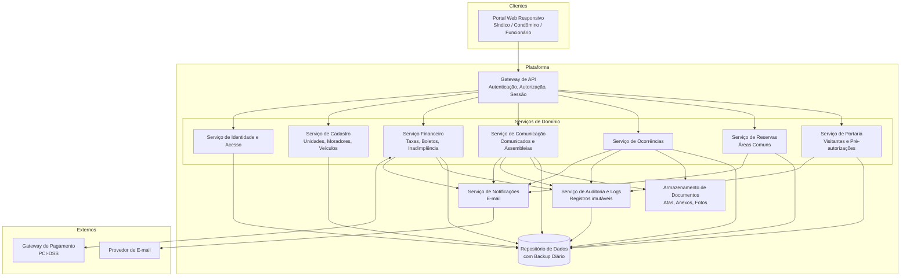
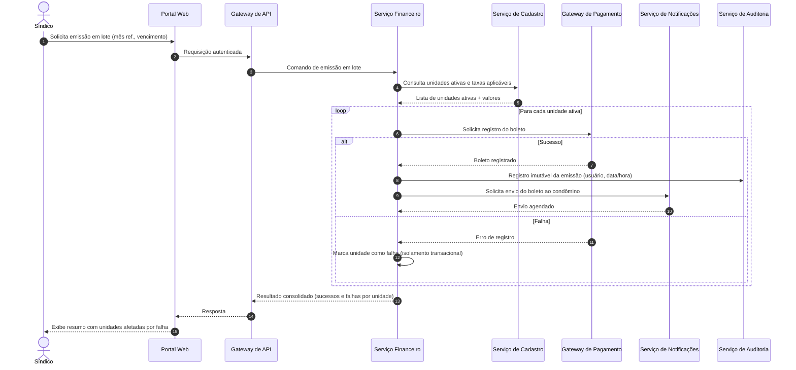
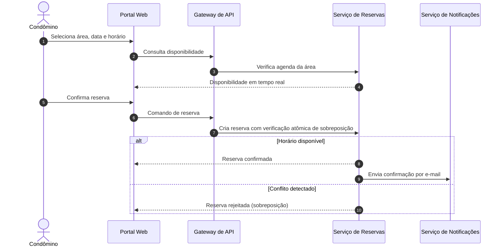

# Relatório Técnico de Arquitetura de Software
## Sistema de Gestão de Condomínio Residencial (M04)

---

## 1. Identificação das HUs

| HU | Perfil | Título | RFs Relacionados | RNFs Relacionados |
|----|--------|--------|------------------|-------------------|
| HU01 | Síndico | Cadastrar unidades e moradores | RF04, RF05, RF06, RF07, RF08 | RNF04 |
| HU02 | Síndico | Emitir boletos em lote | RF10, RF13 | RNF05, RNF11, RNF13 |
| HU03 | Síndico | Acompanhar inadimplências | RF15 | RNF08 |
| HU04 | Síndico | Publicar comunicados | RF16, RF17 | RNF13 |
| HU05 | Síndico | Gerenciar ocorrências | RF23, RF24 | RNF13 |
| HU06 | Síndico | Criar e registrar assembleias | RF18, RF19 | — |
| HU07 | Síndico | Gerenciar áreas comuns e reservas | RF25, RF28, RF29 | RNF08 |
| HU08 | Condômino | Visualizar e pagar boleto pelo portal | RF11, RF12 | RNF03, RNF05 |
| HU09 | Condômino | Reservar área comum | RF26, RF27 | RNF08 |
| HU10 | Condômino | Registrar e acompanhar ocorrência | RF21, RF24 | — |
| HU11 | Condômino | Pré-autorizar entrada de visitante | RF31 | RNF04 |
| HU12 | Condômino | Acompanhar assembleias e consultar atas | RF20 | — |
| HU13 | Funcionário | Registrar entrada e saída de visitantes | RF30, RF22 | RNF06 |
| HU14 | Funcionário | Consultar pré-autorizações de acesso | RF32, RF33 | RNF06 |

Requisitos transversais sem HU dedicada: RF01–RF03 (autenticação/autorização), RF09 (configuração de taxa), RF14 (pagamento manual) — cobertos por componentes de plataforma (ver Seções 4 e 6).

---

## 2. Diagramas de Arquitetura (Mermaid)

### 2.1 Diagrama de Componentes (visão lógica)

### 2.2 Diagrama de Sequência — HU02: Emissão de Boletos em Lote

### 2.3 Diagrama de Sequência — HU09: Reserva de Área Comum (controle de concorrência)

---

## 3. Decisões de Arquitetura

| ID | Decisão | Justificativa | Requisitos Atendidos |
|----|---------|---------------|----------------------|
| DA01 | Arquitetura modular por domínios (Cadastro, Financeiro, Comunicação, Ocorrências, Reservas, Portaria) atrás de um Gateway de API único | Coesão por contexto de negócio; escalabilidade e manutenibilidade independentes | RF04–RF33, RNF13 |
| DA02 | Autenticação centralizada com controle de acesso baseado em perfis (RBAC) e expiração de sessão em 30 min | Perfis distintos com permissões diferentes; sessão inativa encerrada | RF01–RF03, RNF01, RNF02 |
| DA03 | Integração com gateway de pagamento por tokenização/redirecionamento — nenhum dado de cartão trafega ou persiste no sistema | Conformidade PCI-DSS; recebimento de confirmações assíncronas (webhooks conceituais) para atualização automática de status | RF11, RF12, RNF03 |
| DA04 | Emissão em lote com isolamento por unidade (transação por item + relatório consolidado de falhas) | Falha parcial não corrompe demais emissões; rastreabilidade individual | RF13, RNF11, HU02 |
| DA05 | Trilha de auditoria imutável (append-only) para operações financeiras e acessos de visitantes | Registros com usuário, data/hora não podem ser alterados/excluídos | RNF05, RNF06, RNF13 |
| DA06 | Notificações por e-mail via serviço dedicado e assíncrono, desacoplado dos serviços de domínio | Falha de e-mail não bloqueia operações de negócio; reuso por múltiplos domínios | RF17, RF24, HU02, HU04–HU06, HU09, HU10 |
| DA07 | Controle de sobreposição de reservas com verificação atômica no momento da gravação (bloqueio/checagem única) | Impedir reservas concorrentes na mesma área/horário mesmo sob concorrência | RF27, HU09 |
| DA08 | Exclusão lógica (soft delete) para moradores e entidades com histórico | Desativar morador sem perder histórico; suporte a auditoria | RF07, RNF05 |
| DA09 | Armazenamento de documentos separado do repositório transacional (atas, anexos PDF, fotos) | Anexos volumosos não impactam desempenho transacional | HU06, HU10, HU12 |
| DA10 | Anonimização/minimização de dados pessoais e políticas de retenção configuráveis | Conformidade LGPD para moradores, funcionários e visitantes | RNF04 |
| DA11 | Backup automático diário com retenção de 90 dias e consultas do painel/calendário otimizadas (visões pré-computadas conceituais) | Continuidade de negócio; resposta ≤ 3s | RNF08, RNF12 |
| DA12 | Interface responsiva com padrões web abertos, compatível com navegadores modernos | Uso móvel e desktop | RNF09, RNF10 |

---

## 4. Tabela de Componentes e Rastreabilidade

| Componente | Responsabilidade Principal | Comunica-se com | Origem (HU / Critério de Aceite) |
|------------|---------------------------|-----------------|----------------------------------|
| Portal Web Responsivo | Interface única para síndico, condômino e funcionário | Gateway de API | Todas as HUs; RNF09, RNF10 |
| Gateway de API | Roteamento, autenticação de requisições, autorização por perfil, expiração de sessão | Todos os serviços de domínio, Serviço de Identidade | RF02, RF03; RNF01 |
| Serviço de Identidade e Acesso | Cadastro de usuários, perfis, credenciais com hash seguro, sessões | Gateway de API, Repositório de Dados | RF01–RF03; RNF01, RNF02 |
| Serviço de Cadastro | CRUD de unidades, moradores (soft delete), vínculos, veículos; validação de CPF único | Serviço Financeiro, Repositório de Dados | HU01 (CPF único, múltiplos moradores por unidade); RF04–RF08 |
| Serviço Financeiro | Configuração de taxas, emissão individual e em lote, registro manual de pagamento, painel de inadimplência, exportação CSV | Gateway de Pagamento, Cadastro, Notificações, Auditoria | HU02, HU03, HU08; RF09–RF15; RNF03, RNF05, RNF11 |
| Serviço de Comunicação | Comunicados (com fixação no topo), assembleias, atas com anexos | Notificações, Armazenamento de Documentos, Auditoria | HU04, HU06, HU12; RF16–RF20 |
| Serviço de Ocorrências | Registro (condômino/funcionário), categorização, ciclo de status, histórico, anexos de fotos | Notificações, Armazenamento de Documentos, Auditoria | HU05, HU10; RF21–RF24 |
| Serviço de Reservas | Cadastro de áreas comuns e regras, verificação atômica de disponibilidade, cancelamentos com prazo, calendário | Notificações, Repositório de Dados | HU07, HU09; RF25–RF29 |
| Serviço de Portaria | Registro de entrada/saída de visitantes, pré-autorizações, vínculo pré-autorização↔visita, histórico por unidade | Auditoria, Repositório de Dados | HU11, HU13, HU14; RF30–RF33; RNF06 |
| Serviço de Notificações | Envio assíncrono de e-mails (boletos, comunicados, ocorrências, reservas, assembleias) | Provedor de E-mail, serviços de domínio | RF17, RF24; HU02, HU04–HU06, HU09, HU10 |
| Serviço de Auditoria e Logs | Trilha imutável de operações financeiras, acessos e eventos críticos | Repositório de Dados | RNF05, RNF06, RNF13 |
| Armazenamento de Documentos | Guarda de atas (PDF), anexos e fotos de ocorrências | Serviços de Comunicação e Ocorrências | HU06, HU10, HU12 |
| Repositório de Dados | Persistência transacional com backup diário e retenção de 90 dias | Todos os serviços | RNF11, RNF12 |
| Gateway de Pagamento (externo) | Registro de boletos e confirmação de pagamento (PCI-DSS) | Serviço Financeiro | RF11, RF12; RNF03 |
| Provedor de E-mail (externo) | Entrega de mensagens | Serviço de Notificações | RF17, RF24 |

---

## 5. Bloqueios e Pendências

| ID | Tipo | Descrição | Impacto | Responsável Sugerido |
|----|------|-----------|---------|----------------------|
| BP01 | Pendência | Gateway de pagamento não especificado (protocolo de confirmação, prazos de compensação, contrato de erro) | Bloqueia design detalhado do Serviço Financeiro | Produto / Negócio |
| BP02 | Pendência | Política de juros e multa sobre boletos vencidos não definida | Painel de inadimplência pode exigir cálculo de valor atualizado | Produto |
| BP03 | Pendência | Regras LGPD operacionais: prazo de retenção de dados de visitantes, base legal, fluxo de exclusão/anonimização | Risco de conformidade | Jurídico / DPO |
| BP04 | Pendência | Comportamento de sessão em 30 min: renovação silenciosa vs. logout forçado com aviso | UX e implementação do Gateway | UX / Segurança |
| BP05 | Pendência | Volume estimado de unidades/condomínios (mono ou multi-condomínio?) | Afeta modelo de dados e escalabilidade | Produto |
| BP06 | Pendência | Reemissão/2ª via de boleto e cancelamento de boleto emitido incorretamente não especificados | Escopo do Serviço Financeiro | Produto |
| BP07 | Bloqueio parcial | Ausência de definição de canal de notificação alternativo em caso de e-mail inválido/rejeitado | Comunicados críticos podem não chegar | Produto |

---

## 6. Cobertura de Requisitos

| Requisito | Componente(s) Responsável(is) | Status |
|-----------|-------------------------------|--------|
| RF01–RF03 | Identidade e Acesso, Gateway de API | Coberto |
| RF04–RF08 | Serviço de Cadastro | Coberto |
| RF09–RF15 | Serviço Financeiro (+ Gateway de Pagamento, Auditoria) | Coberto |
| RF16–RF20 | Serviço de Comunicação, Notificações, Armazenamento de Documentos | Coberto |
| RF21–RF24 | Serviço de Ocorrências, Notificações | Coberto |
| RF25–RF29 | Serviço de Reservas | Coberto |
| RF30–RF33 | Serviço de Portaria, Auditoria | Coberto |
| RNF01–RNF02 | Identidade e Acesso, Gateway de API | Coberto |
| RNF03 | Serviço Financeiro (tokenização, sem persistência de cartão) | Coberto (depende de BP01) |
| RNF04 | Transversal (DA10) | Parcial (depende de BP03) |
| RNF05–RNF06 | Serviço de Auditoria | Coberto |
| RNF07 | Infraestrutura de disponibilidade (redundância conceitual) | Coberto conceitualmente |
| RNF08 | Reservas e Financeiro (visões otimizadas — DA11) | Coberto |
| RNF09–RNF10 | Portal Web Responsivo | Coberto |
| RNF11 | Serviço Financeiro (DA04) | Coberto |
| RNF12 | Repositório de Dados | Coberto |
| RNF13 | Serviço de Auditoria e Logs | Coberto |

**Cobertura:** 33/33 RFs cobertos; 13/13 RNFs cobertos (RNF03 e RNF04 com dependências externas documentadas).

---

## 7. Gap Analysis

| # | Lacuna Identificada | Impacto Arquitetural | Ação Recomendada |
|---|---------------------|----------------------|------------------|
| G01 | Confirmação de pagamento: não é definido se o gateway notifica ativamente ou se o sistema deve consultar periodicamente | Define se o Serviço Financeiro precisa de endpoint de callback ou de rotina de polling; afeta latência de atualização do status (RF12) | Definir contrato de integração com callback assíncrono como padrão e polling de contingência |
| G02 | Regras de reserva incompletas: limite de reservas por unidade/mês, cobrança por uso da área, no-show | Pode exigir integração Reservas↔Financeiro não prevista | Levantar regras com o negócio antes de fechar o modelo do Serviço de Reservas |
| G03 | Ciclo de vida de ocorrências simplificado (aberta/em andamento/encerrada) sem atribuição de responsável ou SLA | Sem workflow de atribuição, gestão de tratamento é limitada | Avaliar campo de responsável e prazos; projetar máquina de estados extensível |
| G04 | Não há requisito de auditoria para alterações cadastrais (unidades, moradores) — apenas financeiro e acessos | Histórico de vínculos morador↔unidade pode ser necessário para disputas/LGPD | Estender trilha de auditoria ao Serviço de Cadastro |
| G05 | Visitantes recorrentes/prestadores de serviço não modelados (pré-autorização é para data única) | Portaria pode exigir autorizações permanentes futuramente | Modelar pré-autorização com tipo (única/recorrente) desde já, ativando apenas a única |
| G06 | Sem definição de fuso horário e regras de calendário (feriados) para reservas e vencimentos | Conflitos de horário e vencimentos em dias não úteis | Definir política de fuso único do condomínio e regra de vencimento em dia útil |
| G07 | Exportação CSV (HU03) sem definição de encoding, colunas e limite de volume | Risco de exportações pesadas impactarem desempenho (RNF08) | Especificar formato e adotar geração assíncrona para grandes volumes |
| G08 | Recuperação de senha e primeiro acesso do morador não especificados | Fluxo essencial de onboarding ausente do IAM | Especificar fluxo de convite por e-mail com definição de senha e redefinição segura |
| G09 | Falhas de entrega de e-mail (notificações obrigatórias por critérios de aceite) sem tratamento definido | Notificações são requisito de aceite em várias HUs; falha silenciosa quebra o aceite | Implementar fila com retentativas, registro de status de entrega e painel de falhas |
| G10 | Multi-tenancy não definido (um condomínio ou plataforma para vários?) | Decisão estrutural: isolamento de dados, modelo de perfis e escalabilidade | Confirmar escopo com Produto antes do modelo de dados definitivo (vinculado a BP05) |

**Síntese:** a arquitetura proposta cobre integralmente os requisitos declarados com módulos coesos por domínio, auditoria imutável e integrações externas isoladas. Os principais riscos residem nas definições pendentes de integração de pagamento (G01/BP01), escopo multi-condomínio (G10/BP05) e políticas LGPD operacionais (BP03), que devem ser resolvidos antes do detalhamento do modelo de dados e dos contratos de interface.