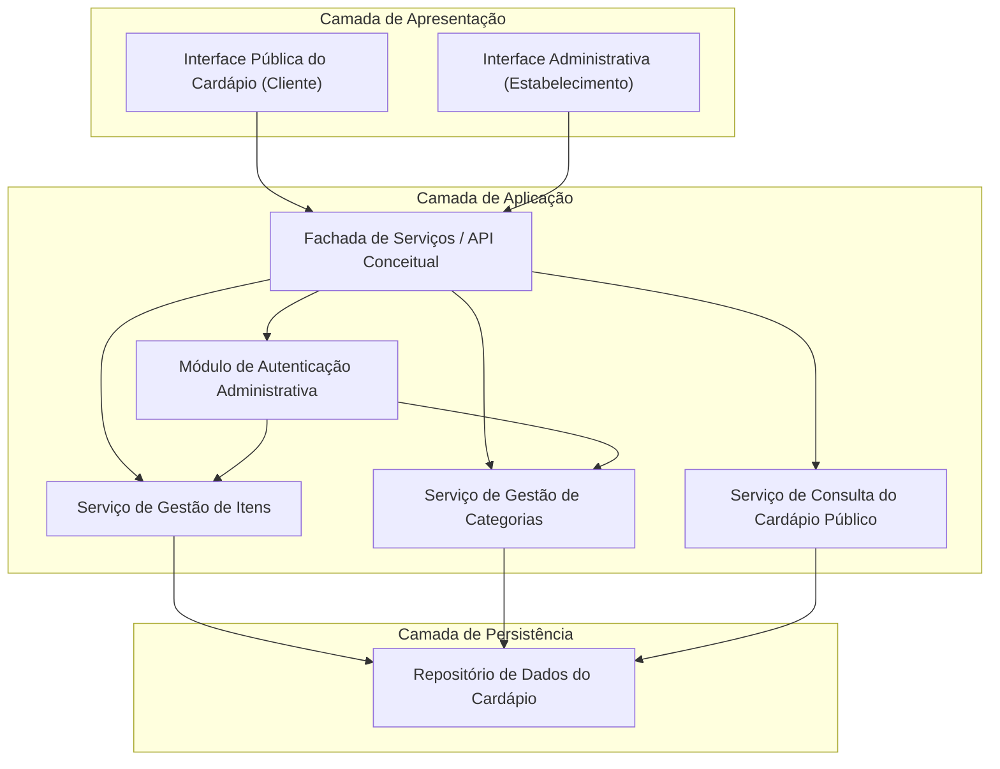
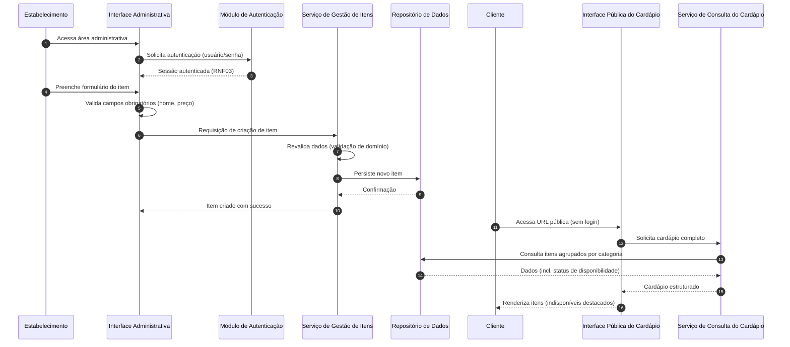
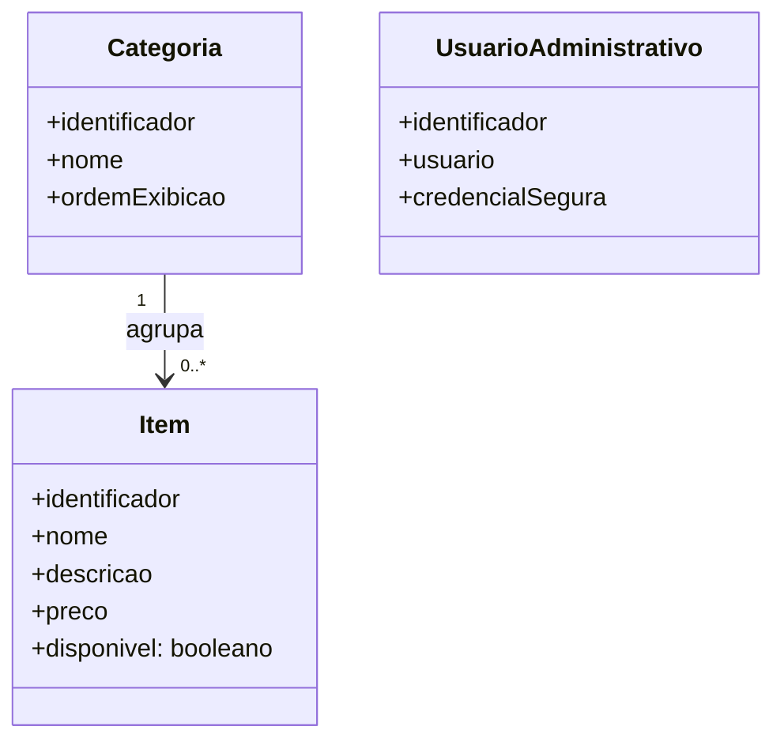

# Relatório Técnico de Arquitetura de Software
**Projeto:** Cardápio Digital para Restaurante (P01) — AI4ES Time 2

---

## 1. Identificação das HUs

| HU | Perfil | Objetivo | RFs Relacionados |
|----|--------|----------|------------------|
| HU01 | Estabelecimento | Cadastrar item (nome, descrição, preço) com validação | RF01 |
| HU02 | Estabelecimento | Criar categorias, associar itens e ordenar categorias | RF04, RF05 |
| HU03 | Estabelecimento | Editar item com reflexo imediato no cardápio público | RF02 |
| HU04 | Estabelecimento | Marcar/desmarcar item como indisponível | RF06, RF07 |
| HU05 | Estabelecimento | Remover item com confirmação prévia | RF03 |
| HU06 | Cliente | Visualizar cardápio sem autenticação, via URL direta | RF08 |
| HU07 | Cliente | Navegar por itens agrupados em categorias | RF09 |
| HU08 | Cliente | Identificar visualmente itens indisponíveis | RF10, RF11 |

---

## 2. Diagramas de Arquitetura (Mermaid)

### 2.1 Diagrama de Componentes (Visão Lógica)

### 2.2 Diagrama de Sequência — Cadastro de Item e Visualização Pública (HU01 + HU06)

### 2.3 Modelo Conceitual de Domínio

---

## 3. Decisões de Arquitetura

| ID | Decisão | Justificativa | Requisitos Suportados |
|----|---------|---------------|----------------------|
| DA01 | Separação em duas interfaces: pública (sem autenticação) e administrativa (autenticada) | Isola o fluxo de leitura livre do cliente do fluxo de gestão protegido | RF08, RNF03, HU06 |
| DA02 | Arquitetura em camadas (apresentação, aplicação, persistência) com serviços coesos por domínio (Itens, Categorias, Consulta) | Modularidade e evolutividade | RNF05 |
| DA03 | Indisponibilidade como atributo de estado do item (soft toggle), não exclusão | Permite exibir item indisponível e reverter a qualquer momento | RF06, RF07, HU04, HU08 |
| DA04 | Leitura do cardápio público como caminho otimizado (consulta única e agregada, passível de cache conceitual) | Carga ≤ 3s e disponibilidade 99% | RNF02, RNF04 |
| DA05 | Validação dupla: na interface (feedback imediato) e no serviço de domínio (integridade) | Critérios de aceite de HU01 | HU01 |
| DA06 | Interface pública responsiva e aderente a WCAG 2.1 nível A, compatível com navegadores modernos | Requisitos transversais de UX | RNF01, RNF06, RNF07 |
| DA07 | Consistência imediata entre escrita administrativa e leitura pública (sem replicação com atraso perceptível) | "Reflexo imediato" exigido em HU01 e HU03 | HU01, HU03 |
| DA08 | Confirmação explícita de exclusão na interface administrativa | Critério de aceite de HU05 | HU05, RF03 |

---

## 4. Tabela de Componentes e Rastreabilidade

| Componente | Responsabilidade Principal | Comunica-se com | Origem (HU / Critério de Aceite) |
|------------|---------------------------|-----------------|----------------------------------|
| Interface Pública do Cardápio | Exibir cardápio responsivo, acessível, agrupado por categorias, com destaque de indisponibilidade | Fachada de Serviços | HU06, HU07, HU08 / "URL direta sem autenticação", "indicação visual clara" |
| Interface Administrativa | CRUD de itens/categorias, ordenação de categorias, toggle de disponibilidade, confirmação de exclusão | Fachada de Serviços | HU01–HU05 / "confirmação antes de excluir", "validação de campos" |
| Fachada de Serviços (API conceitual) | Ponto único de entrada, roteamento e aplicação de política de acesso | Autenticação, Serviços de domínio | Todas as HUs |
| Módulo de Autenticação Administrativa | Validar credenciais e proteger operações de escrita | Fachada, Serviços de gestão | RNF03 |
| Serviço de Gestão de Itens | Criar, editar, remover itens; alternar disponibilidade; validar regras de domínio | Repositório de Dados | HU01, HU03, HU04, HU05 |
| Serviço de Gestão de Categorias | Criar, editar, remover, ordenar categorias; associar item a exatamente uma categoria | Repositório de Dados | HU02 / "item pertence a uma única categoria", "ordem controlável" |
| Serviço de Consulta do Cardápio Público | Fornecer visão de leitura agregada (categorias + itens + status), otimizada para desempenho | Repositório de Dados | HU06, HU07, HU08 / RNF02, RNF04 |
| Repositório de Dados do Cardápio | Persistência e recuperação consistente de itens, categorias e usuários administrativos | Serviços de aplicação | Todos os RFs |

---

## 5. Bloqueios e Pendências

| ID | Tipo | Descrição | Impacto |
|----|------|-----------|---------|
| P01 | Pendência | Não há definição de gestão de usuários administrativos (criação de conta, recuperação de senha, múltiplos usuários) | Escopo do Módulo de Autenticação indefinido |
| P02 | Pendência | Comportamento ao remover categoria com itens associados não especificado (bloquear? mover para "sem categoria"?) | Regra de integridade do domínio |
| P03 | Pendência | Suporte a múltiplos estabelecimentos (multi-tenant) não definido; requisitos sugerem instância única | Decisão estrutural do modelo de dados e URLs |
| P04 | Pendência | Ausência de requisito sobre imagens dos itens (comum em cardápios) — assumido fora de escopo | Confirmação com stakeholders |
| P05 | Bloqueio leve | Moeda, formato de preço e localização não especificados | Regras de validação e exibição de preço |

---

## 6. Cobertura de Requisitos

| Requisito | Componente(s) Responsável(is) | Status |
|-----------|-------------------------------|--------|
| RF01–RF03 | Interface Administrativa + Serviço de Gestão de Itens | Coberto |
| RF04–RF05 | Interface Administrativa + Serviço de Gestão de Categorias | Coberto |
| RF06–RF07 | Serviço de Gestão de Itens (atributo de disponibilidade — DA03) | Coberto |
| RF08 | Interface Pública + Serviço de Consulta (sem autenticação) | Coberto |
| RF09–RF11 | Serviço de Consulta + Interface Pública | Coberto |
| RNF01 | Interface Pública (design responsivo — DA06) | Coberto |
| RNF02 | Caminho de leitura otimizado (DA04) | Coberto (requer verificação em testes de desempenho) |
| RNF03 | Módulo de Autenticação Administrativa | Coberto |
| RNF04 | Arquitetura de leitura resiliente (DA04) | Coberto (requer estratégia operacional de implantação) |
| RNF05 | Arquitetura em camadas e serviços coesos (DA02) | Coberto |
| RNF06 | Interface Pública com padrões web abertos | Coberto |
| RNF07 | Diretrizes WCAG 2.1 A na Interface Pública | Coberto (requer auditoria de acessibilidade) |

**Cobertura: 11/11 RFs e 7/7 RNFs mapeados.**

---

## 7. Gap Analysis

| # | Lacuna Identificada | Impacto Arquitetural | Ação Recomendada |
|---|---------------------|----------------------|------------------|
| G01 | Ordenação de **itens** dentro de uma categoria não especificada (apenas ordenação de categorias em HU02) | Modelo de dados pode exigir atributo de ordem no item | Confirmar com PO; reservar campo de ordenação no domínio |
| G02 | Regra de exclusão de categoria com itens vinculados ausente | Risco de itens órfãos ou perda acidental de dados | Definir política (bloqueio ou realocação) antes da implementação |
| G03 | Ciclo de vida das credenciais administrativas (provisionamento, troca/recuperação de senha, bloqueio por tentativas) não definido | Módulo de Autenticação incompleto; risco de segurança | Especificar requisitos de gestão de identidade mínimos |
| G04 | "Exibição imediata" (HU01/HU03) sem tolerância quantificada | Restringe uso de cache agressivo na leitura pública (conflito potencial com RNF02/RNF04) | Definir tolerância de propagação (ex.: até N segundos) para viabilizar cache conceitual |
| G05 | Disponibilidade 99% sem definição de janela de manutenção e estratégia de monitoramento | Necessidade de observabilidade e plano operacional | Especificar SLO, monitoramento e política de manutenção |
| G06 | Item obrigatoriamente vinculado a categoria? Requisitos permitem item sem categoria (RF05 é opcional) | Ambiguidade na exibição pública (RF09 agrupa por categoria) | Definir tratamento de itens sem categoria (ex.: grupo "Outros") |
| G07 | Limites de dados não definidos (tamanho de descrição, valor máximo de preço, nº de itens/categorias) | Regras de validação e desempenho da listagem | Estabelecer limites de validação e critérios de paginação/rolagem |
| G08 | Auditoria de alterações (quem editou/removeu e quando) não requisitada | Ausência de rastreabilidade operacional | Avaliar inclusão de trilha de auditoria mínima como evolução |

---

*Fim do relatório — AI4ES Time 2.*