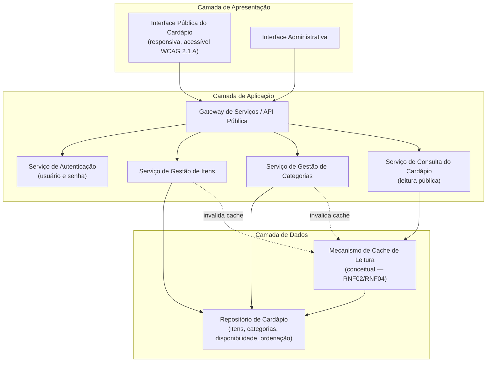
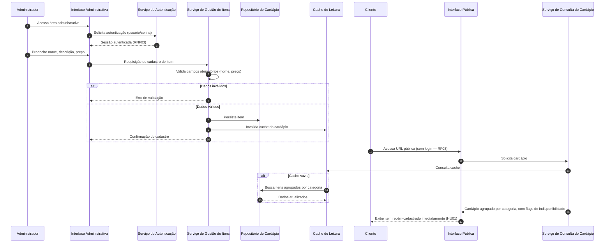
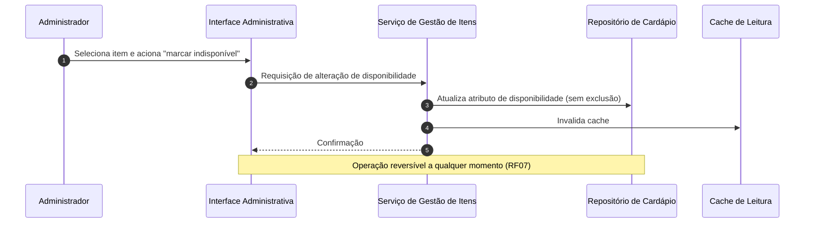

# Relatório Técnico de Arquitetura de Software
**Projeto:** Cardápio Digital para Restaurante (P01) — AI4ES Time 2

---

## 1. Identificação das HUs

| HU | Perfil | Título | RFs Relacionados |
|----|--------|--------|------------------|
| HU01 | Estabelecimento | Cadastrar item no cardápio | RF01 |
| HU02 | Estabelecimento | Organizar itens por categoria | RF04, RF05 |
| HU03 | Estabelecimento | Editar item do cardápio | RF02 |
| HU04 | Estabelecimento | Marcar item como indisponível | RF06, RF07 |
| HU05 | Estabelecimento | Remover item do cardápio | RF03 |
| HU06 | Cliente | Visualizar o cardápio sem cadastro | RF08, RF11 |
| HU07 | Cliente | Navegar pelo cardápio por categorias | RF09 |
| HU08 | Cliente | Identificar itens indisponíveis | RF10 |

---

## 2. Diagramas de Arquitetura (Mermaid)

### 2.1 Diagrama de Componentes (visão lógica)

### 2.2 Diagrama de Sequência — HU01/HU06 (cadastro e visualização imediata)

### 2.3 Diagrama de Sequência — HU04 (indisponibilidade)

---

## 3. Decisões de Arquitetura

| ID | Decisão | Justificativa | Requisitos |
|----|---------|---------------|------------|
| DA01 | Separação em duas interfaces distintas (pública e administrativa) | Público sem autenticação; admin protegido | RF08, RNF03 |
| DA02 | Arquitetura em camadas com serviços modulares por responsabilidade (itens, categorias, consulta) | Manutenibilidade e evolução independente | RNF05 |
| DA03 | Caminho de leitura pública otimizado com cache conceitual e invalidação em escrita | Carregamento ≤ 3s e refletir alterações imediatamente | RNF02, HU01, HU03 |
| DA04 | Exclusão lógica de itens indisponíveis (flag de disponibilidade) vs. exclusão física para remoção | Distinguir RF06/RF07 de RF03 | RF03, RF06, RF07 |
| DA05 | Modelo de dados: item pertence a exatamente 1 categoria; categoria possui atributo de ordenação | Critérios de aceite HU02 | RF05, HU02 |
| DA06 | Front-end público construído com padrões web abertos, design responsivo e conformidade WCAG 2.1 A | Compatibilidade multi-navegador e acessibilidade | RNF01, RNF06, RNF07 |
| DA07 | Confirmação explícita de exclusão na camada de apresentação administrativa | Critério de aceite HU05 | RF03 |
| DA08 | Infraestrutura conceitual com redundância/monitoramento para disponibilidade 99% | RNF04 | RNF04 |

---

## 4. Tabela de Componentes e Rastreabilidade

| Componente | Responsabilidade Principal | Comunica-se com | Origem (HU / Critério de Aceite) |
|---|---|---|---|
| Interface Pública do Cardápio | Exibir cardápio responsivo, agrupado por categoria, com indicação visual de indisponibilidade, sem autenticação | Gateway de Serviços | HU06, HU07, HU08 (URL direta; label/opacidade) |
| Interface Administrativa | CRUD de itens/categorias, ordenação, toggle de disponibilidade, diálogo de confirmação de exclusão | Gateway de Serviços | HU01–HU05 (confirmação antes de excluir) |
| Gateway de Serviços / API Pública | Roteamento, controle de acesso às rotas administrativas | Autenticação, Serviços de Itens/Categorias/Consulta | RNF03, RF08 |
| Serviço de Autenticação | Autenticar administrador via usuário e senha; gestão de sessão | Gateway | RNF03 |
| Serviço de Gestão de Itens | Validar (nome/preço obrigatórios), criar, editar, remover, alterar disponibilidade | Repositório, Cache | HU01 (validação), HU03, HU04, HU05 |
| Serviço de Gestão de Categorias | Criar/editar/remover categorias, associar itens (1 categoria por item), controlar ordenação | Repositório, Cache | HU02 (ordem controlável) |
| Serviço de Consulta do Cardápio | Fornecer visão pública agregada (itens por categoria, flags) | Cache, Repositório | HU06–HU08 |
| Repositório de Cardápio | Persistência de itens, categorias, disponibilidade e ordenação | Serviços de aplicação | RF01–RF07 |
| Cache de Leitura (conceitual) | Acelerar leitura pública; invalidado a cada escrita | Repositório, Serviço de Consulta | RNF02; HU01/HU03 (reflexo imediato) |

---

## 5. Bloqueios e Pendências

| ID | Tipo | Descrição | Ação Necessária |
|----|------|-----------|-----------------|
| BP01 | Pendência | Não há RF explícito para gestão de usuários administradores (criação, recuperação de senha) — apenas RNF03 | Confirmar com o cliente escopo de gestão de credenciais |
| BP02 | Pendência | Comportamento de itens ao excluir uma categoria (RF04) não especificado | Definir regra: bloquear exclusão, mover para "sem categoria" ou excluir em cascata |
| BP03 | Pendência | Multi-estabelecimento (multi-tenant) vs. instância única não especificado | Decisão impacta modelo de dados e URLs públicas |
| BP04 | Pendência | Ordem dos itens dentro de uma categoria não especificada (apenas ordem das categorias) | Confirmar critério de ordenação de itens |
| BP05 | Bloqueio potencial | Item sem categoria: RF05 permite associação, mas obrigatoriedade não é definida | Definir se item pode existir sem categoria e como é exibido |

---

## 6. Cobertura de Requisitos

| Requisito | Atendido por | Status |
|-----------|--------------|--------|
| RF01 | Serviço de Gestão de Itens, Interface Administrativa | ✅ Coberto |
| RF02 | Serviço de Gestão de Itens | ✅ Coberto |
| RF03 | Serviço de Gestão de Itens (exclusão física + confirmação na UI) | ✅ Coberto |
| RF04 | Serviço de Gestão de Categorias | ✅ Coberto (ver BP02) |
| RF05 | Serviço de Gestão de Categorias (1:N) | ✅ Coberto (ver BP05) |
| RF06 | Flag de disponibilidade (DA04) | ✅ Coberto |
| RF07 | Toggle reversível de disponibilidade | ✅ Coberto |
| RF08 | Interface Pública + rota sem autenticação | ✅ Coberto |
| RF09 | Serviço de Consulta do Cardápio (agregação por categoria) | ✅ Coberto |
| RF10 | Interface Pública (indicação visual) | ✅ Coberto |
| RF11 | Serviço de Consulta + Interface Pública | ✅ Coberto |
| RNF01 | Design responsivo (DA06) | ✅ Coberto |
| RNF02 | Cache de leitura (DA03) | ✅ Coberto |
| RNF03 | Serviço de Autenticação + Gateway | ✅ Coberto |
| RNF04 | Redundância/monitoramento conceitual (DA08) | ⚠️ Parcial — depende de decisões de implantação |
| RNF05 | Modularização em serviços (DA02) | ✅ Coberto |
| RNF06 | Padrões web abertos (DA06) | ✅ Coberto |
| RNF07 | Conformidade WCAG 2.1 A (DA06) | ✅ Coberto |

**Cobertura:** 18/18 requisitos endereçados (1 parcial).

---

## 7. Gap Analysis

| # | Lacuna | Impacto Arquitetural | Ação Recomendada |
|---|--------|----------------------|------------------|
| G01 | Ausência de gestão de contas administrativas (cadastro, troca/recuperação de senha, múltiplos usuários) | Serviço de Autenticação pode precisar de módulo de gestão de identidade; afeta modelo de dados | Levantar requisitos de identidade antes da Sprint 1 |
| G02 | Comportamento de exclusão de categoria com itens associados indefinido | Regra de integridade referencial no Repositório; fluxo de UI adicional | Definir política (bloqueio, realocação ou cascata) com o cliente |
| G03 | Modelo mono vs. multi-estabelecimento não definido | Afeta particionamento de dados, estrutura de URLs públicas e autenticação | Decisão prioritária — alto custo de mudança posterior |
| G04 | Sem requisitos de imagem do item (comum em cardápios) | Adição futura exigiria armazenamento de mídia e impacto no RNF02 | Confirmar escopo; se previsto, reservar extensão no modelo de item (RNF05) |
| G05 | Ordenação de itens dentro de categorias não especificada | Atributo de ordenação adicional no modelo de item | Assumir ordem alfabética como padrão e validar |
| G06 | Ausência de requisitos de auditoria/histórico de alterações (preços, exclusões) | Sem trilha de auditoria, exclusões são irreversíveis | Avaliar exclusão lógica com retenção como salvaguarda |
| G07 | RNF04 (99% de disponibilidade) sem métricas de medição/SLA formalizado | Necessidade de monitoramento, health-checks e estratégia de recuperação | Definir estratégia de observabilidade e janela de manutenção |
| G08 | Sem requisitos de proteção contra abuso do endpoint público (leitura anônima) | Risco de sobrecarga afetando RNF02/RNF04 | Prever limitação de taxa conceitual no Gateway |

---
*Fim do Relatório Canônico — AI4ES Time 2.*