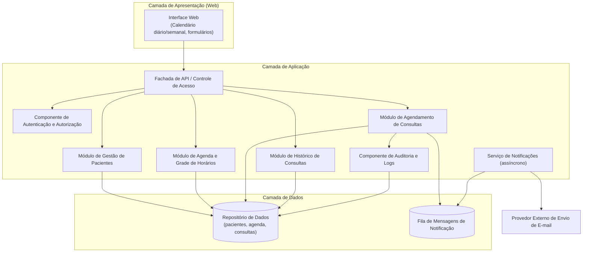
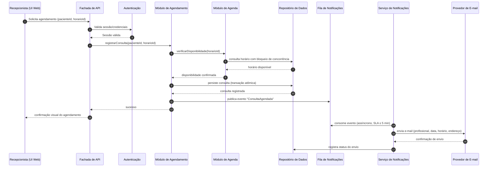
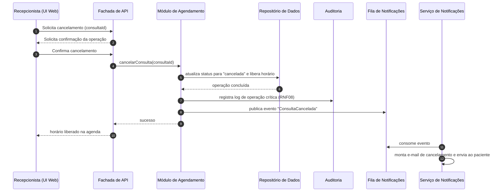

# Relatório Técnico de Arquitetura de Software
## Sistema: Agendador de Consultas para Clínica Pequena (P02)

---

## 1. Identificação das HUs

| HU | Perfil | Título | RFs Relacionados | RNFs Relacionados |
|----|--------|--------|------------------|-------------------|
| HU01 | Recepcionista | Cadastrar paciente | RF01 | RNF01, RNF02 |
| HU02 | Recepcionista | Pesquisar paciente | RF03 | RNF01 |
| HU03 | Recepcionista | Visualizar agenda do profissional | RF04, RF11 | RNF03, RNF04 |
| HU04 | Recepcionista | Registrar agendamento | RF05, RF06, RF09 | RNF05, RNF08 |
| HU05 | Recepcionista | Cancelar agendamento | RF07, RF10 | RNF08 |
| HU06 | Recepcionista | Remarcar agendamento | RF08, RF10 | RNF08 |
| HU07 | Recepcionista | Consultar histórico do paciente | RF12 | RNF02 |
| HU08 | Paciente | Receber confirmação por e-mail | RF09 | RNF05 |
| HU09 | Paciente | Receber notificação de cancelamento/remarcação | RF10 | RNF05 |

Observações:
- RF02 (edição de cadastro) não possui HU explícita — tratado como extensão de HU01 (ver Seção 7).
- HU01 cita CPF como critério de unicidade, mas RF01 não lista CPF como campo — inconsistência registrada na Seção 5.

---

## 2. Diagramas de Arquitetura (Mermaid)

### 2.1 Diagrama de Componentes (visão lógica)

### 2.2 Diagrama de Sequência — Registrar Agendamento (HU04/HU08)

### 2.3 Diagrama de Sequência — Cancelamento (HU05/HU09)

---

## 3. Decisões de Arquitetura

| ID | Decisão | Justificativa | Requisitos Atendidos |
|----|---------|---------------|----------------------|
| AD01 | Arquitetura em camadas (Apresentação / Aplicação / Dados) com aplicação web | Escala pequena da clínica; simplicidade de manutenção; acesso via navegador (RNF07) | RNF06, RNF07 |
| AD02 | Envio de e-mails desacoplado via fila e serviço assíncrono de notificações | Garante que falhas no provedor de e-mail não bloqueiem o agendamento; SLA de 5 min permite processamento assíncrono com reprocessamento | RF09, RF10, RNF05 |
| AD03 | Controle de concorrência transacional na reserva de horário (bloqueio/verificação atômica) | Impede duplo agendamento no mesmo horário mesmo com operações simultâneas | RF06 |
| AD04 | Consultas nunca são excluídas fisicamente; usam ciclo de status (agendada → realizada / cancelada / remarcada) | Viabiliza histórico completo e auditoria | RF12, RNF08 |
| AD05 | Componente de auditoria registra criação, cancelamento e remarcação com autor, data/hora e dados anteriores | Rastreabilidade de operações críticas | RNF08 |
| AD06 | Autenticação obrigatória com perfis (recepcionista, administrador) e autorização por papel | Restrição de acesso; administrador configura grade de horários (RF11) | RNF01, RF11 |
| AD07 | Dados pessoais tratados com minimização, criptografia em repouso e em trânsito, e controle de acesso; registro de consentimento/base legal | Conformidade LGPD | RNF02 |
| AD08 | Leitura da agenda otimizada (consulta indexada por profissional + intervalo de datas) | Carregamento ≤ 2 s | RNF04 |
| AD09 | Remarcação modelada como operação atômica (liberar horário antigo + reservar novo na mesma transação) | Evita estados inconsistentes (consulta sem horário ou dois horários ocupados) | RF08 |

---

## 4. Tabela de Componentes e Rastreabilidade

| Componente | Responsabilidade Principal | Comunica-se com | Origem (HU / Critério de Aceite) |
|------------|---------------------------|-----------------|----------------------------------|
| Interface Web | Formulários, calendário diário/semanal, distinção visual de horários, confirmações de operação | Fachada de API | HU03 (visões diária/semanal), HU05 (confirmação prévia), RNF03, RNF07 |
| Fachada de API | Ponto único de entrada, validação de entrada, roteamento, controle de acesso | Todos os módulos de aplicação, Autenticação | RNF01 (acesso restrito) |
| Autenticação e Autorização | Login, sessões, perfis (recepcionista/admin) | Fachada de API, Repositório de Dados | RNF01 |
| Módulo de Gestão de Pacientes | CRUD de pacientes, validação de e-mail, unicidade CPF/e-mail, busca parcial por nome/telefone | Repositório de Dados | HU01 (campos obrigatórios, validação de e-mail, não duplicidade), HU02 (busca parcial), RF01–RF03 |
| Módulo de Agenda e Grade de Horários | Configuração da grade do profissional, cálculo de horários livres/ocupados, consulta por período | Repositório de Dados, Módulo de Agendamento | HU03, RF04, RF11, RNF04 |
| Módulo de Agendamento de Consultas | Registrar, cancelar e remarcar consultas com controle de concorrência e transições de status | Agenda, Repositório de Dados, Fila de Notificações, Auditoria | HU04 ("apenas horários disponíveis"), HU05 ("horário liberado imediatamente"), HU06 ("horário anterior liberado"), RF05–RF08 |
| Módulo de Histórico de Consultas | Listar consultas realizadas/canceladas por paciente com data, horário e status | Repositório de Dados | HU07, RF12 |
| Serviço de Notificações | Consumir eventos, montar e enviar e-mails de confirmação/cancelamento/remarcação, retry e registro de status | Fila de Notificações, Provedor de E-mail, Repositório de Dados | HU08 (conteúdo e SLA de 5 min), HU09, RF09, RF10, RNF05 |
| Fila de Mensagens de Notificação | Desacoplar operações transacionais do envio de e-mail; garantir entrega com reprocessamento | Módulo de Agendamento, Serviço de Notificações | RNF05 (AD02) |
| Componente de Auditoria e Logs | Registrar operações críticas com autor e timestamp | Módulos de Agendamento, Repositório de Dados | RNF08 |
| Repositório de Dados | Persistência de pacientes, grade, consultas, logs e status de notificações, com proteção LGPD | Todos os módulos | RNF02, RNF04 |
| Provedor Externo de E-mail | Entrega efetiva dos e-mails aos pacientes | Serviço de Notificações | HU08, HU09 |

---

## 5. Bloqueios e Pendências

| ID | Tipo | Descrição | Impacto | Responsável Sugerido |
|----|------|-----------|---------|----------------------|
| B01 | Inconsistência | HU01 exige unicidade por CPF, mas RF01 não inclui CPF nos dados cadastrais | Modelo de dados do paciente indefinido; validação de duplicidade parcial | Product Owner |
| B02 | Indefinição | Não está claro se há um único profissional ou múltiplos (RF04 usa singular "do profissional") | Afeta modelo de agenda, UI de seleção e escalabilidade | Product Owner |
| B03 | Indefinição | Não há regra para marcar consulta como "realizada" (necessária para o histórico do RF12) | Sem transição de status, histórico incompleto | Product Owner / Analista |
| B04 | Indefinição | Duração padrão dos slots da grade de horários e regras de exceção (feriados, ausências) não especificadas | Impacta modelo da grade (RF11) | Product Owner |
| B05 | Pendência | Política de retenção/anonimização de dados (LGPD) e processo de consentimento não detalhados | Risco de não conformidade RNF02 | DPO / Jurídico |
| B06 | Pendência | Comportamento em caso de falha permanente no envio de e-mail (alerta à recepcionista?) não definido | Afeta desenho de resiliência do Serviço de Notificações | Product Owner |
| B07 | Indefinição | Papéis do "administrador" (RNF01) não têm HU associada; presume-se que configure a grade (RF11) | Escopo de permissões incerto | Product Owner |

---

## 6. Cobertura de Requisitos

| Requisito | Coberto por (Componente / Decisão) | Status |
|-----------|-------------------------------------|--------|
| RF01 | Módulo de Gestão de Pacientes | ✅ Coberto |
| RF02 | Módulo de Gestão de Pacientes | ✅ Coberto (sem HU — ver Gap G01) |
| RF03 | Módulo de Gestão de Pacientes (busca parcial) | ✅ Coberto |
| RF04 | Módulo de Agenda + Interface Web | ✅ Coberto |
| RF05 | Módulo de Agendamento | ✅ Coberto |
| RF06 | AD03 (controle de concorrência transacional) | ✅ Coberto |
| RF07 | Módulo de Agendamento (cancelamento) | ✅ Coberto |
| RF08 | Módulo de Agendamento + AD09 (remarcação atômica) | ✅ Coberto |
| RF09 | Serviço de Notificações + Fila (AD02) | ✅ Coberto |
| RF10 | Serviço de Notificações + Fila (AD02) | ✅ Coberto |
| RF11 | Módulo de Agenda (configuração de grade) | ✅ Coberto |
| RF12 | Módulo de Histórico + AD04 | ⚠️ Parcial (transição "realizada" indefinida — B03) |
| RNF01 | Autenticação e Autorização (AD06) | ✅ Coberto |
| RNF02 | AD07 (LGPD) | ⚠️ Parcial (políticas pendentes — B05) |
| RNF03 | Interface Web (calendário diário/semanal) | ✅ Coberto |
| RNF04 | AD08 (leitura otimizada) | ✅ Coberto |
| RNF05 | AD02 (fila assíncrona com retry) | ✅ Coberto |
| RNF06 | AD01 + práticas operacionais (a detalhar no deploy) | ⚠️ Parcial (requer definição operacional) |
| RNF07 | Interface Web padrão navegadores | ✅ Coberto |
| RNF08 | Componente de Auditoria (AD05) | ✅ Coberto |

**Resumo:** 17/20 totalmente cobertos; 3 parciais; 0 sem cobertura.

---

## 7. Gap Analysis

| ID | Lacuna | Impacto Arquitetural | Ação Recomendada |
|----|--------|----------------------|------------------|
| G01 | RF02 (editar paciente) sem HU e sem critérios de aceite | Regras de edição (ex.: pode alterar CPF/e-mail únicos?) indefinidas | Criar HU de edição com critérios de validação e auditoria de alterações (LGPD) |
| G02 | Ausência de fluxo para marcar consulta como "realizada" | O histórico (RF12/HU07) depende de status que ninguém atualiza; risco de dados sempre "agendados" | Definir HU/regra: marcação manual pela recepcionista ou automática após o horário |
| G03 | Quantidade de profissionais indefinida (B02) | Modelo mono vs. multiprofissional altera entidades Agenda/Grade e navegação da UI | Decidir cedo; recomenda-se modelar com suporte a N profissionais desde o início (baixo custo incremental) |
| G04 | Regras da grade de horários incompletas (duração de slot, bloqueios, feriados, férias) | Estrutura de dados da grade e algoritmo de disponibilidade dependem dessas regras | Workshop com a clínica para definir modelo de grade e exceções |
| G05 | Falha de envio de e-mail sem tratamento definido | Serviço de Notificações precisa de política de retry, dead-letter e alerta ao usuário | Definir: N tentativas dentro do SLA de 5 min; painel/alerta para a recepcionista em falha permanente; registrar status de envio |
| G06 | LGPD sem detalhamento operacional (retenção, exclusão, consentimento, acesso do titular) | Pode exigir funcionalidades novas (exportação/anonimização de dados do paciente) | Envolver DPO; incluir requisitos de direitos do titular no backlog |
| G07 | Nenhum requisito de backup/recuperação apesar do RNF06 (99% uptime) | Disponibilidade sem estratégia de recuperação é frágil | Definir RPO/RTO e rotina de backup do Repositório de Dados |
| G08 | Fuso horário e formato de data/hora não especificados | E-mails e agenda podem exibir horários ambíguos | Padronizar fuso da clínica e formato de exibição em toda a solução |
| G09 | Sem requisito de bloqueio de sessão/expiração ou política de senhas | Superfície de segurança incompleta para RNF01 | Definir política de credenciais, expiração de sessão e trilha de acesso |
| G10 | E-mail de confirmação exige "endereço da clínica" (HU08), mas não há cadastro de dados da clínica | Necessário componente/entidade de configuração institucional | Adicionar módulo simples de configurações da clínica (nome, endereço, contatos) |

**Recomendação geral ao time de desenvolvimento:** priorizar a resolução de B01–B04 (modelo de dados de paciente, profissionais e grade) antes do início da implementação dos módulos de Agenda e Agendamento, pois são fundacionais. Os itens de LGPD e resiliência de notificações (G05, G06) podem ser tratados em incremento subsequente, desde que o desenho (fila + status de envio + auditoria) já esteja implementado desde a primeira versão, conforme AD02, AD04 e AD05.