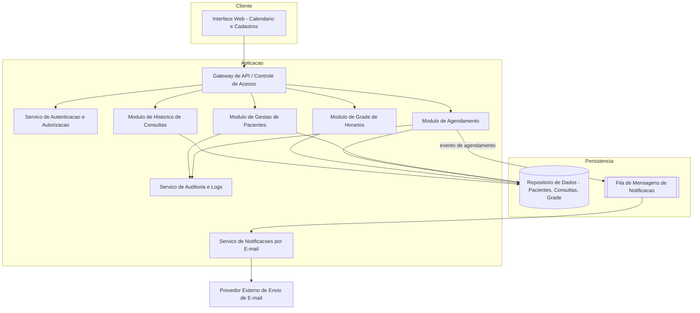
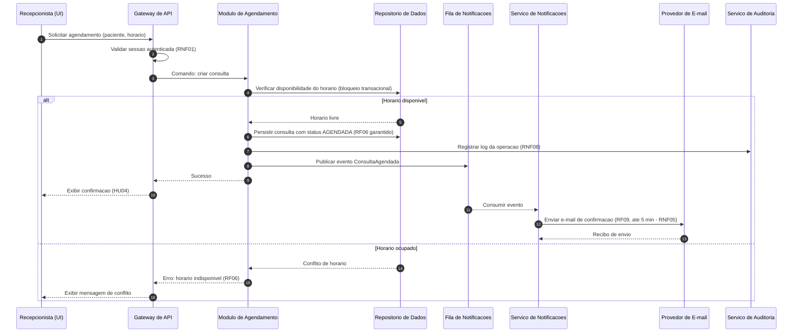
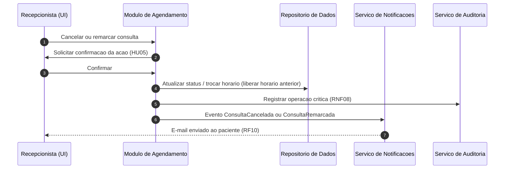

# Relatório Técnico de Arquitetura de Software
**Projeto:** Agendador de Consultas para Clínica Pequena (P02)
**Origem:** AI4ES — Time 2

---

## 1. Identificação das HUs

| HU | Perfil | Título | RFs Relacionados | RNFs Relacionados |
|----|--------|--------|------------------|-------------------|
| HU01 | Recepcionista | Cadastrar paciente | RF01 | RNF01, RNF02 |
| HU02 | Recepcionista | Pesquisar paciente | RF03 | RNF01 |
| HU03 | Recepcionista | Visualizar agenda do profissional | RF04, RF11 | RNF03, RNF04 |
| HU04 | Recepcionista | Registrar agendamento | RF05, RF06, RF09 | RNF05, RNF08 |
| HU05 | Recepcionista | Cancelar agendamento | RF07, RF10 | RNF08 |
| HU06 | Recepcionista | Remarcar agendamento | RF08, RF10 | RNF08 |
| HU07 | Recepcionista | Consultar histórico do paciente | RF12 | RNF02 |
| HU08 | Paciente | Receber confirmação por e-mail | RF09 | RNF05 |
| HU09 | Paciente | Receber notificação de cancelamento/remarcação | RF10 | RNF05 |

Nota: RF02 (edição de dados cadastrais) não possui HU explícita — tratado como extensão de HU01 (ver Seções 5 e 7).

---

## 2. Diagramas de Arquitetura (Mermaid)

### 2.1 Diagrama de Componentes (visão lógica)

### 2.2 Diagrama de Sequência — Registrar Agendamento (HU04, RF05/RF06/RF09)

### 2.3 Diagrama de Sequência — Cancelamento/Remarcação (HU05/HU06)

---

## 3. Decisões de Arquitetura

| ID | Decisão | Justificativa | Requisitos Atendidos |
|----|---------|---------------|----------------------|
| AD01 | Arquitetura em camadas com módulos coesos (monólito modular) | Escopo pequeno (clínica pequena); simplicidade operacional e manutenibilidade | Todos |
| AD02 | Envio de e-mail assíncrono via fila de mensagens | Desacopla agendamento do envio; tolerância a falhas do provedor; SLA de 5 min permite processamento assíncrono com retentativas | RF09, RF10, RNF05, RNF06 |
| AD03 | Controle de concorrência transacional na reserva de horário | Garante unicidade do horário mesmo com acessos simultâneos | RF06 |
| AD04 | Modelo de consulta com ciclo de estados (AGENDADA → REALIZADA / CANCELADA / REMARCADA) | Suporta histórico e auditoria sem exclusão física de registros | RF07, RF08, RF12, RNF08 |
| AD05 | Autenticação centralizada com perfis (recepcionista, administrador) | Acesso restrito e segregação de permissões (ex.: configurar grade só para admin) | RNF01, RF11 |
| AD06 | Criptografia de dados pessoais em repouso e em trânsito; minimização de dados e trilha de consentimento | Conformidade LGPD | RNF02 |
| AD07 | Interface web responsiva baseada em padrões abertos de navegador | Compatibilidade multi-navegador sem prescrever framework | RNF07, RNF03 |
| AD08 | Consulta de agenda otimizada por índice temporal e projeção de leitura | Carregamento ≤ 2s | RNF04 |
| AD09 | Serviço de auditoria com log imutável de operações críticas | Rastreabilidade de criação/cancelamento/remarcação | RNF08 |

---

## 4. Tabela de Componentes e Rastreabilidade

| Componente | Responsabilidade Principal | Comunica-se com | Origem (HU / Critério de Aceite) |
|---|---|---|---|
| Interface Web (Calendário e Cadastros) | Visões diária/semanal da agenda, formulários de paciente, feedback ao usuário | Gateway de API | HU03 (visões diária/semanal, distinção visual), HU01, HU04 |
| Gateway de API / Controle de Acesso | Ponto de entrada, validação de sessão e autorização por perfil | Todos os módulos de aplicação | RNF01 |
| Serviço de Autenticação e Autorização | Gestão de credenciais, sessões e perfis | Gateway | RNF01 |
| Módulo de Gestão de Pacientes | CRUD de pacientes, validação de e-mail, unicidade de CPF/e-mail, busca parcial | Repositório, Auditoria | HU01 (campos obrigatórios, e-mail válido, sem duplicatas), HU02 (busca parcial), RF01–RF03 |
| Módulo de Agendamento | Criar, cancelar e remarcar consultas; garantir exclusividade de horário; publicar eventos | Repositório, Fila, Auditoria | HU04–HU06, RF05–RF08 |
| Módulo de Grade de Horários | Configuração dos horários de atendimento do profissional | Repositório | RF11, HU03 |
| Módulo de Histórico de Consultas | Consulta de consultas realizadas/canceladas com data, hora e status | Repositório | HU07, RF12 |
| Serviço de Notificações por E-mail | Montar e enviar e-mails de confirmação/cancelamento/remarcação com retentativas | Fila, Provedor externo de e-mail | HU08 (conteúdo e SLA de 5 min), HU09, RF09, RF10, RNF05 |
| Serviço de Auditoria e Logs | Registrar operações críticas de forma imutável | Módulos de Agendamento e Pacientes | RNF08 |
| Repositório de Dados | Persistência de pacientes, consultas e grade com proteção LGPD | Módulos de aplicação | RNF02, RNF04 |
| Fila de Notificações | Desacoplar eventos de agendamento do envio de e-mail | Agendamento, Notificações | RNF05, RNF06 |

---

## 5. Bloqueios e Pendências

| ID | Tipo | Descrição | Impacto |
|----|------|-----------|---------|
| P01 | Pendência | RF02 (edição de paciente) sem HU/critérios de aceite | Regras de edição de CPF/e-mail indefinidas |
| P02 | Pendência | CPF citado apenas em critério da HU01, mas não em RF01 | Modelo de dados do paciente ambíguo |
| P03 | Pendência | Quantidade de profissionais não especificada (singular em RF04/RF11) | Afeta modelo de agenda (mono vs. multi-profissional) |
| P04 | Pendência | Definição de "consulta realizada" (RF12) sem RF de registro de realização/comparecimento | Histórico incompleto sem transição de status |
| P05 | Bloqueio potencial | Política de retenção/eliminação de dados LGPD não definida | Conformidade RNF02 depende de decisão do cliente |
| P06 | Pendência | Endereço da clínica (conteúdo do e-mail HU08) — fonte de configuração não especificada | Necessário componente de parametrização institucional |
| P07 | Pendência | Comportamento em falha do provedor de e-mail além do SLA de 5 min | Definir política de retentativa/alerta |

---

## 6. Cobertura de Requisitos

| Requisito | Componente(s) Responsável(is) | Status |
|-----------|-------------------------------|--------|
| RF01 | Gestão de Pacientes | Coberto |
| RF02 | Gestão de Pacientes | Coberto (sem HU — ver P01) |
| RF03 | Gestão de Pacientes | Coberto |
| RF04 | Grade de Horários + Interface Web | Coberto |
| RF05 | Agendamento | Coberto |
| RF06 | Agendamento (controle transacional — AD03) | Coberto |
| RF07 | Agendamento | Coberto |
| RF08 | Agendamento | Coberto |
| RF09 | Fila + Notificações | Coberto |
| RF10 | Fila + Notificações | Coberto |
| RF11 | Grade de Horários | Coberto |
| RF12 | Histórico de Consultas | Parcial (ver P04) |
| RNF01 | Gateway + Autenticação | Coberto |
| RNF02 | Repositório + AD06 | Parcial (ver P05) |
| RNF03 | Interface Web | Coberto |
| RNF04 | Repositório + AD08 | Coberto |
| RNF05 | Fila + Notificações + AD02 | Coberto |
| RNF06 | Arquitetura modular + fila resiliente | Coberto |
| RNF07 | Interface Web (AD07) | Coberto |
| RNF08 | Serviço de Auditoria | Coberto |

**Cobertura funcional:** 12/12 RFs mapeados (1 parcial). **Cobertura não funcional:** 8/8 RNFs mapeados (1 parcial).

---

## 7. Gap Analysis

| # | Lacuna | Impacto Arquitetural | Ação Recomendada |
|---|--------|----------------------|------------------|
| 1 | Ausência de fluxo para marcar consulta como "realizada" (RF12 pressupõe status inexistente nos RFs) | Máquina de estados da consulta incompleta; histórico não confiável | Especificar RF/HU de registro de comparecimento ou transição automática pós-horário |
| 2 | CPF exigido como único na HU01, mas ausente dos campos de cadastro do RF01 | Modelo de dados e validações de unicidade inconsistentes | Alinhar campos obrigatórios com o cliente; definir CPF como opcional ou obrigatório |
| 3 | Multi-profissional não definido | Estrutura da agenda, filtros de UI e chave de exclusividade de horário mudam significativamente | Confirmar cardinalidade; projetar agenda parametrizada por profissional desde já (baixo custo) |
| 4 | Regras de negócio de cancelamento/remarcação (antecedência mínima, limite de remarcações) não especificadas | Validações no Módulo de Agendamento indefinidas | Levantar políticas da clínica; implementar como regras configuráveis |
| 5 | LGPD sem detalhamento (consentimento, direito de exclusão, anonimização, retenção) | Pode exigir componente de gestão de consentimento e rotinas de anonimização | Workshop de conformidade; incluir anonimização no histórico em vez de exclusão física |
| 6 | Falha persistente no envio de e-mail sem tratamento definido | Risco de violação silenciosa do RNF05 | Política de retentativas com backoff, dead-letter e alerta administrativo |
| 7 | Perfil "administrador" citado (RNF01) sem HUs associadas | Matriz de permissões incompleta (quem configura a grade? RF11) | Definir HUs do administrador; atribuir RF11 a esse perfil |
| 8 | Endereço/dados institucionais para e-mails sem origem definida | Necessidade de módulo de configurações gerais | Incluir componente de parametrização institucional administrável |
| 9 | Fusos horários e feriados/exceções na grade não tratados | Grade de horários pode gerar disponibilidade incorreta | Especificar tratamento de exceções (bloqueio de datas) na grade |
| 10 | Ausência de requisitos de backup/recuperação | Risco à disponibilidade (RNF06) e integridade dos dados | Definir RTO/RPO e estratégia conceitual de backup |

**Conclusão:** a arquitetura proposta cobre integralmente o escopo especificado com um monólito modular, notificação assíncrona e controle transacional de conflitos. As lacunas identificadas são predominantemente de especificação de negócio (status de realização, LGPD, multi-profissional) e devem ser resolvidas antes do detalhamento do modelo de dados definitivo.