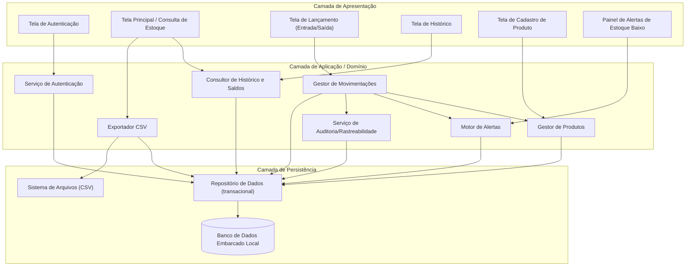
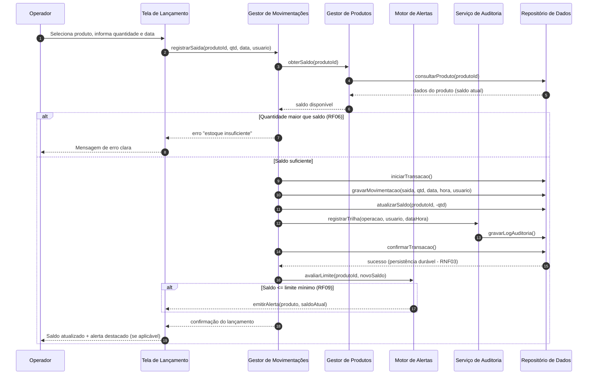
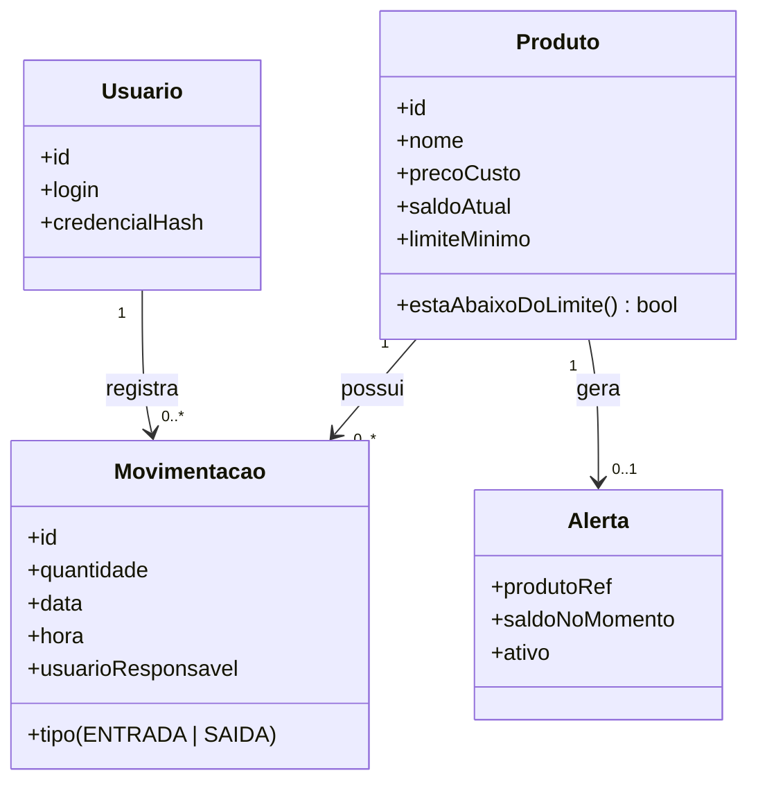

# Relatório Técnico de Arquitetura de Software
## Sistema de Controle de Estoque — Loja Física (P03)

---

## 1. Identificação das HUs

| HU | Título | Perfil | RFs Relacionados | RNFs Relacionados |
|----|--------|--------|------------------|-------------------|
| HU01 | Cadastrar produto | Operador | RF01, RF02, RF03, RF12 | RNF04, RNF06 |
| HU02 | Registrar entrada de mercadoria | Operador | RF04, RF07 | RNF03, RNF04, RNF08 |
| HU03 | Registrar saída de produto | Operador | RF05, RF06, RF07 | RNF03, RNF04, RNF08 |
| HU04 | Ser alertado sobre estoque baixo | Operador | RF09 | RNF04 |
| HU05 | Configurar limite mínimo por produto | Operador | RF08 | — |
| HU06 | Consultar saldo atual do estoque | Operador | RF10, RF12 | RNF05 |
| HU07 | Consultar histórico de movimentações | Operador | RF11 | RNF05, RNF08 |
| HU08 | Exportar dados em CSV | Operador | — (derivado de RNF07) | RNF07 |

**Observação:** RF02 e RF03 (edição/remoção) não possuem HU dedicada — tratados como extensão de HU01. RNF06 (autenticação) não possui HU associada — registrado na Seção 5.

---

## 2. Diagramas de Arquitetura (Mermaid)

### 2.1 Diagrama de Componentes (Arquitetura em Camadas — Aplicação Desktop Local)

### 2.2 Diagrama de Sequência — Registro de Saída com Validação e Alerta (HU03 + HU04)

### 2.3 Modelo de Domínio Conceitual

---

## 3. Decisões de Arquitetura

| ID | Decisão | Justificativa | Requisitos Atendidos |
|----|---------|---------------|----------------------|
| AD01 | **Arquitetura monolítica em camadas (Apresentação / Domínio / Persistência)** para aplicação desktop local | Sistema mono-usuário local, sem servidor externo; camadas garantem manutenibilidade e testabilidade | RNF01, RNF02, RNF07 |
| AD02 | **Persistência transacional com escrita durável (write-ahead / commit atômico)**: lançamento e atualização de saldo ocorrem na mesma transação, confirmada em disco antes de retornar sucesso à UI | Garante que nenhum lançamento seja perdido em fechamento inesperado | RNF03, RF07 |
| AD03 | **Validação de saldo no domínio (não apenas na UI)**: a regra "saída ≤ saldo" é aplicada pelo Gestor de Movimentações dentro da transação | Evita condições de inconsistência e centraliza a regra de negócio | RF06, HU03 |
| AD04 | **Motor de Alertas orientado a eventos internos**: recalcula estado de alerta a cada lançamento e a cada alteração de limite mínimo; alerta persiste até saldo superar o limite | Atende ao critério de persistência do alerta de HU04 e reflexo imediato de HU05 | RF08, RF09 |
| AD05 | **Consultas com índices por nome de produto, produto+data e paginação/ordenação no repositório** | Garante carga ≤ 2s com grande volume de registros | RNF05, RF11, RF12 |
| AD06 | **Trilha de auditoria imutável (append-only)**: toda movimentação registra data, hora e usuário autenticado; registros de movimentação não são editáveis | Rastreabilidade e integridade do histórico | RNF08, HU07 |
| AD07 | **Autenticação local com armazenamento de credenciais via hash com salt**; sessão do usuário propaga identidade para os lançamentos | Segurança sem servidor externo | RNF06, RNF08 |
| AD08 | **Exportador CSV desacoplado**, lendo do repositório e gravando em diretório escolhido pelo usuário, com confirmação de sucesso | Backup e análise externa sem acoplar UI à persistência | RNF07, HU08 |
| AD09 | **Exclusão lógica de produto (soft delete)** quando houver movimentações associadas | Preserva histórico e rastreabilidade (RNF08) mesmo após remoção (RF03) | RF03, RF11, RNF08 |
| AD10 | **Fluxos de entrada/saída acessíveis da tela principal em ≤ 3 interações** (selecionar produto → informar quantidade → confirmar) | Restrição de usabilidade guia o design de navegação | RNF04 |

---

## 4. Tabela de Componentes e Rastreabilidade

| Componente | Responsabilidade Principal | Comunica-se com | Origem (HU / Critério de Aceite) |
|------------|---------------------------|-----------------|----------------------------------|
| Tela de Autenticação | Coletar credenciais e iniciar sessão do operador | Serviço de Autenticação | RNF06 |
| Tela Principal / Consulta de Estoque | Listar produtos com saldo, limite e destaque visual; ordenação por nome/quantidade | Consultor de Histórico e Saldos, Exportador CSV, Painel de Alertas | HU06 (todos os critérios), RF10 |
| Tela de Cadastro de Produto | Cadastro, edição e remoção de produtos; validação de campos obrigatórios | Gestor de Produtos | HU01 (nome/qtd obrigatórios; sem duplicidade), RF01–RF03 |
| Tela de Lançamento | Registrar entradas/saídas em ≤ 3 interações; busca de produto por nome | Gestor de Movimentações | HU02, HU03, RNF04, RF12 |
| Tela de Histórico | Filtrar movimentações por produto e período; ordem cronológica decrescente | Consultor de Histórico e Saldos | HU07 (todos os critérios), RF11 |
| Painel de Alertas | Exibir alertas destacados e persistentes com produto e saldo atual | Motor de Alertas | HU04 (destaque, identificação, persistência) |
| Serviço de Autenticação | Validar credenciais (hash+salt), gerir sessão e identidade do usuário | Repositório de Dados, todas as telas | RNF06, RNF08 |
| Gestor de Produtos | CRUD de produtos, unicidade de nome, gestão de limite mínimo, exclusão lógica | Repositório de Dados | HU01, HU05, RF01–RF03, RF08 |
| Gestor de Movimentações | Orquestrar lançamentos transacionais; validar saldo; atualizar estoque atomicamente | Gestor de Produtos, Motor de Alertas, Serviço de Auditoria, Repositório | HU02, HU03, RF04–RF07, RNF03 |
| Motor de Alertas | Avaliar saldo × limite após cada lançamento/configuração; manter estado do alerta ativo | Repositório, Painel de Alertas | HU04, HU05, RF09 |
| Consultor de Histórico e Saldos | Consultas otimizadas (índices, paginação) de saldo, busca por nome e histórico filtrado | Repositório de Dados | HU06, HU07, RF10–RF12, RNF05 |
| Serviço de Auditoria | Registrar data, hora e usuário em toda operação (trilha append-only) | Repositório de Dados | RNF08, HU07 (usuário responsável) |
| Exportador CSV | Gerar CSV de estoque e movimentações no diretório escolhido; confirmar sucesso | Repositório de Dados, Sistema de Arquivos | HU08 (todos os critérios), RNF07 |
| Repositório de Dados | Abstrair persistência transacional durável sobre banco embarcado local | Banco de Dados Embarcado | RNF02, RNF03, RNF05 |

---

## 5. Bloqueios e Pendências

| ID | Tipo | Descrição | Impacto | Ação Requerida |
|----|------|-----------|---------|----------------|
| P01 | Pendência | Não há HU nem critérios para autenticação (RNF06): gestão de usuários, cadastro, recuperação de senha, perfis | Componente de autenticação sem escopo funcional definido | Product Owner especificar HU de gestão de usuários/acessos |
| P02 | Pendência | RF03 (remoção de produto) conflita potencialmente com RNF08 (rastreabilidade) — comportamento com movimentações existentes não especificado | Decisão AD09 (soft delete) adotada provisoriamente | Validar exclusão lógica com stakeholders |
| P03 | Pendência | Não definido se saída pode ser retroativa (data no passado) nem se há estorno/correção de lançamentos errados | Modelo de movimentações imutável pode exigir movimentação de ajuste | Definir política de correção/estorno |
| P04 | Pendência | "Grande volume de registros" (RNF05) não quantificado | Dimensionamento de índices e paginação sem meta objetiva | Definir volumetria alvo (ex.: nº de produtos e movimentações/ano) |
| P05 | Bloqueio parcial | Existência de múltiplos operadores simultâneos não especificada (aplicação local sugere mono-usuário, mas RNF08 cita "usuário responsável") | Afeta estratégia de concorrência e locking | Confirmar cenário mono-estação vs. múltiplas estações |
| P06 | Pendência | Edição de produto (RF02): não definido se preço de custo e nome podem ser alterados após haver movimentações | Impacto em histórico e relatórios | Especificar campos editáveis e regras |

---

## 6. Cobertura de Requisitos

| Requisito | Coberto por (Componente/Decisão) | Status |
|-----------|----------------------------------|--------|
| RF01 | Tela Cadastro + Gestor de Produtos | ✅ Coberto |
| RF02 | Gestor de Produtos | ⚠️ Coberto com pendência (P06) |
| RF03 | Gestor de Produtos (AD09) | ⚠️ Coberto com pendência (P02) |
| RF04 | Gestor de Movimentações | ✅ Coberto |
| RF05 | Gestor de Movimentações | ✅ Coberto |
| RF06 | Gestor de Movimentações (AD03) | ✅ Coberto |
| RF07 | Transação atômica (AD02) | ✅ Coberto |
| RF08 | Gestor de Produtos + Motor de Alertas | ✅ Coberto |
| RF09 | Motor de Alertas + Painel de Alertas (AD04) | ✅ Coberto |
| RF10 | Consultor de Histórico e Saldos + Tela Principal | ✅ Coberto |
| RF11 | Consultor de Histórico e Saldos + Tela de Histórico | ✅ Coberto |
| RF12 | Consultor (busca indexada por nome) | ✅ Coberto |
| RNF01 | AD01 (aplicação desktop local para Windows) | ✅ Coberto |
| RNF02 | Repositório + banco embarcado (AD01) | ✅ Coberto |
| RNF03 | AD02 (transação durável) | ✅ Coberto |
| RNF04 | AD10 (fluxo ≤ 3 interações) | ✅ Coberto (validar em teste de usabilidade) |
| RNF05 | AD05 (índices/paginação) | ⚠️ Coberto com pendência (P04 — volumetria) |
| RNF06 | Serviço de Autenticação (AD07) | ⚠️ Coberto com pendência (P01 — gestão de usuários) |
| RNF07 | Exportador CSV (AD08) | ✅ Coberto |
| RNF08 | Serviço de Auditoria (AD06) | ✅ Coberto |

**Resumo:** 20/20 requisitos endereçados arquiteturalmente; 5 com pendências de especificação (não bloqueiam o design, mas bloqueiam detalhamento de implementação).

---

## 7. Gap Analysis

| # | Lacuna Identificada | Impacto Arquitetural | Ação Recomendada |
|---|---------------------|----------------------|------------------|
| G01 | **Gestão de usuários inexistente**: RNF06/RNF08 pressupõem usuários, mas não há requisito de cadastro, perfis ou troca de senha | Serviço de Autenticação incompleto; risco de credencial fixa/insegura | Especificar HU de administração de usuários antes da Sprint que implementa autenticação |
| G02 | **Ausência de estorno/correção de lançamentos**: histórico imutável (AD06) sem mecanismo de ajuste levará a saldos incorretos permanentes em caso de erro do operador | Necessário conceito de "movimentação de ajuste" com motivo e rastreabilidade | Incluir RF de ajuste de estoque com justificativa obrigatória |
| G03 | **Backup automático não especificado**: RNF07 cobre exportação manual, mas RNF03 (confiabilidade) sugere necessidade de proteção contra corrupção/perda do arquivo local | Estratégia de backup/restauração do banco embarcado ausente | Definir política de backup automático local e procedimento de restauração |
| G04 | **Concorrência não definida** (P05): se houver mais de uma estação, o banco embarcado local não suporta o cenário | Pode invalidar AD01/RNF02 (arquitetura local) | Confirmar mono-estação; se multi-estação, revisar decisão de persistência |
| G05 | **Volumetria e retenção de histórico não quantificadas** | Índices/paginação (AD05) sem meta mensurável; sem política de arquivamento | Definir volumetria alvo e política de retenção/arquivamento de movimentações antigas |
| G06 | **Unidades de medida e preço de venda ausentes**: produtos possuem apenas quantidade inteira e preço de custo | Modelo de domínio pode exigir extensão (unidades fracionadas, margem) — risco de retrabalho | Confirmar com o negócio se quantidade inteira e ausência de preço de venda são definitivos |
| G07 | **Codificação e layout do CSV não especificados** (separador, encoding, cabeçalhos) | Risco de incompatibilidade com planilhas do usuário | Padronizar formato do CSV nos critérios de aceite de HU08 |
| G08 | **Comportamento de RF06 em lançamentos retroativos** (P03): saída com data passada pode gerar saldo negativo histórico | Regra de validação temporal indefinida | Decidir se validação de saldo considera apenas saldo corrente ou saldo na data do lançamento |

**Conclusão:** a arquitetura proposta cobre integralmente os requisitos declarados com decisões conservadoras (transações duráveis, auditoria append-only, exclusão lógica). As lacunas G01, G02 e G04 são as de maior risco e devem ser resolvidas antes do início do desenvolvimento dos módulos de autenticação e movimentações.