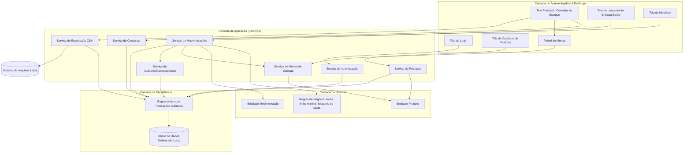
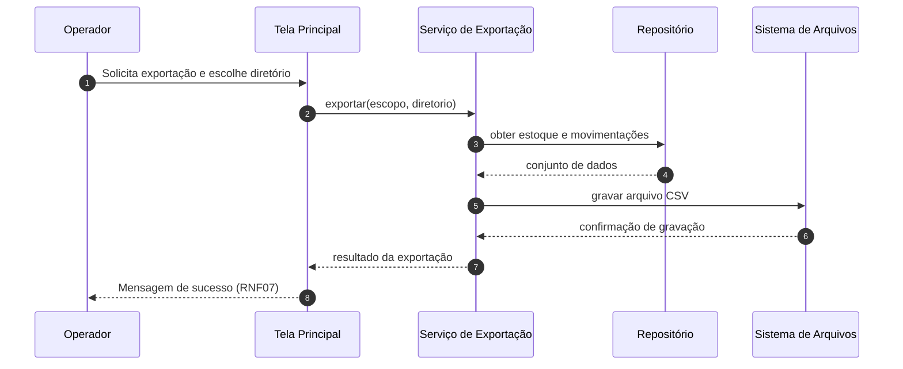

# Relatório Técnico de Arquitetura de Software
## Sistema de Controle de Estoque — Loja Física (P03)

---

## 1. Identificação das HUs

| HU | Título | Perfil | RFs Relacionados | RNFs Relacionados |
|------|--------|--------|------------------|-------------------|
| HU01 | Cadastrar produto | Operador | RF01, RF02, RF03, RF10 | RNF01, RNF02 |
| HU02 | Registrar entrada de mercadoria | Operador | RF04, RF07, RF12 | RNF03, RNF04, RNF08 |
| HU03 | Registrar saída de produto | Operador | RF05, RF06, RF07 | RNF03, RNF04, RNF08 |
| HU04 | Ser alertado sobre estoque baixo | Operador | RF09 | RNF04 |
| HU05 | Configurar limite mínimo por produto | Operador | RF08 | — |
| HU06 | Consultar saldo atual do estoque | Operador | RF10, RF12 | RNF05 |
| HU07 | Consultar histórico de movimentações | Operador | RF11 | RNF05, RNF08 |
| HU08 | Exportar dados (CSV) | Operador | — (derivado de RNF07) | RNF07 |
| — | Autenticação de acesso (implícita) | Operador | — | RNF06, RNF08 |

> **Observação:** RNF06/RNF08 implicam uma HU não escrita ("Autenticar-me no sistema"), tratada na Seção 5 e 7.

---

## 2. Diagramas de Arquitetura (Mermaid)

### 2.1 Diagrama de Componentes (Arquitetura em Camadas — Aplicação Desktop Local)



### 2.2 Diagrama de Sequência — HU03: Registrar Saída de Produto (com validação e alerta)

```mermaid
sequenceDiagram
    autonumber
    participant OP as Operador
    participant UI as Tela de Lançamento
    participant MOV as Serviço de Movimentações
    participant REG as Regras de Negócio
    participant ALT as Serviço de Alertas
    participant AUD as Serviço de Auditoria
    participant REP as Repositório
    participant DB as Banco Embarcado

    OP->>UI: Seleciona produto, informa quantidade e data
    UI->>MOV: registrarSaida(produtoId, qtd, data, usuario)
    MOV->>REP: obterSaldoAtual(produtoId)
    REP->>DB: consulta saldo
    DB-->>REP: saldo atual
    REP-->>MOV: saldo atual
    MOV->>REG: validarSaida(saldo, qtd)
    alt Quantidade maior que saldo (RF06)
        REG-->>MOV: violação de regra
        MOV-->>UI: erro de validação
        UI-->>OP: Mensagem clara: saldo insuficiente
    else Quantidade válida
        REG-->>MOV: aprovado
        MOV->>REP: iniciar transação atômica (RNF03)
        REP->>DB: grava movimentação (data, hora, usuário - RNF08)
        REP->>DB: decrementa saldo (RF07)
        REP->>DB: commit
        DB-->>REP: confirmação
        REP-->>MOV: sucesso
        MOV->>ALT: avaliarLimiteMinimo(produtoId)
        ALT-->>MOV: status do alerta (RF09)
        MOV->>AUD: registrarTrilha(lancamento)
        MOV-->>UI: sucesso + estado de alerta
        UI-->>OP: Saldo atualizado (e alerta destacado, se aplicável)
    end
```

### 2.3 Diagrama de Sequência — HU08: Exportação CSV



---

## 3. Decisões de Arquitetura

| ID | Decisão | Justificativa | Requisitos Atendidos |
|----|---------|---------------|----------------------|
| DA01 | **Arquitetura monolítica em camadas (desktop standalone)** | Aplicação local, mono-usuário por estação, sem servidor externo; camadas isolam UI, regras e persistência para manutenibilidade. | RNF01, RNF02 |
| DA02 | **Banco de dados embarcado com transações ACID** | Cada lançamento (movimentação + atualização de saldo) executa em transação atômica com commit imediato; nenhum dado é mantido apenas em memória. | RNF02, RNF03, RF07 |
| DA03 | **Saldo derivado mantido como campo materializado, validado por trilha de movimentações** | Consulta de saldo em O(1) garante desempenho; o histórico permite reconciliação/recontagem em caso de inconsistência. | RF07, RF10, RNF05 |
| DA04 | **Validação de saída centralizada na camada de domínio** | A regra "saída ≤ saldo" (RF06) é aplicada dentro da mesma transação de gravação, evitando condição de corrida e duplicação de regra na UI. | RF06, RNF03 |
| DA05 | **Alertas avaliados de forma reativa e persistente** | O estado "abaixo do limite" é uma condição derivada (saldo ≤ limite), recalculada a cada lançamento e a cada carga da tela; o alerta persiste naturalmente até reposição (HU04). | RF08, RF09 |
| DA06 | **Autenticação local com credenciais protegidas por hash + sessão em memória** | Sem servidor externo, credenciais residem no banco embarcado com armazenamento irreversível de senha; usuário logado alimenta a trilha de auditoria. | RNF06, RNF08 |
| DA07 | **Índices/paginação nas consultas de histórico** | Filtros por produto e período com paginação garantem resposta ≤ 2s com grande volume. | RF11, RNF05 |
| DA08 | **Exportação CSV desacoplada via serviço dedicado** | Exportação lê via repositório (mesma fonte de verdade), sem acoplar formato de arquivo às regras de negócio. | RNF07 |
| DA09 | **UI orientada a fluxo curto (atalhos na tela principal)** | Lançamento de entrada/saída acessível diretamente da tela principal: (1) selecionar produto, (2) informar quantidade/data, (3) confirmar. | RNF04 |
| DA10 | **Exclusão de produto com verificação de dependências** | Produto com movimentações não pode ser fisicamente removido sem perda de rastreabilidade → adoção de inativação lógica (ver Gap G02). | RF03, RNF08 |

---

## 4. Tabela de Componentes e Rastreabilidade

| Componente | Responsabilidade Principal | Comunica-se com | Origem (HU / Critério de Aceite) |
|------------|---------------------------|-----------------|----------------------------------|
| Tela de Login | Coletar credenciais e iniciar sessão | Serviço de Autenticação | RNF06 (implícito) |
| Tela Principal / Consulta de Estoque | Listar produtos com saldo, limite e destaque visual; ordenação por nome/quantidade; busca por nome | Serviço de Consultas, Painel de Alertas, Serviço de Exportação | HU06 (todos os CAs), RF10, RF12 |
| Tela de Cadastro de Produtos | CRUD de produto e configuração de limite mínimo | Serviço de Produtos | HU01 (CAs 1–3), HU05 (CAs 1–3), RF01–RF03, RF08 |
| Tela de Lançamento Entrada/Saída | Capturar produto, quantidade e data em ≤ 3 interações; exibir erros de validação | Serviço de Movimentações | HU02 (CAs 1–4), HU03 (CAs 1–3), RNF04 |
| Tela de Histórico | Filtrar por produto/período; exibir tipo, quantidade, data, hora, usuário em ordem decrescente | Serviço de Consultas | HU07 (CAs 1–3), RF11 |
| Painel de Alertas | Exibir destaque visual persistente de produtos abaixo do limite, com saldo atual | Serviço de Alertas | HU04 (CAs 1–3), RF09 |
| Serviço de Autenticação | Validar credenciais (hash), gerenciar sessão do usuário corrente | Repositório | RNF06, RNF08 |
| Serviço de Produtos | Regras de cadastro (obrigatoriedade, unicidade de nome), edição, remoção/inativação, limite mínimo | Entidade Produto, Repositório | HU01 (CA2: não duplicar nome), HU05 (CA2: inteiro ≥ 0) |
| Serviço de Movimentações | Orquestrar entrada/saída em transação atômica; acionar alertas e auditoria | Regras de Negócio, Repositório, Serviço de Alertas, Serviço de Auditoria | HU02 (CA3), HU03 (CA1–2), RF04–RF07, RNF03 |
| Regras de Negócio (Domínio) | Validar saída ≤ saldo; quantidades inteiras positivas; recomputar saldo | Serviço de Movimentações | HU02 (CA2), HU03 (CA1), RF06 |
| Serviço de Alertas de Estoque | Avaliar condição saldo ≤ limite; manter estado do alerta até reposição | Entidade Produto, Repositório | HU04 (CA3), HU05 (CA3), RF09 |
| Serviço de Consultas | Consultas de saldo, busca por nome, histórico paginado com filtros | Repositório | HU06, HU07, RNF05 |
| Serviço de Auditoria | Registrar data, hora e usuário de cada lançamento | Repositório | HU07 (CA2), RNF08 |
| Serviço de Exportação CSV | Gerar arquivo CSV completo em diretório escolhido; confirmar sucesso | Repositório, Sistema de Arquivos | HU08 (CAs 1–3), RNF07 |
| Repositórios | Acesso transacional ao banco embarcado; índices para desempenho | Banco de Dados Embarcado | RNF02, RNF03, RNF05 |
| Banco de Dados Embarcado | Persistência local durável (ACID) | Repositórios | RNF02, RNF03 |

---

## 5. Bloqueios e Pendências

| ID | Tipo | Descrição | Impacto | Ação Requerida |
|----|------|-----------|---------|----------------|
| B01 | Bloqueio | **Gestão de usuários não especificada** (RNF06 exige login, mas não há RF/HU para criar/gerir usuários e senhas). | Sem cadastro de usuários, autenticação e rastreabilidade (RNF08) ficam inviáveis. | Product Owner definir HU de administração de usuários (ou usuário único pré-provisionado). |
| B02 | Bloqueio | **Semântica de remoção de produto (RF03)** com movimentações existentes conflita com RNF08 (rastreabilidade). | Remoção física quebraria histórico. | Confirmar adoção de inativação lógica (DA10). |
| P01 | Pendência | Comportamento para lançamentos com **data retroativa/futura** (RF04/RF05 permitem informar data). | Pode gerar históricos inconsistentes. | Definir regras de validação de data. |
| P02 | Pendência | **Edição/estorno de lançamentos** não prevista — apenas criação. | Erros operacionais sem correção auditável. | Definir mecanismo de estorno (nova movimentação compensatória). |
| P03 | Pendência | Escopo exato do CSV (separador, codificação, um arquivo ou dois — estoque × movimentações). | Retrabalho na exportação. | Especificar layout do CSV. |
| P04 | Pendência | Política de backup/recuperação do banco embarcado além do CSV. | Risco de perda total em falha de disco. | Definir estratégia de backup local. |

---

## 6. Cobertura de Requisitos

| Requisito | Coberto por | Status |
|-----------|-------------|--------|
| RF01 | Serviço de Produtos, Tela de Cadastro | ✅ Coberto |
| RF02 | Serviço de Produtos, Tela de Cadastro | ✅ Coberto |
| RF03 | Serviço de Produtos (inativação lógica — DA10) | ⚠️ Coberto com ressalva (B02) |
| RF04 | Serviço de Movimentações, Tela de Lançamento | ✅ Coberto |
| RF05 | Serviço de Movimentações, Tela de Lançamento | ✅ Coberto |
| RF06 | Regras de Negócio (validação transacional — DA04) | ✅ Coberto |
| RF07 | Transação atômica movimentação + saldo (DA02/DA03) | ✅ Coberto |
| RF08 | Serviço de Produtos, Tela de Cadastro | ✅ Coberto |
| RF09 | Serviço de Alertas, Painel de Alertas (DA05) | ✅ Coberto |
| RF10 | Serviço de Consultas, Tela Principal | ✅ Coberto |
| RF11 | Serviço de Consultas, Tela de Histórico (DA07) | ✅ Coberto |
| RF12 | Serviço de Consultas (busca por nome) | ✅ Coberto |
| RNF01 | Arquitetura desktop standalone (DA01) | ✅ Coberto |
| RNF02 | Banco embarcado local (DA02) | ✅ Coberto |
| RNF03 | Transações atômicas com commit imediato (DA02) | ✅ Coberto |
| RNF04 | Fluxo de UI ≤ 3 interações (DA09) | ✅ Coberto |
| RNF05 | Saldo materializado + índices/paginação (DA03, DA07) | ✅ Coberto |
| RNF06 | Serviço de Autenticação (DA06) | ⚠️ Coberto com ressalva (B01) |
| RNF07 | Serviço de Exportação CSV (DA08) | ✅ Coberto |
| RNF08 | Serviço de Auditoria + sessão de usuário | ⚠️ Coberto com ressalva (B01) |

**Resumo:** 20 requisitos — 17 totalmente cobertos, 3 cobertos com ressalvas dependentes de decisões de negócio.

---

## 7. Gap Analysis

| ID | Lacuna Identificada | Impacto Arquitetural | Ação Recomendada |
|----|---------------------|----------------------|------------------|
| G01 | Ausência de HU/RF para **gestão de usuários e recuperação de senha**, apesar de RNF06/RNF08 exigirem identificação. | Serviço de Autenticação e Auditoria não têm origem de dados; auditoria fica sem ator identificável. | Criar HU de administração de usuários; definir perfis (haverá apenas "Operador" ou também "Administrador"?). |
| G02 | **Remoção de produto (RF03)** conflita com preservação de histórico (RNF08, HU07). | Modelo de dados deve prever flag de inatividade e filtragem em consultas/busca. | Formalizar decisão de exclusão lógica; ocultar inativos das telas operacionais. |
| G03 | **Sem mecanismo de correção/estorno de lançamentos.** | Ausência de fluxo compensatório pode induzir manipulação direta do banco (viola RNF03/RNF08). | Especificar movimentação de ajuste/estorno auditada. |
| G04 | **Preço de custo cadastrado (RF01) sem uso posterior** — nenhuma consulta ou relatório o utiliza; não há preço por lote na entrada. | Modelo pode precisar de histórico de custo por entrada (custo médio, FIFO). | Confirmar se custo é atributo estático do produto ou por lote de entrada. |
| G05 | **Critérios de desempenho vagos** — "grande volume" não quantificado (RNF05). | Dimensionamento de índices, paginação e política de arquivamento sem baseline. | Definir volumetria alvo (nº de produtos, movimentações/dia, horizonte de retenção). |
| G06 | **Alerta de estoque baixo sem definição de "reconhecimento"** — apenas persistência até reposição. | UI pode ficar poluída com muitos alertas simultâneos. | Validar com PO se há necessidade de agrupamento/priorização de alertas. |
| G07 | **Concorrência multi-estação não abordada** — requisitos sugerem estação única, mas lojas podem ter mais de um caixa. | Se houver múltiplas estações, o banco embarcado local (RNF02) torna-se restrição estrutural crítica. | Confirmar explicitamente cenário mono-estação antes de fechar a arquitetura. |
| G08 | **Recuperação pós-falha (RNF03)** cobre durabilidade, mas não define comportamento na reabertura (ex.: retomar lançamento parcial em tela). | Escolha entre descartar rascunhos ou implementar rascunho persistente. | Definir política: recomenda-se descartar entradas de tela não confirmadas, garantindo apenas lançamentos confirmados. |
| G09 | **CSV sem especificação de formato** (codificação, separador, escopo de campos, nomes de arquivos). | Baixo impacto estrutural, mas afeta interoperabilidade com planilhas. | Documentar layout do arquivo na especificação funcional. |

**Conclusão:** A arquitetura proposta cobre integralmente o escopo funcional descrito, com desenho monolítico em camadas adequado ao contexto desktop local. Os gaps críticos (G01, G02, G07) devem ser resolvidos com o Product Owner **antes do início da implementação**, pois afetam modelo de dados e premissas estruturais; os demais podem ser tratados durante o refinamento do backlog.