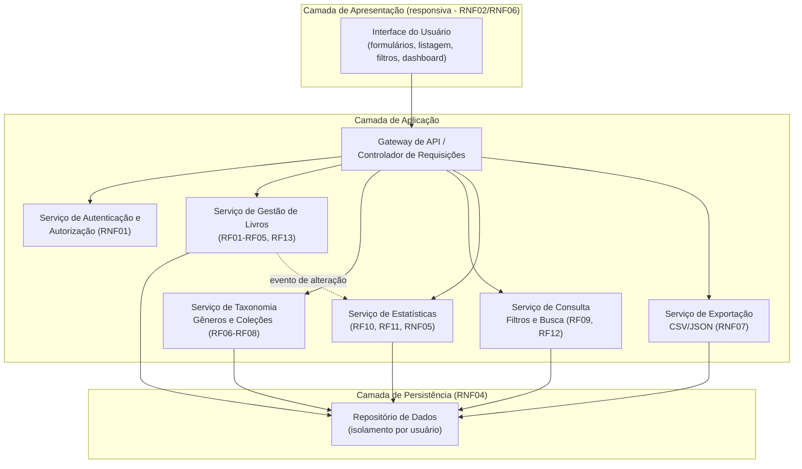
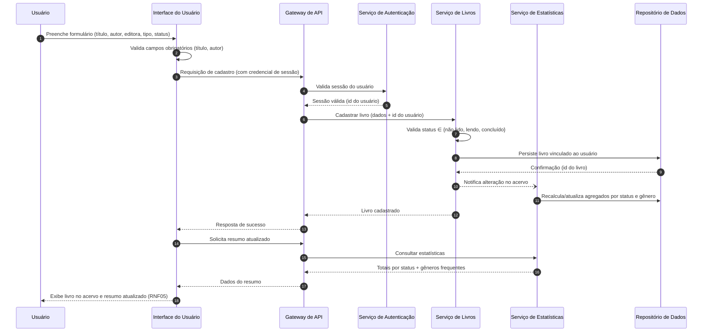
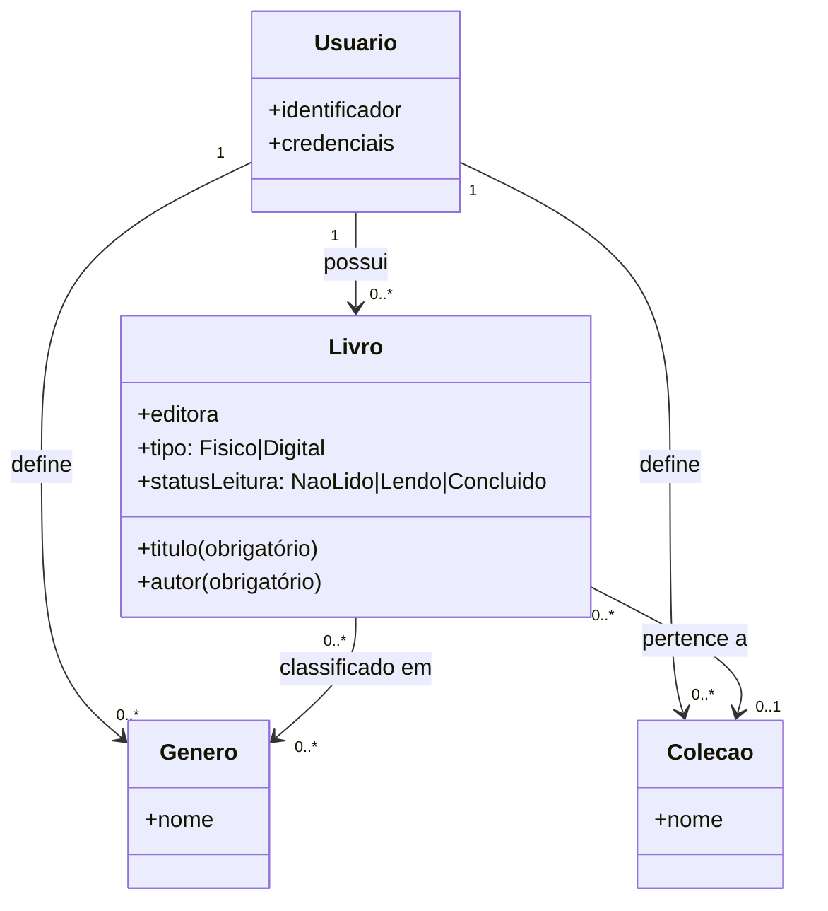

# Relatório Técnico de Arquitetura de Software
## Sistema de Catalogação de Livros — Biblioteca Pessoal (P04) | AI4ES Time 2

---

## 1. Identificação das HUs

| HU | Título | Perfil | RFs Relacionados | RNFs Relacionados |
|----|--------|--------|------------------|-------------------|
| HU01 | Cadastrar livro | Usuário | RF01, RF04, RF13 | RNF01, RNF04 |
| HU02 | Atualizar status de leitura | Usuário | RF02, RF04, RF05 | RNF05 |
| HU03 | Organizar livros por gênero | Usuário | RF06, RF08 | RNF04 |
| HU04 | Organizar livros por coleção | Usuário | RF07, RF08 | RNF04 |
| HU05 | Filtrar o acervo | Usuário | RF09 | RNF03 |
| HU06 | Pesquisar por título/autor | Usuário | RF12 | RNF03 |
| HU07 | Visualizar resumo do acervo | Usuário | RF10, RF11 | RNF05 |
| HU08 | Exportar o acervo | Usuário | — (derivado de RNF07) | RNF07 |

**Observações de identificação:**
- RF03 (remoção de livro) não possui HU explícita — coberto implicitamente pelo ciclo CRUD de HU01/HU02 (registrado na Seção 7).
- RNF01 (autenticação) não possui HU associada — tratado como requisito transversal (registrado nas Seções 5 e 7).

---

## 2. Diagramas de Arquitetura (Mermaid)

### 2.1 Diagrama de Componentes (Visão Lógica)

### 2.2 Diagrama de Sequência — HU01/HU02/HU07 (Cadastro + Atualização de estatísticas em tempo real)

### 2.3 Modelo Conceitual de Domínio

---

## 3. Decisões de Arquitetura

| ID | Decisão | Justificativa | Requisitos |
|----|---------|---------------|------------|
| DA01 | Arquitetura em camadas (apresentação, aplicação, persistência) com serviços de domínio coesos | Separação de responsabilidades e manutenibilidade; escopo pessoal não justifica distribuição complexa | Geral |
| DA02 | Isolamento de dados por usuário no repositório (todo acesso filtrado pelo identificador do usuário autenticado) | Garante acervo estritamente pessoal | RNF01 |
| DA03 | Autenticação como componente transversal no gateway, interceptando todas as requisições | Nenhuma operação de acervo acessível sem sessão válida | RNF01 |
| DA04 | Relacionamento N:N Livro↔Gênero e N:1 Livro↔Coleção, com remoção de gênero/coleção via **desvinculação** (não cascata) | Critérios de aceite de HU03/HU04 exigem preservar livros ao remover categorias | RF06–RF08 |
| DA05 | Serviço de Consulta com filtros combináveis e busca parcial (correspondência por substring, insensível a maiúsculas), com apoio de índices nos atributos filtráveis | Atender filtros dinâmicos e busca incremental em ≤ 2s | RF09, RF12, RNF03 |
| DA06 | Estatísticas atualizadas por notificação de evento a cada mutação do acervo (ou recomputadas sob demanda com agregação eficiente) | Resumo "em tempo real" após cadastro/edição/remoção | RF10, RF11, RNF05 |
| DA07 | Exportação gerada no servidor e entregue como download; formatos CSV e JSON selecionáveis | Backup pessoal completo; formatos exigidos literalmente pelo requisito | RNF07 |
| DA08 | Interface responsiva baseada em padrões web abertos, compatível com navegadores modernos | Compatibilidade multi-dispositivo e multi-navegador | RNF02, RNF06 |
| DA09 | Status de leitura e tipo de livro modelados como enumerações fechadas do domínio | Conjunto fixo de valores definidos nos requisitos | RF04, RF13 |
| DA10 | Persistência transacional: confirmações de escrita antes de responder ao cliente | Sem risco de perda ao fechar/recarregar a aplicação | RNF04 |

---

## 4. Tabela de Componentes e Rastreabilidade

| Componente | Responsabilidade Principal | Comunica-se com | Origem (HU / Critério de Aceite) |
|---|---|---|---|
| Interface do Usuário | Formulários de CRUD, listagem, filtros combináveis com "limpar filtros", busca incremental, dashboard de resumo, download de exportação; validação de campos obrigatórios | Gateway de API | HU01 (obrigatoriedade título/autor), HU05 (limpar filtros em 1 clique), HU06 (resultados enquanto digita), HU07, HU08 |
| Gateway de API | Roteamento, validação de sessão, orquestração das requisições | Todos os serviços de aplicação | Transversal (RNF01) |
| Serviço de Autenticação e Autorização | Cadastro/login, gestão de sessão, garantia de isolamento por usuário | Gateway, Repositório | RNF01 |
| Serviço de Gestão de Livros | CRUD de livros, validação de status e tipo (físico/digital), emissão de eventos de alteração | Repositório, Serviço de Estatísticas | HU01, HU02 (alteração de status a qualquer momento); RF01–RF05, RF13 |
| Serviço de Taxonomia | CRUD de gêneros e coleções; associação livro↔gêneros (N) e livro↔coleção (1); desvinculação sem exclusão de livros | Repositório | HU03 (remover gênero apenas desvincula), HU04 (uma coleção por livro; remover desvincula) |
| Serviço de Consulta | Filtragem combinada por qualquer atributo e busca parcial por título/autor | Repositório | HU05 (múltiplos filtros simultâneos), HU06 (busca parcial); RNF03 |
| Serviço de Estatísticas | Cálculo de totais por status e gêneros mais frequentes; atualização a cada mutação | Repositório, Serviço de Livros (eventos) | HU07 (atualização automática); RF10, RF11, RNF05 |
| Serviço de Exportação | Serialização do acervo completo em CSV ou JSON e disponibilização para download | Repositório | HU08 (todos os campos, escolha de formato, download via navegador); RNF07 |
| Repositório de Dados | Persistência durável e transacional, indexação para consulta, particionamento lógico por usuário | Todos os serviços de aplicação | RNF01, RNF03, RNF04 |

---

## 5. Bloqueios e Pendências

| ID | Tipo | Descrição | Impacto | Responsável sugerido |
|----|------|-----------|---------|----------------------|
| BP01 | Pendência | Não há HU/RF de cadastro de conta, recuperação de senha ou logout — apenas RNF01 cita autenticação | Bloqueia detalhamento do fluxo de acesso | Product Owner |
| BP02 | Pendência | RF03 (remover livro) sem critérios de aceite (confirmação? exclusão lógica vs. física?) | Risco de perda irreversível de dados | Product Owner |
| BP03 | Pendência | RNF03 exige ≤ 2s "independentemente do volume" sem definir volume máximo esperado nem estratégia de paginação | Impossível dimensionar índices/paginação | Arquitetura + PO |
| BP04 | Pendência | Não há requisito de **importação** de dados (apenas exportação), o que limita o valor do backup | Decisão de escopo | Product Owner |
| BP05 | Bloqueio parcial | Semântica de "tempo real" (RNF05): mesma sessão apenas, ou múltiplos dispositivos simultâneos (necessitaria mecanismo de notificação ao cliente)? | Define complexidade da camada de apresentação | Arquitetura |

---

## 6. Cobertura de Requisitos

| Requisito | Componente(s) responsável(is) | Status |
|-----------|-------------------------------|--------|
| RF01 | Serviço de Livros, UI | ✅ Coberto |
| RF02 | Serviço de Livros, UI | ✅ Coberto |
| RF03 | Serviço de Livros | ✅ Coberto (critérios pendentes — BP02) |
| RF04 | Serviço de Livros (enumeração de status) | ✅ Coberto |
| RF05 | Serviço de Livros | ✅ Coberto |
| RF06 | Serviço de Taxonomia | ✅ Coberto |
| RF07 | Serviço de Taxonomia | ✅ Coberto |
| RF08 | Serviço de Taxonomia | ✅ Coberto |
| RF09 | Serviço de Consulta | ✅ Coberto |
| RF10 | Serviço de Estatísticas | ✅ Coberto |
| RF11 | Serviço de Estatísticas | ✅ Coberto |
| RF12 | Serviço de Consulta | ✅ Coberto |
| RF13 | Serviço de Livros (enumeração de tipo) | ✅ Coberto |
| RNF01 | Autenticação, Gateway, Repositório (isolamento) | ✅ Coberto (fluxos de conta pendentes — BP01) |
| RNF02 | Interface do Usuário | ✅ Coberto |
| RNF03 | Serviço de Consulta, Repositório (índices) | ⚠️ Parcial (volume indefinido — BP03) |
| RNF04 | Repositório (persistência transacional) | ✅ Coberto |
| RNF05 | Serviço de Estatísticas (eventos) | ⚠️ Parcial (semântica multi-dispositivo — BP05) |
| RNF06 | Interface do Usuário (padrões web) | ✅ Coberto |
| RNF07 | Serviço de Exportação | ✅ Coberto |

**Cobertura: 20/20 requisitos endereçados (17 totais, 3 com ressalvas).**

---

## 7. Gap Analysis

| # | Lacuna | Impacto Arquitetural | Ação Recomendada |
|---|--------|----------------------|------------------|
| G01 | Ausência de fluxos de ciclo de vida da conta (cadastro, login, recuperação, exclusão de conta) | O Serviço de Autenticação foi projetado, mas suas interfaces não podem ser fechadas | PO redigir HUs de gestão de conta antes da sprint de segurança |
| G02 | RF03 sem HU nem critérios: exclusão física vs. lógica, confirmação, impacto nas estatísticas | Define modelo de dados (marcador de exclusão) e reversibilidade | Definir exclusão lógica com confirmação na UI como padrão seguro; validar com PO |
| G03 | RNF03 sem volumetria nem exigência de paginação | "Até 2s independentemente do volume" é inverificável; listagem sem paginação pode degradar | Definir volume-alvo (ex.: até N milhares de livros/usuário), adotar paginação e indexação dos atributos filtráveis |
| G04 | Exportação sem importação correspondente | Backup exportado não é restaurável pelo próprio sistema | Avaliar HU de importação/restauração com validação de esquema e deduplicação |
| G05 | Semântica de "tempo real" indefinida (RNF05) | Escolha entre atualização na resposta da própria operação vs. notificação assíncrona ao cliente | Assumir atualização síncrona pós-operação na mesma sessão; escalar para notificação se multi-dispositivo for requisito |
| G06 | Regras de unicidade não especificadas (livros duplicados? gêneros/coleções com mesmo nome?) | Afeta restrições de integridade do modelo de dados | Definir: nomes de gênero/coleção únicos por usuário; alertar (sem bloquear) livro com título+autor duplicado |
| G07 | Campos adicionais comuns ausentes (ISBN, ano, capa, notas, avaliação) | Extensões futuras exigem modelo de dados evolutivo | Projetar entidade Livro com esquema extensível; validar backlog com PO |
| G08 | Exportação não especifica tratamento de relacionamentos no formato CSV (gêneros múltiplos por livro) | Serialização tabular de N:N requer convenção (ex.: lista separada por delimitador) | Definir e documentar o esquema de exportação como contrato de dados |
| G09 | Sem requisitos de acessibilidade, internacionalização ou limites de tamanho de campos | Retrabalho na camada de apresentação e validações | Estabelecer padrões mínimos de acessibilidade e validação de entrada na definição de pronto |

---

*Fim do Relatório Canônico — AI4ES Time 2 | Projeto P04.*