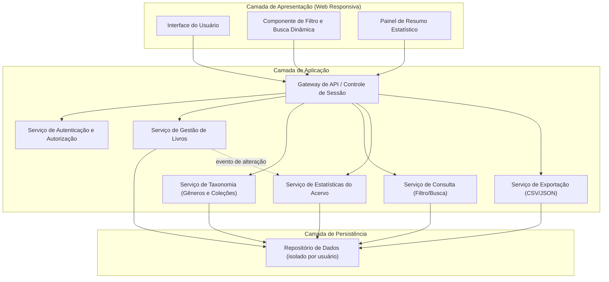
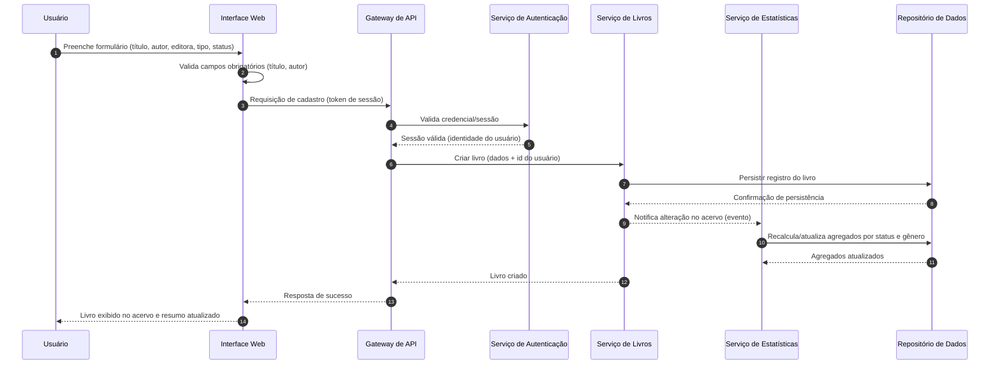
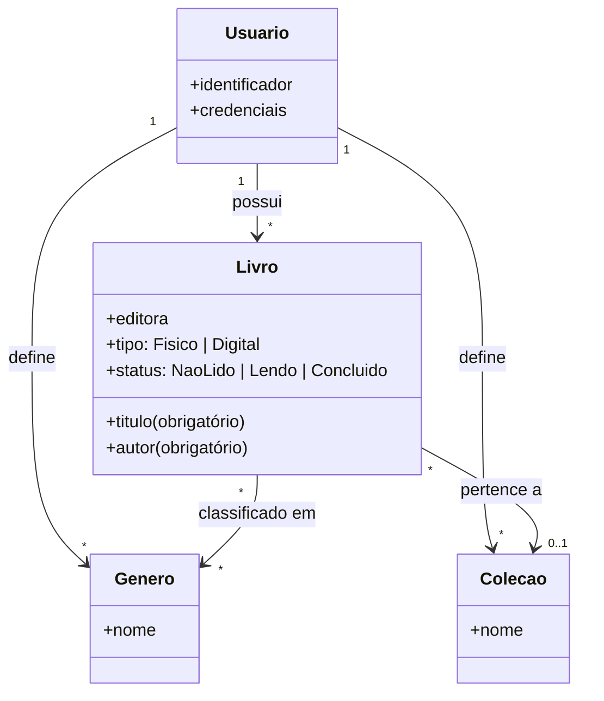

# Relatório Técnico de Arquitetura de Software
## Sistema de Catalogação de Livros — Biblioteca Pessoal (P04)

---

## 1. Identificação das HUs

| HU | Título | Perfil | Requisitos Relacionados |
|----|--------|--------|-------------------------|
| HU01 | Cadastrar livro | Usuário | RF01, RF04, RF13, RNF04 |
| HU02 | Atualizar status de leitura | Usuário | RF05, RF04, RNF05 |
| HU03 | Organizar livros por gênero | Usuário | RF06, RF08 |
| HU04 | Organizar livros por coleção | Usuário | RF07, RF08 |
| HU05 | Filtrar o acervo | Usuário | RF09, RNF03 |
| HU06 | Pesquisar livros por título ou autor | Usuário | RF12, RNF03 |
| HU07 | Visualizar resumo do acervo | Usuário | RF10, RF11, RNF05 |
| HU08 | Exportar o acervo | Usuário | RNF07 |

Requisitos funcionais sem HU dedicada: **RF02 (editar livro)** e **RF03 (remover livro)** — tratados como extensão natural da HU01 (gestão do ciclo de vida do livro). **RNF01 (autenticação)** é transversal a todas as HUs.

---

## 2. Diagramas de Arquitetura (Mermaid)

### 2.1 Diagrama de Componentes (Visão Lógica)

### 2.2 Diagrama de Sequência — Cadastro de Livro com Atualização do Resumo (HU01 + HU07 / RNF05)

### 2.3 Modelo Conceitual de Domínio

---

## 3. Decisões de Arquitetura

| ID | Decisão | Justificativa | Requisitos |
|----|---------|---------------|------------|
| DA01 | Arquitetura em camadas (Apresentação / Aplicação / Persistência) | Separação de responsabilidades, manutenibilidade e testabilidade | RNF07 (manutenção), geral |
| DA02 | Autenticação obrigatória no gateway, com isolamento de dados por identidade de usuário em todas as consultas do repositório | Acervo estritamente pessoal; nenhuma operação acessa dados sem escopo de usuário | RNF01 |
| DA03 | Interface web responsiva única (design adaptativo), compatível com navegadores modernos | Evita duplicação de clientes; atende mobile e desktop | RNF02, RNF06 |
| DA04 | Estatísticas atualizadas por notificação de eventos internos após cada mutação (criar/editar/remover) | Garante resumo em "tempo real" sem recálculo completo a cada leitura | RNF05, RF10, RF11 |
| DA05 | Serviço de Consulta dedicado com filtros combináveis, busca parcial (título/autor) e paginação, apoiado em indexação dos atributos filtráveis | Cumprir SLA de 2s independentemente do volume | RF09, RF12, RNF03 |
| DA06 | Exclusão de gênero/coleção implementa desvinculação (não cascata) dos livros associados | Critérios de aceite de HU03 e HU04 exigem preservar livros | RF06, RF07 |
| DA07 | Cardinalidades: Livro N:N Gênero; Livro N:1 (opcional) Coleção | Determinado literalmente pelos critérios de aceite | RF08, HU03, HU04 |
| DA08 | Exportação gerada sob demanda em CSV ou JSON e entregue como download via navegador | Formatos citados literalmente nos requisitos | RNF07, HU08 |
| DA09 | Persistência transacional em banco de dados (tecnologia não prescrita) | Sem perda de dados ao fechar/recarregar | RNF04 |

---

## 4. Tabela de Componentes e Rastreabilidade

| Componente | Responsabilidade Principal | Comunica-se com | Origem (HU / Critério de Aceite) |
|---|---|---|---|
| Interface do Usuário | Formulários de CRUD, validação de campos obrigatórios, exibição do acervo | Gateway de API | HU01 (título/autor obrigatórios; exibição imediata), HU02 |
| Componente de Filtro e Busca | Filtros combináveis, limpeza em um clique, busca incremental enquanto digita | Gateway → Serviço de Consulta | HU05 (múltiplos filtros; limpar filtros), HU06 (busca parcial dinâmica) |
| Painel de Resumo Estatístico | Exibir totais por status e gêneros mais frequentes, atualização automática | Gateway → Serviço de Estatísticas | HU07 (todos os critérios), RNF05 |
| Gateway de API | Ponto único de entrada, validação de sessão, roteamento | Todos os serviços de aplicação | RNF01 (transversal) |
| Serviço de Autenticação | Autenticar usuário e garantir isolamento do acervo por identidade | Gateway, Repositório | RNF01 |
| Serviço de Gestão de Livros | CRUD de livros, controle de status e tipo (físico/digital), emissão de eventos de alteração | Repositório, Serviço de Estatísticas | HU01, HU02; RF01–RF05, RF13 |
| Serviço de Taxonomia | CRUD de gêneros e coleções; associação/desvinculação de livros; exclusão sem cascata | Repositório | HU03, HU04 (desvinculação sem exclusão dos livros) |
| Serviço de Consulta | Filtragem multi-atributo, busca parcial por título/autor, paginação e desempenho ≤ 2s | Repositório | HU05, HU06; RF09, RF12, RNF03 |
| Serviço de Estatísticas | Manter agregados (total geral, por status, gêneros mais frequentes) atualizados por evento | Repositório | HU07; RF10, RF11, RNF05 |
| Serviço de Exportação | Serializar acervo completo em CSV/JSON e disponibilizar download | Repositório, Gateway | HU08 (todos os campos; escolha de formato; download via navegador) |
| Repositório de Dados | Persistência transacional com escopo por usuário e índices para consulta | Todos os serviços de aplicação | RNF04, RNF01, RNF03 |

---

## 5. Bloqueios e Pendências

| ID | Tipo | Descrição | Impacto | Ação |
|----|------|-----------|---------|------|
| P01 | Pendência | Não há especificação de cadastro/registro de usuários (criação de conta, recuperação de senha) — apenas "autenticação" | Bloqueia detalhamento do fluxo de acesso | Solicitar ao Product Owner definição do ciclo de vida de contas |
| P02 | Pendência | Volume máximo esperado de livros por usuário não definido | Afeta estratégia de paginação/indexação para RNF03 | Definir volumetria de referência |
| P03 | Pendência | Não há requisito de importação de dados (apenas exportação) | Backup exportado não é restaurável pelo sistema | Confirmar se importação está fora de escopo |
| P04 | Pendência | Regras de unicidade não especificadas (ex.: livros duplicados, gêneros com mesmo nome) | Ambiguidade em validações de cadastro | Definir regras de duplicidade |
| P05 | Bloqueio parcial | "Gêneros mais frequentes" (RF11) sem definição de quantidade exibida (top 3? top 5?) | Afeta contrato da API de estatísticas | Definir parâmetro; propor default configurável |

---

## 6. Cobertura de Requisitos

| Requisito | Coberto por | Status |
|-----------|-------------|--------|
| RF01 | Serviço de Livros, UI (HU01) | ✅ Coberto |
| RF02 | Serviço de Livros (edição) | ✅ Coberto |
| RF03 | Serviço de Livros (remoção) | ✅ Coberto |
| RF04 | Enumeração de status no domínio | ✅ Coberto |
| RF05 | Serviço de Livros (HU02) | ✅ Coberto |
| RF06 | Serviço de Taxonomia (HU03) | ✅ Coberto |
| RF07 | Serviço de Taxonomia (HU04) | ✅ Coberto |
| RF08 | Associações N:N (gênero) e N:1 (coleção) | ✅ Coberto |
| RF09 | Serviço de Consulta (HU05) | ✅ Coberto |
| RF10 | Serviço de Estatísticas (HU07) | ✅ Coberto |
| RF11 | Serviço de Estatísticas (HU07) | ⚠️ Coberto com pendência (P05) |
| RF12 | Serviço de Consulta (HU06) | ✅ Coberto |
| RF13 | Atributo "tipo" no domínio Livro | ✅ Coberto |
| RNF01 | Autenticação + isolamento por usuário (DA02) | ⚠️ Coberto com pendência (P01) |
| RNF02 | UI responsiva (DA03) | ✅ Coberto |
| RNF03 | Indexação/paginação (DA05) | ⚠️ Coberto com pendência (P02) |
| RNF04 | Repositório transacional (DA09) | ✅ Coberto |
| RNF05 | Atualização por eventos (DA04) | ✅ Coberto |
| RNF06 | Compatibilidade cross-browser (DA03) | ✅ Coberto |
| RNF07 | Serviço de Exportação (DA08) | ✅ Coberto |

**Cobertura: 20/20 requisitos endereçados (17 plenos, 3 com pendências de refinamento).**

---

## 7. Gap Analysis

| # | Lacuna Identificada | Impacto Arquitetural | Ação Recomendada |
|---|---------------------|----------------------|------------------|
| G01 | Ausência de HU explícita para editar/remover livro (RF02/RF03) | Baixo — critérios de aceite (confirmação de exclusão, validações na edição) não estão definidos | Criar HUs derivadas com critérios de aceite antes do desenvolvimento |
| G02 | Ciclo de vida de contas (cadastro, logout, expiração de sessão, recuperação de acesso) não especificado | Alto — o Serviço de Autenticação não pode ser contratado sem esses fluxos | Workshop de refinamento com stakeholders; definir política de sessão |
| G03 | Comportamento em falha de exportação ou acervos muito grandes (geração síncrona vs. assíncrona) não definido | Médio — pode exigir mecanismo de geração assíncrona | Definir limite prático; se necessário, evoluir Serviço de Exportação para processamento em background |
| G04 | RNF03 ("independentemente do volume") é irrealizável de forma absoluta sem paginação | Médio — sem paginação definida na UI, o SLA fica em risco | Formalizar paginação/carregamento incremental como requisito derivado |
| G05 | Concorrência entre múltiplas sessões do mesmo usuário (ex.: dois dispositivos) não tratada | Baixo/Médio — risco de sobrescrita de edições | Adotar estratégia de controle de concorrência otimista no Serviço de Livros |
| G06 | Auditoria/histórico de mudanças de status não requerido, mas HU02 menciona "progresso ao longo do tempo" | Médio — se histórico for desejado, o modelo de dados muda (evento de leitura vs. campo simples) | Confirmar com PO se apenas o status atual é suficiente; decisão deve preceder o modelo físico de dados |
| G07 | Acessibilidade não mencionada nos RNFs de usabilidade | Baixo — pode gerar retrabalho na camada de apresentação | Recomendar adoção de diretrizes de acessibilidade desde o início |
| G08 | Importação de backup (contrapartida da exportação) inexistente | Baixo — exportação sem restauração limita o valor do backup | Avaliar inclusão em roadmap futuro (P03) |

**Recomendação final:** a arquitetura proposta cobre integralmente o escopo funcional declarado. Antes da implementação, priorizar a resolução de **G02** (autenticação/contas) e **G06** (histórico de status), pois ambos impactam contratos de serviço e modelo de domínio; os demais gaps podem ser tratados incrementalmente durante as sprints.