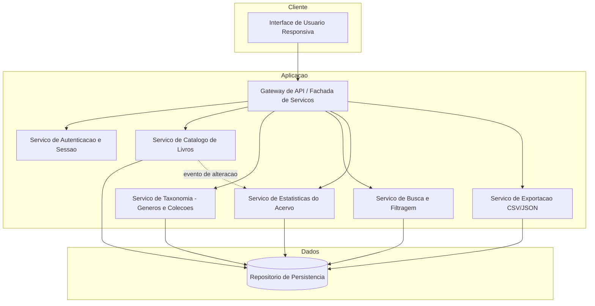
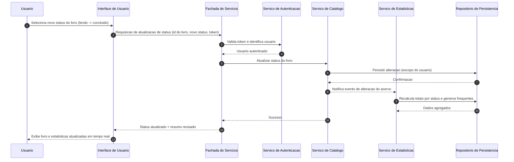
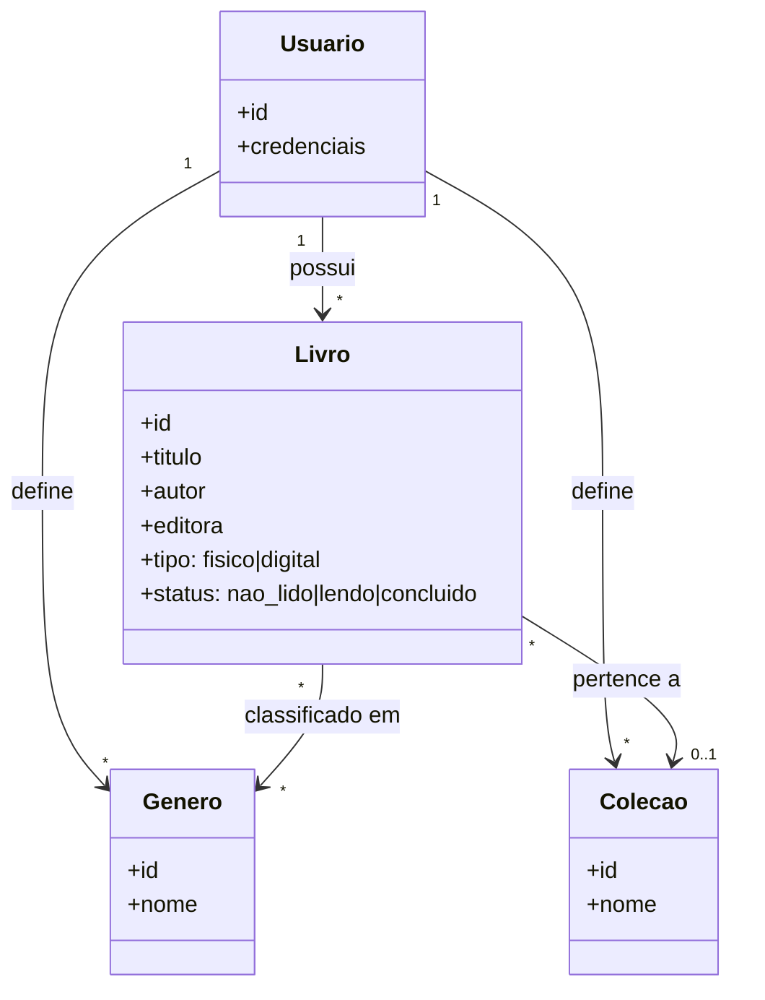

# Relatório Técnico de Arquitetura de Software
**Projeto:** Biblioteca Pessoal de Livros (P04) — Sistema de Catalogação de Livros

---

## 1. Identificação das HUs

| HU | Nome | Perfil | Requisitos Relacionados |
|----|------|--------|------------------------|
| HU01 | Cadastrar livro | Usuário | RF01, RF04, RF13, RNF04 |
| HU02 | Atualizar status de leitura | Usuário | RF04, RF05, RNF05 |
| HU03 | Organizar livros por gênero | Usuário | RF06, RF08 |
| HU04 | Organizar livros por coleção | Usuário | RF07, RF08 |
| HU05 | Filtrar o acervo | Usuário | RF09, RNF03 |
| HU06 | Pesquisar livros | Usuário | RF12, RNF03 |
| HU07 | Visualizar resumo do acervo | Usuário | RF10, RF11, RNF05 |
| HU08 | Exportar o acervo | Usuário | RNF07 |
| — | Edição/remoção de livros (sem HU explícita) | Usuário | RF02, RF03 |
| — | Autenticação (sem HU explícita) | Usuário | RNF01 |

---

## 2. Diagramas de Arquitetura (Mermaid)

### 2.1 Diagrama de Componentes

### 2.2 Diagrama de Sequência — HU02 (Atualizar Status) + Atualização em Tempo Real do Resumo

### 2.3 Modelo Conceitual de Domínio

---

## 3. Decisões de Arquitetura

| ID | Decisão | Justificativa | Requisitos |
|----|---------|---------------|-----------|
| AD01 | Arquitetura em camadas (Apresentação, Serviços, Persistência) com fachada única de API | Simplicidade adequada ao escopo de acervo pessoal; facilita manutenibilidade | RNF02, RNF06 |
| AD02 | Isolamento de dados por usuário aplicado na camada de serviço (todo acesso ao repositório é escopado pelo identificador do usuário autenticado) | Garante que o acervo é estritamente pessoal | RNF01 |
| AD03 | Autenticação baseada em token de sessão validado pela fachada em toda requisição | Proteção uniforme de todos os endpoints | RNF01 |
| AD04 | Busca e filtragem executadas no servidor com suporte a índices sobre atributos consultáveis e paginação | Cumprir o SLA de 2s independentemente do volume | RF09, RF12, RNF03 |
| AD05 | Estatísticas calculadas sob demanda com invalidação/recalcularão reativa a eventos de alteração do acervo | Atualização em tempo real sem inconsistências | RF10, RF11, RNF05 |
| AD06 | Remoção de gênero/coleção implementada como desvinculação (integridade referencial suave), nunca exclusão em cascata dos livros | Critérios de aceite de HU03 e HU04 | RF06, RF07 |
| AD07 | Cardinalidades do domínio: Livro N:N Gênero; Livro N:1 Coleção (opcional) | Regras explícitas nas HUs | RF08 |
| AD08 | Exportação gerada de forma síncrona no servidor e entregue como download pelo navegador, em CSV ou JSON | Volume pessoal é pequeno; simplicidade | RNF07 |
| AD09 | Interface responsiva (layout adaptável) com atualização dinâmica de resultados durante digitação (busca incremental com debounce conceitual) | RNF02, HU05, HU06 |
| AD10 | Status de leitura modelado como enumeração fechada (não lido, lendo, concluído) | RF04 |

---

## 4. Tabela de Componentes e Rastreabilidade

| Componente | Responsabilidade Principal | Comunica-se com | Origem (HU / Critério de Aceite) |
|---|---|---|---|
| Interface de Usuário Responsiva | Formulários de CRUD, filtros combináveis, busca incremental, painel de resumo, download de exportação | Fachada de Serviços | HU01–HU08; RNF02, RNF06 |
| Fachada de Serviços (Gateway) | Ponto único de entrada, validação de token, roteamento para serviços | UI, todos os serviços | RNF01 |
| Serviço de Autenticação e Sessão | Login, emissão/validação de credenciais, identificação do usuário | Fachada, Repositório | RNF01 |
| Serviço de Catálogo de Livros | CRUD de livros, validação de campos obrigatórios (título/autor), tipo físico/digital, status | Repositório, Serviço de Estatísticas | HU01 (campos obrigatórios), HU02, RF01–RF05, RF13 |
| Serviço de Taxonomia | CRUD de gêneros e coleções; associação/desvinculação de livros; regra de desvinculação na exclusão | Repositório | HU03, HU04, RF06–RF08 |
| Serviço de Busca e Filtragem | Filtros combináveis por qualquer atributo, busca parcial por título/autor, limpeza de filtros, paginação | Repositório | HU05, HU06, RF09, RF12, RNF03 |
| Serviço de Estatísticas | Totais por status, gêneros mais frequentes, recalculo reativo a eventos | Repositório, Serviço de Catálogo (eventos) | HU07, RF10, RF11, RNF05 |
| Serviço de Exportação | Serialização completa do acervo em CSV ou JSON e disponibilização para download | Repositório | HU08, RNF07 |
| Repositório de Persistência | Armazenamento durável e isolado por usuário; integridade das associações | Todos os serviços | RNF01, RNF04 |

---

## 5. Bloqueios e Pendências

| ID | Tipo | Descrição | Impacto |
|----|------|-----------|---------|
| P01 | Pendência | RNF01 não especifica o mecanismo de autenticação (cadastro próprio, provedor externo, recuperação de senha) | Bloqueia design detalhado do fluxo de acesso |
| P02 | Pendência | RF09 menciona 6 atributos; HU05 acrescenta "tipo". Assumido o conjunto ampliado da HU05 | Baixo — decisão registrada |
| P03 | Pendência | Não há definição de volume máximo esperado nem de paginação da listagem | Afeta estratégia de índices e UI |
| P04 | Pendência | Exportação (HU08) inclui gêneros/coleções associados? Assumido que sim ("todos os campos") | Definir esquema do arquivo exportado |
| P05 | Pendência | Ausência de HU explícita para edição/remoção de livro (RF02/RF03) e para autenticação | Critérios de aceite a serem definidos com o PO |
| P06 | Pendência | Comportamento de confirmação na remoção de livro/gênero/coleção não especificado | UX de exclusão a validar |

---

## 6. Cobertura de Requisitos

| Requisito | Componente(s) Responsável(is) | Status |
|-----------|-------------------------------|--------|
| RF01 | Catálogo, UI | ✅ Coberto |
| RF02 | Catálogo, UI | ✅ Coberto (sem HU — ver P05) |
| RF03 | Catálogo, UI | ✅ Coberto (sem HU — ver P05) |
| RF04 | Catálogo (enum de status) | ✅ Coberto |
| RF05 | Catálogo | ✅ Coberto |
| RF06 | Taxonomia | ✅ Coberto |
| RF07 | Taxonomia | ✅ Coberto |
| RF08 | Taxonomia, Catálogo | ✅ Coberto |
| RF09 | Busca e Filtragem | ✅ Coberto |
| RF10 | Estatísticas | ✅ Coberto |
| RF11 | Estatísticas | ✅ Coberto |
| RF12 | Busca e Filtragem | ✅ Coberto |
| RF13 | Catálogo | ✅ Coberto |
| RNF01 | Autenticação, Fachada, Repositório (escopo por usuário) | ✅ Coberto (detalhes pendentes — P01) |
| RNF02 | UI Responsiva | ✅ Coberto |
| RNF03 | Busca e Filtragem (índices, paginação) | ✅ Coberto |
| RNF04 | Repositório de Persistência | ✅ Coberto |
| RNF05 | Estatísticas (recalcularão reativa) | ✅ Coberto |
| RNF06 | UI (padrões web modernos) | ✅ Coberto |
| RNF07 | Exportação | ✅ Coberto |

**Cobertura: 20/20 requisitos (100%), com pendências de refinamento registradas na Seção 5.**

---

## 7. Gap Analysis

| # | Lacuna Identificada | Impacto Arquitetural | Ação Recomendada |
|---|---------------------|----------------------|------------------|
| G01 | Ausência de especificação do modelo de autenticação (cadastro, recuperação de senha, múltiplas sessões) | Serviço de Autenticação não pode ser detalhado; risco de retrabalho na fachada | Elicitar com o PO; criar HU de acesso com critérios de aceite |
| G02 | RNF03 exige 2s "independentemente do volume", mas não define volume-alvo nem paginação | Sem limite, o SLA é inverificável; pode exigir índices e paginação obrigatória | Definir volume máximo de referência (ex.: N mil livros/usuário) e adotar paginação na listagem |
| G03 | "Tempo real" (RNF05) não define mecanismo (recalcular na resposta vs. notificação push) | Escolha entre agregação síncrona ou canal de eventos para a UI | Assumir recálculo síncrono na resposta da operação; validar suficiência com o PO |
| G04 | Sem requisitos de auditoria, histórico de leitura ou datas (início/fim de leitura) | Modelo de dados atual não retém progressão temporal; extensão futura custosa | Avaliar inclusão de carimbos de data nas transições de status desde já |
| G05 | Importação não prevista (apenas exportação) | Backup sem restauração limita o valor do RNF07 | Propor HU de importação CSV/JSON com validação de duplicatas |
| G06 | Regras de duplicidade de livros/gêneros/coleções (mesmo título/nome) não definidas | Serviços de Catálogo/Taxonomia precisam de regra de unicidade | Definir unicidade de nome de gênero/coleção por usuário; permitir livros duplicados com aviso |
| G07 | Sem requisitos de acessibilidade nem de internacionalização | UI pode necessitar refatoração para conformidade posterior | Registrar decisão explícita de escopo com o PO |
| G08 | Ausência de HUs para edição/remoção de livro (RF02/RF03) | Critérios de aceite indefinidos (confirmação, efeitos em estatísticas) | Redigir HUs complementares antes do desenvolvimento |
| G09 | Limites da exportação (encoding, separador CSV, representação de listas de gêneros) não especificados | Interoperabilidade do backup comprometida | Definir esquema canônico de exportação (dicionário de dados) |

**Conclusão:** a arquitetura proposta cobre integralmente os requisitos declarados, com design tecnologicamente neutro e rastreabilidade completa. Os gaps G01–G03 devem ser resolvidos antes do início do desenvolvimento dos serviços de Autenticação e Busca.