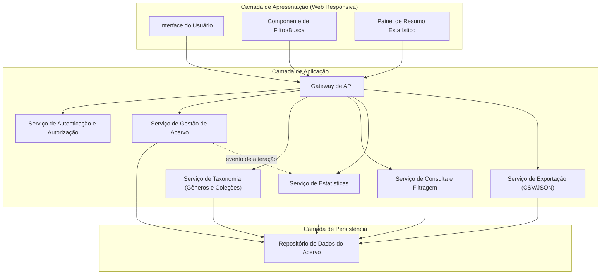
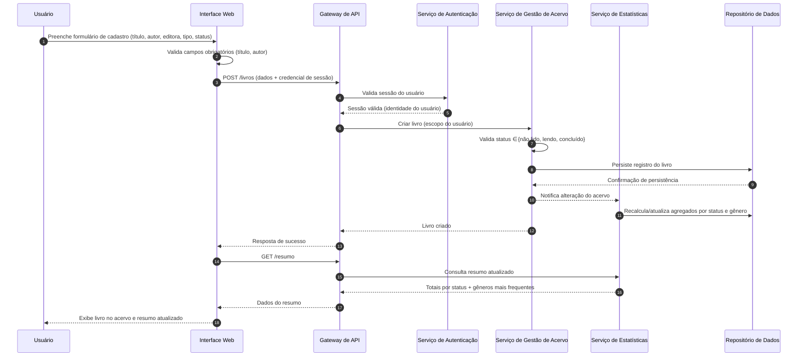
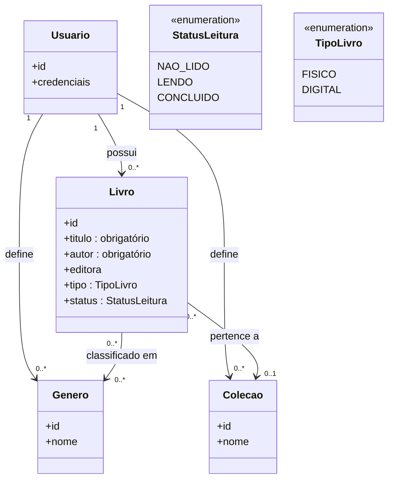

# Relatório Técnico de Arquitetura de Software
## Sistema de Catalogação de Livros — Biblioteca Pessoal (P04)

---

## 1. Identificação das HUs

| HU | Título | Perfil | RFs Relacionados | RNFs Relacionados |
|----|--------|--------|------------------|-------------------|
| HU01 | Cadastrar livro | Usuário | RF01, RF04, RF13 | RNF01, RNF04 |
| HU02 | Atualizar status de leitura | Usuário | RF05, RF04 | RNF05 |
| HU03 | Organizar livros por gênero | Usuário | RF06, RF08 | RNF04 |
| HU04 | Organizar livros por coleção | Usuário | RF07, RF08 | RNF04 |
| HU05 | Filtrar o acervo | Usuário | RF09 | RNF03 |
| HU06 | Pesquisar por título/autor | Usuário | RF12 | RNF03 |
| HU07 | Visualizar resumo do acervo | Usuário | RF10, RF11 | RNF05 |
| HU08 | Exportar o acervo | Usuário | — (derivado de RNF07) | RNF07 |

**Observação:** RF02 (edição) e RF03 (remoção) não possuem HU dedicada, mas são cobertos pelo componente de Gestão de Acervo (ver Seções 6 e 7).

---

## 2. Diagramas de Arquitetura (Mermaid)

### 2.1 Diagrama de Componentes (visão lógica)

### 2.2 Diagrama de Sequência — Cadastro de Livro e Atualização do Resumo (HU01 + HU07)

### 2.3 Diagrama de Classes — Modelo de Domínio

---

## 3. Decisões de Arquitetura

| ID | Decisão | Justificativa | Requisitos Atendidos |
|----|---------|---------------|----------------------|
| DA01 | Arquitetura em camadas (Apresentação / Aplicação / Persistência) com componentes de responsabilidade única | Simplicidade adequada ao escopo pessoal; facilita manutenibilidade e testes | RNF07 (indireta), geral |
| DA02 | Autenticação centralizada no Gateway, com isolamento de dados por identidade do usuário em todas as consultas (multi-tenancy lógico por usuário) | Garante acervo estritamente pessoal | RNF01 |
| DA03 | Separação do Serviço de Consulta/Filtragem do serviço de escrita, com suporte a filtros combináveis e busca parcial (contains) sobre título/autor, apoiado por índices no repositório | Atender filtragem dinâmica e busca incremental em ≤ 2s | RF09, RF12, RNF03 |
| DA04 | Estatísticas atualizadas por notificação de alteração (evento interno) após operações de escrita, com agregados consultáveis pelo painel | Resumo em tempo real sem recomputação custosa a cada leitura | RF10, RF11, RNF05 |
| DA05 | Remoção de gênero/coleção implementada como desvinculação (soft-unlink), nunca exclusão em cascata de livros | Critérios de aceite de HU03 e HU04 | RF06, RF07 |
| DA06 | Cardinalidades explícitas no modelo: livro ↔ N gêneros; livro ↔ 0..1 coleção | Critérios de aceite HU03/HU04 | RF08 |
| DA07 | Exportação executada no servidor com serialização em CSV ou JSON e entrega via download no navegador | Backup completo e portabilidade | RNF07, HU08 |
| DA08 | Interface web responsiva, com validação de campos obrigatórios no cliente e revalidação no servidor | Usabilidade e integridade de dados | RNF02, RNF06, HU01 |

---

## 4. Tabela de Componentes e Rastreabilidade

| Componente | Responsabilidade Principal | Comunica-se com | Origem (HU / Critério de Aceite) |
|---|---|---|---|
| Interface do Usuário (Web Responsiva) | Formulários de CRUD, validação de obrigatoriedade de título/autor, exibição dinâmica do acervo | Gateway de API | HU01 (campos obrigatórios), HU05/HU06 (resultados dinâmicos), RNF02, RNF06 |
| Componente de Filtro/Busca (UI) | Composição de múltiplos filtros, limpar filtros com um clique, busca incremental enquanto digita | Gateway de API, Serviço de Consulta | HU05 (combinar filtros, limpar), HU06 (resultados parciais dinâmicos) |
| Painel de Resumo Estatístico (UI) | Exibir totais por status e gêneros mais frequentes, atualizados automaticamente | Serviço de Estatísticas via Gateway | HU07 (todos os critérios), RNF05 |
| Gateway de API | Ponto único de entrada, roteamento, aplicação de contexto de autenticação | Todos os serviços de aplicação | RNF01 |
| Serviço de Autenticação e Autorização | Gestão de identidade, sessão e isolamento por usuário | Gateway, Repositório | RNF01 |
| Serviço de Gestão de Acervo | CRUD de livros, validação de status e tipo (físico/digital), emissão de eventos de alteração | Repositório, Serviço de Estatísticas | HU01, HU02, RF02, RF03, RF13 |
| Serviço de Taxonomia | CRUD de gêneros e coleções, vinculação/desvinculação com livros, regra de não exclusão em cascata | Repositório | HU03, HU04 (desvinculação ao remover), RF06–RF08 |
| Serviço de Consulta e Filtragem | Filtros combináveis por qualquer atributo, busca parcial por título/autor com resposta ≤ 2s | Repositório | HU05, HU06, RF09, RF12, RNF03 |
| Serviço de Estatísticas | Cálculo/atualização de agregados: total por status, gêneros mais frequentes | Repositório, Serviço de Gestão de Acervo | HU07, RF10, RF11, RNF05 |
| Serviço de Exportação | Serialização completa do acervo em CSV/JSON e disponibilização para download | Repositório, Gateway | HU08 (todos os critérios), RNF07 |
| Repositório de Dados do Acervo | Persistência durável de livros, gêneros, coleções e usuários, com indexação para consulta | Todos os serviços de aplicação | RNF04, RNF03 |

---

## 5. Bloqueios e Pendências

| ID | Tipo | Descrição | Impacto | Ação Sugerida |
|----|------|-----------|---------|---------------|
| P01 | Pendência | Mecanismo de autenticação não especificado (cadastro próprio? recuperação de senha?) | Bloqueia design detalhado do Serviço de Autenticação | Refinar com Product Owner |
| P02 | Pendência | RNF03 exige ≤ 2s "independentemente do volume", mas não define volume máximo esperado nem paginação | Risco de não atendimento em acervos muito grandes | Definir volumetria alvo e estratégia de paginação |
| P03 | Pendência | Semântica de "tempo real" do RNF05 não quantificada (imediato na mesma sessão? entre dispositivos?) | Afeta escolha entre atualização por requisição ou notificação ativa | Esclarecer expectativa de latência |
| P04 | Pendência | Não há requisito de importação (apenas exportação), impossibilitando restauração do backup | Backup unidirecional tem valor limitado | Avaliar RF de importação em versão futura |
| P05 | Bloqueio leve | Ausência de regras para duplicidade de livros (mesmo título/autor) e de gêneros/coleções homônimos | Pode gerar inconsistência de dados | Definir regras de unicidade por usuário |

---

## 6. Cobertura de Requisitos

| Requisito | Coberto por | Status |
|-----------|-------------|--------|
| RF01 | Serviço de Gestão de Acervo (HU01) | ✅ Coberto |
| RF02 | Serviço de Gestão de Acervo (edição) | ✅ Coberto (sem HU dedicada — ver Gap G01) |
| RF03 | Serviço de Gestão de Acervo (remoção) | ✅ Coberto (sem HU dedicada — ver Gap G01) |
| RF04 | Enumeração StatusLeitura + validação no serviço | ✅ Coberto |
| RF05 | Serviço de Gestão de Acervo (HU02) | ✅ Coberto |
| RF06 | Serviço de Taxonomia (HU03) | ✅ Coberto |
| RF07 | Serviço de Taxonomia (HU04) | ✅ Coberto |
| RF08 | Modelo de domínio (N gêneros / 1 coleção) | ✅ Coberto |
| RF09 | Serviço de Consulta e Filtragem (HU05) | ✅ Coberto |
| RF10 | Serviço de Estatísticas (HU07) | ✅ Coberto |
| RF11 | Serviço de Estatísticas (HU07) | ✅ Coberto |
| RF12 | Serviço de Consulta e Filtragem (HU06) | ✅ Coberto |
| RF13 | Enumeração TipoLivro no cadastro (HU01) | ✅ Coberto |
| RNF01 | Gateway + Serviço de Autenticação (DA02) | ✅ Coberto |
| RNF02 | Interface responsiva (DA08) | ✅ Coberto |
| RNF03 | Indexação + separação de consulta (DA03) | ⚠️ Coberto com ressalva (P02) |
| RNF04 | Repositório de Dados durável | ✅ Coberto |
| RNF05 | Eventos de alteração + agregados (DA04) | ⚠️ Coberto com ressalva (P03) |
| RNF06 | Aplicação web baseada em padrões abertos | ✅ Coberto |
| RNF07 | Serviço de Exportação (HU08) | ✅ Coberto |

**Cobertura:** 20/20 requisitos endereçados (18 plenos, 2 com ressalvas dependentes de refinamento).

---

## 7. Gap Analysis

| ID | Lacuna Identificada | Impacto Arquitetural | Ação Recomendada |
|----|---------------------|----------------------|------------------|
| G01 | RF02 e RF03 (editar/remover livro) não possuem HU nem critérios de aceite (ex.: confirmação de exclusão, remoção lógica vs. física) | Comportamento de exclusão indefinido pode afetar estatísticas e exportação | Criar HUs específicas com critérios de aceite; decidir soft-delete vs. hard-delete |
| G02 | Filtro por "tipo" aparece em HU05 mas RF09 não lista o atributo tipo | Divergência requisito × história pode gerar implementação incompleta | Alinhar RF09 para incluir explicitamente o tipo (físico/digital) |
| G03 | Exportação não define escopo de gêneros/coleções no arquivo (apenas "campos do livro") nem regras de escape/encoding no CSV | Backup potencialmente incompleto; problemas de interoperabilidade | Especificar esquema de exportação incluindo taxonomias e codificação de caracteres |
| G04 | Ausência de requisito de importação/restauração de backup (par de RNF07) | Estratégia de recuperação de dados do usuário incompleta | Priorizar funcionalidade de importação em roadmap |
| G05 | RNF03 sem volumetria definida e sem menção a paginação na listagem | Risco de degradação de desempenho e de UX em acervos grandes | Definir carga esperada, estratégia de paginação e critérios de teste de desempenho |
| G06 | Regras de unicidade não especificadas (livros duplicados, gêneros/coleções homônimos, case-sensitivity de nomes) | Inconsistência de dados e estatísticas distorcidas (ex.: gêneros duplicados no ranking) | Definir restrições de unicidade por usuário no modelo de dados |
| G07 | "Gêneros mais frequentes" (RF11/HU07) sem definição de quantidade exibida ou critério de desempate | Ambiguidade na implementação do painel estatístico | Especificar top-N e regra de ordenação/desempate |
| G08 | Fluxos de autenticação incompletos (registro, recuperação de credenciais, expiração de sessão) | Serviço de Autenticação não pode ser detalhado; risco de segurança | Elaborar HUs de gestão de conta e política de sessão |
| G09 | Comportamento offline/concorrência não abordado (uso em múltiplos dispositivos simultâneos) | Possíveis conflitos de escrita e resumo desatualizado entre sessões | Definir estratégia de resolução de conflitos (ex.: última escrita vence) e política de sincronização do resumo |

---

*Fim do Relatório Canônico de Arquitetura — AI4ES Time 2.*