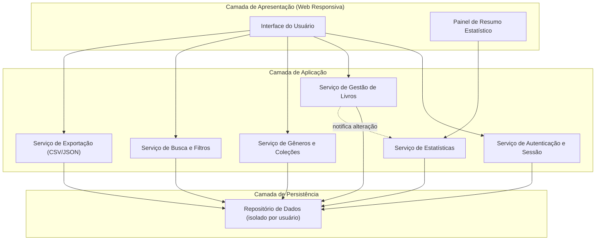
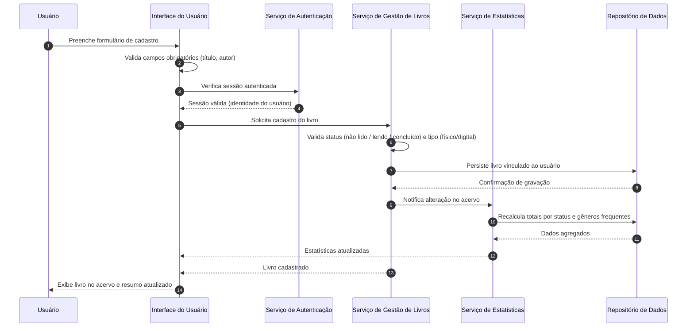
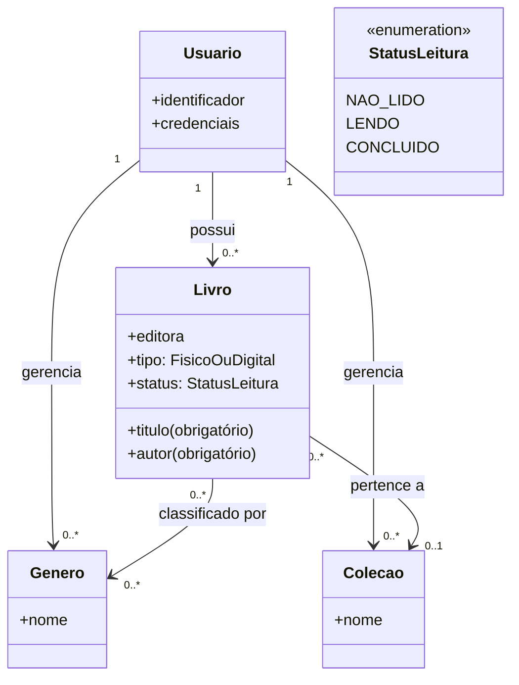

# Relatório Técnico de Arquitetura de Software
## Sistema de Catalogação de Livros — Biblioteca Pessoal (P04)

---

## 1. Identificação das HUs

| HU | Título | Perfil | RFs Relacionados | RNFs Relacionados |
|----|--------|--------|------------------|-------------------|
| HU01 | Cadastrar livro | Usuário | RF01, RF04, RF13 | RNF01, RNF04 |
| HU02 | Atualizar status de leitura | Usuário | RF05, RF04 | RNF05 |
| HU03 | Organizar livros por gênero | Usuário | RF06, RF08 | RNF04 |
| HU04 | Organizar livros por coleção | Usuário | RF07, RF08 | RNF04 |
| HU05 | Filtrar o acervo | Usuário | RF09 | RNF03 |
| HU06 | Pesquisar por título/autor | Usuário | RF12 | RNF03 |
| HU07 | Visualizar resumo do acervo | Usuário | RF10, RF11 | RNF05 |
| HU08 | Exportar o acervo | Usuário | — (derivado de RNF07) | RNF07 |

**Observação:** RF02 (editar livro) e RF03 (remover livro) não possuem HU explícita; foram absorvidos pelo componente de Gestão de Acervo (ver Seção 7 — Gap Analysis).

---

## 2. Diagramas de Arquitetura (Mermaid)

### 2.1 Diagrama de Componentes (visão lógica em camadas)

### 2.2 Diagrama de Sequência — Cadastro de Livro com Atualização de Estatísticas (HU01/HU07)

### 2.3 Modelo Conceitual de Domínio

---

## 3. Decisões de Arquitetura

| ID | Decisão | Justificativa | Requisitos |
|----|---------|---------------|------------|
| AD-01 | Arquitetura em camadas (Apresentação, Aplicação, Persistência) | Separação de responsabilidades e manutenibilidade; escopo pessoal não justifica distribuição complexa. | RNF07 (indireta), geral |
| AD-02 | Isolamento multiusuário no repositório: toda consulta é escopada pela identidade autenticada | Garante acervo estritamente pessoal. | RNF01 |
| AD-03 | Enumeração fechada de status de leitura no domínio | Evita estados inválidos; validação em camada de aplicação e apresentação. | RF04, RF05 |
| AD-04 | Desvinculação (não exclusão) em cascata ao remover gênero/coleção | Critérios de aceite de HU03/HU04 exigem preservação dos livros. | HU03, HU04 |
| AD-05 | Notificação de alteração do acervo para o serviço de estatísticas (evento interno de domínio) | Atualização em tempo real do resumo sem acoplamento direto. | RNF05, RF10, RF11 |
| AD-06 | Busca com correspondência parcial e filtros combináveis processados no repositório com índices sobre atributos filtráveis | Cumprir limite de 2s independente do volume. | RF09, RF12, RNF03 |
| AD-07 | Exportação gerada sob demanda em CSV ou JSON, entregue como download pelo navegador | Backup pessoal sem dependência de serviços externos. | RNF07, HU08 |
| AD-08 | Interface web responsiva compatível com navegadores modernos | Requisito literal de compatibilidade e usabilidade. | RNF02, RNF06 |
| AD-09 | Cardinalidades: livro N:N com gêneros; livro N:1 com coleção | Diretamente derivado dos critérios de aceite. | RF08, HU03, HU04 |

---

## 4. Tabela de Componentes e Rastreabilidade

| Componente | Responsabilidade Principal | Comunica-se com | Origem (HU / Critério de Aceite) |
|------------|---------------------------|-----------------|----------------------------------|
| Interface do Usuário | Formulários, listagens, validação de obrigatoriedade, responsividade | Todos os serviços de aplicação | HU01–HU08; RNF02, RNF06 |
| Painel de Resumo Estatístico | Exibir totais por status e gêneros mais frequentes em tempo real | Serviço de Estatísticas | HU07; RF10, RF11; RNF05 |
| Serviço de Autenticação e Sessão | Autenticar usuário e prover identidade para isolamento do acervo | UI, Repositório | RNF01 |
| Serviço de Gestão de Livros | CRUD de livros, validação de status e tipo, associação a gêneros/coleção | Repositório, Serviço de Estatísticas | HU01, HU02; RF01–RF05, RF08, RF13 |
| Serviço de Gêneros e Coleções | CRUD de gêneros/coleções; desvinculação sem exclusão de livros | Repositório | HU03, HU04; RF06, RF07 |
| Serviço de Busca e Filtros | Filtros combináveis por qualquer atributo; busca parcial dinâmica; limpar filtros | Repositório, UI | HU05, HU06; RF09, RF12; RNF03 |
| Serviço de Estatísticas | Agregar totais por status e ranking de gêneros; reagir a alterações do acervo | Repositório, Painel de Resumo | HU07; RF10, RF11; RNF05 |
| Serviço de Exportação | Serializar acervo completo em CSV ou JSON para download | Repositório, UI | HU08; RNF07 |
| Repositório de Dados | Persistência durável, consultas escopadas por usuário, índices para filtros | Todos os serviços | RNF01, RNF03, RNF04 |

---

## 5. Bloqueios e Pendências

| ID | Tipo | Descrição | Impacto | Ação Sugerida |
|----|------|-----------|---------|---------------|
| P-01 | Pendência | Modelo de autenticação não especificado (autocadastro? recuperação de senha? sessão persistente?) | Alto — bloqueia RNF01 | Elicitar com o Product Owner |
| P-02 | Pendência | RF02/RF03 sem HU e sem critérios de aceite (ex.: confirmação de exclusão) | Médio | Criar HUs complementares |
| P-03 | Pendência | "Tempo real" (RNF05) não quantificado; assume-se atualização na mesma interação | Baixo | Confirmar SLA |
| P-04 | Pendência | RNF03 exige 2s "independentemente do volume" sem limite superior de registros | Médio — dimensionamento de índices/paginação | Definir volume máximo esperado |
| P-05 | Bloqueio potencial | Importação de dados (inverso da exportação) não prevista — backup não é restaurável pelo sistema | Médio | Avaliar inclusão no backlog |
| P-06 | Pendência | Regras de unicidade (livros/gêneros/coleções duplicados) não definidas | Baixo | Definir regras de validação |

---

## 6. Cobertura de Requisitos

| Requisito | Coberto por | Status |
|-----------|-------------|--------|
| RF01 | Serviço de Gestão de Livros, UI | ✅ Coberto |
| RF02 | Serviço de Gestão de Livros | ⚠️ Coberto sem HU/critérios |
| RF03 | Serviço de Gestão de Livros | ⚠️ Coberto sem HU/critérios |
| RF04 | Enumeração StatusLeitura (AD-03) | ✅ Coberto |
| RF05 | Serviço de Gestão de Livros | ✅ Coberto |
| RF06 | Serviço de Gêneros e Coleções | ✅ Coberto |
| RF07 | Serviço de Gêneros e Coleções | ✅ Coberto |
| RF08 | Gestão de Livros + modelo de domínio (AD-09) | ✅ Coberto |
| RF09 | Serviço de Busca e Filtros | ✅ Coberto |
| RF10 | Serviço de Estatísticas | ✅ Coberto |
| RF11 | Serviço de Estatísticas | ✅ Coberto |
| RF12 | Serviço de Busca e Filtros | ✅ Coberto |
| RF13 | Atributo tipo no domínio Livro | ✅ Coberto |
| RNF01 | Autenticação + AD-02 | ⚠️ Depende de P-01 |
| RNF02 | UI responsiva (AD-08) | ✅ Coberto |
| RNF03 | AD-06 (índices, busca otimizada) | ⚠️ Depende de P-04 |
| RNF04 | Repositório de Dados durável | ✅ Coberto |
| RNF05 | AD-05 (notificação de alteração) | ✅ Coberto |
| RNF06 | AD-08 | ✅ Coberto |
| RNF07 | Serviço de Exportação | ✅ Coberto |

**Cobertura:** 20/20 requisitos endereçados; 4 com ressalvas dependentes de esclarecimento.

---

## 7. Gap Analysis

| # | Lacuna Identificada | Impacto Arquitetural | Ação Recomendada |
|---|---------------------|----------------------|------------------|
| G-01 | Ausência de HU e critérios para edição/remoção de livro (RF02/RF03) | Regras de integridade (ex.: efeito nas estatísticas e coleções ao remover) implícitas | Especificar HUs com critérios de confirmação e cascatas |
| G-02 | Sem mecanismo de importação/restauração do backup exportado | Exportação (RNF07) tem valor limitado como backup; formato precisa ser estável e versionado | Definir esquema de exportação versionado e avaliar funcionalidade de importação |
| G-03 | Estratégia de paginação da listagem não especificada | Sem paginação, RNF03 pode ser violado em acervos grandes; afeta contrato UI↔Busca | Adotar listagem paginada/incremental com filtros aplicados no repositório |
| G-04 | Regras de duplicidade e normalização (autor/editora como texto livre) | Filtros por autor/editora podem fragmentar resultados ("J. K. Rowling" vs "J.K. Rowling") | Decidir entre texto livre com busca normalizada ou entidades catalogadas |
| G-05 | Comportamento de concorrência (mesmo usuário em múltiplos dispositivos) não definido | Risco de sobrescrita de edições; afeta estratégia de sincronização do resumo em tempo real | Definir política de última escrita vence ou detecção de conflito |
| G-06 | Requisitos de acessibilidade não mencionados | Interface responsiva sem diretrizes de acessibilidade pode excluir usuários | Incluir critérios de acessibilidade nas HUs de interface |
| G-07 | Ausência de requisitos de auditoria/histórico de leitura | HU02 fala em "progresso ao longo do tempo", mas só o status atual é persistido | Confirmar se histórico de mudanças de status é desejado; se sim, adicionar registro de eventos ao domínio |

---

*Relatório gerado pelo Sistema Multi-Agente de Design de Software — AI4ES Time 2. Design tecnologicamente neutro: escolhas concretas de produtos e plataformas ficam a cargo da fase de implementação, respeitando as responsabilidades e interfaces aqui definidas.*