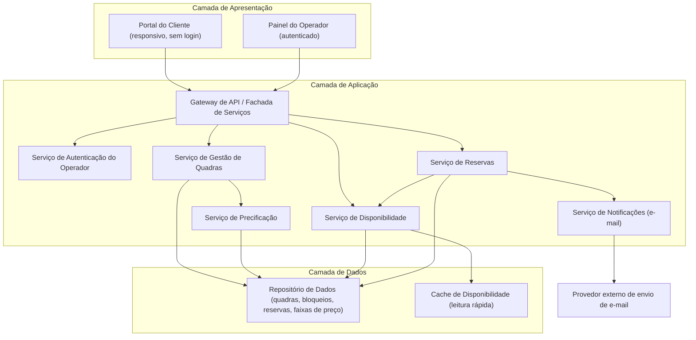
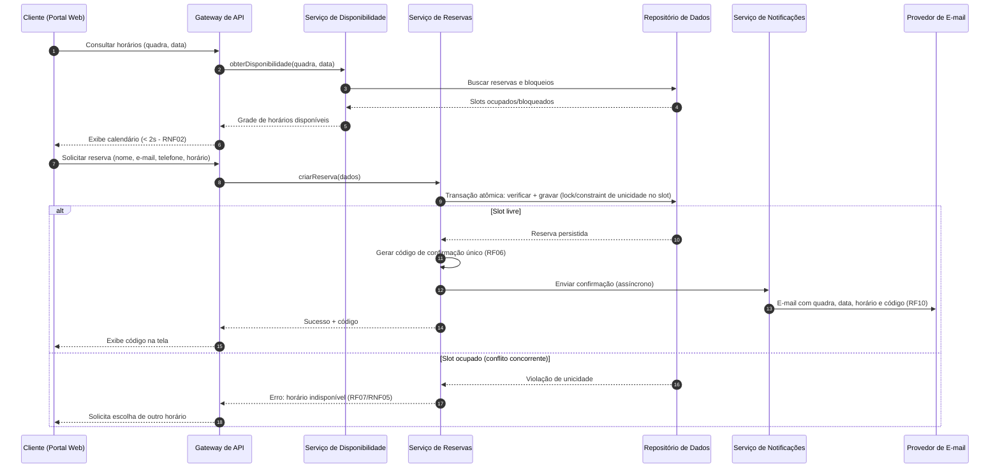
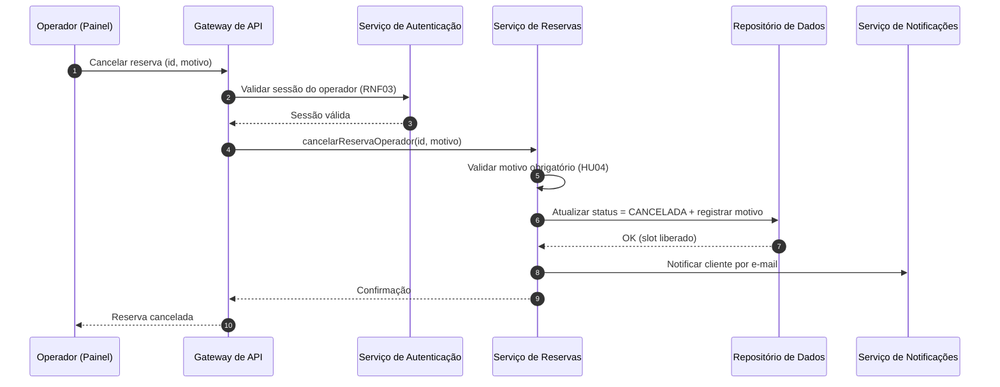

# Relatório Técnico de Arquitetura de Software
## Sistema de Reservas para Quadras Esportivas (P05)

---

## 1. Identificação das HUs

| HU | Perfil | Resumo | RFs Relacionados |
|----|--------|--------|------------------|
| HU01 | Operador | Cadastrar quadra com tipo, horário de funcionamento e valor da hora | RF01, RF02, RF12 |
| HU02 | Operador | Bloquear horários para manutenção/feriados | RF03 |
| HU03 | Operador | Visualizar agenda diária consolidada de todas as quadras | RF11 |
| HU04 | Operador | Cancelar reserva com motivo obrigatório e notificação ao cliente | RF09, RF10 |
| HU05 | Cliente | Consultar disponibilidade sem cadastro/login | RF04 |
| HU06 | Cliente | Realizar reserva com dados de contato e código de confirmação | RF05, RF06, RF07, RF10 |
| HU07 | Cliente | Cancelar reserva mediante código de confirmação | RF08 |

**Atores identificados:** Operador (autenticado — RNF03) e Cliente (anônimo, sem cadastro — RF04).

---

## 2. Diagramas de Arquitetura (Mermaid)

### 2.1 Diagrama de Componentes (Visão Lógica)

### 2.2 Diagrama de Sequência — HU06: Realizar Reserva (com controle de concorrência)

### 2.3 Diagrama de Sequência — HU04: Cancelamento pelo Operador

---

## 3. Decisões de Arquitetura

| ID | Decisão | Justificativa | Requisitos |
|----|---------|---------------|------------|
| AD01 | Arquitetura em camadas com serviços modulares (Quadras, Disponibilidade, Reservas, Precificação, Notificações) | Modularidade facilita inclusão de novas modalidades e evolução independente | RNF07 |
| AD02 | Controle de concorrência via transação atômica com restrição de unicidade no slot (quadra + data + horário) | Impede duplo agendamento em requisições simultâneas sem depender de lógica de aplicação | RNF05, RF07 |
| AD03 | Notificação por e-mail desacoplada e assíncrona (fila conceitual de mensagens) | Falha no provedor de e-mail não deve impedir a confirmação da reserva; permite retentativas | RF10, RNF04 |
| AD04 | Cache de leitura para a grade de disponibilidade, invalidado a cada reserva/cancelamento/bloqueio | Atende meta de carregamento ≤ 2s e reduz carga no repositório | RNF02 |
| AD05 | Área do cliente sem autenticação; autorização de cancelamento pelo código de confirmação (token não sequencial, imprevisível) | Atende ausência de cadastro mantendo controle mínimo de acesso à reserva | RF04, RF08, HU07 |
| AD06 | Autenticação obrigatória apenas na área administrativa (fachada distinta para operador) | Segrega superfícies de ataque e simplifica UX do cliente | RNF03 |
| AD07 | Cancelamento como mudança de estado (soft delete) com registro de motivo e trilha de auditoria | Preserva histórico para gestão e disputas | RF09, HU04 |
| AD08 | Precificação por faixa de horário modelada como regra parametrizável associada à quadra | Suporta horário nobre sem alteração de código | RF12 |
| AD09 | Interface web responsiva (design adaptativo) compatível com navegadores modernos | Requisitos explícitos de usabilidade e compatibilidade | RNF01, RNF06 |
| AD10 | Redundância e monitoramento de saúde dos serviços com recuperação automática | Meta de 99% de disponibilidade 24/7 | RNF04 |

---

## 4. Tabela de Componentes e Rastreabilidade

| Componente | Responsabilidade Principal | Comunica-se com | Origem (HU / Critério de Aceite) |
|---|---|---|---|
| Portal do Cliente | Exibir calendário, formulário de reserva e cancelamento por código; interface responsiva | Gateway de API | HU05, HU06, HU07 / consulta sem login; código exibido na tela |
| Painel do Operador | CRUD de quadras, bloqueios, agenda consolidada, cancelamento com motivo | Gateway de API | HU01–HU04 / campos obrigatórios; navegação entre datas |
| Gateway de API / Fachada | Roteamento, validação de entrada, aplicação de política de acesso por perfil | Todos os serviços de aplicação | Todas as HUs; RNF03 |
| Serviço de Autenticação do Operador | Autenticar operador e gerir sessões da área administrativa | Gateway, Repositório | RNF03 / HU01–HU04 |
| Serviço de Gestão de Quadras | Cadastrar/editar/remover quadras e gerenciar bloqueios de horário | Repositório, Serviço de Precificação, Cache (invalidação) | HU01, HU02 / quadra visível imediatamente; bloqueio removível |
| Serviço de Disponibilidade | Calcular grade de horários livres/ocupados/bloqueados por quadra e data | Repositório, Cache, Serviço de Reservas | HU03, HU05 / ocupados exibidos como indisponíveis |
| Serviço de Reservas | Criar reservas atomicamente, gerar código único, cancelar por código ou por operador | Repositório, Disponibilidade, Notificações | HU04, HU06, HU07 / validação no momento da confirmação; motivo obrigatório |
| Serviço de Precificação | Manter faixas de preço diferenciadas por horário e calcular valor da reserva | Repositório, Gestão de Quadras | RF12 / HU01 (valor da hora obrigatório) |
| Serviço de Notificações | Enviar e-mails de confirmação e cancelamento com retentativas | Provedor de e-mail externo, Serviço de Reservas | HU04, HU06 / código enviado por e-mail; cliente notificado do cancelamento |
| Repositório de Dados | Persistir quadras, bloqueios, reservas, faixas de preço; garantir unicidade do slot | Serviços de aplicação | RNF05, RF07 |
| Cache de Disponibilidade | Acelerar leitura da grade de horários | Serviço de Disponibilidade | RNF02 |

---

## 5. Bloqueios e Pendências

| ID | Tipo | Descrição | Impacto | Responsável Sugerido |
|----|------|-----------|---------|----------------------|
| P01 | Pendência | Duração/granularidade dos slots de reserva não definida (1h fixa? frações?) | Afeta modelo de dados e regra de conflito | Product Owner |
| P02 | Pendência | Comportamento na remoção de quadra com reservas futuras (RF02) não especificado | Risco de inconsistência; sugerir inativação lógica | Product Owner |
| P03 | Pendência | Bloqueio (RF03) sobre horário já reservado: cancela automaticamente e notifica? | Regra de negócio crítica | Product Owner |
| P04 | Pendência | Pagamento não está no escopo, mas há precificação (RF12) — o valor é apenas informativo? | Escopo de integração financeira | Stakeholders |
| P05 | Pendência | Política de prazo mínimo para cancelamento pelo cliente não definida | Regra de negócio do Serviço de Reservas | Product Owner |
| P06 | Bloqueio | Não há definição do provedor/contrato de envio de e-mail nem tratamento de falha permanente de entrega | Confirmação (RF10) pode não chegar ao cliente | Time de Infraestrutura |
| P07 | Pendência | Gestão de contas de operador (criação, recuperação de senha, múltiplos operadores/perfis) não especificada | Escopo do Serviço de Autenticação | Product Owner |

---

## 6. Cobertura de Requisitos

| Requisito | Componente(s) Responsável(is) | Status |
|-----------|-------------------------------|--------|
| RF01 | Painel do Operador, Serviço de Gestão de Quadras | Coberto |
| RF02 | Serviço de Gestão de Quadras | Coberto (ver P02) |
| RF03 | Serviço de Gestão de Quadras, Serviço de Disponibilidade | Coberto (ver P03) |
| RF04 | Portal do Cliente, Serviço de Disponibilidade | Coberto |
| RF05 | Portal do Cliente, Serviço de Reservas | Coberto |
| RF06 | Serviço de Reservas (geração de código único) | Coberto |
| RF07 | Serviço de Reservas + Repositório (unicidade de slot) | Coberto |
| RF08 | Serviço de Reservas (validação de código) | Coberto (ver P05) |
| RF09 | Painel do Operador, Serviço de Reservas | Coberto |
| RF10 | Serviço de Notificações | Coberto (ver P06) |
| RF11 | Painel do Operador, Serviço de Disponibilidade | Coberto |
| RF12 | Serviço de Precificação | Coberto (ver P04) |
| RNF01 | Portal do Cliente (design responsivo) | Coberto |
| RNF02 | Cache de Disponibilidade (AD04) | Coberto |
| RNF03 | Serviço de Autenticação, Gateway | Coberto |
| RNF04 | Redundância e monitoramento (AD10) | Coberto |
| RNF05 | Transação atômica + unicidade (AD02) | Coberto |
| RNF06 | Padrões web abertos no front-end | Coberto |
| RNF07 | Arquitetura modular por serviços (AD01) | Coberto |

**Cobertura: 12/12 RFs e 7/7 RNFs (100%), com pendências de refinamento sinalizadas.**

---

## 7. Gap Analysis

| # | Lacuna Identificada | Impacto Arquitetural | Ação Recomendada |
|---|---------------------|----------------------|------------------|
| G01 | Granularidade dos slots e possibilidade de reservas multi-hora não especificadas | Modelo de conflito (RF07/RNF05) muda se slots forem variáveis (intervalos sobrepostos vs. unicidade simples) | Definir slot padrão com PO; se intervalos livres, adotar verificação de sobreposição transacional em vez de constraint simples |
| G02 | Ausência de fluxo de pagamento apesar de precificação | Se pagamento entrar no escopo futuramente, o Serviço de Reservas precisará de estados adicionais (pendente/pago) e integração externa | Modelar reserva com máquina de estados extensível desde já |
| G03 | Falha na entrega de e-mail sem tratamento definido | Cliente pode ficar sem código; e-mail é o único canal de recuperação | Exibir código sempre na tela (já previsto), adicionar fila com retentativas e registro de falhas de envio; considerar canal alternativo (telefone informado) |
| G04 | Sem mecanismo anti-abuso na área pública (reservas em massa por bots, dados falsos) | Risco de indisponibilidade artificial de horários | Incluir limitação de taxa, desafio anti-automação e possível confirmação de e-mail antes de efetivar a reserva |
| G05 | Fuso horário e horário de verão não tratados | Erros de exibição/conflito em datas de transição | Padronizar armazenamento em tempo universal e conversão na apresentação |
| G06 | Sem requisitos de auditoria/relatórios (ocupação, receita) | Provável demanda futura do operador | Registrar eventos de domínio (reserva criada/cancelada) para viabilizar relatórios sem refatoração |
| G07 | Retenção e proteção de dados pessoais do cliente (nome, e-mail, telefone) não especificadas | Conformidade com legislação de proteção de dados | Definir política de retenção/anonimização e minimização de dados coletados |
| G08 | Sem definição de comportamento offline/degradado para atingir 99% de disponibilidade | Estratégia de resiliência indefinida | Definir orçamento de indisponibilidade, monitoramento e plano de recuperação com o time de operações |

---

*Fim do Relatório Canônico de Arquitetura — AI4ES Time 2 — Projeto P05.*