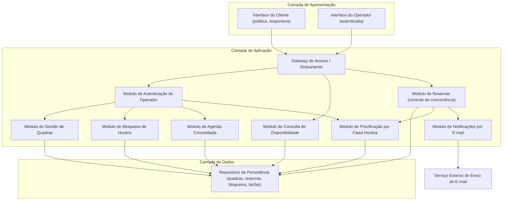
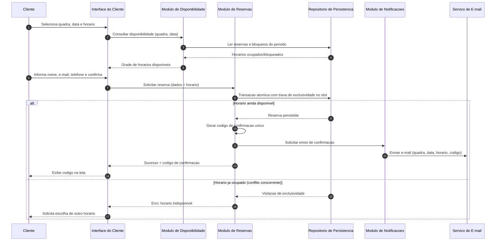
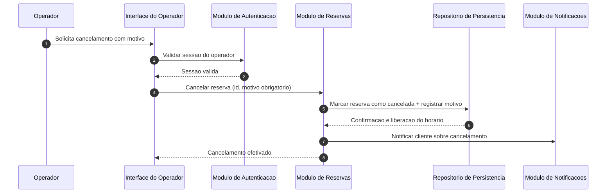

# Relatório Técnico de Arquitetura de Software
## Sistema de Reservas para Quadras Esportivas (P05)

---

## 1. Identificação das HUs

| HU | Perfil | Título | RFs Relacionados |
|----|--------|--------|------------------|
| HU01 | Operador | Cadastrar quadra | RF01, RF02, RF12 |
| HU02 | Operador | Bloquear horários para manutenção | RF03 |
| HU03 | Operador | Visualizar agenda consolidada | RF11 |
| HU04 | Operador | Cancelar reserva com justificativa | RF09, RF10 |
| HU05 | Cliente | Consultar disponibilidade sem cadastro | RF04 |
| HU06 | Cliente | Realizar reserva | RF05, RF06, RF07, RF10 |
| HU07 | Cliente | Cancelar minha reserva | RF08 |

Atores identificados: **Operador** (autenticado — RNF03) e **Cliente** (anônimo, identificado apenas por dados de contato e código de confirmação).

---

## 2. Diagramas de Arquitetura (Mermaid)

### 2.1 Diagrama de Componentes

### 2.2 Diagrama de Sequência — Realizar Reserva (HU06 / RF05–RF07, RF10, RNF05)

### 2.3 Diagrama de Sequência — Cancelamento pelo Operador (HU04)

---

## 3. Decisões de Arquitetura

| ID | Decisão | Justificativa | Requisitos |
|----|---------|---------------|------------|
| DA01 | Arquitetura modular em camadas (apresentação, aplicação, dados) | Facilita evolução e inclusão de novas modalidades | RNF07 |
| DA02 | Controle de concorrência transacional no slot de reserva (unicidade quadra+data+horário garantida na persistência) | Impede duplo agendamento sob requisições simultâneas | RF07, RNF05 |
| DA03 | Área pública sem autenticação; área administrativa protegida por autenticação e controle de sessão | Cliente consulta e reserva sem login; operador exige proteção | RF04, RNF03 |
| DA04 | Código de confirmação único, não sequencial e imprevisível, atuando como credencial do cliente para cancelamento | Cliente anônimo precisa de token seguro | RF06, RF08 |
| DA05 | Notificações de e-mail assíncronas e desacopladas do fluxo transacional, com fila/retentativa conceitual | Falha no e-mail não deve reverter a reserva; melhora disponibilidade | RF10, RNF04 |
| DA06 | Cálculo de disponibilidade derivado (funcionamento − reservas − bloqueios), sem materializar slots vazios | Simplifica consistência; bloqueios refletem imediatamente | RF03, RF04, HU02 |
| DA07 | Estratégia de leitura otimizada/cacheável para o calendário de disponibilidade, com invalidação a cada reserva/bloqueio | Carregamento em até 2s | RNF02 |
| DA08 | Interface responsiva baseada em padrões web abertos | Compatibilidade com navegadores modernos e dispositivos móveis | RNF01, RNF06 |
| DA09 | Cancelamentos por soft delete (mudança de status) com registro de motivo e auditoria | Rastreabilidade de cancelamentos do operador | RF09 |
| DA10 | Precificação por faixa de horário como regra parametrizável associada à quadra | Horário nobre configurável sem alteração de código | RF12 |

---

## 4. Tabela de Componentes e Rastreabilidade

| Componente | Responsabilidade Principal | Comunica-se com | Origem (HU / Critério de Aceite) |
|------------|---------------------------|-----------------|----------------------------------|
| Interface do Cliente | Exibir disponibilidade, capturar dados de reserva/cancelamento, responsiva | Gateway de Acesso | HU05 (acesso sem login), HU06, HU07; RNF01 |
| Interface do Operador | Gestão de quadras, bloqueios, agenda e cancelamentos | Gateway de Acesso | HU01–HU04; RNF03 |
| Gateway de Acesso | Roteamento, validação de entrada, aplicação de política pública/autenticada | Todos os módulos de aplicação | RNF03, RNF04 |
| Módulo de Autenticação do Operador | Autenticar operador e proteger área administrativa | Módulos administrativos | RNF03; HU01–HU04 |
| Módulo de Gestão de Quadras | CRUD de quadras (nome, tipo, funcionamento, valor); validação de obrigatórios | Repositório | HU01 (campos obrigatórios; aparecer imediatamente na listagem); RF01, RF02 |
| Módulo de Bloqueios de Horário | Criar/remover bloqueios de manutenção e feriado | Repositório, Disponibilidade | HU02 (bloqueados não disponíveis; remoção a qualquer momento); RF03 |
| Módulo de Consulta de Disponibilidade | Calcular grade de horários livres por quadra/data | Repositório | HU05 (ocupados como indisponíveis); RF04, RNF02 |
| Módulo de Reservas | Criar reserva atômica, gerar código único, validar disponibilidade na confirmação, processar cancelamentos | Repositório, Precificação, Notificações | HU06 (validação no momento da confirmação; código exibido e enviado), HU07 (código válido; liberação imediata), HU04 (motivo obrigatório); RF05–RF09, RNF05 |
| Módulo de Precificação | Aplicar valores por faixa horária | Repositório, Reservas | RF12 |
| Módulo de Agenda Consolidada | Visão diária de todas as quadras com navegação por data | Repositório | HU03 (todas as quadras no dia; navegação entre datas); RF11 |
| Módulo de Notificações | Enviar e-mails de confirmação e cancelamento de forma assíncrona | Serviço externo de e-mail | HU04 (notificar cancelamento), HU06 (e-mail com código); RF10 |
| Repositório de Persistência | Armazenar quadras, reservas, bloqueios e tarifas com restrição de unicidade de slot | Todos os módulos de domínio | RF07, RNF05 |

---

## 5. Bloqueios e Pendências

| ID | Tipo | Descrição | Impacto |
|----|------|-----------|---------|
| P01 | Pendência | Não há definição de prazo mínimo para cancelamento pelo cliente (política de antecedência) | Regra de negócio do Módulo de Reservas indefinida |
| P02 | Pendência | Duração do slot de reserva não especificada (fixa em 1h? configurável?) | Afeta modelo de disponibilidade e precificação |
| P03 | Pendência | Comportamento quando operador bloqueia horário com reserva já confirmada | Pode exigir cancelamento em cascata + notificação |
| P04 | Bloqueio | Não há requisito de pagamento — valor da hora é apenas informativo? | Se pagamento for necessário, muda significativamente a arquitetura |
| P05 | Pendência | Política de gestão de contas de operador (criação, recuperação de senha, múltiplos operadores/perfis) não especificada | Escopo do Módulo de Autenticação |
| P06 | Pendência | Requisitos de privacidade/retenção de dados pessoais do cliente (nome, e-mail, telefone) não especificados | Conformidade legal (proteção de dados) |
| P07 | Pendência | Comportamento em falha de envio de e-mail (retentativas, alerta ao operador) não especificado | Confiabilidade da notificação |

---

## 6. Cobertura de Requisitos

| Requisito | Componente(s) Responsável(is) | Status |
|-----------|-------------------------------|--------|
| RF01 | Gestão de Quadras | Coberto |
| RF02 | Gestão de Quadras | Coberto |
| RF03 | Bloqueios de Horário | Coberto |
| RF04 | Consulta de Disponibilidade, Interface do Cliente | Coberto |
| RF05 | Reservas, Interface do Cliente | Coberto |
| RF06 | Reservas (geração de código único) | Coberto |
| RF07 | Reservas + Repositório (unicidade de slot) | Coberto |
| RF08 | Reservas (validação de código) | Coberto |
| RF09 | Reservas (motivo obrigatório, auditoria) | Coberto |
| RF10 | Notificações | Coberto |
| RF11 | Agenda Consolidada | Coberto |
| RF12 | Precificação | Coberto |
| RNF01 | Interface do Cliente (design responsivo) | Coberto |
| RNF02 | Disponibilidade + estratégia de leitura otimizada (DA07) | Coberto |
| RNF03 | Autenticação do Operador, Gateway | Coberto |
| RNF04 | Notificações assíncronas (DA05), redundância operacional | Parcial — requer decisões de infraestrutura em fase posterior |
| RNF05 | Transação atômica com trava de exclusividade (DA02) | Coberto |
| RNF06 | Interfaces baseadas em padrões web abertos | Coberto |
| RNF07 | Arquitetura modular em camadas (DA01) | Coberto |

**Cobertura: 12/12 RFs e 6/7 RNFs plenamente cobertos; RNF04 parcialmente (dependente de topologia de implantação).**

---

## 7. Gap Analysis

| # | Lacuna | Impacto Arquitetural | Ação Recomendada |
|---|--------|----------------------|------------------|
| G01 | Granularidade do slot de reserva indefinida (P02) | Define o modelo de disponibilidade, colisão e precificação; mudança tardia é custosa | Definir com o negócio antes da modelagem de dados; projetar duração como parâmetro por quadra |
| G02 | Ausência de fluxo de pagamento (P04) | Introdução futura exigiria estados adicionais de reserva (pendente/paga) e integração externa | Modelar a reserva com máquina de estados extensível desde o início |
| G03 | Conflito entre bloqueio e reserva existente (P03) | Necessário fluxo de cancelamento em cascata com notificação automática | Especificar regra; reutilizar fluxo HU04 com motivo padrão "manutenção" |
| G04 | Segurança do código de confirmação não detalhada | Código previsível permitiria cancelamento indevido por terceiros | Adotar geração criptograficamente aleatória e limitação de tentativas de cancelamento |
| G05 | Tratamento de dados pessoais de cliente anônimo (P06) | Exige política de retenção, anonimização pós-uso e consentimento | Levantar requisitos legais aplicáveis; prever anonimização de reservas antigas |
| G06 | Fuso horário e formato de datas não especificados | Ambiguidade em disponibilidade e horário nobre | Fixar fuso de referência do estabelecimento no domínio |
| G07 | Falha no envio de e-mail sem comportamento definido (P07) | Cliente pode ficar sem código se não anotar o exibido em tela | Retentativas assíncronas + registro de falhas visível ao operador |
| G08 | RNF04 (99% de disponibilidade) sem estratégia de monitoramento | SLA não verificável | Definir métricas, health checks e plano de observabilidade na fase de implantação |
| G09 | Sem limite de reservas por cliente/e-mail | Risco de abuso (reserva em massa por bots, já que não há login) | Especificar limites por contato e mecanismos anti-automação na interface pública |
| G10 | Alteração de tarifas com reservas futuras existentes (RF12) | Ambiguidade sobre preço aplicável | Registrar preço vigente no momento da reserva (snapshot no registro) |

---

*Fim do relatório — AI4ES Time 2.*