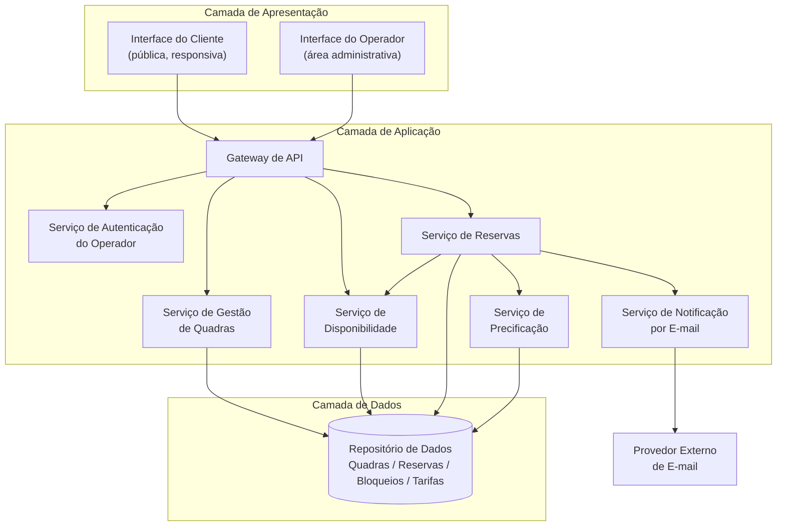
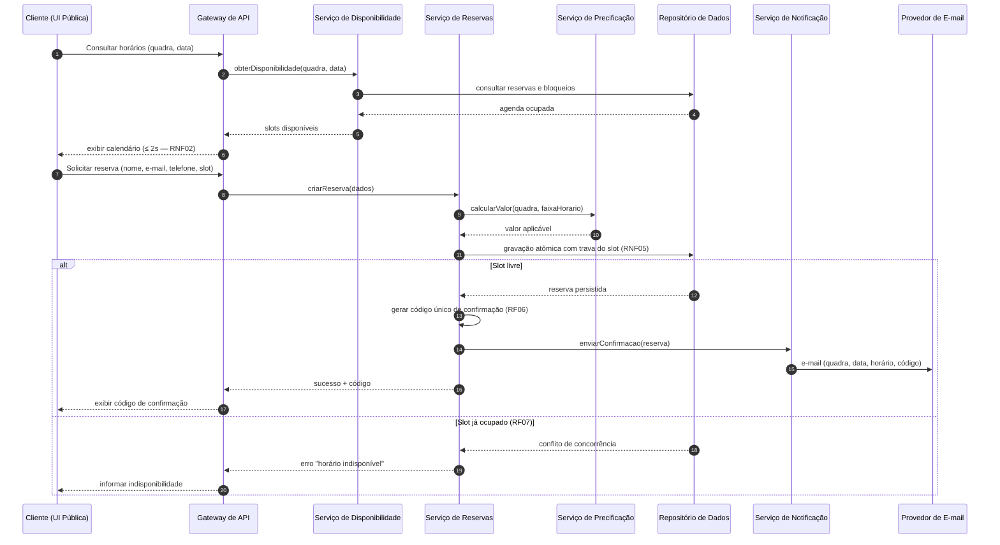
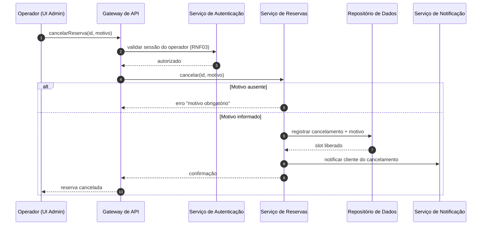
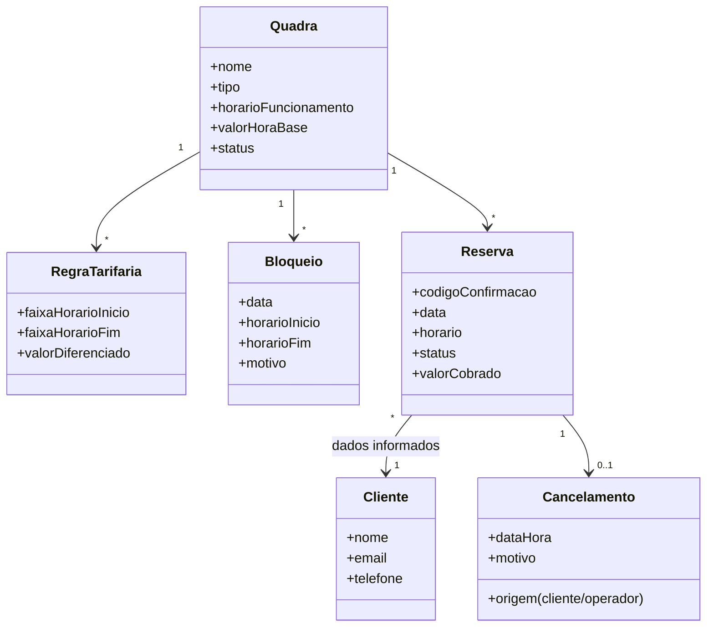

# Relatório Técnico de Arquitetura de Software
## Sistema de Reservas para Quadras Esportivas (P05)

---

## 1. Identificação das HUs

| HU | Perfil | Título | RFs Relacionados | RNFs Relacionados |
|----|--------|--------|------------------|-------------------|
| HU01 | Operador | Cadastrar quadra | RF01, RF02 | RNF03, RNF07 |
| HU02 | Operador | Bloquear horários para manutenção | RF03 | RNF03 |
| HU03 | Operador | Visualizar agenda consolidada | RF11 | RNF02, RNF03 |
| HU04 | Operador | Cancelar reserva com justificativa | RF09, RF10 | RNF03 |
| HU05 | Cliente | Consultar disponibilidade sem cadastro | RF04 | RNF01, RNF02, RNF06 |
| HU06 | Cliente | Realizar reserva | RF05, RF06, RF07, RF10 | RNF05 |
| HU07 | Cliente | Cancelar minha reserva | RF08 | RNF05 |

**Observações de identificação:**
- RF12 (valores diferenciados por faixa de horário) **não possui HU associada** — registrado na Seção 5 e 7.
- HU04 estende o escopo de RF10 (notificação de cancelamento por e-mail), não explicitamente coberto pelo RF original.

---

## 2. Diagramas de Arquitetura (Mermaid)

### 2.1 Diagrama de Componentes (Visão Lógica)

### 2.2 Diagrama de Sequência — Realizar Reserva (HU06 / RF05–RF07, RF10, RNF05)

### 2.3 Diagrama de Sequência — Cancelamento pelo Operador (HU04)

### 2.4 Modelo Conceitual de Domínio

---

## 3. Decisões de Arquitetura

| ID | Decisão | Justificativa | Requisitos Atendidos |
|----|---------|---------------|----------------------|
| DA01 | **Arquitetura modular em camadas** com serviços de domínio separados (Quadras, Disponibilidade, Reservas, Precificação, Notificação) | Facilita evolução e inclusão de novas modalidades esportivas sem impacto transversal | RNF07 |
| DA02 | **Área pública sem autenticação** e **área administrativa protegida** por serviço de autenticação dedicado, segregadas no Gateway | Cliente consulta e reserva sem login; operador opera em zona protegida | RF04, RNF03 |
| DA03 | **Controle de concorrência com gravação atômica** (trava/verificação transacional no ato da persistência da reserva) | Impede duplo agendamento em requisições simultâneas; a verificação prévia de disponibilidade não é suficiente — a garantia é no commit | RF07, RNF05 |
| DA04 | **Código de confirmação único gerado no servidor**, não sequencial e não adivinhável, funcionando como credencial de cancelamento do cliente | Único mecanismo de autorização do cliente (sem cadastro); precisa ser resistente a enumeração | RF06, RF08 |
| DA05 | **Notificação por e-mail assíncrona e desacoplada** via fila/mecanismo de retentativa conceitual | Falha do provedor de e-mail não deve abortar a reserva já confirmada; contribui para disponibilidade 99% | RF10, RNF04 |
| DA06 | **Cancelamento como soft delete** (reserva muda de status, com registro de origem e motivo) | Preserva histórico/auditoria e libera o slot imediatamente | RF08, RF09, HU07 |
| DA07 | **Cálculo de disponibilidade derivado** (funcionamento − bloqueios − reservas ativas), sem materialização redundante obrigatória; cache de leitura conceitual permitido | Garante consistência imediata (HU01/HU02: efeito imediato na listagem) e desempenho de carga ≤ 2s | RF03, RF04, RNF02 |
| DA08 | **Precificação como serviço isolado** com regras tarifárias por faixa de horário associadas à quadra | Valores diferenciados (horário nobre) sem acoplamento ao fluxo de reserva | RF01, RF12 |
| DA09 | **Interface do cliente responsiva** baseada em padrões web abertos, compatível com navegadores modernos | Neutralidade tecnológica mantida; responsividade e compatibilidade como requisito de design | RNF01, RNF06 |

---

## 4. Tabela de Componentes e Rastreabilidade

| Componente | Responsabilidade Principal | Comunica-se com | Origem (HU / Critério de Aceite) |
|------------|---------------------------|-----------------|----------------------------------|
| Interface do Cliente (pública) | Exibir calendário de disponibilidade, formulário de reserva e cancelamento por código; responsiva | Gateway de API | HU05 (consulta sem login), HU06, HU07; RNF01/RNF06 |
| Interface do Operador (admin) | CRUD de quadras, bloqueios, agenda consolidada, cancelamentos com motivo, configuração tarifária | Gateway de API | HU01–HU04; RF12 |
| Gateway de API | Roteamento, validação de entrada, segregação de rotas públicas × autenticadas | Todos os serviços de aplicação | HU05 (acesso sem login) + RNF03 |
| Serviço de Autenticação do Operador | Autenticar e autorizar acesso à área administrativa | Gateway, Repositório | RNF03; HU01–HU04 (pré-condição implícita) |
| Serviço de Gestão de Quadras | Cadastro, edição, remoção de quadras; gestão de bloqueios; validação de campos obrigatórios | Repositório de Dados | HU01 (campos obrigatórios), HU02 (bloquear/remover bloqueio) |
| Serviço de Disponibilidade | Calcular slots livres por quadra/data (funcionamento − bloqueios − reservas); agenda consolidada diária | Repositório, Serviço de Reservas | HU05 (ocupados exibidos como indisponíveis), HU03 (agenda de todas as quadras, navegação por data), HU01 (aparecer imediatamente) |
| Serviço de Reservas | Criar reserva com verificação atômica, gerar código único, cancelar (cliente por código / operador com motivo obrigatório) | Disponibilidade, Precificação, Notificação, Repositório | HU06 (validar disponibilidade no momento da confirmação; código exibido e enviado), HU07 (código válido; liberação imediata), HU04 (motivo obrigatório) |
| Serviço de Precificação | Aplicar valor da hora e regras diferenciadas por faixa de horário | Repositório, Serviço de Reservas | HU01 (valor da hora obrigatório); RF12 |
| Serviço de Notificação por E-mail | Montar e enviar confirmações e avisos de cancelamento, com retentativa | Provedor externo de e-mail, Serviço de Reservas | HU06 (código por e-mail), HU04 (cliente notificado do cancelamento) |
| Repositório de Dados | Persistência transacional de quadras, bloqueios, reservas, tarifas e cancelamentos | Serviços de aplicação | RNF05 (atomicidade), DA06 (histórico) |

---

## 5. Bloqueios e Pendências

| ID | Tipo | Descrição | Impacto | Responsável Sugerido |
|----|------|-----------|---------|----------------------|
| B01 | Pendência de requisito | RF12 sem HU e sem critérios de aceite: como o operador define/edita faixas de horário nobre? Sobreposições de faixas são permitidas? | Serviço de Precificação sem regras validáveis | Product Owner |
| B02 | Pendência de requisito | Ausência de regra sobre **prazo mínimo de cancelamento** pelo cliente (pode cancelar 5 min antes?) | Regra de negócio do Serviço de Reservas indefinida | Product Owner |
| B03 | Pendência de requisito | RF02 (remover quadra): o que ocorre com **reservas futuras existentes**? Cancelamento em massa + notificação? | Integridade referencial e fluxo de notificação | PO + Arquitetura |
| B04 | Pendência de requisito | Duração/granularidade dos slots não especificada (1h fixa? blocos configuráveis?) | Modelo de dados de agenda e UI do calendário | PO |
| B05 | Bloqueio de decisão | Falha no envio de e-mail (RF10): a reserva permanece válida? Há reenvio? Confirmado conceitualmente em DA05, requer aprovação | Estratégia de resiliência da notificação | Arquitetura + PO |
| B06 | Pendência | Pagamento **fora de escopo**? Valores existem (RF01/RF12) mas nenhum RF trata cobrança | Escopo do MVP | PO / Stakeholders |
| B07 | Pendência | Conflito entre bloqueio (RF03) e reserva já existente no mesmo horário: bloqueio cancela a reserva ou é rejeitado? | Regra do Serviço de Gestão de Quadras | PO |

---

## 6. Cobertura de Requisitos

| Requisito | Coberto por (Componente / Decisão) | Status |
|-----------|-----------------------------------|--------|
| RF01 | Serviço de Gestão de Quadras; DA08 | ✅ Coberto |
| RF02 | Serviço de Gestão de Quadras | ⚠️ Coberto com pendência (B03) |
| RF03 | Serviço de Gestão de Quadras + Disponibilidade; DA07 | ⚠️ Coberto com pendência (B07) |
| RF04 | Serviço de Disponibilidade + UI pública; DA02, DA07 | ✅ Coberto |
| RF05 | Serviço de Reservas | ✅ Coberto |
| RF06 | Serviço de Reservas; DA04 | ✅ Coberto |
| RF07 | Serviço de Reservas; DA03 | ✅ Coberto |
| RF08 | Serviço de Reservas; DA04, DA06 | ⚠️ Coberto com pendência (B02) |
| RF09 | Serviço de Reservas; DA06 | ✅ Coberto |
| RF10 | Serviço de Notificação; DA05 | ⚠️ Coberto com pendência (B05) |
| RF11 | Serviço de Disponibilidade (agenda consolidada) | ✅ Coberto |
| RF12 | Serviço de Precificação; DA08 | ⚠️ Coberto sem HU (B01) |
| RNF01 | UI do Cliente responsiva; DA09 | ✅ Coberto |
| RNF02 | DA07 (cálculo eficiente + cache conceitual) | ✅ Coberto (validar em teste de desempenho) |
| RNF03 | Serviço de Autenticação; DA02 | ✅ Coberto |
| RNF04 | DA05 (desacoplamento) + práticas operacionais | ⚠️ Parcial — depende de decisões de infraestrutura fora do design abstrato |
| RNF05 | DA03 (gravação atômica) | ✅ Coberto |
| RNF06 | DA09 | ✅ Coberto |
| RNF07 | DA01 (modularidade por domínio) | ✅ Coberto |

**Resumo:** 19 requisitos — 13 plenamente cobertos, 6 cobertos com pendências. Nenhum requisito sem componente responsável.

---

## 7. Gap Analysis

| # | Lacuna Identificada | Impacto Arquitetural | Ação Recomendada |
|---|---------------------|----------------------|------------------|
| G01 | **RF12 sem HU e sem critérios de aceite** (precificação por faixa) | Modelo de RegraTarifaria pode exigir retrabalho (sobreposições, prioridade, vigência) | Elaborar HU08 "Configurar tarifas por faixa" com critérios de validação de sobreposição antes da implementação |
| G02 | **Ausência de fluxo de pagamento** apesar de valores tarifários existirem | Se pagamento entrar depois, o fluxo de reserva (2.2) precisará de estados adicionais (pendente/pago) | Confirmar escopo com stakeholders; modelar `status` da Reserva de forma extensível desde já |
| G03 | **Política de cancelamento do cliente indefinida** (prazo, penalidades) | Regra ausente no Serviço de Reservas; risco de abuso (reservar/cancelar repetidamente sem custo) | Definir janela mínima de cancelamento e eventual limite de reservas por e-mail/telefone |
| G04 | **Segurança do código de confirmação não especificada** (formato, entropia) | Código é a única credencial do cliente; código fraco permite cancelamento de reservas de terceiros | Especificar geração não previsível e proteção contra tentativa exaustiva (limitação de tentativas) |
| G05 | **Conflito bloqueio × reserva existente** (RF03) sem regra definida | Serviço de Gestão de Quadras não sabe se rejeita bloqueio ou cancela reservas | Definir regra: sugerido rejeitar bloqueio com aviso, oferecendo cancelamento com notificação (reutiliza HU04) |
| G06 | **Granularidade de slots não definida** | Afeta modelo de agenda, cálculo de disponibilidade e UI do calendário | Definir duração padrão (ex.: blocos de 1h) e se é configurável por quadra |
| G07 | **RNF04 (99% disponibilidade) sem estratégia operacional** | Design abstrato não garante SLA; requer redundância, monitoramento e plano de recuperação | Elaborar documento de requisitos operacionais na fase de infraestrutura (fora do design neutro) |
| G08 | **Sem requisito de auditoria/histórico explícito** | DA06 assume soft delete, mas retenção de dados pessoais (nome, e-mail, telefone) sem cadastro levanta questão de privacidade/LGPD | Definir política de retenção e anonimização de dados de clientes após período |
| G09 | **Ausência de validação de dados de contato** (e-mail/telefone válidos?) | Reservas com e-mail inválido inviabilizam RF10 e HU04 | Especificar validação sintática de e-mail e telefone no formulário de reserva; considerar confirmação por link (decisão de PO) |
| G10 | **Notificações limitadas a e-mail** | Clientes sem acesso rápido a e-mail podem perder aviso de cancelamento pelo operador | Avaliar canal adicional (ex.: mensagem ao telefone informado) como evolução — arquitetura de notificação já desacoplada (DA05) suporta extensão |

---

*Relatório gerado pelo Sistema Multi-Agente AI4ES — Time 2. Design tecnologicamente neutro; decisões de produtos/plataformas específicas ficam delegadas à fase de implementação, condicionadas à resolução das pendências B01–B07.*