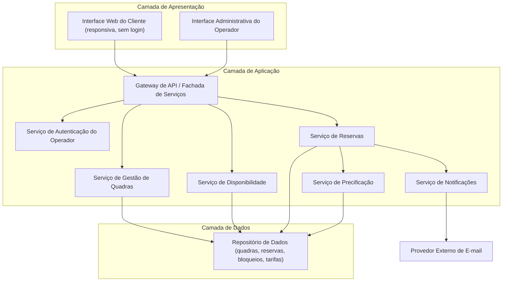
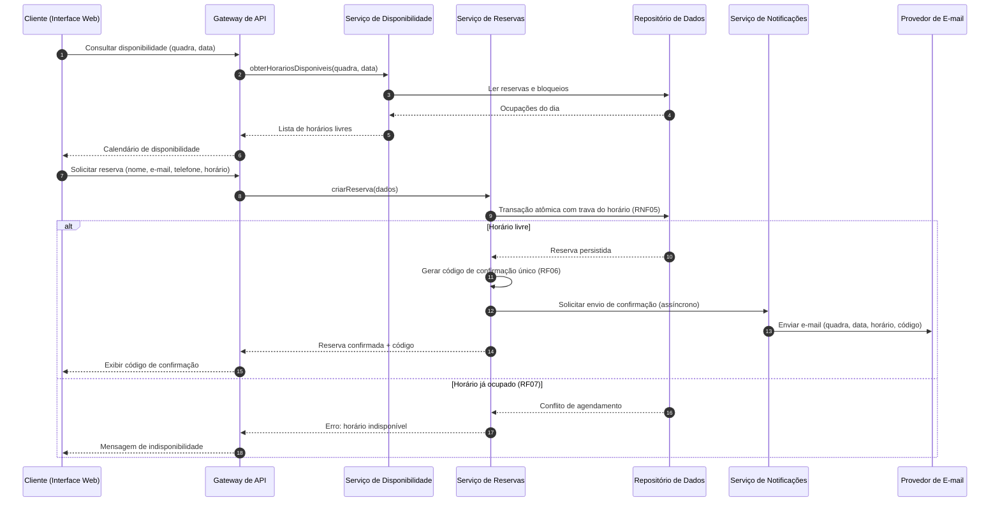
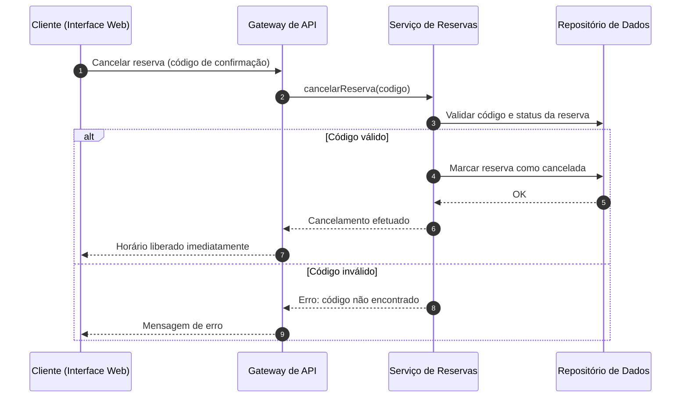

# Relatório Técnico de Arquitetura de Software
## Sistema de Reservas para Quadras Esportivas (P05)

---

## 1. Identificação das HUs

| HU | Perfil | Título | RFs Relacionados | RNFs Relacionados |
|----|--------|--------|------------------|-------------------|
| HU01 | Operador | Cadastrar quadra | RF01, RF02, RF12 | RNF03, RNF07 |
| HU02 | Operador | Bloquear horários para manutenção | RF03 | RNF03 |
| HU03 | Operador | Visualizar agenda consolidada | RF11 | RNF02, RNF03 |
| HU04 | Operador | Cancelar reserva com justificativa | RF09, RF10 | RNF03 |
| HU05 | Cliente | Consultar disponibilidade sem cadastro | RF04 | RNF01, RNF02, RNF06 |
| HU06 | Cliente | Realizar reserva | RF05, RF06, RF07, RF10 | RNF05, RNF04 |
| HU07 | Cliente | Cancelar minha reserva | RF08 | RNF05 |

---

## 2. Diagramas de Arquitetura (Mermaid)

### 2.1 Diagrama de Componentes (Visão Lógica)

### 2.2 Diagrama de Sequência — Realizar Reserva (HU06 / RNF05)

### 2.3 Diagrama de Sequência — Cancelamento pelo Cliente (HU07)

---

## 3. Decisões de Arquitetura

| ID | Decisão | Justificativa | Requisitos |
|----|---------|---------------|------------|
| AD01 | Arquitetura modular em camadas (Apresentação, Aplicação, Dados) com serviços de responsabilidade única | Facilita manutenção e extensão para novas modalidades esportivas | RNF07 |
| AD02 | Consulta de disponibilidade pública, sem autenticação, via endpoint somente-leitura | O cliente não exige cadastro; segrega tráfego de leitura | RF04, HU05 |
| AD03 | Área administrativa protegida por serviço de autenticação com controle de sessão | Proteção obrigatória de operações do operador | RNF03 |
| AD04 | Confirmação de reserva executada em **transação atômica** com restrição de unicidade sobre (quadra, data, horário) e controle de concorrência (trava pessimista ou verificação otimista com constraint) | Impede duplo agendamento em requisições simultâneas | RF07, RNF05 |
| AD05 | Código de confirmação gerado com identificador único não sequencial e não adivinhável | O código é a única credencial do cliente para cancelamento | RF06, RF08 |
| AD06 | Envio de e-mail **assíncrono e desacoplado** da transação de reserva, com política de reprocessamento | Falha no provedor de e-mail não deve impedir a reserva; contribui para disponibilidade | RF10, RNF04 |
| AD07 | Disponibilidade calculada como composição: horário de funcionamento − bloqueios − reservas ativas | Fonte única de verdade; evita inconsistências | RF03, RF04, RF07 |
| AD08 | Precificação por faixas horárias modelada como regra parametrizável associada à quadra | Suporta horário nobre sem alteração de código | RF12 |
| AD09 | Cache de leitura de disponibilidade com invalidação em eventos de reserva/cancelamento/bloqueio | Atender carregamento do calendário em ≤ 2s | RNF02 |
| AD10 | Interface do cliente com design responsivo e compatibilidade com navegadores modernos | Requisito explícito de usabilidade e compatibilidade | RNF01, RNF06 |
| AD11 | Cancelamentos são "soft delete" com registro de motivo (operador) e trilha de auditoria | Rastreabilidade exigida pelo motivo obrigatório | RF09, HU04 |

---

## 4. Tabela de Componentes e Rastreabilidade

| Componente | Responsabilidade Principal | Comunica-se com | Origem (HU / Critério de Aceite) |
|------------|---------------------------|-----------------|----------------------------------|
| Interface Web do Cliente | Exibir calendário de disponibilidade, formulário de reserva e cancelamento por código; responsiva, sem login | Gateway de API | HU05 (acesso sem login), HU06, HU07 |
| Interface Administrativa do Operador | CRUD de quadras, bloqueios, tarifas, agenda consolidada e cancelamento com motivo | Gateway de API | HU01–HU04 |
| Gateway de API / Fachada | Roteamento, validação de entrada, aplicação de autenticação nas rotas administrativas | Todos os serviços de aplicação | RNF03; todas as HUs |
| Serviço de Autenticação do Operador | Autenticar operador e emitir/validar sessões | Gateway, Repositório de Dados | RNF03 |
| Serviço de Gestão de Quadras | Cadastro, edição, remoção de quadras; gestão de bloqueios de horários | Repositório de Dados | HU01 (campos obrigatórios), HU02 (bloqueio/remoção de bloqueio) |
| Serviço de Disponibilidade | Calcular horários livres por quadra/data (funcionamento − bloqueios − reservas); agenda consolidada diária | Repositório de Dados, Gateway | HU03 (visão consolidada, navegação por datas), HU05 (ocupados indisponíveis) |
| Serviço de Reservas | Criar reserva com verificação atômica, gerar código único, cancelar por código (cliente) ou com motivo (operador) | Repositório, Serviço de Precificação, Serviço de Notificações | HU06 (validação no ato, código na tela e por e-mail), HU07 (código válido, liberação imediata), HU04 (motivo obrigatório) |
| Serviço de Precificação | Calcular valor da reserva conforme valor-hora e faixas diferenciadas | Repositório de Dados | RF12, HU01 |
| Serviço de Notificações | Compor e enviar e-mails de confirmação e cancelamento, com fila e reenvio | Provedor Externo de E-mail | HU06, HU04 (notificação de cancelamento) |
| Repositório de Dados | Persistência transacional de quadras, reservas, bloqueios, tarifas e auditoria; constraint de unicidade de horário | Todos os serviços | RNF05, RF07 |

---

## 5. Bloqueios e Pendências

| ID | Tipo | Descrição | Impacto |
|----|------|-----------|---------|
| P01 | Pendência | Não há definição de política de pagamento (reserva exige pagamento antecipado ou apenas registro?) | Afeta fluxo de confirmação e integrações futuras |
| P02 | Pendência | Regra de antecedência mínima/máxima para reservar ou cancelar não especificada | Regras do Serviço de Reservas incompletas |
| P03 | Pendência | Comportamento ao bloquear horário (RF03) que já possui reserva confirmada não definido | Pode exigir cancelamento em cascata + notificação |
| P04 | Bloqueio parcial | Provedor de e-mail (interface e SLA) a definir pelo time de infraestrutura | Necessário para HU04/HU06 em ambiente produtivo |
| P05 | Pendência | Granularidade dos slots de reserva (hora cheia? frações?) não especificada | Impacta modelo de dados e cálculo de disponibilidade |
| P06 | Pendência | Gestão de contas de operador (criação, recuperação de senha, múltiplos operadores/perfis) não especificada | Escopo do Serviço de Autenticação |
| P07 | Pendência | Política de retenção de dados pessoais do cliente (LGPD) não definida | Requisito legal potencial |

---

## 6. Cobertura de Requisitos

| Requisito | Coberto por | Status |
|-----------|-------------|--------|
| RF01 | Serviço de Gestão de Quadras, UI Operador | ✅ Coberto |
| RF02 | Serviço de Gestão de Quadras | ✅ Coberto |
| RF03 | Serviço de Gestão de Quadras (bloqueios), AD07 | ✅ Coberto (ver P03) |
| RF04 | Serviço de Disponibilidade, UI Cliente, AD02 | ✅ Coberto |
| RF05 | Serviço de Reservas | ✅ Coberto |
| RF06 | Serviço de Reservas (AD05) | ✅ Coberto |
| RF07 | Transação atômica + constraint de unicidade (AD04) | ✅ Coberto |
| RF08 | Serviço de Reservas (cancelamento por código) | ✅ Coberto |
| RF09 | Serviço de Reservas (motivo obrigatório, AD11) | ✅ Coberto |
| RF10 | Serviço de Notificações (AD06) | ✅ Coberto |
| RF11 | Serviço de Disponibilidade (agenda consolidada) | ✅ Coberto |
| RF12 | Serviço de Precificação (AD08) | ✅ Coberto |
| RNF01 | UI Cliente responsiva (AD10) | ✅ Coberto |
| RNF02 | Cache de disponibilidade (AD09) | ✅ Coberto |
| RNF03 | Serviço de Autenticação + Gateway (AD03) | ✅ Coberto |
| RNF04 | Desacoplamento assíncrono (AD06); redundância operacional a detalhar | ⚠️ Parcial |
| RNF05 | AD04 (transação atômica) | ✅ Coberto |
| RNF06 | AD10 | ✅ Coberto |
| RNF07 | Arquitetura modular (AD01) | ✅ Coberto |

**Cobertura: 18/19 total, 1 parcial (RNF04 depende de topologia de implantação a definir).**

---

## 7. Gap Analysis

| # | Lacuna | Impacto Arquitetural | Ação Recomendada |
|---|--------|----------------------|------------------|
| G01 | Ausência de fluxo de pagamento ou sinal para reservas | Se pagamento for exigido, o fluxo de confirmação (2.2) precisará de estado intermediário "pendente de pagamento" e integração externa | Validar com o negócio antes do design detalhado do Serviço de Reservas |
| G02 | Conflito entre bloqueio de horário (RF03) e reservas existentes | Pode exigir orquestração: cancelamento em massa + notificações; hoje o Serviço de Gestão de Quadras não conversa com o de Notificações | Definir regra de negócio; se confirmada, adicionar interação Gestão de Quadras → Reservas |
| G03 | Granularidade e duração dos slots não definidas | Afeta constraint de unicidade (AD04) — sobreposição parcial de horários é mais complexa que igualdade exata | Definir modelo de slot (hora fechada vs. intervalo livre) antes do modelo de dados |
| G04 | Sem requisito de no-show / expiração de reservas não utilizadas | Ausência de rotina temporal (jobs agendados) na arquitetura atual | Confirmar necessidade; se sim, incluir componente de tarefas agendadas |
| G05 | RNF04 (99% em 24/7) sem estratégia de implantação especificada | Exige redundância, monitoramento e recuperação — decisões fora do escopo do design abstrato | Time de operações deve produzir plano de disponibilidade e observabilidade |
| G06 | Segurança do código de confirmação como única credencial | Risco de força bruta para cancelar reservas alheias | Adotar códigos não sequenciais de alta entropia + limitação de tentativas no Gateway |
| G07 | Dados pessoais (nome, e-mail, telefone) sem política de privacidade/retenção | Possível não conformidade legal (LGPD) | Definir prazos de retenção, anonimização e consentimento na captura |
| G08 | Falha permanente no envio de e-mail sem tratamento especificado | Cliente pode não receber código (o código exibido na tela mitiga parcialmente) | Implementar fila com reenvio e alerta ao operador para falhas persistentes |
| G09 | Alteração de tarifas/valor-hora com reservas já feitas | Ambiguidade sobre preço aplicável (momento da reserva vs. atual) | Recomenda-se congelar o valor no ato da reserva (snapshot de preço) |

---

*Fim do Relatório Canônico — AI4ES Time 2 · Projeto P05.*