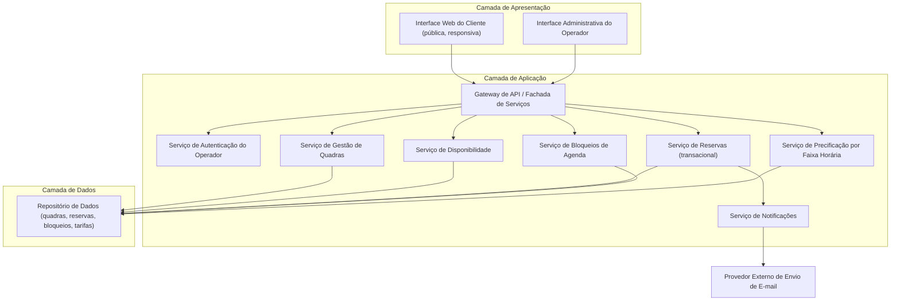
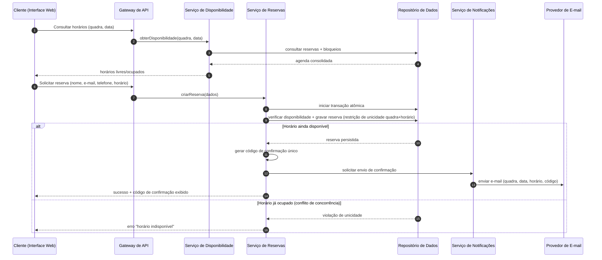
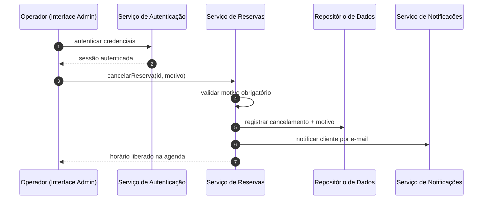

# Relatório Técnico de Arquitetura de Software
## Sistema de Reservas para Quadras Esportivas (P05)

---

## 1. Identificação das HUs

| HU | Perfil | Título | RFs Relacionados | RNFs Relacionados |
|----|--------|--------|------------------|-------------------|
| HU01 | Operador | Cadastrar quadra | RF01, RF02, RF12 | RNF03, RNF07 |
| HU02 | Operador | Bloquear horários para manutenção | RF03 | RNF03 |
| HU03 | Operador | Visualizar agenda consolidada | RF11 | RNF02, RNF03 |
| HU04 | Operador | Cancelar reserva com justificativa | RF09, RF10 | RNF03 |
| HU05 | Cliente | Consultar disponibilidade sem cadastro | RF04 | RNF01, RNF02, RNF06 |
| HU06 | Cliente | Realizar reserva | RF05, RF06, RF07, RF10 | RNF05 |
| HU07 | Cliente | Cancelar minha reserva | RF08 | RNF05 |

---

## 2. Diagramas de Arquitetura (Mermaid)

### 2.1 Diagrama de Componentes (Visão Lógica)

### 2.2 Diagrama de Sequência — Realizar Reserva (HU06 / RNF05)

### 2.3 Diagrama de Sequência — Cancelamento pelo Operador (HU04)

---

## 3. Decisões de Arquitetura

| ID | Decisão | Justificativa | Requisitos Atendidos |
|----|---------|---------------|----------------------|
| DA01 | Arquitetura em camadas com serviços modulares por domínio (Quadras, Reservas, Bloqueios, Disponibilidade, Precificação, Notificações) | Facilita evolução independente e inclusão de novas modalidades esportivas | RNF07 |
| DA02 | Garantia de atomicidade via transação com restrição de unicidade (quadra + data + horário) no repositório | Impede duplo agendamento sob concorrência; controle otimista no ponto de escrita | RF07, RNF05 |
| DA03 | Área pública sem autenticação; área administrativa protegida por autenticação e controle de sessão | Consulta e reserva sem login; proteção das funções do operador | RF04, RF05, RNF03 |
| DA04 | Envio de e-mail assíncrono e desacoplado (fila conceitual de notificações com política de retentativa) | Falha no provedor de e-mail não deve bloquear a confirmação da reserva | RF10, RNF04 |
| DA05 | Código de confirmação único, não sequencial e de difícil adivinhação, atuando como credencial de cancelamento do cliente | Único fator de autorização do cliente para cancelamento | RF06, RF08 |
| DA06 | Serviço de Disponibilidade de leitura otimizada (agenda pré-consolidada / consulta indexada) | Carregamento do calendário em até 2 segundos | RF04, RNF02 |
| DA07 | Interface do cliente com design responsivo e compatibilidade com navegadores modernos | Uso em dispositivos móveis e desktops | RNF01, RNF06 |
| DA08 | Precificação por faixa horária modelada como regra separada da entidade quadra | Permite configurar horário nobre sem alterar cadastro da quadra | RF12 |
| DA09 | Cancelamento como transição de estado (reserva mantida com status e motivo), não exclusão física | Rastreabilidade e liberação imediata do horário | RF08, RF09, HU07 |

---

## 4. Tabela de Componentes e Rastreabilidade

| Componente | Responsabilidade Principal | Comunica-se com | Origem (HU / Critério de Aceite) |
|------------|---------------------------|-----------------|----------------------------------|
| Interface Web do Cliente | Exibir disponibilidade sem login, capturar dados de reserva e cancelamento; responsiva | Gateway de API | HU05 (consulta sem login), HU06, HU07; RNF01/RNF06 |
| Interface Administrativa | Gestão de quadras, bloqueios, agenda consolidada e cancelamentos; acesso autenticado | Gateway de API | HU01–HU04; RNF03 |
| Gateway de API | Fachada única, roteamento, validação de sessão administrativa | Todos os serviços de aplicação | Transversal (RNF03) |
| Serviço de Autenticação do Operador | Autenticar operadores e gerir sessões da área administrativa | Gateway, Repositório | RNF03 |
| Serviço de Gestão de Quadras | CRUD de quadras (nome, tipo, funcionamento, valor); refletir imediatamente na disponibilidade | Repositório, Serviço de Disponibilidade | HU01 ("campos obrigatórios", "aparece imediatamente"), RF01, RF02 |
| Serviço de Bloqueios de Agenda | Criar/remover bloqueios por manutenção ou feriado | Repositório, Serviço de Disponibilidade | HU02 (bloqueios não aparecem disponíveis; remoção a qualquer momento), RF03 |
| Serviço de Disponibilidade | Consolidar reservas, bloqueios e horário de funcionamento em agenda por quadra/data; agenda diária do operador | Repositório | HU03, HU05, RF04, RF11, RNF02 |
| Serviço de Reservas | Criar reserva atômica, gerar código único, cancelar por código (cliente) ou com motivo (operador) | Repositório, Serviço de Notificações | HU06 (validar disponibilidade na confirmação), HU07 (código válido; liberação imediata), HU04 (motivo obrigatório), RF05–RF09, RNF05 |
| Serviço de Precificação | Manter tarifas por faixa horária e calcular valor da reserva | Repositório, Serviço de Reservas | RF12 |
| Serviço de Notificações | Montar e enviar e-mails de confirmação/cancelamento com retentativas | Provedor externo de e-mail | HU04 (notificar cliente), HU06 (código por e-mail), RF10 |
| Repositório de Dados | Persistência íntegra com restrição de unicidade quadra+horário | Serviços de aplicação | RF07, RNF05 |

---

## 5. Bloqueios e Pendências

| ID | Tipo | Descrição | Impacto |
|----|------|-----------|---------|
| P01 | Pendência | Não há definição de prazo mínimo/antecedência para cancelamento pelo cliente (política de cancelamento) | Regra de negócio do Serviço de Reservas indefinida |
| P02 | Pendência | Ausência de definição sobre pagamento: reserva é apenas agendamento ou envolve cobrança do valor calculado? | Pode exigir integração externa de pagamentos não prevista |
| P03 | Pendência | Comportamento ao bloquear horário que já possui reserva confirmada não especificado (bloqueio recusado? cancelamento automático?) | Interação entre Serviços de Bloqueio e Reservas |
| P04 | Pendência | Granularidade dos slots de reserva (1h fixa? frações? múltiplas horas consecutivas?) não definida | Modelo de agenda e de precificação |
| P05 | Bloqueio | Definição do provedor de envio de e-mail e credenciais é dependência externa de infraestrutura | Necessário antes da homologação de RF10 |
| P06 | Pendência | Gestão de contas de operador (criação, recuperação de senha, múltiplos operadores/papéis) não especificada | Escopo do Serviço de Autenticação |
| P07 | Pendência | Requisitos de retenção de dados pessoais do cliente (nome, e-mail, telefone) e conformidade com legislação de privacidade não abordados | Política de anonimização/expurgo |

---

## 6. Cobertura de Requisitos

| Requisito | Componente(s) Responsável(is) | Status de Cobertura |
|-----------|-------------------------------|---------------------|
| RF01 | Serviço de Gestão de Quadras | ✅ Coberto |
| RF02 | Serviço de Gestão de Quadras | ✅ Coberto |
| RF03 | Serviço de Bloqueios de Agenda | ✅ Coberto (ressalva P03) |
| RF04 | Serviço de Disponibilidade + Interface do Cliente | ✅ Coberto |
| RF05 | Serviço de Reservas | ✅ Coberto |
| RF06 | Serviço de Reservas (geração de código) | ✅ Coberto |
| RF07 | Serviço de Reservas + Repositório (unicidade) | ✅ Coberto |
| RF08 | Serviço de Reservas (cancelamento por código) | ✅ Coberto (ressalva P01) |
| RF09 | Serviço de Reservas (motivo obrigatório) | ✅ Coberto |
| RF10 | Serviço de Notificações + Provedor de E-mail | ✅ Coberto (dependência P05) |
| RF11 | Serviço de Disponibilidade (agenda consolidada) | ✅ Coberto |
| RF12 | Serviço de Precificação | ✅ Coberto (ressalva P02/P04) |
| RNF01 | Interface Web do Cliente | ✅ Coberto |
| RNF02 | Serviço de Disponibilidade (leitura otimizada) | ✅ Coberto |
| RNF03 | Serviço de Autenticação + Gateway | ✅ Coberto |
| RNF04 | Notificação assíncrona, componentes sem estado replicáveis | ⚠️ Parcial — requer definição de infraestrutura de implantação |
| RNF05 | Transação atômica + restrição de unicidade | ✅ Coberto |
| RNF06 | Interface Web do Cliente | ✅ Coberto |
| RNF07 | Arquitetura modular por domínio (DA01) | ✅ Coberto |

**Resumo:** 19 requisitos — 18 cobertos, 1 parcial (RNF04, dependente de decisões de implantação).

---

## 7. Gap Analysis

| # | Lacuna Identificada | Impacto Arquitetural | Ação Recomendada |
|---|---------------------|----------------------|------------------|
| G01 | Ausência de política de pagamento/sinal para reservas | Pode introduzir componente de pagamento externo, alterando o fluxo de confirmação e a máquina de estados da reserva | Validar com o negócio se a reserva envolve cobrança; se sim, planejar estado "pendente de pagamento" |
| G02 | Conflito entre bloqueio de horário e reservas existentes não tratado | Requer orquestração entre Serviços de Bloqueio, Reservas e Notificações | Definir regra: bloqueio força cancelamento com notificação automática, ou é rejeitado quando há reserva |
| G03 | Código de confirmação como único fator de cancelamento pode ser vulnerável a força bruta | Necessidade de limitação de tentativas e códigos com entropia adequada | Especificar formato do código e política de rate limiting na fachada pública |
| G04 | Granularidade e duração das reservas indefinidas | Afeta modelo de dados da agenda, restrição de unicidade e cálculo de preço por faixa | Definir slot mínimo (ex.: 1h) e se reservas de múltiplos slots são permitidas |
| G05 | Falha no envio de e-mail sem tratamento especificado | Cliente pode ficar sem código se depender apenas do e-mail | Manter exibição do código em tela como fonte primária (já previsto na HU06) e retentativas assíncronas no Serviço de Notificações |
| G06 | Requisito de disponibilidade 99% (RNF04) sem estratégia de resiliência definida | Exige redundância, monitoramento e recuperação que não derivam de nenhum RF | Elaborar plano de implantação com redundância de instâncias, verificação de saúde e cópias de segurança do repositório |
| G07 | Ausência de requisitos de auditoria/histórico de alterações (edição/remoção de quadras, cancelamentos) | Dificulta rastreabilidade de disputas com clientes | Adotar registro de eventos de domínio (trilha de auditoria) desde o início |
| G08 | Fuso horário e tratamento de datas não especificados | Erros de exibição de disponibilidade para clientes em fusos distintos | Padronizar armazenamento em tempo universal e conversão na apresentação |
| G09 | Privacidade de dados pessoais do cliente sem cadastro | Dados coletados por reserva exigem política de retenção e expurgo | Definir prazo de retenção e anonimização de reservas antigas, alinhado à legislação vigente |

---

*Fim do Relatório — AI4ES Time 2 · Projeto P05 · Design abstrato em conformidade com a Regra de Neutralidade Tecnológica.*