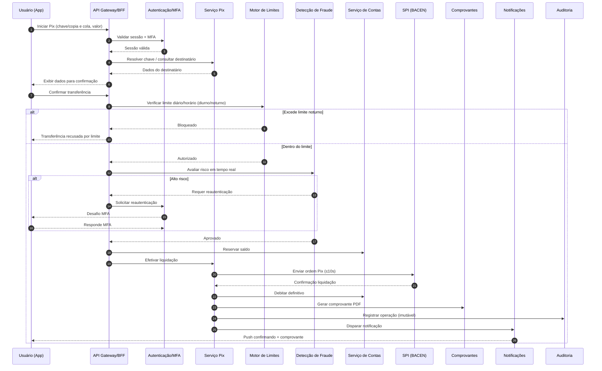
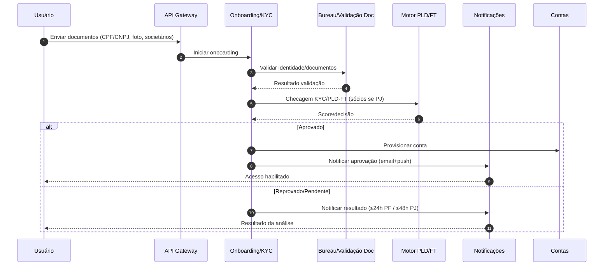

# Relatório Técnico de Arquitetura de Software
## Plataforma Financeira Digital — Sistema Bancário Digital (G01)

---

## 1. Identificação das HUs

| HU | Título | Perfil | RFs Relacionados | RNFs Relevantes |
|----|--------|--------|------------------|-----------------|
| HU01 | Abrir conta com validação de identidade | PF | RF02, RF08 | RNF07, RNF08, RNF10 |
| HU02 | Autenticar com múltiplos fatores | Todos | RF03, RF04, RF05 | RNF01, RNF03, RNF04 |
| HU03 | Realizar transferência via Pix | PF/PJ | RF22, RF24, RF27, RF13 | RNF15, RNF21, RNF17 |
| HU04 | Pagar boleto com agendamento | PF/PJ | RF28, RF29, RF30, RF31 | RNF21 |
| HU05 | Gerenciar cartão de crédito | PF/PJ | RF16, RF17, RF18, RF19, RF20 | RNF02, RNF06 |
| HU06 | Contestar transação não reconhecida | PF/PJ | RF21, RF39 | RNF12 |
| HU07 | Investir em renda fixa | PF/PJ | RF32, RF33, RF34, RF35 | RNF21 |
| HU08 | Gerenciar consentimentos open finance | PF/PJ | RF41, RF42, RF44 | RNF11 |
| HU09 | Alertas e resposta a fraude | Todos | RF36, RF37, RF38, RF39, RF40 | RNF12 |
| HU10 | Abrir conta PJ com documentação societária | PJ | RF01, RF02, RF08 | RNF08 |
| HU11 | Realizar TED para fornecedores | PJ | RF25, RF27, RF13 | RNF21 |
| HU12 | Acompanhar carteira de clientes | Gerente | RF07, RF45, RF46 | RNF10, RNF12 |
| HU13 | Abrir solicitação de serviço em nome do cliente | Gerente | RF47 | RNF12 |

---

## 2. Diagramas de Arquitetura (Mermaid)

### 2.1 Visão de Componentes (Alto Nível)

```mermaid
graph TD
    subgraph Canais
        MOB[App Mobile iOS/Android]
        WEB[Portal Web Responsivo]
        EXT[Instituições Open Finance]
    end

    GW[API Gateway / BFF]

    subgraph Núcleo
        AUTH[Serviço de Autenticação e MFA]
        USR[Serviço de Usuários e Onboarding/KYC]
        ACC[Serviço de Contas e Saldos]
        TXN[Serviço de Transações]
        PIX[Serviço Pix]
        TED[Serviço TED]
        BOL[Serviço de Boletos]
        CARD[Serviço de Cartões]
        INV[Serviço de Investimentos]
        FRAUD[Serviço de Detecção de Fraude]
        OF[Serviço Open Finance / Consentimentos]
        MGR[Serviço de Gerente/Carteira]
        NOTIF[Serviço de Notificações]
        AUDIT[Serviço de Auditoria/Trilha]
        DOC[Serviço de Comprovantes/PDF]
    end

    subgraph Integrações Externas
        SPI[SPI - Pix BACEN]
        STR[STR - TED BACEN]
        PCI[Processador de Cartões PCI-DSS]
        BC[Reguladores BACEN/SCR]
        BUR[Bureaus de Crédito/Documentos]
    end

    MOB --> GW
    WEB --> GW
    EXT --> GW
    GW --> AUTH
    GW --> USR
    GW --> ACC
    GW --> TXN
    GW --> CARD
    GW --> INV
    GW --> OF
    GW --> MGR

    USR --> BUR
    TXN --> PIX
    TXN --> TED
    TXN --> BOL
    PIX --> SPI
    TED --> STR
    CARD --> PCI
    TXN --> FRAUD
    FRAUD --> NOTIF
    OF --> EXT
    INV --> BC
    TXN --> AUDIT
    AUTH --> AUDIT
    TXN --> DOC
    NOTIF --> MOB
```

### 2.2 Sequência — HU03: Transferência via Pix (com fraude e limites)

### 2.3 Sequência — HU01/HU10: Onboarding com KYC

---

## 3. Decisões de Arquitetura

| ID | Decisão | Justificativa | Requisitos |
|----|---------|---------------|-----------|
| AD01 | Arquitetura de microserviços orientada a domínios financeiros | Escalonamento horizontal independente e resiliência por componente | RNF16, RNF17 |
| AD02 | API Gateway/BFF como ponto único de entrada | Centraliza autenticação, rate limiting e roteamento para múltiplos canais | RNF04, RNF01 |
| AD03 | Serviço de Auditoria com armazenamento imutável e retenção ≥5 anos | Trilha regulatória obrigatória | RNF12, RF40 |
| AD04 | Delegação total do processamento de cartões a processador PCI-DSS | Evita armazenamento de dados de cartão no sistema | RNF06, RF14-RF20 |
| AD05 | Motor de Detecção de Fraude assíncrono/síncrono na malha transacional | Avaliação em tempo real com bloqueio preventivo | RF36-RF39 |
| AD06 | Motor de Limites desacoplado e configurável por canal/horário | Cumprimento de normas BACEN e regras por perfil | RF27, RF04 |
| AD07 | Camada de Consentimento Open Finance com APIs padronizadas | Conformidade com especificações OF Brasil | RF41-RF44, RNF11 |
| AD08 | Criptografia em repouso (AES-256) e hashing de senhas (bcrypt/Argon2) | Proteção de dados sensíveis | RNF02, RNF03 |
| AD09 | Implantação multi-AZ com backup contínuo (RPO 1h/RTO 4h) | Redundância geográfica e continuidade | RNF13, RNF22, RNF23 |
| AD10 | Notificações multicanal (push + e-mail) como serviço dedicado | Reuso por fraude, transações, agendamentos, onboarding | RF20, RF31, RF38 |
| AD11 | Confirmação explícita em operações críticas via BFF | Padrão consistente de confirmação antes de efetivação | RNF21 |

---

## 4. Tabela de Componentes e Rastreabilidade

| Componente | Responsabilidade Principal | Comunica-se com | Origem (HU / Critério de Aceite) |
|-----------|---------------------------|-----------------|----------------------------------|
| API Gateway / BFF | Roteamento, agregação por canal, rate limiting, confirmação de operações | Todos os serviços de núcleo, Canais | HU03 (confirmação), RNF04, RNF21 |
| Serviço de Autenticação e MFA | Login, MFA (OTP/biometria), sessões, bloqueio remoto | GW, Auditoria, Notificações | HU02 (MFA obrigatório, gerenciar métodos, alerta) |
| Serviço de Usuários e Onboarding/KYC | Cadastro PF/PJ/gerente, validação identidade, KYC/PLD-FT | Bureaus, PLD, Contas, Notificações | HU01, HU10 (validação CPF/CNPJ, sócios) |
| Serviço de Contas e Saldos | Abertura conta, saldo tempo real, extrato, rendimento poupança | GW, Transações, Auditoria | HU01 CA3; RF08-RF12; RNF14 |
| Serviço de Transações | Orquestra transferências, aplica fraude/limites, comprovantes | Pix, TED, Boletos, Fraude, Limites, DOC | HU03, HU04, HU11 |
| Serviço Pix | Resolução de chaves, liquidação SPI, gestão de chaves | SPI, Contas, DOC | HU03 (chaves, ≤10s); RF22-RF24 |
| Serviço TED | Transferência interbancária, validação de dados bancários | STR/BACEN, Contas | HU11 (validar dados, limites/horários) |
| Serviço de Boletos | Leitura código de barras, validação, agendamento | Transações, Notificações | HU04 (beneficiário/valor/vencimento, lembrete) |
| Serviço de Cartões | Fatura, limites, bloqueio, pagamento, notificações de compra | Processador PCI, Contas, Notificações | HU05 (fatura, limite, bloqueio ≤60s, push) |
| Serviço de Investimentos | Catálogo renda fixa, aplicação/resgate, posição, informe IR | Contas, BACEN | HU07 (rentabilidade/risco, confirmação, atualização) |
| Serviço de Detecção de Fraude | Monitoramento tempo real, score, bloqueio preventivo, histórico | Transações, Notificações, Auditoria | HU09 (alerta push+email, 2 cliques, bloqueio) |
| Serviço Open Finance / Consentimentos | Autorização, revogação, APIs padronizadas, iniciação de pagamento | Instituições externas, Notificações | HU08 (painel, revogação imediata, notificação) |
| Serviço de Gerente/Carteira | Visão consolidada, anotações, solicitações de serviço | Contas, Investimentos, Auditoria | HU12, HU13 (consentimento, auditoria do gerente) |
| Motor de Limites | Validação de limites diários por canal/horário | Transações, GW | HU03 CA4; RF27 |
| Serviço de Notificações | Envio multicanal push/e-mail | Todos os serviços núcleo, Canais | HU01, HU05, HU09, RF20, RF31, RF38 |
| Serviço de Auditoria/Trilha | Registro imutável, retenção ≥5 anos, disponibilização auditoria | Todos os serviços | RF40; RNF12; HU13 CA1 |
| Serviço de Comprovantes/PDF | Geração de comprovantes em PDF | Transações, Pix, TED | HU03, HU11 (comprovante PDF) |

---

## 5. Bloqueios e Pendências

| ID | Bloqueio/Pendência | Impacto | Ação Necessária |
|----|--------------------|---------|-----------------|
| BL01 | Regras exatas de análise de crédito (RF15/RF18) não especificadas | Emissão de cartão de crédito indefinida | Definir política/motor de crédito |
| BL02 | Critérios de score de fraude (RF36/RF37) não detalhados | Ambiguidade no bloqueio preventivo | Especificar thresholds e regras |
| BL03 | SLA de resolução de contestação (HU06) não quantificado | Prazo de retorno ao usuário indefinido | Definir prazos regulatórios de estorno |
| BL04 | Fases/prazos específicos do Open Finance (RNF11) não listados | Escopo de APIs incerto | Mapear fases obrigatórias vigentes |
| BL05 | Regras de cálculo de rendimento da poupança (RF11) referenciam "regras vigentes" sem detalhe | Cálculo automático não parametrizado | Obter fórmula/parâmetros BACEN |
| BL06 | Formato dos relatórios regulatórios (RNF09 - 3040/SCR) não especificado | Integração regulatória pendente | Obter layouts oficiais |

---

## 6. Cobertura de Requisitos

**Requisitos Funcionais:** 47/47 endereçados.

| Faixa | Cobertura |
|-------|-----------|
| RF01-RF07 (Usuários/Auth) | Serviço Auth + Usuários/KYC + Gerente |
| RF08-RF13 (Contas) | Serviço de Contas + DOC |
| RF14-RF21 (Cartões) | Serviço de Cartões + PCI |
| RF22-RF27 (Transferências) | Pix + TED + Limites |
| RF28-RF31 (Boletos) | Serviço de Boletos + Notificações |
| RF32-RF35 (Investimentos) | Serviço de Investimentos |
| RF36-RF40 (Fraude) | Serviço de Fraude + Auditoria |
| RF41-RF44 (Open Finance) | Serviço OF/Consentimentos |
| RF45-RF47 (Gerente) | Serviço de Gerente/Carteira |

**Requisitos Não Funcionais:** 24/24 endereçados via decisões AD01-AD11 (segurança, conformidade, disponibilidade, usabilidade, infraestrutura).

**HUs:** 13/13 mapeadas nas Seções 1, 2 e 4.

---

## 7. Gap Analysis

| # | Lacuna Identificada | Impacto Arquitetural | Ação Recomendada |
|---|---------------------|----------------------|------------------|
| G01 | Estratégia de consistência entre saldo tempo real (RF09/RNF14 ≤1s) e liquidação transacional | Risco de saldo divergente sob concorrência | Definir modelo transacional (reserva/hold) e leitura otimizada de saldo |
| G02 | Ausência de especificação de idempotência para Pix/TED/boletos | Risco de duplicidade de pagamento em retentativas | Adotar chaves de idempotência por operação |
| G03 | RNF17 (recuperação sem perda de transações em andamento) sem detalhamento de padrão | Perda de transações em falhas | Definir padrão saga/outbox e reconciliação com SPI/STR |
| G04 | Consentimento do gerente (RF07/HU12) sem fluxo de revogação especificado | Acesso indevido após revogação | Modelar ciclo de vida do consentimento com expiração |
| G05 | Retenção de logs de auditoria ≥5 anos (RNF12) sem política de arquivamento/custo | Crescimento de armazenamento não gerenciado | Definir tiering de retenção e imutabilidade (WORM) |
| G06 | Gestão de chaves criptográficas (RNF02) não abordada | Risco de comprometimento de dados sensíveis | Introduzir gerência de chaves e rotação |
| G07 | Tratamento de agendamentos (RF26/RF30) sob indisponibilidade na data futura | Pagamentos agendados podem falhar silenciosamente | Definir scheduler resiliente com reprocessamento e notificação |
| G08 | Ausência de especificação de observabilidade correlacionada (RNF24) | Dificuldade de rastrear transações distribuídas | Adotar trace/correlation ID ponta-a-ponta |
| G09 | Contestação de fraude (HU06/HU09) sem workflow de estado definido | Inconsistência entre bloqueio, análise e estorno | Modelar máquina de estados de disputa |
| G10 | LGPD (RNF10) sem detalhamento de direitos do titular (exclusão/portabilidade) | Não conformidade parcial | Especificar fluxos de atendimento a titulares |

---

*Relatório gerado pelo Sistema Multi-Agente AI4ES — Time 2. Design em nível conceitual, tecnologicamente neutro conforme diretrizes.*